<div align="center">

# ULima++ · App 📱

> **La app de la vida académica de un alumno de la Universidad de Lima**
> *Flutter y GetX sobre una única fuente de verdad: si el dato no está en el backend, la app no se lo inventa*

[](#-qué-es-esta-app-y-qué-no)
[](#-compilación-y-distribución)
[](#-arquitectura)

[](#-arquitectura)
[](#-pantallas-y-navegación)
[](#-pruebas-y-calidad)

[](#-la-capa-de-servicios)
[](#-la-capa-de-servicios)
[](https://github.com/jeffangeloss/ULima_Backend_IS2)

</div>

---

## 📑 Metadatos del sistema

| Parámetro | Valor |
|:---|:---|
| **Entidad** | Universidad de Lima · Facultad de Ingeniería · curso de Ingeniería de Software 2 |
| **Producto** | **ULima++** — malla, notas, horario, asesorías, anuncios, alertas, contactos, chat y asistente, en un solo sitio |
| **Rol de este repositorio** | Frontend: la app Flutter, sus specs por feature y sus pruebas. La lógica de negocio vive en el backend |
| **Stack** | Flutter · Dart 3 · GetX · `http` · `shared_preferences` · `flutter_secure_storage` · Firebase · `flutter_svg` · `pdfx` |
| **Backend proveedor** | [ULima_Backend_IS2](https://github.com/jeffangeloss/ULima_Backend_IS2) → https://u-lima-backend-is-2-one.vercel.app |
| **Actores** | Estudiante · delegado · subdelegado · docente/jefe de práctica |
| **Superficie** | **28 pantallas** · 25 controllers · **30 services** · 21 modelos · 20 componentes |
| **Código** | 30 217 líneas Dart en 151 archivos bajo `lib/` |
| **Verificación** | **49 suites** · 6 567 líneas de prueba · `flutter analyze` como puerta obligatoria |
| **Specs** | **15 features** especificadas antes de implementarse, en `specs/features/` |
| **Diseño** | 17 mockups en [`docs/images/UI`](docs/images/UI) · marca `#FF6600` |
| **Historia** | 274 commits · del 2026-05-12 al 2026-09-06 |

---

## 📖 Índice

1. [Qué es esta app (y qué no)](#-qué-es-esta-app-y-qué-no)
2. [Arquitectura](#-arquitectura)
3. [Mapa del repositorio](#-mapa-del-repositorio)
4. [Pantallas y navegación](#-pantallas-y-navegación)
5. [La capa de servicios](#-la-capa-de-servicios)
6. [La lógica de dominio](#-la-lógica-de-dominio)
7. [Interfaz y diseño](#-interfaz-y-diseño)
8. [Requerimientos](#-requerimientos)
9. [Historias de usuario y criterios de aceptación](#-historias-de-usuario-y-criterios-de-aceptación)
10. [Pruebas y calidad](#-pruebas-y-calidad)
11. [Compilación y distribución](#-compilación-y-distribución)
12. [Configuración y entorno](#-configuración-y-entorno)
13. [Cómo se trabaja aquí](#-cómo-se-trabaja-aquí)
14. [Deuda técnica y límites conocidos](#-deuda-técnica-y-límites-conocidos)
15. [Equipo](#-equipo)
16. [Enlaces](#-enlaces)

---

## ⚡ Qué es esta app (y qué no)

ULima++ es la app que un alumno de la Universidad de Lima abre para no tener que abrir otras cinco. Hoy su vida académica vive repartida entre el portal miUlima, los PDFs de sílabo en Drive, un grupo de WhatsApp por sección y una hoja de cálculo con sus propias notas. Esta app junta todo eso en un solo sitio: **malla curricular** con prerrequisitos y simulación de avance, **calculadora de notas personales**, **notas oficiales** en solo lectura, **horario** semanal con evaluaciones y carga académica, **asesorías** con confirmación de asistencia, **anuncios de sección** publicados por el delegado, **buzón de alertas**, **contactos** del salón, **chat de sección** en vivo, **carnet de networking**, **visor de sílabo** dentro de la app y **ULimaBot**, un asistente que responde en lenguaje natural sobre notas, horario, exámenes, malla, anuncios, compañeros, alertas y las conversaciones del chat de su sección.

Desde **HU18** la app dejó de ser solo del alumno. Un profesor o jefe de práctica entra con las mismas credenciales y recibe otro shell: [`lib/pages/home/home_shell_config.dart`](lib/pages/home/home_shell_config.dart) decide en `forUser(user)` si arma la barra de alumno —Malla · Notas · Horario · Delegado · Perfil— o la de docente —Secciones · Calificar · Horario · Asesorias · Perfil—. La pestaña **Calificar** solo aparece si el usuario es profesor titular (`AuthService.to.canGrade`); un JP puro no la ve, y por eso `HomePage` deriva el índice de cada pestaña en runtime en lugar de hardcodearlo (`home_page.dart:42-43`). El mismo criterio se repite en el resto de la UI: la campana de alertas y el toggle del horario se ocultan para docentes (`app_header.dart:57-58, 95-115`), y la burbuja del chatbot solo se dibuja si `!user.isTeacher` (`home_page.dart:102`).

Este repositorio es **únicamente la app Flutter**: paquete Dart `ulima_plus` versión `1.0.0+1` ([`pubspec.yaml`](pubspec.yaml)), **30 217 líneas de Dart repartidas en 151 archivos** bajo [`lib/`](lib), **15 specs** en [`specs/features/`](specs/features) y **49 suites de prueba** (6 567 líneas) en [`test/`](test). Son 28 pantallas, 25 controllers GetX, 30 servicios, 21 modelos y 20 componentes. Las plataformas que realmente arrancan son **Android, iOS y Web**: `Firebase.initializeApp` corre siempre en el arranque ([`lib/main.dart:53`](lib/main.dart)) y `DefaultFirebaseOptions.currentPlatform` lanza `UnsupportedError` en macOS, Windows y Linux ([`lib/firebase_options.dart:27-45`](lib/firebase_options.dart)). Los directorios de esas tres plataformas existen en el repo, pero son andamiaje generado por `flutter create` que nadie compila.

Lo que este repo **no** es importa tanto como lo que es. No es una segunda implementación de las reglas académicas: `KNOWLEDGE.md:110` y `README.md:60` prohíben duplicar lógica de negocio del backend, y el código lo respeta en los sitios donde se nota. El promedio de la calculadora **lo calcula el backend** (`POST /grades/me/calculate`, `calculadora_controller.dart:185-198`), no un `fold` local. El carnet de networking declara la regla explícita de que "el frontend no decide permisos, propiedad, límites persistentes ni autorización" (BR-NET-F-01, `networking.spec.md:38-44`): manda el borrador y presenta el error que el backend devuelva. Tampoco es un almacén académico: `shared_preferences` guarda sesión, token y preferencias, nunca datos académicos oficiales (`AGENTS.md:41`, `KNOWLEDGE.md:111`), y el JWT vive aparte en `flutter_secure_storage`.

Y no lee JSON de `assets/data`. Esa carpeta **no existe**, y su ausencia es una decisión firmada, no un descuido: `AGENTS.md:11` dice literalmente *"No existen archivos `assets/data/` en el proyecto; la única fuente de verdad es PostgreSQL a través del backend"*, `README.md:8` lo repite, `KNOWLEDGE.md:14-15` llama a esos JSON "mocks descartables" y prohíbe migrarlos, y `specs/README.md:9`, `docs/specs/workflow.md:25-27` y `docs/specs/feature-index.md:37-41` cierran el círculo con la misma orden. Lo único que hay en [`assets/`](assets) son 7 imágenes (`pubspec.yaml:105-106`); ni una línea de datos. La spec de perfil académico llega a documentarlo como eliminación formal: `assets/data/` → 🗑️ *"El directorio `assets/data/` no existe en el proyecto"* (`academic-profile.spec.md:139-142`).

Esa es la tensión que le da carácter al proyecto: **PostgreSQL detrás del backend es la única fuente de verdad, y punto**. La regla operativa es corta y brutal — `AGENTS.md:43`: *"Si faltan datos en PostgreSQL, reportar el faltante; no volver a JSON"*. Si el dato no está, la app dice que no está; no lo inventa con un respaldo local ni lo rellena con el último valor que vio.

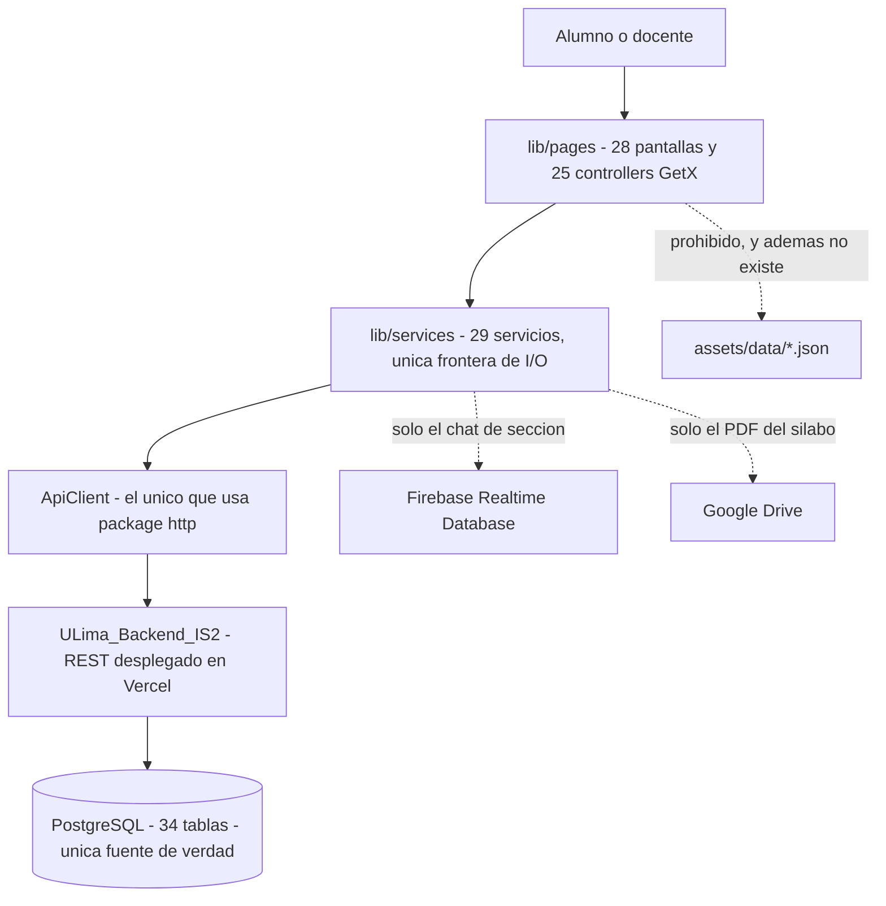

La regla existe porque el sistema tiene dos escrituras vivas —el backend y la importación desde miUlima— y un caché local mentiroso sería indistinguible de un dato real para el alumno que decide si se matricula o no en un curso. El costo de sostenerla es visible en el código, y no es barato:

> **1 · Distinguir "falló" de "está vacío" en cada pantalla.** Sin respaldo local, un error de red produciría una pantalla vacía que el alumno leería como "no tengo cursos". Por eso existe [`lib/components/error_retry.dart`](lib/components/error_retry.dart) y se usa en calculadora, alertas, anuncios de delegado, los tres tabs de detalle de curso y la lista de alumnos en riesgo — `at_risk_students_page.dart:196-203` cambia el falso negativo "No se encontraron alumnos" por `ErrorRetry('No se pudo cargar la lista de alumnos')`. La malla resuelve lo mismo con su propio widget `_ErrorState` (`malla_list_page.dart:53-58`).

> **2 · Invalidar cachés a mano, en orden.** Los tres cachés en memoria por código de alumno (`MallaService._loadedForCode`, `CoursesService`, `EvaluationSyllabusService`) se cortocircuitan solos y hay que limpiarlos explícitamente. `AuthService.logout()` (`auth_service.dart:315-339`) los borra para que otra cuenta en el mismo dispositivo no vea datos ajenos, y tras importar un ciclo se invalidan **cinco** capas en un orden que es load-bearing: `PortalSyncService.refreshAfterImport()` (`portal_sync_service.dart:126-142`) hace las tres primeras —primero el token re-firmado, después `/auth/me`, después los cachés— y `PortalSyncController` (`portal_sync_controller.dart:79-122`) remata con los controllers vivos y las alertas.

> **3 · Pedir permiso antes de preguntar.** Varios endpoints son exclusivos de alumno (`/alerts/me`, `/academic-profile/*`, `/portal-sync/*`). En vez de dejar que el backend conteste 403 y pintar un error, el frontend se abstiene de llamarlos con cuenta docente (`main.dart:71-79`, `auth_service.dart:138-142`, `home_controller.dart:23`, `alert_service.dart:29-30`).

> **4 · No es gratis y hay grietas.** `ApiClient` **no impone ningún timeout** (`api_client.dart:95`); solo tres puntos se protegen a mano — 90 s y 15 s en `portal_sync_service.dart:28-29` y 8 s en `chat_page.dart:48`. Y la regla "no llamar HTTP desde widgets" tiene una violación literal: [`lib/pages/horario/horario.dart:976`](lib/pages/horario/horario.dart) hace `await ApiClient().postJson(...)` dentro de un archivo de página.

El ciclo no se lo inventa la app: **lo trae el alumno desde miUlima**. La pantalla [`/portal-sync`](lib/pages/portal_sync) pide contraseña del portal y el código de 6 dígitos del authenticator, y el backend hace el login por él y baja cursos, secciones, horario, docentes, matrícula y avance de carrera. La contraseña vive **solo** en el `TextEditingController` —no entra en un `Rx`, no se guarda, no se imprime, se limpia al usarla y otra vez en `onClose()` antes del `dispose()` (`portal_sync_controller.dart:38-40, 51-59, 76-78`)— y el usuario del portal ni siquiera se envía: el backend lo saca del JWT. Mientras el alumno no importe, `HomeController` le muestra un banner honesto: *"Aún no tienes los cursos del ciclo `<code>`. Tráelos desde miUlima."* (`home_controller.dart:30-35`). Es la misma filosofía: la app no adivina el ciclo, lo pide.

Última precisión, porque se malinterpreta seguido: **las notas de la calculadora son personales y no oficiales** (`AGENTS.md:58`, `KNOWLEDGE.md:72`, `README.md:81`). La pestaña *Notas* es una calculadora donde el alumno registra lo que él cree que sacó, y la app **no** calcula riesgo académico con esas notas: las alertas llegan hechas de `GET /alerts/me` (`alert_service.dart:35`) y el backend las deriva de las notas **oficiales** de `student_score`, con los umbrales `ACADEMIC_RISK_MIN_PROGRESS = 55` y `ACADEMIC_RISK_MAX_AVERAGE = 10.5` (`alerts.logic.ts:6,8` del backend). Lo oficial está en otra pantalla, `/mis-notas`, que lee `GET /official-grades/me` y es de **solo lectura**; se llega a ella desde el ícono `school_outlined` con tooltip "Notas oficiales" de la propia calculadora (`calculadora_page.dart:31-46`). Nunca se mezclan. En la misma línea, la simulación de la malla es visual y no debe confundirse con progreso real (`AGENTS.md:61`).

---

## 🧩 Arquitectura

La app es un cliente Flutter de una sola capa de red. **30 217 líneas de Dart en 151 archivos** bajo `lib/`, organizadas en cinco anillos: pantalla → controller → servicio → `ApiClient` → backend. La fuente de verdad no vive aquí: vive en el PostgreSQL que hay detrás de [`ULima_Backend_IS2`](https://github.com/jeffangeloss/ULima_Backend_IS2). Todo lo que la app guarda en el dispositivo es sesión, preferencias o caché.

No hay Provider, ni Riverpod, ni Bloc, ni Dio. Hay **GetX** para estado, inyección y rutas, y **`package:http`** para la red — usado en exactamente un archivo.

### El stack

Entorno declarado en [`pubspec.yaml`](pubspec.yaml)`:22`: `sdk: ^3.11.4`. El `pubspec.lock` resuelve `dart: ">=3.11.4 <4.0.0"` y `flutter: ">=3.38.4"`. El paquete Dart se llama `ulima_plus`, versión `1.0.0+1`.

| Pieza | Paquete | Restricción | Resuelto |
|:---|:---|:---|:---|
| Estado, DI y rutas | `get` | `^4.6.5` | 4.7.3 |
| Red HTTP | `http` | `^1.6.0` | 1.6.0 |
| Preferencias locales | `shared_preferences` | `^2.3.4` | 2.5.5 |
| Almacén seguro del JWT | `flutter_secure_storage` | `^10.3.1` | 10.3.1 |
| Chat en vivo | `firebase_core` · `firebase_auth` · `firebase_database` | `^4.11.0` · `^6.5.4` · `^12.4.4` | 4.11.0 · 6.5.4 · 12.4.4 |

Dart 3 no es decorativo: `UserModel.especialidades` usa la sintaxis de elemento nulo `[?especialidadPrincipal, ...]` ([`lib/models/user_model.dart`](lib/models/user_model.dart)`:103`), que solo compila en Dart 3.x. La tabla completa de dependencias por rol está al final de esta sección.

---

### El arranque — [`lib/main.dart`](lib/main.dart)

`main()` es `async` y hace doce cosas en este orden exacto (`lib/main.dart:48-84`). El orden es load-bearing: la restauración de sesión ocurre **antes** de `runApp`, así que la app nunca parpadea el login para un usuario que ya tenía sesión.

| # | Paso | Línea | Por qué |
|---:|:---|:---|:---|
| 1 | `WidgetsFlutterBinding.ensureInitialized()` | `:49` | Requisito previo a tocar canales de plataforma. |
| 2 | `SystemChrome.setPreferredOrientations([portraitUp])` | `:50-52` | La app arranca **bloqueada en vertical**. El landscape se habilita pantalla por pantalla. |
| 3 | `Firebase.initializeApp(options: DefaultFirebaseOptions.currentPlatform)` | `:53` | Siempre, aunque Firebase solo lo use el chat de sección. |
| 4 | `LucideIcons.info.codePoint;` | `:54` | Expresión suelta, sin asignación ni llamada. Presumiblemente fuerza la carga del paquete de íconos. **No hay comentario que lo explique.** |
| 5 | `Get.putAsync<StorageService>(() => StorageService().init(), permanent: true)` | `:57-60` | `init()` resuelve `SharedPreferences.getInstance()`. Primero, porque todos los demás lo necesitan. |
| 6-8 | `Get.put` de `AuthService`, `AlertService`, `MallaService`, todos `permanent: true` | `:61-63` | Los cuatro únicos `GetxService` de la app. |
| 9 | `await AuthService.to.tryRestoreSession()` | `:66` | `GET /auth/me` con el JWT del almacén seguro. |
| 10 | Cálculo de `initialRoute` | `:67-82` | `postLoginRoute(user)` si restauró; `'/login'` si no. |
| 11 | Precarga de alertas **solo si `!user.isTeacher`** | `:73-79` | `/alerts/me` lleva `requireRole` de alumno; un docente recibiría 403. El `catch` hace `print(...)`. |
| 12 | `runApp(MyApp(initialRoute: initialRoute))` | `:84` | |

`MyApp` es un `StatelessWidget` que recibe `initialRoute` por constructor y monta el `GetMaterialApp` (`lib/main.dart:87-214`):

```dart
final materialTheme = MaterialTheme(Theme.of(context).textTheme);
return GetMaterialApp(
  title: 'ULIMA++',
  theme: materialTheme.light(),
  darkTheme: materialTheme.dark(),
  themeMode: ThemeMode.system,
  debugShowCheckedModeBanner: false,
  scrollBehavior: const AppScrollBehavior(),
  initialRoute: initialRoute,
  getPages: [ /* 15 rutas nombradas */ ],
);
```

| Propiedad | Valor | Detalle |
|:---|:---|:---|
| `title` | `'ULIMA++'` | `lib/main.dart:95` |
| `theme` / `darkTheme` | `MaterialTheme.light()` / `.dark()` | Dos `ColorScheme` escritos a mano, **no** generados con `ColorScheme.fromSeed` ([`lib/configs/themes.dart`](lib/configs/themes.dart)`:157-252`). |
| `themeMode` | `ThemeMode.system` | El modo lo decide el sistema operativo; no hay toggle en la app. |
| `scrollBehavior` | `AppScrollBehavior` | `getScrollPhysics => const ClampingScrollPhysics()` (`lib/main.dart:220-226`). Mata el rebote de iOS en **toda** la app. |
| `initialRoute` | calculado en `main()` | Ver diagrama abajo. |
| `getPages` | 15 rutas nombradas | `lib/main.dart:105-211`. |

**Orientaciones.** `main.dart` fija `portraitUp` y seis puntos del código lo amplían o lo restauran. `_scheduleOrientations` y `_mallaMapOrientations` son la misma lista `[portraitUp, landscapeLeft, landscapeRight]`, y solo la aplican el shell cuando la pestaña activa es "Horario" ([`lib/pages/home/home_page.dart`](lib/pages/home/home_page.dart)`:24-31`), el toggle del header, las dos vistas de horario y la malla clásica en modo mapa. Cada una vuelve a vertical en su `dispose()`.

> ⚠️ **Solo Android, iOS y Web arrancan.** `firebase_options.dart:27-45` lanza `UnsupportedError` para macOS, Windows y Linux, y `Firebase.initializeApp` está en el paso 3 de `main()`. Los directorios `macos/`, `windows/` y `linux/` existen en el repo pero la app moriría en el arranque en esas tres plataformas.

---

### Las capas

La cadena es: **pantalla → controller → servicio → `ApiClient` → backend → PostgreSQL**, con `models/` adaptando los DTOs en el camino de vuelta y `domain/` conteniendo la lógica que no necesita saber nada de red.

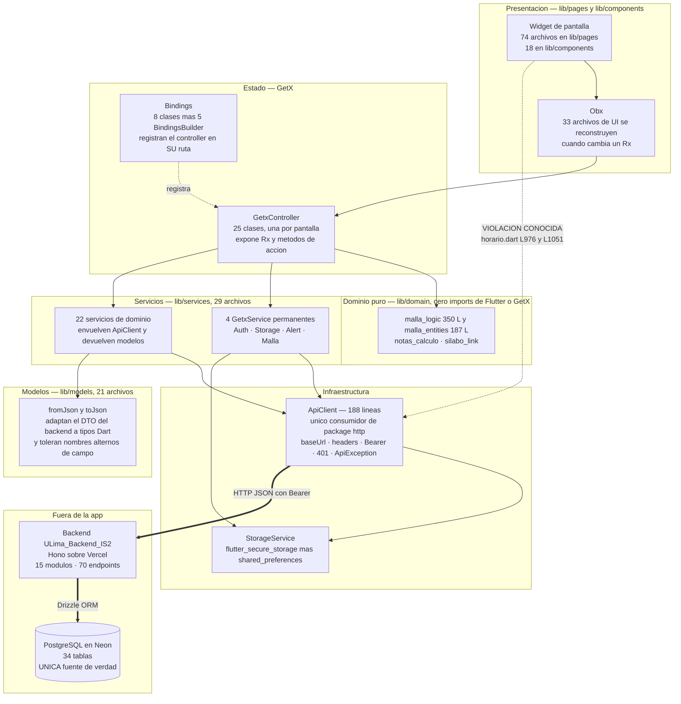

| Capa | Carpeta | Archivos | Qué contiene |
|:---|:---|---:|:---|
| Presentación | `lib/pages/**` | 74 | Pantallas y sus controllers, en 18 subcarpetas. La más grande es `teacher/` con 19. |
| Presentación | `lib/components/**` | 18 | Widgets reutilizables sin estado de negocio: `AppHeader`, `AppFooter`, `Skeleton`, `ChatbotBubble`, `ErrorRetry`. |
| Dominio | `lib/domain/**` | 4 | Lógica pura, **cero imports de Flutter y GetX** (declarado en `malla_entities.dart:3`): prerrequisitos y simulación de malla, promedio ponderado, parseo de enlaces de Drive. |
| Modelos | `lib/models/**` | 21 | DTOs con `fromJson`/`toJson`. Los mayores: `user_model` 191 L, `portal_sync_models` 176 L, `official_grades_models` 160 L. |
| Servicios | `lib/services/**` | 29 | La frontera de I/O. 22 hablan con el backend, 4 son locales, 2 salen a terceros y 1 es el `ApiClient`. |
| Configuración | `lib/configs/**` | 3 | Tema (310 L), paleta de cursos (115 L), client ID web de Google. |

**Los modelos son adaptadores, no espejos.** `UserModel.fromJson` acepta `email` o `institutionalEmail`, `career_id` o `careerId`, `setupComplete` o `specialtySetupCompleted`, y cae a `'estudiante'` si `role` viene ausente ([`lib/models/user_model.dart`](lib/models/user_model.dart)`:140-165`). No es descuido: es la forma de sobrevivir a que el contrato del backend haya cambiado de vocabulario a mitad del proyecto sin romper clientes ya instalados.

#### La regla dura: ningún widget hace HTTP

[`AGENTS.md`](AGENTS.md)`:37-40` la escribe en cuatro líneas: *no llamar HTTP desde widgets*, *no leer JSON desde widgets*, *los services son la frontera de API*, *un API client central debe manejar base URL, headers, token y errores*.

**Por qué.** Un `widget` se reconstruye cada vez que Flutter lo decide. Si el `build()` dispara una petición, la app manda N peticiones por cada rebuild, no hay dónde poner el estado de carga, y la respuesta puede llegar cuando el widget ya no está montado. Además, con el HTTP repartido no hay un solo lugar donde inyectar el `Bearer`, atrapar el 401 o cambiar la base URL: cada llamada tendría que acordarse por su cuenta.

**Cómo se hace cumplir.** No hay linter que lo verifique; se sostiene por tres hechos estructurales:

> **1 · Solo un archivo importa `package:http`.** [`lib/services/api_client.dart`](lib/services/api_client.dart) es el único punto donde se construye un `http.Request` contra el backend propio. Cualquier otro import de `http` salta a la vista en un diff.

> **2 · El token no se pasa a mano.** `ApiClient` lo resuelve solo (`api_client.dart:90`). Un widget que quisiera llamar directo tendría que replicar la resolución del `Bearer`, el saneado de la base URL y el interceptor de 401 — trabajo suficiente como para que el camino corto sea usar el servicio.

> **3 · Los servicios devuelven modelos, no `Map`.** La pantalla recibe `List<AlertModel>`, no JSON crudo, así que no tiene nada que parsear.

**Y aun así se rompió.** [`lib/pages/horario/horario.dart`](lib/pages/horario/horario.dart)`:976` hace `await ApiClient().postJson(...)` dentro de un `State` de widget, y `:1051` instancia otro. De las **28 instanciaciones de `ApiClient()`** en `lib/`, 23 están en `lib/services/` y **5 fuera**: esas dos, más [`lib/pages/horario/horario_controller.dart`](lib/pages/horario/horario_controller.dart)`:29`, [`lib/pages/calculadora/calculadora_controller.dart`](lib/pages/calculadora/calculadora_controller.dart)`:27` y [`lib/pages/malla/malla_list_controller.dart`](lib/pages/malla/malla_list_controller.dart)`:487`. (La coincidencia número 29 de `ApiClient(` es la declaración del constructor en `api_client.dart:28`, no una instanciación.) Las tres de controllers son menos graves — hay estado y ciclo de vida — pero tampoco son la capa de servicios. En total, **13 de los 66 endpoints consumidos** se llaman sin pasar por un servicio: todo el módulo `schedule`, `grades/me/notes`, `grades/me/calculate` y `curriculum/me/simulation`. Está listado con nombre y apellido en [Deuda técnica y límites conocidos](#-deuda-técnica-y-límites-conocidos).

---

### GetX como mecanismo reactivo

GetX cubre tres responsabilidades a la vez, y conviene no confundirlas:

| Responsabilidad | Pieza | Cuántas |
|:---|:---|---:|
| Estado observable | `Rx`/`.obs` en controllers, `Obx(...)` en las vistas | 33 archivos de UI usan `Obx` |
| Inyección de dependencias | `Get.put` / `Get.lazyPut` / `Get.putAsync`, `Get.find<T>()` | 22 `Get.find<T>()`; el tipo más buscado es `HorarioController` (4) |
| Navegación | rutas nombradas en `getPages`, `Get.toNamed` / `Get.offAllNamed` | 15 rutas nombradas + 6 destinos anónimos |

**Controllers.** 25 clases `extends GetxController`, en general una por pantalla. Casi todas exponen la misma tripleta *cargando / error / datos* como campos `Rx` separados, a propósito: sin un flag de error explícito, un fallo de red se veía en pantalla igual que "no hay nada" — el usuario leía "¡Todo al día!" cuando en realidad la petición había reventado. El patrón quedó fijado tras la auditoría documentada en `ULima_Backend_IS2/docs/AUDITORIA_TECNICA.md §6.1` —ese archivo vive en el repo del backend, no en este— y se ve, por ejemplo, en [`lib/services/alert_service.dart`](lib/services/alert_service.dart)`:16-20`.

**Servicios permanentes.** Cuatro `GetxService` registrados con `permanent: true` en `main()`, cada uno con su singleton estático `static X get to => Get.find()`: `StorageService`, `AuthService`, `AlertService`, `MallaService`. Sobreviven a toda navegación, incluido `offAllNamed`.

**Bindings.** Un `Binding` registra el controller de una página **atado a su ruta**, no a un widget. Esa distinción viene de un bug real, documentado en tres archivos (`lib/main.dart:106-110`, `lib/pages/portal_sync/portal_sync_binding.dart:5-7`, `lib/pages/login/login_binding.dart:1-18`):

> **La trampa del `Get.put` en `build()`.** Un `Get.put` dentro de `build()` asociaba el controller al overlay del snackbar que estuviera activo durante la transición. Al descartarse el snackbar, GetX eliminaba el controller de la página **visible** y la app reventaba con *"A TextEditingController was used after being disposed"*. En release no crasheaba: se manifestaba como "tipeo fantasma", texto que se escribía en un campo ya muerto. De ahí la regla del repo: **nada de `Get.put` dentro de `build()`**.

Las ocho clases `Bindings` en disco y las rutas a las que sirven:

| Binding | Archivo | Ruta / página | Qué registra |
|:---|:---|:---|:---|
| `LoginBinding` | [`lib/pages/login/login_binding.dart`](lib/pages/login/login_binding.dart)`:25-39` | `/login` → `LoginPage` | `Get.put(LoginController(), permanent: true)`. Si ya existe, lo reusa y agenda `resetFields()` en `addPostFrameCallback` para no disparar un `setState during build`. **Único binding con instancia permanente.** |
| `MisNotasBinding` | [`lib/pages/mis_notas/mis_notas_binding.dart`](lib/pages/mis_notas/mis_notas_binding.dart)`:5-10` | `/mis-notas` → `MisNotasPage` | `lazyPut(MisNotasController)` |
| `NetworkingBinding` | [`lib/pages/networking/networking_binding.dart`](lib/pages/networking/networking_binding.dart)`:7-19` | `/networking` → `NetworkingPage` | `lazyPut<NetworkingGateway>(() => NetworkingService())` **y** el controller con esa abstracción inyectada. Único binding que inyecta una interfaz en vez de una clase concreta: es el punto de entrada de los tests. |
| `PortalSyncBinding` | [`lib/pages/portal_sync/portal_sync_binding.dart`](lib/pages/portal_sync/portal_sync_binding.dart)`:8-13` | `/portal-sync` → `PortalSyncPage` | `lazyPut<PortalSyncController>(PortalSyncController.new)` |
| `AttendeesBinding` | [`lib/pages/teacher/attendees_binding.dart`](lib/pages/teacher/attendees_binding.dart)`:7-16` | `/teacher-advising-attendees` → `AttendeesPage` | `lazyPut(AttendeesController, fenix: true)`. **Único con `fenix`**: sin él, la segunda visita reusaba el controller con el `sessionId` viejo y la lista de confirmados salía vacía. |
| `CreateAdvisingBinding` | [`lib/pages/teacher/create_advising_binding.dart`](lib/pages/teacher/create_advising_binding.dart)`:7-12` | `/teacher-advising-create` → `CreateAdvisingPage` | `lazyPut(CreateAdvisingController)` |
| `TeacherGradeSectionBinding` | [`lib/pages/teacher/teacher_grade_section_binding.dart`](lib/pages/teacher/teacher_grade_section_binding.dart)`:5-10` | `/teacher-grade-section` → `TeacherGradeSectionPage` | `lazyPut(TeacherGradeSectionController)` |
| `TeacherHomeBinding` | [`lib/pages/teacher/teacher_home_binding.dart`](lib/pages/teacher/teacher_home_binding.dart)`:9-14` | `/teacher-home` → `TeacherHomePage` | `lazyPut(TeacherHomeController)` |

Además hay **5 bloques `BindingsBuilder` inline** en `main.dart`, uno por ruta:

| Ruta | Registra | Nota |
|:---|:---|:---|
| `/forgot-password` | `ForgotPasswordController` | `main.dart:119-125` |
| `/reset-password` | `ResetPasswordController` | `main.dart:126-132` |
| `/home` | `MallaListController`, `TeacherSectionsController`, `TeacherHomeController`, `TeacherGradesController` | Los cuatro controllers del shell se atan a la **ruta** `/home` para sobrevivir al cambio de pestañas y morir en el logout. `main.dart:134-146` |
| `/malla-clasica` | `MallaController` | Vista mapa de solo lectura; se rehidrata fresca en cada entrada. `main.dart:147-157` |
| `/silabo` | `SilaboViewerController` | Recibe `{'url', 'titulo'}` por argumentos. `main.dart:158-168` |

**Dos rutas nombradas no declaran binding**: `/setup-carrera` y `/chatbot` hacen `Get.put` dentro de la página (`setup_carrera_page.dart:17`, `chatbot_page.dart:18`). Y **6 destinos se abren con `Get.to(() => Widget())` anónimo**, sin ruta nombrada ni binding: `AlertasPage`, `DescripCursosPage`, `AtRiskStudentsPage`, `ChatPage`, `CreateAnnouncementPage` y `DelegadoAnunciosPage`. Es exactamente el patrón que la regla anterior prohíbe; no ha explotado ahí, pero es deuda.

---

### `ApiClient` en detalle

188 líneas en [`lib/services/api_client.dart`](lib/services/api_client.dart). Es el único punto de la app que arma un `http.Request` contra el backend propio.

#### Resolución de `API_BASE_URL`

```dart
ApiClient({String? configuredBaseUrl})
  : _configuredBaseUrl = configuredBaseUrl ?? _defaultConfiguredBaseUrl;

static const _defaultConfiguredBaseUrl = String.fromEnvironment('API_BASE_URL');

String get baseUrl {
  if (_configuredBaseUrl.trim().isNotEmpty) {
    return _sanitizeBaseUrl(_configuredBaseUrl);
  }
  if (kReleaseMode) {
    throw StateError(
      'API_BASE_URL debe definirse en builds release con --dart-define.',
    );
  }
  if (kIsWeb) return 'http://localhost:3000';
  if (defaultTargetPlatform == TargetPlatform.android) {
    return 'http://10.0.2.2:3000';
  }
  return 'http://localhost:3000';
}
```
(`lib/services/api_client.dart:27-50`)

| Condición, en orden de evaluación | Base URL | Línea |
|:---|:---|:---|
| `configuredBaseUrl` del constructor no vacío | ese valor, saneado | `:28-29, 37-39` |
| `--dart-define=API_BASE_URL=…` no vacío | ese valor, saneado | `:31-33` |
| Vacío **y** `kReleaseMode` | **`StateError`** — falla dura | `:40-44` |
| Vacío, debug/profile, web | `http://localhost:3000` | `:45` |
| Vacío, debug/profile, **Android** | `http://10.0.2.2:3000` | `:46-48` |
| Vacío, debug/profile, resto (iOS, escritorio) | `http://localhost:3000` | `:49` |

Tres decisiones que conviene entender:

> **1 · No hay host de producción en el código.** `String.fromEnvironment` es `const`: el valor se congela en tiempo de compilación. Un APK queda atado a **el backend contra el que se compiló**. Se inyecta con `flutter build apk --dart-define=API_BASE_URL=https://u-lima-backend-is-2-one.vercel.app`, y las tres configuraciones de [`.vscode/launch.json`](.vscode/launch.json) hacen lo mismo para depurar.

> **2 · El emulador de Android necesita otro host.** Dentro del emulador, `localhost` es el emulador mismo, no la Mac que corre el backend. `10.0.2.2` es la dirección que el emulador de Android mapea al `127.0.0.1` del host. Sin ese caso especial, todo desarrollo local en Android fallaría con conexión rechazada. En iOS el simulador comparte la red del host, así que `localhost` sirve tal cual.

> **3 · `baseUrl` es un getter, no un campo.** Se recalcula en cada petición, y por tanto el `StateError` de release no aparece en el arranque sino en la **primera llamada de red**. Es una elección deliberada: falla ruidoso en vez de compilar un APK mudo apuntando a `localhost`.

`_sanitizeBaseUrl` recorta espacios y quita una barra final (`:144-146`), así que `https://host/` y `https://host` producen la misma URI.

#### Headers e inyección del Bearer

```dart
Map<String, String> _headers(String? token) {
  final headers = {
    'Accept': 'application/json',
    'Content-Type': 'application/json',
  };
  if (token != null && token.isNotEmpty) {
    headers['Authorization'] = 'Bearer $token';
  }
  // El header X-User-Code se eliminó: era parte del antiguo bypass de auth
  // (ya retirado del backend) y además rompía el preflight CORS en web,
  // porque el backend solo permite Content-Type y Authorization.
  return headers;
}
```
(`lib/services/api_client.dart:130-142`)

El token **no lo pasa el llamador**. `_send` lo resuelve solo:

```dart
final resolvedToken = token ?? await StorageService.to.savedToken;
```
(`lib/services/api_client.dart:90`)

Y `savedToken` lee de `flutter_secure_storage`, no de `shared_preferences`. Por eso casi ningún servicio toca el token: solo `AuthService` lo pasa explícitamente en `/auth/me`, `/auth/logout` y `/academic-profile/*`, donde necesita usar un token recién obtenido y todavía no persistido.

Verbos expuestos: `getJson(path, {token, query})`, `postJson(path, {body, token})`, `putJson(path, {body, token})`, `deleteJson(path, {token})` — `:52-81`. **No hay `PATCH`.** Los pares de query con valor `null` se descartan antes de construir la URI (`:119-128`).

#### Errores

```dart
if (response.statusCode >= 200 && response.statusCode < 300) return json;

final error = json['error'];
if (error is Map) {
  throw ApiException(
    statusCode: response.statusCode,
    code: error['code']?.toString() ?? 'HTTP_ERROR',
    message: error['message']?.toString() ?? 'Error del servidor',
    details: error['details'],
  );
}
```
(`lib/services/api_client.dart:167-179`)

| Situación | Resultado |
|:---|:---|
| Cuerpo vacío | `{}` |
| Cuerpo **no-JSON** | `{'raw': body}` — sin esto, `jsonDecode` lanzaba un `FormatException` críptico que **enmascaraba el status real**; el caso concreto fue un 404 del chat (`:156-161`) |
| JSON que no es objeto | `{'data': decoded}` |
| 2xx | devuelve el `Map<String, dynamic>` |
| No-2xx con `error` objeto | `ApiException(statusCode, code, message, details)` con los campos del backend |
| No-2xx sin `error` | `ApiException(statusCode, 'HTTP_ERROR', 'Error del servidor', details: json)` |

`ApiException` (`:10-25`) expone `statusCode:int`, `code:String`, `message:String`, `details:Object?`. Ese `code` es lo que los servicios traducen a español — `PORTAL_LOGIN_REJECTED`, `NOT_ENROLLED`, `INVALID_DOMAIN` — como se detalla en [La capa de servicios](#-la-capa-de-servicios).

#### El interceptor de 401

```dart
if (resolved.statusCode == 401 && !path.contains('/auth/login')) {
  await StorageService.to.clearSession();
  if (!path.contains('/auth/logout') && offAllToLogin()) {
    Get.snackbar('Sesión expirada',
        'Tu sesión caducó o iniciaste sesión en otro dispositivo.');
  }
}
```
(`lib/services/api_client.dart:98-114`)

Cuatro reglas, todas con motivo:

1. **`/auth/login` queda excluido.** Un 401 ahí significa "credenciales malas", no "sesión expirada". Cerrar sesión por un tipeo sería absurdo.
2. **Cualquier otro 401 limpia la sesión local siempre.** El JWT ya no vale; guardarlo solo sirve para fallar de nuevo.
3. **`/auth/logout` limpia pero no navega ni muestra snackbar.** El logout es voluntario; quien lo inició ya está navegando, y un "Sesión expirada" sería un mensaje engañoso.
4. **La navegación pasa obligatoriamente por `offAllToLogin()`**, que devuelve `false` si no hay navegador montado o si `/login` ya es la ruta actual. El snackbar solo aparece si de verdad se navegó. Sin esa guarda, varias peticiones caducando a la vez apilaban dos rutas `/login` — el mismo bug de "tipeo fantasma" descrito arriba.

#### Timeouts: **no hay ninguno**

`_send` llama a `await request.send()` **sin `.timeout()`** (`api_client.dart:95`). El hecho está reconocido por escrito en el propio código:

> «`ApiClient` no impone timeout (`_send` llama a `request.send()` sin `.timeout()`), así que sin esto la pantalla quedaría colgada para siempre si el portal no responde.» — [`lib/services/portal_sync_service.dart`](lib/services/portal_sync_service.dart)`:24-27`

Los únicos tres timeouts del frontend son locales, puestos a mano donde alguien se acordó:

| Uso | Valor | Archivo |
|:---|---:|:---|
| `PortalSyncService.importTimeout` | 90 s | `portal_sync_service.dart:28` |
| `PortalSyncService.statusTimeout` | 15 s | `portal_sync_service.dart:29` |
| Carga del chat de sección | 8 s | `lib/pages/chat/chat_page.dart:48` |

Además, `ApiClient` **no envuelve los fallos de red**: un `SocketException` se propaga crudo hasta el controller. Cualquier pantalla que no sea esas tres puede quedarse colgada indefinidamente si el backend no responde. Es la deuda operativa más seria del cliente.

**Instanciación.** `ApiClient` no es singleton: se crea con `ApiClient()` en 28 sitios. Cinco servicios aceptan uno inyectado por constructor para poder testearlos sin red: `EvaluationSyllabusService`, `NetworkingService`, `PortalSyncService`, `CoursesService` y `ContactoService`.

---

### Almacenamiento local

Dos backends distintos conviven en [`lib/services/storage_service.dart`](lib/services/storage_service.dart) (238 líneas), y el reparto no es arbitrario: **una sola cosa va al almacén seguro, y es el JWT.**

| Dato | Backend | Clave literal | Tipo |
|:---|:---|:---|:---|
| **JWT de sesión** | `flutter_secure_storage` | `session_token` | String |
| Código del alumno | `shared_preferences` | `session_code` | String |
| Carrera | `shared_preferences` | `session_career_id` | int |
| Carrera (legado) | `shared_preferences` | `session_career` | — |
| Especialidades combinadas | `shared_preferences` | `session_especialidades_v2` | JSON de `List<int>` |
| Especialidades (legado) | `shared_preferences` | `session_especialidades` | — |
| Especialidad principal | `shared_preferences` | `session_especialidad_principal` | int |
| Especialidades de interés | `shared_preferences` | `session_especialidades_interes` | JSON de `List<int>` |
| Setup completo | `shared_preferences` | `session_setup_complete` | bool, default `false` |
| Estados de la malla | `shared_preferences` | `session_statuses_v2` | JSON `{courseId: CourseStatus.index}` |
| Estados de la malla (legado) | `shared_preferences` | `session_statuses` | — |
| Setups por usuario | `shared_preferences` | `user_setups_v1` | JSON `{código: {…}}` |
| Estados por usuario | `shared_preferences` | `user_statuses_v1` | JSON `{código: {courseId: index}}` |

**12 claves en `shared_preferences`, 1 en el almacén seguro.** El JWT está solo porque es la única credencial: con él, cualquiera es el usuario. El resto son preferencias o cachés cuyo original vive en la base de datos, así que un atacante con acceso al `shared_preferences` del dispositivo no obtiene nada que no pudiera pedir al backend con el mismo token.

Dos accesos a `shared_preferences` viven **fuera** de `StorageService` y conviene conocerlos: [`lib/services/notas_service.dart`](lib/services/notas_service.dart) escribe directo las claves `notas_estudiante_<id>` y `currentStudentId`; y [`lib/services/silabo_service.dart`](lib/services/silabo_service.dart) cachea los PDF en `getTemporaryDirectory()` como `<fileId>.pdf`, con tope de 25 MB y validación de la firma `%PDF`.

> ⚠️ **`clearSession()` no borra todo.** `storage_service.dart:206-218` borra el token seguro y 10 claves de `shared_preferences`, pero **no** `user_setups_v1` ni `user_statuses_v1`, ni las claves de `NotasService`. Esas cachés por código de alumno sobreviven al logout en el dispositivo. No hay comentario que lo justifique, y contradice el propósito declarado de invalidar todas las cachés por usuario (`auth_service.dart:328-329`).

**La contraseña de miUlima nunca se persiste.** `portal_sync_service.dart:16-18` lo dice sin ambigüedad: no entra en un `Rx`, no va a `shared_preferences`, no se imprime. Viaja del campo de texto al backend y desaparece.

#### La regla: el almacenamiento local no sustituye a PostgreSQL

[`AGENTS.md`](AGENTS.md)`:10-11` y [`README.md`](README.md)`:39` la fijan: *«`shared_preferences` debe guardar solo sesión/token/preferencias locales permitidas, no reemplazar PostgreSQL»*, y *«no existen archivos `assets/data/` en el proyecto; la única fuente de verdad es PostgreSQL a través del backend»*.

En la práctica significa tres cosas:

1. **No hay JSON semilla en el repo.** `assets/` solo declara `assets/images/` ([`pubspec.yaml`](pubspec.yaml)`:105-106`); no existe `assets/data/`. Si falta un dato, se reporta el faltante en el backend — no se vuelve a un JSON local.
2. **Lo que se guarda local es derivado o preferencia.** Los estados de la malla en `session_statuses_v2` son la simulación del alumno; los oficiales llegan de `/curriculum/me`. Las notas de `NotasService` son las **personales no oficiales** de la calculadora; las oficiales solo se leen de `/official-grades/me` y jamás se persisten.
3. **Las cachés cortocircuitan por código de alumno y hay que invalidarlas a mano.** `MallaService._loadedForCode`, `CoursesService` y `EvaluationSyllabusService` se saltan la red si ya cargaron para ese código. `PortalSyncService.refreshAfterImport` documenta **cinco** capas de invalidación tras importar un ciclo, y el orden importa: primero `AuthService.replaceToken(...)`, porque el backend re-firma el JWT con la misma `token_version` para que un delegado recién electo vea su pestaña sin re-loguearse, y solo después `refreshCurrentUser()`. Al revés se consultaría `/auth/me` con el token viejo.

---

### La ruta post-login y la guarda de sesión

Toda la decisión de a dónde va el usuario cabe en cuatro líneas, en un archivo propio y sin dependencias, para que sea testeable como función pura:

```dart
/// - Docente/JP (TT09): home shell con navegacion docente.
/// - Alumno con setup completo: home.
/// - Alumno sin setup: seleccion de carrera/especialidad.
String postLoginRoute(UserModel user) {
  if (user.isTeacher) return '/home';
  return user.setupComplete ? '/home' : '/setup-carrera';
}
```
([`lib/services/post_login_route.dart`](lib/services/post_login_route.dart)`:11-14`)

| `isTeacher` | `setupComplete` | Ruta |
|:---|:---|:---|
| `true` | irrelevante | `/home` |
| `false` | `true` | `/home` |
| `false` | `false` | `/setup-carrera` |
| *(sin sesión restaurada)* | — | `/login` (`main.dart:81`) |
| *(fin del onboarding)* | pasa a `true` | `/home` vía `Get.offAllNamed('/home')` |

`isTeacher` es `role == 'teacher' || role == 'docente'`; `setupComplete` se hidrata de `setupComplete` o `specialtySetupCompleted`, con default `false`. **`isDelegate` no afecta la ruta**: un delegado es un alumno y va a `/home` como cualquiera; lo que cambia es el shell, que gana una quinta pestaña.

Los **cuatro llamadores** son los únicos puntos de la app que deciden ruta post-login: el arranque (`main.dart:70`) y los tres caminos del login — código + contraseña, Google en móvil y Google en web (`login_controller.dart:83`, `:103`, `:46`). Que sea una sola función y no tres `if` dispersos es la razón de que el comportamiento sea idéntico en los cuatro.

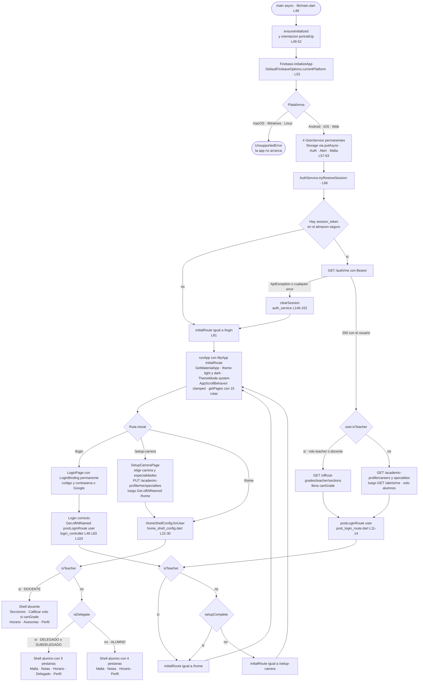

**La guarda de sesión.** Todo camino que termina una sesión — el botón de logout del Perfil, el interceptor de 401 del `ApiClient` y el éxito del reset de contraseña — pasa obligatoriamente por una sola función:

```dart
bool offAllToLogin() {
  if (Get.context == null) return false;
  final alreadyOnLogin =
      Get.currentRoute == '/login' || Get.currentRoute == '/LoginPage';
  if (alreadyOnLogin) return false;
  Get.offAllNamed('/login');
  return true;
}
```
([`lib/services/session_navigation.dart`](lib/services/session_navigation.dart)`:32-39`)

Nadie debe hacer `Get.offAllNamed('/login')` directo. La guarda cubre tres casos: el navegador aún no montado durante el arranque, la ruta `/login` ya activa, y varias peticiones caducando a la vez. Compara contra **dos** cadenas porque `/LoginPage` es el nombre que GetX autogenera para rutas anónimas. No tiene ventana de carrera: `Get.currentRoute` se actualiza síncronamente en el `didPush` del observer.

El logout completo (`auth_service.dart:315-339`) hace bastante más que borrar el token: limpia `MallaService`, `CoursesService`, `EvaluationSyllabusService`, `_profesorSectionIds`, `_currentUser`, llama a `StorageService.clearSession()` y cierra la sesión de Google. El motivo está comentado en el código: que otra cuenta en el mismo dispositivo no vea datos del usuario anterior.

---

### Dependencias por rol

| Rol | Paquete | Restricción | Resuelto |
|:---|:---|:---|:---|
| **Estado, DI y rutas** | `get` | `^4.6.5` | 4.7.3 |
| **Red HTTP** | `http` | `^1.6.0` | 1.6.0 |
| **Persistencia local** | `shared_preferences` | `^2.3.4` | 2.5.5 |
| **Persistencia segura** | `flutter_secure_storage` | `^10.3.1` | 10.3.1 |
| **SSO móvil** | `google_sign_in` | `^6.2.1` | 6.3.0 |
| **SSO web** | `google_sign_in_web` | `^0.12.4` | 0.12.4+4 |
| **Tiempo real (chat)** | `firebase_core` | `^4.11.0` | 4.11.0 |
| **Tiempo real (chat)** | `firebase_auth` | `^6.5.4` | 6.5.4 |
| **Tiempo real (chat)** | `firebase_database` | `^12.4.4` | 12.4.4 |
| **Íconos** | `lucide_icons_flutter` | `^3.1.14` | 3.1.15 |
| **Íconos** | `cupertino_icons` | `^1.0.8` | 1.0.9 |
| **Vectores** | `flutter_svg` | `^2.0.10+1` | 2.3.0 |
| **Visor de sílabos** | `pdfx` | `^2.9.2` | 2.9.2 |
| **Sistema de archivos** | `path_provider` | `^2.1.6` | 2.1.6 |
| **Compartir / exportar** | `share_plus` | `^13.2.0` | 13.2.0 |
| **Enlaces externos** | `url_launcher` | `^6.3.2` | 6.3.2 |
| **Dev · lint** | `flutter_lints` | `^6.0.0` | 6.0.0 |
| **Dev · ícono de app** | `flutter_launcher_icons` | `^0.14.4` | 0.14.4 |
| **Dev · splash nativo** | `flutter_native_splash` | `^2.4.4` | 2.4.7 |
| **Dev · pruebas** | `flutter_test` | del SDK | — |

Tres cosas que **no** están en esta lista y a veces se asumen: no hay librería de gráficos, no hay generador de código (`build_runner`, `freezed`, `json_serializable`) — los `fromJson` están escritos a mano —, y no hay cliente HTTP con interceptores; los interceptores son los 30 renglones de `_send`.

Una nota de plataforma que vive en el `pubspec.yaml` y explica un dolor de cabeza de iOS: `flutter.config.enable-swift-package-manager: false` (`pubspec.yaml:96-97`) está **desactivado a propósito**. Flutter 3.44 genera el paquete SPM raíz con piso iOS 13.0 hardcodeado y Firebase exige 15.0; con SPM apagado los plugins pasan por CocoaPods, que sí respeta `platform :ios, '15.0'`.

---

## 📁 Mapa del repositorio

Los conteos son de archivos del árbol de trabajo, medidos el 2026-09-07; donde difieren de lo
versionado en git se indica en la nota del final de la sección.

```text
ULima_Frontend_IS2/
├── lib/                              151 .dart · todo el código de la app, 30 217 líneas
│   ├── main.dart                     # 226 L. Bootstrap, GetMaterialApp, tabla de 15 getPages, AppScrollBehavior
│   ├── firebase_options.dart         #  76 L. GENERADO por FlutterFire. android/ios/web configurados;
│   │                                 #   macOS, Windows y Linux lanzan UnsupportedError (:27-45)
│   ├── components/           (18)    # Widgets reutilizables, sin estado de negocio. Subcarpetas por feature:
│   │                                 #   calculadora/ descripcion_cursos/ footer/ header/ networking/ + 6 en raíz
│   │                                 #   (chatbot_bubble, error_retry, skeleton, google_sign_in_button{,_stub,_web})
│   ├── configs/               (3)    # themes.dart (310 L), course_colors.dart (115 L), google_auth_config.dart
│   ├── domain/                (4)    # LÓGICA PURA, cero imports de Flutter/GetX. malla_entities (187 L),
│   │                                 #   malla_logic (350 L), notas_calculo (17 L), silabo_link (82 L)
│   ├── models/               (21)    # DTOs con fromJson/toJson. El mayor: user_model.dart (191 L)
│   ├── pages/                (74)    # 28 pantallas + sus controllers GetX + bindings de ruta.
│   │                                 #   18 subcarpetas; teacher/ es la mayor con 19 archivos
│   └── services/             (29)    # Frontera de I/O. api_client.dart (188 L) es el único que usa package:http
│
├── test/                       (49)  # 6 456 líneas. 19 carpetas: test/HU##_<autor> por historia,
│                                     #   más test/components/ y test/services/
├── specs/                      (16)  # README.md + 15 specs .spec.md, una carpeta por feature (1 318 L en total)
│
├── docs/                       (41)  # Documentación y material visual del curso
│   ├── images/UI/              (17)  # Mockups PNG de referencia. AGENTS.md:47 obliga a respetarlos
│   ├── images/arquitectura/     (5)  # diagrama db, diagramaClases, diagramaER, diagrama_despliegue .png/.puml
│   ├── images/casos_uso/        (8)  # 8 diagramas de casos de uso
│   ├── specs/                   (4)  # api-contracts.md (503 L), feature-index.md, workflow.md, spec-template.md
│   └── agent_session/           (5)  # Bitácoras de sesiones de agente + CAMBIO_GOOGLE_SIGNIN_ANDROID.md en raíz
│
├── android/                    (42)  # VIVA. Único target que CI compila. app/ tiene 35 archivos, incluye
│                                     #   google-services.json, debug.keystore compartido y key.properties.example
├── ios/                        (51)  # VIVA. Podfile con platform :ios, '15.0'; SPM desactivado a propósito
├── web/                        (15)  # VIVA. index.html, manifest.json, favicon, 4 íconos, 8 PNG de splash
├── macos/                      (30)  # ANDAMIAJE. Firebase lanza UnsupportedError; nadie la compila
├── windows/                    (18)  # ANDAMIAJE
├── linux/                      (10)  # ANDAMIAJE
│
├── assets/images/               (7)  # Las ÚNICAS assets. NO existe assets/data/ — es una regla, no un olvido
├── .github/workflows/           (1)  # build-apk.yml (207 L). Único workflow del proyecto
├── .tessl/                     (13)  # Reglas y skills vendorizadas de Spec Driven Development v2.0.1
│
├── pubspec.yaml                      # Paquete ulima_plus 1.0.0+1; assets; splash e ícono #E77330
├── analysis_options.yaml             # flutter_lints ^6.0.0; excluye android/ ios/ web/ desktop del analyze
├── firebase.json                     # flutter.platforms android/ios/dart del proyecto ulima-plus-chat.
│                                     #   NO tiene clave "hosting": hoy solo se despliegan reglas
├── database.rules.json               # Reglas de Realtime Database del chat de sección (2 295 bytes)
├── AGENTS.md                         #  72 L. Contrato de agentes: flujo de 10 pasos, arquitectura, reglas
├── KNOWLEDGE.md                      # 112 L. Producto, stack, catálogo de historias, decisiones no negociables
└── tessl.json                        # mode: "vendored", tile tessl-labs/spec-driven-development 2.0.1
```

### Resumen por carpeta

| Carpeta | Qué contiene | Archivos |
|:---|:---|---:|
| [`lib/`](lib) | Todo el código de la app Flutter | 151 |
| [`lib/pages/`](lib/pages) | 28 pantallas + 25 controllers GetX + bindings | 74 |
| [`lib/services/`](lib/services) | Frontera de I/O: HTTP, storage, Firebase, Drive | 29 |
| [`lib/models/`](lib/models) | DTOs y adaptadores `fromJson`/`toJson` | 21 |
| [`lib/components/`](lib/components) | Widgets reutilizables sin estado de negocio | 18 |
| [`lib/domain/`](lib/domain) | Lógica pura sin Flutter ni GetX | 4 |
| [`lib/configs/`](lib/configs) | Tema, paleta de cursos, client ID de Google | 3 |
| [`test/`](test) | Suites de prueba, agrupadas por historia y autor | 46 |
| [`specs/`](specs) | 15 specs Tessl + README de convenciones | 16 |
| [`docs/`](docs) | Mockups, diagramas, contrato REST local, bitácoras | 41 |
| [`ios/`](ios) | Proyecto Xcode, Podfile, Info.plist | 51 |
| [`android/`](android) | Proyecto Gradle, firma, `google-services.json` | 42 |
| [`macos/`](macos) | Andamiaje de `flutter create`, sin uso | 30 |
| [`windows/`](windows) | Andamiaje de `flutter create`, sin uso | 18 |
| [`web/`](web) | `index.html`, manifest, íconos y splash | 15 |
| [`.tessl/`](.tessl) | Reglas vendorizadas de Spec Driven Development | 13 |
| [`linux/`](linux) | Andamiaje de `flutter create`, sin uso | 10 |
| [`assets/images/`](assets/images) | 7 imágenes. No hay `assets/data/` | 7 |
| [`.github/`](.github) | `workflows/build-apk.yml`, único workflow | 1 |

### Qué carpetas de plataforma están vivas

| Carpeta | Estado | Evidencia |
|:---|:---|:---|
| `android/` | **Viva y es la única que se compila en CI** | [`.github/workflows/build-apk.yml`](.github/workflows/build-apk.yml) produce el APK firmado; `android/app/build.gradle.kts:72-80` usa el keystore de release si existe `key.properties` |
| `ios/` | **Viva, se compila a mano** | `ios/Podfile:2` fija `platform :ios, '15.0'`; los tres `IPHONEOS_DEPLOYMENT_TARGET` del `.pbxproj` coinciden; SPM desactivado a propósito en `pubspec.yaml:92-97` porque Flutter 3.44 hardcodea un piso de iOS 13.0 que rompe Firebase. **No hay comando de build iOS documentado en el repo** |
| `web/` | **Viva a nivel de código, sin despliegue** | `firebase_options.dart:68-75` configura la plataforma web y existe `google_sign_in_button_web.dart`; pero [`firebase.json`](firebase.json) **no tiene clave `hosting`** y ningún `.md`/`.yml` del repo menciona `flutter build web`. Además `web/manifest.json:6-8` conserva el azul `#0175C2` y la descripción `"A new Flutter project."` por defecto de Flutter |
| `macos/`, `windows/`, `linux/` | **Andamiaje muerto** | `firebase_options.dart:27-45` lanza `UnsupportedError` para las tres, y `main.dart:53` inicializa Firebase antes que nada: la app no llegaría ni a pintar. `.metadata` solo registra `root` y `android` como plataformas migradas. Los 58 archivos que suman los tres directorios son plantilla de `flutter create` |

> ⚠️ El árbol que documenta [`README.md`](README.md) del propio repo y las listas de `AGENTS.md` y `KNOWLEDGE.md` describen `lib/` como `pages/ components/ services/ models/ configs/` y **omiten `lib/domain/`**, que sí existe con 4 archivos y es donde vive la lógica pura extraída en TT03 (issue #93). Si vas a seguir esa documentación al pie de la letra, ten presente que le falta una carpeta.

**Dos notas de honestidad sobre los conteos.** En [`test/`](test) hay 46 archivos `.dart` en disco pero solo 44 versionados: la carpeta `test/HU_asistencia/` estaba sin trackear al momento de la medición. Y `ios/` tiene 51 archivos en git pero más de mil en disco, porque `ios/Pods/` se instala localmente y está ignorado.

---

## 🗺 Pantallas y navegación

La app tiene **28 pantallas** y **15 rutas nombradas**. No es una relación 1:1 y conviene entender por qué:

| Forma de montaje | Pantallas | Consecuencia |
|:---|---:|:---|
| Ruta nombrada en `getPages` | 15 | Deep-linkable, con `Binding` propio y argumentos tipados |
| Montada dentro del shell `/home` | 7 | No tiene URL; vive como hijo de `IndexedStack` según el rol |
| Abierta con `Get.to(() => Widget)` | 6 | Sin ruta, sin binding, sin deep link |

Las 15 rutas están declaradas en [`lib/main.dart`](lib/main.dart) (`main.dart:105-211`). Las 7 del shell las
compone [`lib/pages/home/home_shell_config.dart`](lib/pages/home/home_shell_config.dart). Las 6 restantes son
`AlertasPage`, `DescripCursosPage`, `ChatPage`, `AtRiskStudentsPage`, `DelegadoAnunciosPage` y
`CreateAnnouncementPage`.

---

### El shell: una sola ruta, dos aplicaciones distintas

Docente y alumno comparten `/home`. La decisión de qué se ve la toma
`HomeShellConfig.forUser(user)` (`home_shell_config.dart:22-30`), no el router:

```dart
// lib/services/post_login_route.dart:11-14
String postLoginRoute(UserModel user) {
  if (user.isTeacher) return '/home';
  return user.setupComplete ? '/home' : '/setup-carrera';
}
```

`postLoginRoute` es la **única fuente de verdad** de a dónde va alguien después de autenticarse, y tiene
cuatro llamadores: el arranque con sesión restaurada (`main.dart:70`), el login con contraseña
(`login_controller.dart:83`), el login con Google en móvil (`login_controller.dart:103`) y el login con Google
en web, que llega por stream (`login_controller.dart:46`).

**Shell docente** (`home_shell_config.dart:32-53`):

| # | Pestaña | Icono Lucide | Página | Condición |
|---:|:---|:---|:---|:---|
| 0 | Secciones | `layers` | `TeacherSectionsPage` | siempre |
| 1 | Calificar | `clipboardList` | `TeacherGradesPage` | **solo si `AuthService.to.canGrade`** |
| 2 | Horario | `calendar` | `HorarioPage` | siempre |
| 3 | Asesorias | `calendarPlus` | `TeacherHomePage(embedded: true)` | siempre |
| 4 | Perfil | `user` | `ProfilePage` | siempre |

**Shell alumno** (`home_shell_config.dart:55-73`):

| # | Pestaña | Icono Lucide | Página | Condición |
|---:|:---|:---|:---|:---|
| 0 | Malla | `network` | `MallaListPage` | siempre |
| 1 | Notas | `calculator` | `CalculadoraPage` | siempre |
| 2 | Horario | `calendar` | `HorarioPage` | siempre |
| 3 | Delegado | `shield` | `DelegadoCursosPage` | **solo si `user.isDelegate`** |
| 4 | Perfil | `user` | `ProfilePage` | siempre |

Las dos pestañas condicionales son la razón de una decisión que parece paranoia y no lo es:

> **1 · Los índices de pestaña no se hardcodean.** Para un Jefe de Práctica la pestaña "Calificar" no
> existe, así que Horario deja de ser el índice 2 y pasa a ser el 1. `HomePage` deriva el índice buscando
> la etiqueta real —`_config.footerItems.indexWhere((i) => i.label == 'Horario')` (`home_page.dart:42-43`),
> y lo mismo para "Asesorias" (`home_page.dart:74-76`)— porque el comportamiento de orientación y de recarga
> del horario cuelga de ese índice. Con un `2` literal, un JP habría rotado la pantalla en la pestaña
> equivocada.

`canGrade` es `_profesorSectionIds.isNotEmpty` (`auth_service.dart:72`), poblado desde
`GET /official-grades/teacher/sections`, que solo devuelve secciones donde el docente es **titular**. Un JP
puro queda en `false`. Si ese endpoint falla, el set queda vacío y el login no se rompe: degradación segura
(`auth_service.dart:346-355`). `isDelegate` es `role ∈ {delegado, subdelegado, delegate, subdelegate}`
(`user_model.dart:93-97`) y **no afecta la ruta**, solo el shell.

#### Lo que el shell añade encima de la pestaña

| Elemento | Archivo | Visible para | Comportamiento |
|:---|:---|:---|:---|
| Marca `ULIMA++` | `app_header.dart:34-48,73-91` | Todos | `InkWell` que abre una promoción externa con `url_launcher` |
| Toggle lista/calendario | `app_header.dart:95-115` | Alumno, solo en el tab Horario | `HorarioController.toggleListView()` |
| Campana + badge de no leídas | `app_header.dart:57-58,116-171` | **Solo alumno** | Fuerza vertical, abre `AlertasPage`, restaura orientaciones al volver |
| Placeholder `SizedBox(30,30)` | `app_header.dart:172-173` | Docente | Mantiene la altura del header sin campana ni toggle |
| Banner de carga de ciclo | `home_page.dart:143-197` | Alumno con `needsImport` y no pospuesto | **Cargar** → `/portal-sync`; **✕ Después** → `posponerCarga()` |
| Burbuja arrastrable de ULimaBot | `chatbot_bubble.dart:86` | Alumno, fuera del horario en landscape | `Get.toNamed('/chatbot')` |
| Footer `BottomNavigationBar` | `app_footer.dart:27-41` | Todos salvo horario en landscape | Fondo `#1E1E24`, `elevation: 12` |

> **2 · "Después" no se persiste, y es a propósito.** `HomeController.pospuesto` vive solo en memoria
> (`home_controller.dart:16-19`). Si el alumno cierra el banner y reabre la app, vuelve a verlo. La
> alternativa —guardarlo en `shared_preferences`— dejaba al alumno con la app vacía y sin ninguna pista
> de cómo llenarla. La condición completa es
> `mostrarBannerCarga = _esAlumno && !pospuesto && portalStatus.needsImport` (`home_controller.dart:25-26`),
> y `refrescarEstadoPortal()` nunca lanza: ante cualquier fallo `PortalSyncService.status()` devuelve
> `PortalSyncStatus.desconocido` y el banner simplemente no aparece.

**Orientación.** La app arranca bloqueada en vertical (`main.dart:50-52`). El único lugar donde se permite
landscape dentro del shell es el tab Horario (`_scheduleOrientations`, `home_page.dart:24-31,51-55`); en
landscape se ocultan header, banner y footer (`home_page.dart:99-134`). Fuera del shell, solo
`/malla-clasica` rota (`malla_page.dart:32-51`). Toda navegación que sale del horario fuerza vertical y
restaura al volver (`app_header.dart:123-133`, `horario.dart:404-408`, `horario.dart:1193-1206`).

---

### Las 28 pantallas

| Pantalla | Archivo | Rol | Qué hace | Services que usa | Mockup |
|:---|:---|:---|:---|:---|:---|
| `LoginPage` | [`lib/pages/login/login_page.dart:10`](lib/pages/login/login_page.dart) | Pública | Código/usuario + contraseña, Google SSO y enlace a recuperación | `AuthService` | `InicioSesion.png` |
| `ForgotPasswordPage` | [`lib/pages/password_reset/forgot_password_page.dart:10`](lib/pages/password_reset/forgot_password_page.dart) | Pública | Paso 1 del OTP: pedir código por código de alumno o correo | `PasswordResetService` | — |
| `ResetPasswordPage` | [`lib/pages/password_reset/reset_password_page.dart:14`](lib/pages/password_reset/reset_password_page.dart) | Pública y autenticada | Pasos 2 y 3: validar OTP de 6 dígitos y fijar nueva contraseña | `PasswordResetService`, `AuthService`, `StorageService` | — |
| `SetupCarreraPage` | [`lib/pages/setup_carrera/setup_carrera_page.dart:12`](lib/pages/setup_carrera/setup_carrera_page.dart) | Alumno | Wizard de 3 pasos: carrera → decisión → especialidades | `AuthService.completeSetup` | `ConfiguracionCarrera.png` |
| `HomePage` | [`lib/pages/home/home_page.dart:16`](lib/pages/home/home_page.dart) | Alumno y docente | Shell: header, footer por rol, banner de carga, burbuja de chatbot | `HomeController` → `PortalSyncService`, `AlertService` | — |
| `MallaListPage` | [`lib/pages/malla/malla_list_page.dart:24`](lib/pages/malla/malla_list_page.dart) | Alumno | Malla por ciclos con filtros, progreso doble y modo simulación | `MallaService`, `ApiClient`, `EvaluationSyllabusService`, `StorageService` | `MallaCurricular_Electivos.png` |
| `MallaPage` | [`lib/pages/malla/malla_page.dart:24`](lib/pages/malla/malla_page.dart) | Alumno | Vista mapa clásica: lienzo 2D con prerrequisitos y zoom, **solo lectura** | `MallaService`, `StorageService`, `EvaluationSyllabusService` | `MallaCurricular.png` |
| `CalculadoraPage` | [`lib/pages/calculadora/calculadora_page.dart:8`](lib/pages/calculadora/calculadora_page.dart) | Alumno | Notas personales por evaluación y promedio ponderado | `CoursesService`, `EvaluationSyllabusService`, `ApiClient` | `CalculadoraNotas.png`, `NotasPorCurso.png`, `AgregarNota.png` |
| `MisNotasPage` | [`lib/pages/mis_notas/mis_notas_page.dart:10`](lib/pages/mis_notas/mis_notas_page.dart) | Alumno | Notas **oficiales** publicadas por el docente, solo lectura | `OfficialGradesService` | — |
| `HorarioPage` | [`lib/pages/horario/horario.dart:18`](lib/pages/horario/horario.dart) | Alumno y docente | Rejilla día/semana con evaluaciones; único lugar con landscape | `ApiClient`, `AttendanceRiskService`, `ContactoService` | `HorarioAcademico_Evaluaciones.png` |
| `DescripCursosPage` | [`lib/pages/descripcion_cursos/descrip_cursos.dart:11`](lib/pages/descripcion_cursos/descrip_cursos.dart) | Alumno | Detalle de sección: dona de asistencia + 3 pestañas | `SeccionService`, `AnuncioService`, `AsesoriaService`, `ContactoService` | `Anuncios.png`, `Asesorias.png`, `Contactos.png` |
| `AlertasPage` | [`lib/pages/alertas/alertas_page.dart:13`](lib/pages/alertas/alertas_page.dart) | Alumno | Buzón de alertas de riesgo académico y alta carga | `AlertService` | `BuzonAlertas.png` |
| `ProfilePage` | [`lib/pages/perfil/perfil.dart:14`](lib/pages/perfil/perfil.dart) | Alumno y docente | Datos, carrera, especialidades, seguridad, networking, logout | `AuthService`, `PasswordResetService` | `Perfil.png` |
| `PortalSyncPage` | [`lib/pages/portal_sync/portal_sync_page.dart:16`](lib/pages/portal_sync/portal_sync_page.dart) | Alumno | Carga del ciclo desde miUlima: formulario → cargando → resumen | `PortalSyncService` | — |
| `SilaboViewerPage` | [`lib/pages/silabo/silabo_viewer_page.dart:25`](lib/pages/silabo/silabo_viewer_page.dart) | Alumno | Visor de PDF in-app con zoom, paginado y compartir | `SilaboService` | — |
| `ChatbotPage` | [`lib/pages/chatbot/chatbot_page.dart:13`](lib/pages/chatbot/chatbot_page.dart) | Alumno | ULimaBot: asistente académico con historial de conversaciones | `ChatbotService`, `NotasService` | — |
| `NetworkingPage` | [`lib/pages/networking/networking_page.dart:10`](lib/pages/networking/networking_page.dart) | Alumno y docente | Carnet público: opt-in + una red social | `NetworkingService` | — |
| `ChatPage` | [`lib/pages/chat/chat_page.dart:10`](lib/pages/chat/chat_page.dart) | Alumno y docente | Chat grupal de sección sobre Firebase RTDB | `ChatRepository`, `NetworkingService` | — |
| `DelegadoCursosPage` | [`lib/pages/delegado/delegado_cursos/delegado_cursos_page.dart:9`](lib/pages/delegado/delegado_cursos/delegado_cursos_page.dart) | Delegado / Subdelegado | Secciones donde el alumno es representante | `DelegateService` | `GestionCursosDelegado.png` |
| `DelegadoAnunciosPage` | [`lib/pages/delegado/delegado_anuncios/delegado_anuncios_page.dart:14`](lib/pages/delegado/delegado_anuncios/delegado_anuncios_page.dart) | Delegado / Subdelegado | Estadísticas del salón + historial de anuncios | `DelegateAnnouncementService`, `SectionStatisticsService` | `GestionAnunciosDelegado.png`, `SeguimientoProgresoSeccion.png` |
| `CreateAnnouncementPage` | [`lib/pages/delegado/delegado_anuncios/create_announcement_page.dart:10`](lib/pages/delegado/delegado_anuncios/create_announcement_page.dart) | Delegado / Subdelegado | Formulario de anuncio, crear y editar con el mismo widget | `DelegateAnnouncementService` | — |
| `TeacherSectionsPage` | [`lib/pages/teacher/teacher_sections_page.dart:10`](lib/pages/teacher/teacher_sections_page.dart) | Docente | Secciones del docente con badge `Profesor`/`JP`; abre el chat | `AdvisingService` | — |
| `TeacherGradesPage` | [`lib/pages/teacher/teacher_grades_page.dart:11`](lib/pages/teacher/teacher_grades_page.dart) | Profesor titular | Lista de secciones calificables | `OfficialGradesService` | — |
| `TeacherGradeSectionPage` | [`lib/pages/teacher/teacher_grade_section_page.dart:15`](lib/pages/teacher/teacher_grade_section_page.dart) | Profesor titular | Grilla de calificación por alumno y evaluación | `OfficialGradesService` | — |
| `TeacherHomePage` | [`lib/pages/teacher/teacher_home_page.dart:13`](lib/pages/teacher/teacher_home_page.dart) | Docente | Asesorías extra del docente; embebida en el tab o standalone | `AdvisingService` | — |
| `CreateAdvisingPage` | [`lib/pages/teacher/create_advising_page.dart:12`](lib/pages/teacher/create_advising_page.dart) | Docente | Alta de asesoría extra con modalidad y cupo | `AdvisingService` | — |
| `AttendeesPage` | [`lib/pages/teacher/attendees_page.dart:11`](lib/pages/teacher/attendees_page.dart) | Docente | Alumnos que confirmaron asistencia a una asesoría | `AdvisingService` | — |
| `AtRiskStudentsPage` | [`lib/pages/teacher/at_risk_students_page.dart:8`](lib/pages/teacher/at_risk_students_page.dart) | Docente; notificar solo Profesor | Impedidos y en riesgo por asistencia; exporta CSV | `AttendanceRiskService` | — |

Además hay **8 sheets y modales** que no son pantallas y no tienen ruta: `CourseDetailSheet`
(`course_detail_sheet.dart:44`), `_TeacherCourseDetailSheet` (`horario.dart:923`),
`AddNotaWithSyllabusModal` (`add_score.dart:6`), `_GradeStudentSheet`
(`teacher_grade_section_page.dart:352`), `_EspecialidadSheet` (`perfil.dart:872`), el bottom sheet de
filtros de malla (`malla_list_page.dart:461`), el selector de ciclo (`malla_list_page.dart:712`) y el
`Dialog` con `NetworkingCardPreview`.

#### Las 15 rutas nombradas

| Ruta | Página | Binding | Argumentos | Definida en |
|:---|:---|:---|:---|:---|
| `/login` | `LoginPage` | `LoginBinding`, controller **permanente** | — | `main.dart:111-118` |
| `/forgot-password` | `ForgotPasswordPage` | `BindingsBuilder` | — | `main.dart:119-125` |
| `/reset-password` | `ResetPasswordPage` | `BindingsBuilder` | `{identifier, maskedEmail?}` | `main.dart:126-132` |
| `/setup-carrera` | `SetupCarreraPage` | ninguno | — | `main.dart:133` |
| `/home` | `HomePage` | 4 `lazyPut`: malla, secciones, asesorías, calificar | — | `main.dart:134-146` |
| `/malla-clasica` | `MallaPage` | `MallaController` | — | `main.dart:151-157` |
| `/silabo` | `SilaboViewerPage` | `SilaboViewerController` | `{url, titulo}` | `main.dart:162-168` |
| `/teacher-home` | `TeacherHomePage` | `TeacherHomeBinding` | — | `main.dart:170-174` |
| `/teacher-advising-create` | `CreateAdvisingPage` | `CreateAdvisingBinding` | devuelve `true` | `main.dart:175-179` |
| `/teacher-advising-attendees` | `AttendeesPage` | `AttendeesBinding`, `fenix: true` | `{sessionId, title}` | `main.dart:180-184` |
| `/teacher-grade-section` | `TeacherGradeSectionPage` | `TeacherGradeSectionBinding` | `{sectionId, courseName, sectionCode, title}` | `main.dart:185-190` |
| `/mis-notas` | `MisNotasPage` | `MisNotasBinding` | — | `main.dart:191-196` |
| `/portal-sync` | `PortalSyncPage` | `PortalSyncBinding` | devuelve `true` si cargó | `main.dart:200-204` |
| `/chatbot` | `ChatbotPage` | ninguno | — | `main.dart:205` |
| `/networking` | `NetworkingPage` | `NetworkingBinding` | — | `main.dart:206-210` |

> **3 · Por qué `offAllToLogin()` es idempotente.** Todos los caminos que terminan sesión —logout del
> Perfil (`perfil.dart:1348-1349`), interceptor 401 del `ApiClient` (`api_client.dart:111`), éxito del
> reset de contraseña (`reset_password_controller.dart:117`), logout docente
> (`teacher_home_controller.dart:83`)— pasan por `offAllToLogin()`
> (`session_navigation.dart:32-39`), que devuelve `false` si no hay navegador montado o si `/login` ya es
> la ruta actual. Sin esa guarda, dos navegaciones simultáneas apilaban **dos** rutas `/login`; el binding
> de la segunda no re-registraba el `LoginController` porque GetX ignora `lazyPut` si la instancia sigue
> viva, y al descartar la primera ruta GetX disponía sus `TextEditingController` **bajo la pantalla
> visible**: "tipeo fantasma" en release y `TextEditingController was used after being disposed` en debug.
> La guarda compara contra dos cadenas, `'/login'` y `'/LoginPage'` —el nombre que GetX autogenera para
> rutas anónimas.

---

### Los flujos

#### 1 · Login con código y contraseña

1. `LoginPage` monta una tarjeta de `maxWidth: 340` (`login_page.dart:59`) con el logo, campo **Código**,
   campo **Contraseña** con ojo de visibilidad, botón **Entrar**, enlace **¿Olvidaste tu contraseña?** y
   botón de Google.
2. El campo Código usa teclado de **texto**, no numérico (`login_page.dart:99-106`): el hint es
   `Tu código o usuario` porque el docente entra con un usuario alfanumérico institucional, no con un
   código de 8 dígitos.
3. `LoginController.submit()` (`login_controller.dart:61-84`) valida que ninguno esté vacío
   —`Ingresa tu código y contraseña.`— y llama a `AuthService.login()`.
4. `AuthService.login()` hace `POST /auth/login {code, password}` (`auth_service.dart:161-164`) y guarda
   token y código. Si el token viene vacío: `No se recibió token de sesión.`
5. Según el rol, precarga distinto: alumno → `GET /academic-profile/careers` y
   `GET /academic-profile/specialties?careerId=`; docente → `GET /official-grades/teacher/sections`, que
   además fija `canGrade` (`auth_service.dart:174-179`).
6. Errores traducidos (`auth_service.dart:26-34`): `USER_NOT_FOUND` e `INVALID_PASSWORD` colapsan al mismo
   mensaje, `Código o contraseña incorrectos.`, para no permitir enumeración de usuarios; `NOT_ENROLLED` →
   `No tienes una matrícula activa.`; cualquier otro código propaga el mensaje del backend.
7. `Get.offAllNamed(postLoginRoute(user))` (`login_controller.dart:83`).

#### 2 · Login con Google

1. La instancia de `GoogleSignIn` se construye una sola vez con
   `clientId: kIsWeb ? googleWebClientId : null` y `serverClientId: kIsWeb ? null : googleWebClientId`,
   scope `email` (`auth_service.dart:49-53`). En Android e iOS el `serverClientId` es obligatorio; sin él
   el `idToken` llega `null` y el backend no puede verificar nada.
2. **Móvil y escritorio**: `OutlinedButton` con `assets/images/google_logo.svg` →
   `LoginController.loginWithGoogle()` → `signIn()` interactivo. Si el usuario cancela el selector, el
   método devuelve `null` y **no se navega** (`login_controller.dart:99-103`).
3. **Web**: se renderiza el botón oficial de Google Identity Services (`login_page.dart:360-369`) y la
   cuenta llega por el stream `googleSignIn.onCurrentUserChanged`, suscrito en `onInit`
   (`login_controller.dart:29-47`).
4. Ambos caminos convergen en `finishGoogleLogin(account)` → `POST /auth/google {idToken}`
   (`auth_service.dart:219-222`).
5. Errores propios: `INVALID_DOMAIN` → `Debes usar tu correo @aloe.ulima.edu.pe o @ulima.edu.pe.`;
   `USER_NOT_FOUND` → `Tu correo no está registrado en el sistema.` (`auth_service.dart:244-250`).
6. Tras cualquier fallo se ejecuta `googleSignIn.signOut()` (`auth_service.dart:261-265`), porque si no
   Google recuerda la cuenta y el segundo intento reintenta la misma sin volver a mostrar el selector.

#### 3 · Recuperación de contraseña por OTP

Dos rutas, tres sub-pasos.

1. `/forgot-password`: campo **Código de alumno o correo**, hint
   `Ej. 20231234 o nombre@aloe.ulima.edu.pe`, botón **Enviar código**.
2. `ForgotPasswordController.submit()` (`forgot_password_controller.dart:17-44`) tiene guarda contra doble
   envío (`if (submitting.value) return`), llama a `POST /auth/password-reset/request {identifier}` y
   navega a `/reset-password` con `arguments: {'identifier': identifier}`. El mensaje por defecto es
   deliberadamente ambiguo: `Si la cuenta existe, enviamos un código de verificación al correo
   institucional.` (`password_reset_service.dart:9-10`).
3. `/reset-password` usa un `AnimatedSwitcher` de 250 ms entre dos sub-pasos (`reset_password_page.dart:26-48`).
4. **Sub-paso 0, "Verifica tu correo"**: campo OTP y botón **Continuar**. `continueToPassword()` valida
   **localmente** 6 dígitos antes de gastar una llamada (`reset_password_controller.dart:65-73`). El enlace
   **Reenviar código** tiene cooldown de **60 s** (`resendCooldownSeconds = 60`).
5. **Sub-paso 1**: nueva contraseña + confirmación → `POST /auth/password-reset/confirm
   {identifier, code, newPassword}`.
6. Validadores puros en [`lib/pages/password_reset/password_reset_validators.dart`](lib/pages/password_reset/password_reset_validators.dart):
   `passwordResetCodeLength = 6` con regex `^\d{6}$` y `passwordResetMinPasswordLength = 8`. Mensajes:
   `Ingresa el código de verificación.`, `El código debe tener 6 dígitos numéricos.`,
   `La contraseña debe tener al menos 8 caracteres.`, `Las contraseñas no coinciden.`
7. Éxito: `StorageService.clearToken()` → `AuthService.logout()` → `offAllToLogin()` + snackbar
   `Contraseña actualizada / Inicia sesión con tu nueva contraseña.` (`reset_password_controller.dart:110-121`).
8. Si el backend responde `INVALID_RESET_CODE`, la pantalla **vuelve al sub-paso 0** y muestra el error ahí,
   donde está el campo culpable (`reset_password_controller.dart:124-128`).
9. **Variante autenticada**: desde Perfil, `_ResetPasswordCard._start()` llama a
   `POST /auth/password-reset/request-me` y salta directo a `/reset-password` con
   `{'identifier': user.code, 'maskedEmail': ...}` (`perfil.dart:766-784`). En ese modo el sub-paso 0 dice
   `Enviamos un código de verificación a <maskedEmail>.`
10. Llegar a `/reset-password` sin `identifier` —un refresh del navegador en web— dispara
    `Get.offNamed('/forgot-password')` en el post-frame (`reset_password_controller.dart:55-61`).

#### 4 · Configuración de carrera y especialidad

Wizard de 3 pasos, `enum SetupStep { carrera, decision, seleccion }` (`setup_carrera_controller.dart:5`).

1. Header `Hola, <firstName>` y `Antes de empezar, cuéntanos qué estás estudiando.`
2. **Paso "Tu carrera"**: muestra la carrera que ya trae el usuario
   (`selectedCarreraId = user.careerId`) y avanza con `goToDecision()`.
3. **Paso "Especialización"**, tres salidas (`setup_carrera_page.dart:242-258`):
   `Sí, quiero elegir ahora` → paso de selección; `Todavía no estoy seguro` → guarda **sin** especialidades
   y va directo a `/home` (`setup_carrera_controller.dart:49`); `Quiero explorar primero` → paso de
   selección en modo explorar.
4. **Paso de selección**: `especialidadesDisponibles` filtra por `carrera_id == careerId && is_active` y
   ordena por `display_order`, con 999 por defecto (`setup_carrera_controller.dart:23-35`). `setPrincipal(id)`
   es un toggle que además quita ese id de intereses; `toggleInteres(id)` ignora el id que ya es principal.
5. `finish()` → `PUT /academic-profile/me/specialties {primarySpecialtyId, interestSpecialtyIds}`. **La
   principal nunca viaja también como interés** (`auth_service.dart:281-284`): el backend responde
   `409 DUPLICATE_PRIMARY` y la validación se hace en cliente para no gastar el viaje.
6. Persiste con `StorageService.saveSetup(...)` y `Get.offAllNamed('/home')`. Ante error:
   `No pudimos guardar la configuración: <e>`.
7. **Edición posterior**: `_EspecialidadSheet` del Perfil (`perfil.dart:872-1110`) reabre exactamente la
   misma selección.

#### 5 · Importar el ciclo desde miUlima

Una sola pantalla con tres estados: `enum PortalSyncStep { form, loading, done }`.
Se entra desde tres sitios: el banner del Home (`home_page.dart:171`), la tarjeta
**Actualizar desde miUlima** del Perfil (`perfil.dart:660`) y el bloque "sin datos de asistencia" del
detalle de curso (`descrip_cursos.dart:277`).

1. **Formulario**: título `Carga tus datos del ciclo` y el texto que fija el contrato con el alumno —
   `Traemos de miUlima tus cursos, secciones, horario, docentes y tu avance de carrera. Entramos al portal
   con tus datos una sola vez y no los guardamos.` Campos: **Contraseña de miUlima** y **Código del
   authenticator**, con ayuda `El código de 6 dígitos que cambia cada 30 segundos.`
2. Validación local (`portal_sync_controller.dart:16-30`): contraseña no vacía; passcode con regex
   `^\d{6,8}$` → `El código son 6 dígitos, sin espacios.`
3. **Envío**: `POST /portal-sync/import { credentials: { password, passcode } }` con timeout de **90 s**.
   El usuario del portal **no se manda**: el backend lo saca del JWT, así que nadie puede importar el ciclo
   de otro.
4. **Espera**: spinner de 46×46, `Entrando a miUlima…` y
   `Estamos trayendo tus cursos, tu horario y tu avance. Puede tomar hasta un minuto: no cierres la app.`
5. **Post-éxito**, cinco capas invalidadas en orden (`portal_sync_controller.dart:79-122`):
   (1) `AuthService.replaceToken(r.token)` con el JWT re-firmado; (2) `refreshCurrentUser()`;
   (3) `CoursesService().clear()`, `EvaluationSyllabusService().clear()`, `MallaService.to.clear()`;
   (4) los controllers vivos —`MallaListController.retry()`, `HorarioController.reload()`,
   `Get.delete<CalculadoraController>(force: true)`— siempre con guarda `Get.isRegistered`;
   (5) `AlertService.to.fetchAlerts()`, porque la importación genera alertas nuevas.
6. **Resumen**: `check_circle_rounded` de 54 px, título `Listo, ciclo <periodCode>` —o
   `Listo, ya tienes tus datos`— con los contadores de `PortalSyncSummary` y la lista de `warnings`.
7. `GET /portal-sync/status` tiene timeout de **15 s** y devuelve
   `{activePeriod, enrollmentsInActivePeriod, needsImport}`.

> **4 · La contraseña de miUlima no toca nada persistente.** Vive **solo** en el `TextEditingController`:
> no entra en un `Rx`, no va a `shared_preferences`, no se imprime. Se limpia apenas se usa y otra vez en
> `onClose()` antes del `dispose()` (`portal_sync_controller.dart:38-40,51-59,76-78`;
> `portal_sync_service.dart:16-18`).

> **5 · Ningún error del portal es un 401.** El `ApiClient` intercepta cualquier 401 y expulsa al login
> (`api_client.dart:98-114`). Si el backend devolviera 401 al rechazar la contraseña de miUlima, el alumno
> perdería su sesión de ULima++ por escribir mal una contraseña **ajena**. Por eso los fallos vienen con
> códigos propios que `PortalSyncService` traduce (`portal_sync_service.dart:82-106`). La tabla
> completa de cada `code` a su mensaje —incluido el `default` y los fallos de red— está en
> [La tabla de traducción del portal](#la-tabla-de-traducción-del-portal).

En cualquier fallo se limpia **solo el passcode**, que caduca cada 30 s, y se conserva la contraseña
(`portal_sync_controller.dart:85-92`): obligar a reescribir ambas cosas era el camino más rápido a que el
segundo passcode también expirara.

#### 6 · Malla curricular: lista, detalle de curso y simulación

**Vista lista** (`MallaListPage` + `MallaListController`), la pestaña 0 del alumno.

1. `MallaService.load()` → `GET /curriculum/me`, que devuelve `courses`, `specialties` y `simulation`. La
   caché es idempotente por código de alumno (`_loadedForCode`, `malla_service.dart:39,55-57`).
2. Los sílabos se precargan en segundo plano, best-effort, **sin bloquear el render**; al terminar se
   incrementa `syllabusVersion` y las cards se repintan con el ícono de PDF
   (`malla_list_controller.dart:107-134`).
3. Header de progreso: título, botón de filtros, botón **Vista mapa** → `/malla-clasica`, barra de progreso
   doble —real sólida y proyección al 35 % de alfa— y la línea `X/Y créditos · N% de la carrera`.
4. Stepper `◀ Ciclo N ▶` con resumen `k/n aprobados` y un picker en bottom sheet. El rail son los niveles
   obligatorios más la pestaña **Electivos**, cuya clave es `electivesRailKey = -1`.
5. **Foco inicial** (`malla_list_controller.dart:186-203`): el ciclo más bajo con un curso `current`; si no
   hay, el ciclo actual —el menor nivel con obligatorios pendientes—; si no, el primer ciclo; si no hay
   ciclos, Electivos.
6. Filtros `enum MallaListFilter { todos, disponibles, cursando, pendientes, electivos }`. Con un filtro
   activo se abandona el ciclo enfocado y se pasa a una lista plana con etiqueta de ciclo por curso.
7. Los electivos se agrupan por su primera especialidad; los que no tienen ninguna caen en
   `Otros electivos`, que siempre se ordena al final.
8. Estados `enum CourseStatus { locked, unlocked, current, approved }` con etiquetas
   `Bloqueado / Disponible / Cursando / Aprobado` y colores `#94A3B8 / #0EA5E9 / #F59E0B / #10B981`.

**Detalle de curso** — `CourseDetailSheet` (`course_detail_sheet.dart:44`), se abre con el ícono **ⓘ**.
Muestra el código con el color del estado, la píldora de estado, tags de curso externo, créditos,
especialidades, la **lista de prerrequisitos** y el enlace de sílabo, que resuelve
`EvaluationSyllabusService().getSilaboUrl(courseId)` y navega a `/silabo`. Si el curso está `locked`:
`Este curso está bloqueado hasta que cumplas sus prerrequisitos.`; si no, y solo en simulación, un botón con
la etiqueta del siguiente estado: `Marcar como cursando` / `Marcar como aprobado` / `Volver a disponible`.

**Modo simulación** (`malla_list_controller.dart:396-574`):

1. Un FAB con latido —matraz, esquina inferior derecha, oculto si hay carga, error o simulación activa—
   dispara `enterSimulation()`.
2. `enterSimulation()` parte del progreso real, superpone la simulación persistida en el backend o, si no
   hay, los estados locales, y aplica `recomputeDerivedAvailabilityCascade`: efecto dominó hasta punto fijo.
3. Tocar una card cicla su estado **solo dentro de la simulación**; `locked` no cicla.
4. El panel inferior muestra `±N créditos simulados · M% proyectado` y
   `K cursos desbloqueados por la simulación`, con botones **Descartar** y **Guardar**.
5. **Guardar** emite un `PUT /curriculum/me/simulation {curriculumCourseId, status}` por cada curso que
   difiere del real y un `DELETE /curriculum/me/simulation/<id>` por cada uno que vuelve a coincidir.
6. El baseline local solo registra los requests **exitosos**. Ante fallo parcial muestra
   `No se pudo guardar / Algunos cambios no llegaron al servidor.` y **permanece en modo simulación** para
   que reintentar sea un solo toque en lugar de rehacer el escenario entero.
7. **Descartar** con cambios pide confirmación: `¿Descartar la simulación?` /
   `Perderás los cambios de este escenario. Tu avance real no se ve afectado.`

**Vista mapa clásica** (`/malla-clasica`, `MallaPage` + `MallaController`), **solo lectura** desde TT07: el
antiguo `cycleStatus` y su persistencia se eliminaron (`malla_controller.dart:6-11`), y `CourseDetailSheet`
recibe `readOnly: true` como defensa extra. Habilita landscape mientras está montada. En portrait muestra
barra de progreso y toolbar de zoom con `zoomOut / <porcentaje> / zoomIn / center_focus_strong`, más la
leyenda de obligatorio (línea sólida) contra electivo (discontinua). Geometría del lienzo:
`cardWidth 180`, `cardHeight 110`, `columnGap 40`, `rowGap 24`, `padding 24`, `levelHeaderHeight 32`,
`sectionLabelHeight 36`, `sectionGap 80`; zoom acotado a `[0.5, 1.6]` en pasos de `0.1`. Dos "piscinas":
obligatorios arriba, electivos abajo, separadas por un `_PoolDivider`.

#### 7 · Calculadora de notas

1. Header `Calculadora de Notas`, contador `Cursos con notas: N` y un `IconButton` `school_outlined` con
   tooltip **Notas oficiales** → `/mis-notas` (`calculadora_page.dart:31-46`).
2. La carga cruza `user.courseProgress.currentCourses` —las secciones matriculadas— con
   `CoursesService.allCourses` (`GET /grades/me/courses?code=`) y trae lo ya guardado de
   `GET /grades/me/notes`. **Solo expande las secciones inscritas**.
3. Cada nota se resuelve contra el sílabo para recuperar `titulo` y `peso` de la evaluación
   (`calculadora_controller.dart:76-90`).
4. El promedio **lo calcula el backend**: `POST /grades/me/calculate {notas:[{valor,peso}]}` →
   `{promedio, sumaPesos}`. Ante fallo se muestra `0.0` en lugar de un número inventado.
5. **Agregar nota**: `AddNotaWithSyllabusModal` con un dropdown que solo lista las evaluaciones **aún no
   registradas** (`getAvailableEvaluations`) y un campo validado a `0..20`
   (`La nota es requerida` / `Ingresa un número válido` / `La nota debe estar entre 0 y 20`). Al guardar,
   `POST /grades/me/notes` con el arreglo completo de cursos y snackbar `Éxito / <sigla> registrada`.
6. El botón **Registrar Nota** abre el modal directo si hay un solo curso; con varios, primero un diálogo
   de selección de curso.
7. Eliminar: `DELETE /grades/me/notes/<sectionId>/<assessmentId>`.
8. Estados: `ErrorRetry('No se pudieron cargar tus cursos')` cuando falló la carga, y vacío
   `No hay notas registradas / Comienza registrando una nota` cuando simplemente no hay nada.
9. **Notas oficiales** (`/mis-notas`): `GET /official-grades/me`, nota final ponderada en cliente con el
   mismo dominio `notas_calculo.calcularPromedioPonderado`, solo lectura, `AppBar 'Notas oficiales'`.

#### 8 · Horario semanal

1. Constantes de rejilla: `startHour = 7.0`, `endHour = 22.0`, `hourHeight = 85.0`, `vertLineOffset = 9.0`,
   `blockHairline = 2.0` (`horario.dart:20-33`). `blockGeometry(...)` es **pura y pública para test**
   (`horario.dart:37-46`; cubierta por `test/HU31_jeff/horario_geometria_test.dart`): un bloque mide su
   duración real, no una altura fija.
2. Datos del alumno: `GET /schedule/me/sessions`, `/schedule/me/assessments`, `/schedule/me/load`. Del
   docente: `/schedule/teacher/sessions` y `/schedule/teacher/assessments`.
3. El reloj es de Lima, calculado como `DateTime.now().toUtc() - 5 h` y refrescado cada minuto
   (`horario_controller.dart:47-48,90-96`); pinta la línea de hora actual sobre la rejilla.
4. Día inicial: por fecha exacta; si no hay coincidencia, el primer **Viernes**; si tampoco, el índice 0.
5. **Tres vistas**: día en portrait con `◀ <Día>, <d de Mes> ▶` y swipe horizontal; **semana** en landscape
   con franja naranja `#F26522` y los nombres de día **sin fecha**, porque el horario es semanal y
   repetitivo; y lista **"Mis chats"** (`HorarioListView`), que se togglea desde el header.
6. **Merge de evaluaciones**: `coursesForDay()` marca `isEvaluation` cuando la fecha de una evaluación cae
   en el día activo y coinciden el `sectionCode` o el nombre del curso; el badge del bloque pasa a
   `EVAL <sigla>` o `ASESORIA`.
7. **Colores sin repetir**: el backend guarda el color en `schedule_session`, compartido por sección, así
   que dos cursos distintos pueden traer el mismo. El desempate se hace en cliente sobre **todo** el
   horario y de forma estable, ordenando las claves (`horario_controller.dart:364-403`; test
   `test/HU31_jeff/course_colors_test.dart`).
8. **Tap en un bloque**: alumno → `DescripCursosPage(idSeccion)`, forzando vertical y restaurando landscape
   al volver; docente sobre una asesoría → `AlertDialog` de solo lectura; docente sobre una clase →
   `_TeacherCourseDetailSheet`.

#### 9 · Detalle de curso y sus tres pestañas

1. `DescripCursosPage(idSeccion)` se abre con `Get.to` desde un bloque del horario. Cabecera naranja con el
   nombre del curso y franja `Sección: <codigoSeccion>`.
2. **Bloque de asistencia**: dona con `seccion.porcentajeAsistencia` y horas asistidas e inasistidas.
   Si `!asistenciaDisponible || porcentaje == null`, muestra `Sin datos de asistencia para este curso.` +
   `Todavía no se importaron tus horas de clase desde miUlima.` + botón **Actualizar desde miUlima** →
   `/portal-sync`.
3. **Carga** (`descrip_cursos_controller.dart:51-99`): primero intenta reconstruir la sección desde
   `HorarioController.uniqueEnrolledCourses`, que trae la asistencia real; si no, cae a
   `GET /course-detail/sections/<id>`. Luego un `Future.wait` de las tres pestañas donde **cada una captura
   su propio error**, para que un tab caído no tumbe los otros dos.
4. Un `ApiException` con `statusCode == 403` se trata como "sin datos" y **no** ofrece Reintentar
   (`descrip_cursos_controller.dart:105-106`): reintentar un permiso denegado nunca funciona.
5. **Anuncios** (`GET /course-detail/sections/<id>/announcements`): cada card muestra
   `<autor.fullName> - <autor.roleLabel>` y fecha. Vacío: `Aún no hay publicaciones`. Error:
   `No se pudieron cargar los anuncios`.
6. **Asesorías** (`GET /advising/section/<id>`) con **RSVP optimista**: `POST /advising/<sessionId>/rsvp`
   para confirmar y `DELETE` para cancelar; el contador se ajusta al instante, se reconcilia con el conteo
   autoritativo del backend y se revierte con snackbar ante fallo. Guarda de idempotencia por `rsvpEnCurso`.
7. **Contactos** (`GET /course-detail/sections/<id>/contacts`): grupos `DOCENTE`,
   `JEFE DE PRÁCTICA` —solo si existe— y `ALUMNOS`. Los delegados que el portal publica pero que aún **no
   usan ULima++** van primero, con `enUlimaPlus: false`, y no abren carnet. Tocar un contacto con
   `networking.optIn == true` abre un `Dialog` con `NetworkingCardPreview`.

> **6 · La dona de asistencia acepta `null` a propósito.** Calcular `asistido / total` con `total == 0`
> daba `NaN`, y Flutter clampa `NaN` al máximo: la dona salía **llena y verde**, es decir 100 % de
> asistencia para un alumno del que no se sabía nada. Ahora el porcentaje es `null` y la UI muestra el
> estado "sin datos" (`descrip_cursos.dart:98-104`; test `test/HU_asistencia/seccion_asistencia_test.dart`).

#### 10 · Buzón de alertas

1. Se abre desde la campana del header, que solo existe para alumnos. No tiene ruta nombrada.
2. `initState` refresca `AlertService.to.fetchAlerts()`; `AppBar 'Buzón de Alertas'` con acciones **marcar
   todas como leídas** —solo si hay no leídas— y **refrescar**.
3. `GET /alerts/me` para listar y `PUT /alerts/me/<id>/read` para marcar. `unreadCount` alimenta el badge
   azul `#1D6FDB` del header.
4. Tipos y estilos (`alertas_page.dart:29-88`): `academic_risk` → `alertOctagon` rojo; `high_load` →
   `calendarClock` ámbar; cualquier otro → `bell` azul, con borde izquierdo del mismo color.
5. Fechas relativas: `Hace N min` bajo 60 minutos, `Hace N h` bajo 24 horas, `dd/mm/yyyy` después.
6. `RefreshIndicator` con pull-to-refresh; tocar una alerta la marca leída; `ErrorRetry` cuando
   `hasError && alerts.isEmpty`.
7. **Un docente nunca ve este buzón**: `fetchAlerts()` retorna temprano si `user.isTeacher`
   (`alert_service.dart:29-30`) y el header oculta la campana. `/alerts/me` es un endpoint de alumno y
   devolvería 403.

#### 11 · Gestión de delegado

1. Pestaña **Delegado**, `DelegadoCursosPage`: lista de secciones donde el usuario es representante, desde
   `GET /section-management/representatives`, con `RefreshIndicator` y estado vacío. Cada card abre
   `DelegadoAnunciosPage(curso: curso)`.
2. `DelegadoAnunciosPage`, `AppBar 'Gestión de Sección'`, FAB **Nuevo anuncio**. Su controller se registra
   **con `tag = idSeccion`** y se elimina en `dispose()`, para que dos secciones abiertas en secuencia no
   compartan estado.
3. **Estadísticas del salón**: `GET /section-management/sections/<id>/statistics` →
   `EstadisticasSeccion { promedioGeneral, porcentajeAprobados, rango0_10, rango11_13, rango14_16,
   rango17_20 }`, aceptando también los alias en inglés (`averageScore`, `approvedPercentage`,
   `range0_10`…). Se pintan dos tiles y cuatro barras. Ante fallo, `statsError = true` y se muestra error con
   reintentar: **ya no hay datos mock de respaldo** (`delegado_anuncios_controller.dart:29-31,61-67`).
4. `refreshAll()` corre estadísticas y anuncios en paralelo, cada uno con su `catchError`, para que uno no
   tumbe al otro.
5. `CreateAnnouncementPage` sirve para crear y para editar. Validación local:
   `Ingresa un título para el anuncio.` y `Ingresa el contenido del anuncio.` Crear →
   `POST /section-management/sections/<id>/announcements`; editar →
   `PUT /section-management/announcements/<announcementId>`.
6. Al guardar hace `Get.back(result: true)` y el listado recarga. Snackbars:
   `Anuncio publicado / Tus compañeros ya pueden verlo en el curso.` y
   `Anuncio actualizado / El historial ya muestra la última versión.`
7. Eliminar pide confirmación `¿Eliminar "<titulo>" del historial?` →
   `DELETE /section-management/announcements/<id>`.

> **7 · La pestaña Delegado aparece y desaparece sin volver a iniciar sesión.** El cargo viaja dentro del
> JWT. La carga de ciclo devuelve un **token re-firmado** con el cargo recalculado y `PortalSyncController`
> lo aplica con `AuthService.replaceToken` (`portal_sync_models.dart:142-147`,
> `portal_sync_controller.dart:79-81`). Un delegado recién electo ve su pestaña al terminar la importación;
> un ex delegado la pierde en el mismo momento.

#### 12 · El mundo docente

**Tab Secciones.** `TeacherSectionsPage` con `GET /advising/me/sections`. Cada card muestra curso,
`sectionCode`, badge de rol (`Profesor` o `JP`) e ícono `forum_outlined`; **toda la tarjeta abre el chat de
la sección** (`teacher_sections_page.dart:134-142`).

**Tab Calificar** (solo Profesor titular).

1. `TeacherGradesPage` lista las secciones de `GET /official-grades/teacher/sections`. Tocar una navega a
   `/teacher-grade-section` con `{sectionId, courseName, sectionCode, title}`.
2. `TeacherGradeSectionPage` (`AppBar 'Calificar'`) trae la grilla de
   `GET /official-grades/teacher/sections/<id>/scores`.
3. El buscador filtra por **código o apellido** normalizando tildes y `ñ`
   (`teacher_grade_section_controller.dart:50-68`), porque escribir "Nunez" no debe fallar contra "Núñez".
4. Cada alumno abre `_GradeStudentSheet` con una fila por evaluación (`<code> · <name>`, `Peso N%`) y botón
   **Guardar notas** → `PUT /official-grades/teacher/sections/<id>/scores` con
   `[{enrollmentId, assessmentId, value}]`. Snackbars `Guardado / Notas actualizadas.` o
   `Error / No se pudieron guardar las notas.`
5. La nota final por alumno se calcula en cliente con `notas_calculo.calcularPromedioPonderado`, el mismo
   dominio que usa la calculadora del alumno.

**Tab Horario docente.** Misma `HorarioPage` con endpoints `/schedule/teacher/*`, sin campana ni toggle de
lista. El tap en una clase abre `_TeacherCourseDetailSheet` (`horario.dart:923`):

1. Carga tres cosas en paralelo y **blindadas una por una** —`ContactoService.fetchContactos`,
   `GET /schedule/teacher/sections/<id>/assessments-status` y `AttendanceRiskService.fetchSummary`— cada una
   con su `catchError`, para que un 404 en una no vacíe el sheet entero (`horario.dart:1042-1075`).
2. Muestra **Delegado** y **Subdelegado** derivados de `roleInSection`, y un **Estado de carga de notas**
   con un `Switch` por evaluación.
3. El switch abre el diálogo `Notificar Publicación de Notas` con
   `Alumnos calificados: <loadedCount> / <totalCount>` y dispara
   `POST /schedule/teacher/sections/<id>/assessments/<assessmentId>/notify-grades`. **Solo el Profesor
   titular** puede accionarlo: `onChanged: !isProfesor ? null : ...` (`horario.dart:1319-1322`), con
   `isProfesor = AuthService.to.isProfesorOfSection(sectionId)`.
4. Un badge con `_atRiskCount = impedido + en_riesgo` y un botón `warning_amber_rounded` con tooltip
   **Alumnos impedidos y en riesgo** abren `AtRiskStudentsPage`.

**Alumnos en riesgo** (`AtRiskStudentsPage`, HU22/HU26).

1. Datos de `GET /attendance-risk/sections/<id>/attendance-risk`, resumen en `.../summary`, notificación en
   `POST .../notify`.
2. Buscador con `debounce` de **300 ms**; orden `Mayor % ausencia / Menor % ausencia / Apellido A-Z`;
   filtros `all / impedido / enRiesgo / normal`.
3. Contadores `impedidoCount`, `enRiesgoCount`, `normalCount` y `sinDatosCount`: **`sin_datos` NO se suma a
   normal** (`at_risk_students_controller.dart:25-29`; test
   `test/HU_asistencia/at_risk_student_sin_datos_test.dart`). Un alumno del que no hay registro no es un
   alumno sano.
4. Colores: impedido `#D32F2F`, riesgo `#F57C00`.
5. **Notificar**, solo `isProfesor`: diálogo `Notificar alumnos` → snackbar verde `Notificaciones enviadas`
   y refresco de la lista.
6. **Exportar CSV** (`attendance_risk_service.dart:42-56`): cabecera
   `Codigo,Apellidos,Nombres,Ciclo,Horas Ausentes,Total Horas,% Ausencia,Estado`, archivo
   `Ausencias_<Curso>_S<seccion>.csv` en el directorio temporal, compartido con `Share.shareXFiles`.
7. Un fallo de carga muestra `ErrorRetry('No se pudo cargar la lista de alumnos')` y **no**
   `No se encontraron alumnos`: el falso negativo hacía creer al docente que su sección no tenía nadie en
   riesgo.

**Tab Asesorias.** `TeacherHomePage(embedded: true)` lista `GET /advising/me/sessions` con FAB
**Asesoria extra**. En modo standalone (`/teacher-home`) tiene `AppBar 'Mis asesorias'` con acción
**Cerrar sesion**.

1. Crear: `/teacher-advising-create` → `CreateAdvisingPage` (`AppBar 'Nueva asesoría extra'`). Campos:
   sección (dropdown `<label> · <rol>`), fecha, hora inicio y fin, **modalidad**
   `classroom | virtual | hybrid` con chips `Presencial / Virtual / Híbrida`, aula, URL, nota y cupo.
2. Se valida con `validateAdvisingForm`
   ([`lib/pages/teacher/advising_validators.dart`](lib/pages/teacher/advising_validators.dart); test
   `test/HU18_jeff/advising_validators_test.dart`) y se envía **solo la ubicación coherente con la
   modalidad** (`create_advising_controller.dart:84-95`): una asesoría virtual no manda aula.
3. Éxito → `Get.back(result: true)`, snackbar
   `Asesoría creada / Tus alumnos ya pueden confirmar asistencia.` y recarga del horario.
4. Eliminar: `DELETE /advising/me/sessions/<id>` seguido de `HorarioController.reload()` para que el bloque
   desaparezca del horario en vivo.
5. Asistentes: `/teacher-advising-attendees` con `{sessionId, title}` →
   `GET /advising/me/sessions/<id>/attendees`. El `sessionId` se normaliza a `int` porque GetX lo serializa
   distinto según plataforma; si queda en `0` se muestra `No se pudo identificar la asesoría...` **sin**
   llamar al backend. Su binding usa `fenix: true` para que `onInit` corra con argumentos nuevos en cada
   visita.

> ⚠️ Desactivar el switch de "notas publicadas" en el sheet docente es **solo visual**: no hay llamada al
> backend para revertir una notificación ya enviada (comentario explícito en `horario.dart:1338-1344`). El
> estado real vuelve al valor de `isNotified` del backend en la siguiente carga.

#### 13 · Chat de sección

1. Se entra desde "Mis chats" del horario (alumno) o desde `TeacherSectionsPage` (docente). Sin ruta
   nombrada.
2. **Autenticación**: `POST /chat/token {sectionId}` devuelve un custom token de Firebase más la sesión
   `{uid, displayName, role, roleLabel, isModerator, weight}`. El login a Firebase solo se ejecuta si
   `_auth.currentUser?.uid != session.uid` (`chat_repository.dart:80-83`). Timeout de **8 s** en la
   pantalla; al fallar, `No se pudo conectar al chat.`
3. **Mensajes**: stream de Realtime Database en `sections/<sectionId>/messages`,
   `orderByKey().limitToLast(80)`, reordenados por timestamp en cliente.
4. **Enviar**: `push()` con `{senderId, senderName, senderRole, senderRoleLabel, moderator, weight, body,
   createdAt: ServerValue.timestamp}`. Si falla, el texto se **restaura en el campo** en lugar de perderse.
5. **Enviar carnet**: botón `contact_page_outlined` con tooltip `Enviar carnet`; primero valida con
   `fetchNetworkingCard(ownerId)` y luego publica un mensaje cuyo `body` es
   `'__ULIMA_NETWORKING_CARD__:<ownerId>'` (`ChatMessage.networkingBodyPrefix`). Si el carnet está oculto:
   `Activa "Mostrar mi carnet" antes de enviarlo.`
6. **Abrir carnet ajeno**: tap en la burbuja de tipo networking → `GET /networking/users/<userId>` y
   `Dialog` con `NetworkingCardPreview`; oculto → `Este usuario oculto su carnet.`
7. **Moderación**: `canDelete = _session.role == 'teacher' && !msg.deleted`. El borrado es por **long
   press**, pide confirmación `¿Eliminar mensaje?` y va **por el backend**
   (`DELETE /chat/sections/<sectionId>/messages/<messageId>`) porque las reglas de RTDB no permiten borrar
   desde el cliente. El stream refleja la lápida `_DeletedTombstone`.
8. UI tipo WhatsApp: fondo `#ECE5DD` en claro y `#0B141A` en oscuro, `AppBar` naranja `#FF5722` con avatar
   de grupo, nombre del curso y subtítulo `Chat grupal`.

#### 14 · Chatbot (ULimaBot)

1. Ruta `/chatbot`, se entra por la burbuja arrastrable del Home. `AppBar` con avatar, `ULimaBot` y
   subtítulo `Asistente académico`.
2. En pantallas estrechas (`width <= 600`) con una conversación abierta, el botón atrás **primero cierra la
   conversación** y solo después sale de la pantalla (`chatbot_page.dart:31-38`).
3. Sesiones: `POST /chatbot/sessions`, `GET /chatbot/sessions`, `GET /chatbot/sessions/<id>`,
   `DELETE /chatbot/sessions/<id>`. Eliminar pide confirmación
   `Eliminar conversación / ¿Estás seguro de eliminar esta conversación?`
4. Preguntar: `POST /chatbot/sessions/<id>/ask` con la pregunta y, opcionalmente, los `localGrades`
   construidos desde `NotasService`.
5. El mensaje del usuario se agrega de inmediato y se enciende `isTyping`, con burbuja animada
   `_TypingBubble`.
6. Tras responder se llama `_syncSessionsQuietly()`: refresca la lista **sin** tocar `loadingSessions`,
   porque hacerlo reemplazaba toda la pantalla por un spinner y reiniciaba scroll e input
   (`chatbot_controller.dart:129-147`).
7. Las respuestas se renderizan con `_MarkdownText`; estados vacíos `_EmptyChat` y `_EmptyConversations`
   con botón `Nueva conversación`.

#### 15 · Networking

1. Ruta `/networking`, se entra desde la tarjeta `NetworkingProfileEntryCard` del Perfil o desde el chat.
   `AppBar 'Carnet de networking'`.
2. Un `PopScope` **bloquea la salida con cambios sin guardar** y muestra un aviso
   (`networking_page.dart:17-24`).
3. Estados `enum NetworkingViewStatus { loading, ready, error }`. Datos: `GET /networking/me`,
   `PUT /networking/me`, `GET /networking/users/<userId>`.
4. **Una sola red social por usuario** (`links: [?link]`). Plataformas:
   `linkedin, instagram, github, x, website, other`. El campo **etiqueta** solo aparece para `website` y
   `other`.
5. Validación de URL
   ([`lib/pages/networking/networking_validators.dart`](lib/pages/networking/networking_validators.dart)):
   obligatoria, esquema `http`/`https` y host no vacío → `Ingresa el enlace de tu red.` /
   `Ingresa un enlace completo que empiece con http:// o https://.` Para `website` y `other` además exige
   nombre visible.
6. `canSave = hasUnsavedChanges && !isSaving`. Éxito → `Carnet actualizado correctamente.`
7. **Probar enlace** abre la URL con `NetworkingLinkLauncher`, inyectable para poder testear sin abrir el
   navegador.
8. El opt-in **Mostrar mi carnet** gobierna la visibilidad en Contactos y en el chat: `_showNetworkingCard`
   retorna sin hacer nada si `optIn != true` (`contactos_tab.dart:166`).

#### 16 · Visor de sílabo

1. Ruta `/silabo` con argumentos `{'url': <silaboUrl de la BD>, 'titulo': <nombre del curso>}`. Se entra
   por el ícono PDF de la card de malla o por el enlace dentro de `CourseDetailSheet`. La URL sale de
   `EvaluationSyllabusService.getSilaboUrl(courseId)`, poblado desde `cursos[].silaboUrl` de
   `GET /grades/me/courses`.
2. **Parseo del enlace** ([`lib/domain/silabo/silabo_link.dart`](lib/domain/silabo/silabo_link.dart)):
   acepta los hosts `drive.google.com`, `drive.usercontent.google.com` y `docs.google.com`, y las variantes
   `/file/d/<ID>/view`, `/open?id=<ID>` y `/uc?export=download&id=<ID>`. Deriva un `downloadUrl` y un
   `externalViewUrl` canónicos.
3. **Descarga** ([`lib/services/silabo_service.dart`](lib/services/silabo_service.dart)): tope
   `maxPdfBytes = 25 MB`, verificación de la firma `%PDF` (`[0x25,0x50,0x44,0x46]`) y caché en disco.
   Excepciones tipadas: `SilaboNoAccesibleException`, `SilaboDemasiadoGrandeException`,
   `SilaboDescargaException`.
4. Estados `enum SilaboViewerEstado { cargando, listo, error }`. Enlace que no es de Drive →
   `El enlace del sílabo no es válido para verlo dentro de la app.`; render fallido →
   `El sílabo no está disponible para verlo dentro de la app.`
5. **Zoom**: `zoomMinimo = 1.0` (ajuste de ancho), `zoomMaximo = 5.0`, `factorPasoZoom = 1.4`,
   `zoomDobleToque = 2.5`. `calcularMatrizZoom` es **pura y estática**, y corrige la traslación para no
   dejar bandas vacías al costado (`silabo_viewer_controller.dart:257-303`; test
   `test/HU21_jeff/silabo_viewer_zoom_test.dart`).
6. Indicador `página N de M`.
7. **Compartir**: botón del `AppBar` que pasa el PDF ya cacheado a `share_plus`. En iOS, "Guardar en
   Archivos" **es** la descarga; por eso no hay un botón de descarga aparte. Requiere `sharePositionOrigin`
   para el popover de iPad.
8. **Fallback**: `Reintentar` —que ignora la caché en el segundo intento— y `Abrir en Drive`.

#### 17 · Perfil

`ProfilePage` es la única pantalla que docente y alumno comparten con contenido distinto
(`perfil.dart:14-58`):

| Bloque | Visible para | Destino |
|:---|:---|:---|
| `NetworkingProfileEntryCard` | Todos | `/networking` |
| `_CarreraCard` | Solo alumno | Informativo |
| `_ConfigAcademicaSection` → `_EspecialidadSheet` | Solo alumno | Reelección de mención principal e intereses |
| `_ResetPasswordCard` | Todos | `POST /auth/password-reset/request-me` → `/reset-password` |
| `_CargarDesdeMiUlimaCard` | Solo alumno | `/portal-sync` |
| `_LogoutButton` | Todos | Diálogo `Cerrar sesión` → `offAllToLogin()` |

Dos detalles que no son cosméticos. Primero, si `user == null` la pantalla muestra `_ProfileErrorState` con
un botón **Volver a iniciar sesión** en lugar de campos vacíos (HU15, `perfil.dart:64-96`). Segundo, la
tarjeta **Actualizar desde miUlima** existe porque el banner del Home solo aparece cuando el alumno **no
tiene cursos**: sin esta entrada no habría forma de repetir la carga tras una matrícula complementaria
(comentario en `perfil.dart:649-652`).

---

### Mapa de navegación del alumno

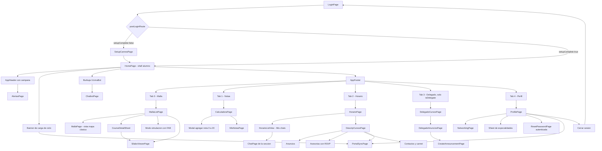

### Mapa de navegación del docente

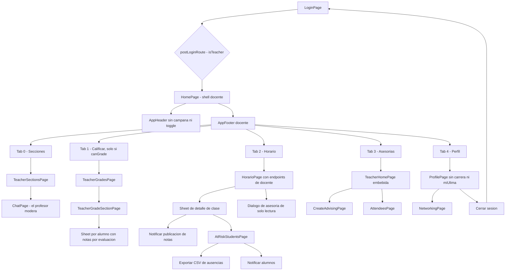

### Ciclo de vida de la sesión

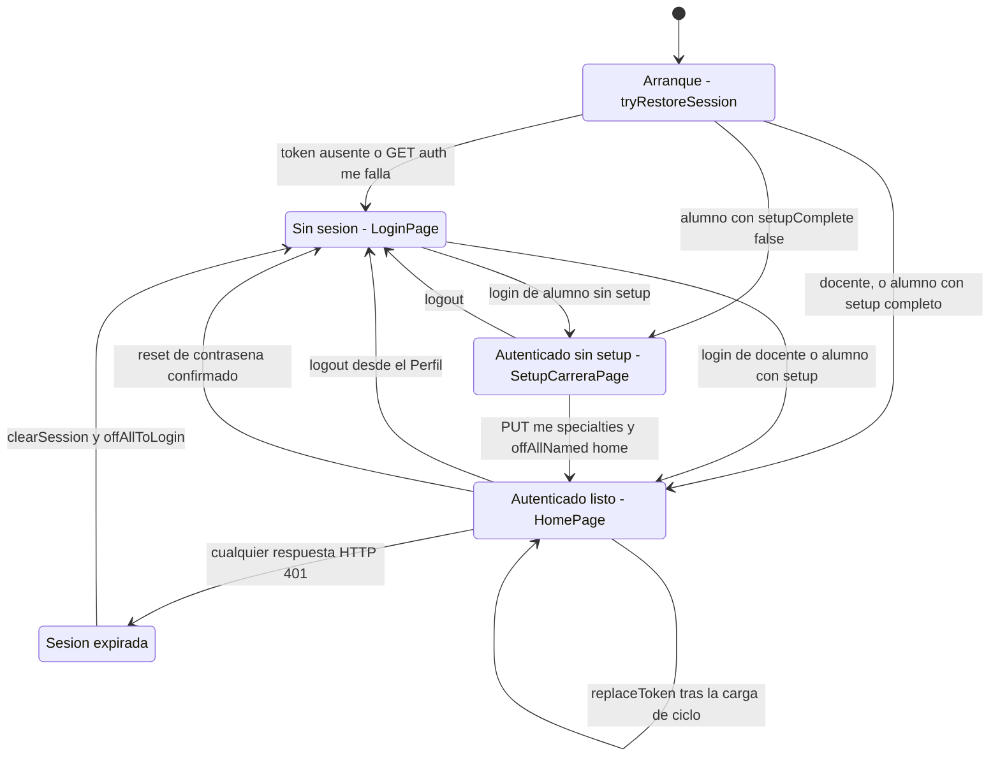

Tres transiciones merecen texto:

> **8 · `tryRestoreSession` cierra sesión ante cualquier excepción; `refreshCurrentUser` no.** El primero
> (`auth_service.dart:129-153`) hace `clearSession()` ante **cualquier** fallo, porque en el arranque no se
> puede distinguir un token revocado de uno vencido. El segundo (`auth_service.dart:118-127`) recarga
> `/auth/me` **sin** cerrar sesión: un hipo de red al volver de importar el ciclo no debe echar al alumno
> a la pantalla de login. El contraste es deliberado y está comentado en el código.

> **9 · El 401 no vuelve del backend "en silencio".** El interceptor del `ApiClient`
> (`api_client.dart:98-114`) limpia la sesión y, si la ruta no es `/auth/login` ni `/auth/logout`, llama a
> `offAllToLogin()` y muestra `Sesión expirada / Tu sesión caducó o iniciaste sesión en otro dispositivo.`
> Las dos rutas excluidas son las que **deben** poder devolver 401 sin significar expiración.

> **10 · La transición `Listo → Listo` existe.** Tras la carga de ciclo, `replaceToken` cambia el JWT sin
> reiniciar la sesión (`auth_service.dart:113-116`). Es lo que hace aparecer o desaparecer la pestaña
> Delegado en caliente.

---

### Mockups

17 archivos PNG en `docs/images/UI/`, uno de ellos sin pantalla equivalente. No son documentación
decorativa: `AGENTS.md:47` los declara contrato — *«Respeta mockups en `docs/images/UI` salvo cambio
aprobado»*.

<table>
<tr>
<td width="33%" align="center"><br><sub><code>InicioSesion.png</code><br><b><code>LoginPage</code></b></sub></td>
<td width="33%" align="center"><br><sub><code>ConfiguracionCarrera.png</code><br><b><code>SetupCarreraPage</code></b></sub></td>
<td width="33%" align="center"><br><sub><code>Perfil.png</code><br><b><code>ProfilePage</code></b></sub></td>
</tr>
<tr>
<td width="33%" align="center"><br><sub><code>MallaCurricular.png</code><br><b><code>MallaPage</code></b>, vista mapa de <code>/malla-clasica</code></sub></td>
<td width="33%" align="center"><br><sub><code>MallaCurricular_Electivos.png</code><br>Pestaña Electivos de <b><code>MallaListPage</code></b></sub></td>
<td width="33%" align="center"><br><sub><code>HorarioAcademico_Evaluaciones.png</code><br><b><code>HorarioPage</code></b> con bloques de evaluación</sub></td>
</tr>
<tr>
<td width="33%" align="center"><br><sub><code>CalculadoraNotas.png</code><br><b><code>CalculadoraPage</code></b></sub></td>
<td width="33%" align="center"><br><sub><code>NotasPorCurso.png</code><br>Tarjeta de curso dentro de <b><code>CalculadoraPage</code></b></sub></td>
<td width="33%" align="center"><br><sub><code>AgregarNota.png</code><br><b><code>AddNotaWithSyllabusModal</code></b></sub></td>
</tr>
<tr>
<td width="33%" align="center"><br><sub><code>Anuncios.png</code><br><b><code>AnunciosTab</code></b> de <code>DescripCursosPage</code></sub></td>
<td width="33%" align="center"><br><sub><code>Asesorias.png</code><br><b><code>AsesoriasTab</code></b> de <code>DescripCursosPage</code></sub></td>
<td width="33%" align="center"><br><sub><code>Contactos.png</code><br><b><code>ContactosTab</code></b> de <code>DescripCursosPage</code></sub></td>
</tr>
<tr>
<td width="33%" align="center"><br><sub><code>BuzonAlertas.png</code><br><b><code>AlertasPage</code></b></sub></td>
<td width="33%" align="center"><br><sub><code>GestionCursosDelegado.png</code><br><b><code>DelegadoCursosPage</code></b></sub></td>
<td width="33%" align="center"><br><sub><code>GestionAnunciosDelegado.png</code><br><b><code>DelegadoAnunciosPage</code></b>, historial</sub></td>
</tr>
<tr>
<td width="33%" align="center"><br><sub><code>SeguimientoProgresoSeccion.png</code><br><b><code>DelegadoAnunciosPage</code></b>, estadísticas del salón</sub></td>
<td width="33%" align="center"><br><sub><code>SubirSilabo.png</code><br><b>⚠️ Ninguna pantalla.</b> Ver aviso abajo</sub></td>
<td width="33%" align="center"><sub><i>Las pantallas nacidas después del diseño no tienen mockup: chat de sección (HU23), ULimaBot (HU28), carnet de networking (HU25), carga desde miUlima (HU31), visor de sílabo (HU21) y todo el modo docente (HU18). Se diseñaron sobre el sistema visual ya establecido.</i></sub></td>
</tr>
</table>

> ⚠️ **`SubirSilabo.png` no corresponde a ninguna pantalla del código.** El mockup muestra un modal
> "Subir Sílabo" (`Toca para subir archivo PDF`, `Máximo 5MB`, botón `Procesar Sílabo`) dentro de la
> Calculadora de Notas. Hoy solo existe el **visor** (`/silabo`), que descarga el PDF desde Google Drive;
> no hay flujo de subida ni endpoint de upload en ninguno de los services de `lib/services/`.

> ⚠️ Dos advertencias más sobre este mapeo. **(a)** Solo 4 de los 17 PNG se verificaron abriendo la imagen
> —`MallaCurricular.png`, `NotasPorCurso.png`, `SeguimientoProgresoSeccion.png` y `SubirSilabo.png`—; los
> otros 13 se mapearon por nombre de archivo. **(b)** `SeguimientoProgresoSeccion.png` titula la pantalla
> `Gestión de Delegado: SOFT1` mientras el `AppBar` real dice `Gestión de Sección`
> (`delegado_anuncios_page.dart:49`). No está claro si la divergencia fue un cambio aprobado.

---

### Diagramas de análisis

Doce imágenes en `docs/images/`, más una fuente PlantUML editable. Se muestran aquí, y no solo se
tabulan, porque son el único artefacto UML del proyecto: el resto de este README los sustituye por
mermaid verificado contra el código. Documentan el sistema **tal como se concibió**; cuando discrepen
del código, manda el código.

#### Arquitectura y datos

| Diagrama | Archivo | Qué muestra |
|:---|:---|:---|
| Entidad-relación | [`diagramaER.png`](docs/images/arquitectura/diagramaER.png) | El modelo relacional del dominio académico |
| Base de datos | [`diagrama db.png`](docs/images/arquitectura/diagrama%20db.png) | Las tablas físicas con sus columnas y tipos. El nombre del archivo lleva un espacio: en Markdown hay que escribirlo `%20` |
| Clases | [`diagramaClases.png`](docs/images/arquitectura/diagramaClases.png) | Las entidades del dominio y sus relaciones |
| Despliegue | [`diagrama_despliegue.png`](docs/images/arquitectura/diagrama_despliegue.png) | Nodos y artefactos. Fuente editable en [`diagrama_despliegue.puml`](docs/images/arquitectura/diagrama_despliegue.puml) |


#### Casos de uso

Ocho diagramas UML en [`docs/images/casos_uso/`](docs/images/casos_uso). El contenido de esta tabla se
transcribió **abriendo las ocho imágenes**, no infiriéndolo del nombre del archivo.

| Diagrama | Actor | Casos de uso que dibuja | Historias |
|:---|:---|:---|:---|
| [`Autenticacion_Seguridad.png`](docs/images/casos_uso/Autenticacion_Seguridad.png) | Usuario | Iniciar Sesión · Cerrar Sesión | US01, US02 |
| [`Perfil_Academico.png`](docs/images/casos_uso/Perfil_Academico.png) | Alumnado | Seleccionar Carrera · Seleccionar Especialidad, extendida con `<<extend>>` por «Visualizar Cursos Electivos por Especialidad» | US05 |
| [`Malla_Curricular.png`](docs/images/casos_uso/Malla_Curricular.png) | Alumnado | Visualizar malla curricular · Actualizar estado de cursos · Visualizar cursos hábiles · Visualizar estado de cursos | US03, US04 |
| [`Seguimiento_Academico.png`](docs/images/casos_uso/Seguimiento_Academico.png) | Alumnado | Ingresar notas por examen · **Subir sílabo por Curso** · Visualizar promedio ponderado · Visualizar horarios de asesoría · Visualizar lista de exámenes | US06, US07, US09, US13 |
| [`Riesgo_Academico.png`](docs/images/casos_uso/Riesgo_Academico.png) | Alumnado | Recibir Alertas | US15 |
| [`Gestion_Seccion.png`](docs/images/casos_uso/Gestion_Seccion.png) | Delegado · Alumnado | Registrar Anuncios · Visualizar promedios de la sección · Visualizar Anuncios | US16, US17, US18 |
| [`Estructura_Seccion.png`](docs/images/casos_uso/Estructura_Seccion.png) | **Administrador** | Asignar docentes · Asignar delegado | **Ninguna** |
| [`Administrador.png`](docs/images/casos_uso/Administrador.png) | **Administrador** | Registrar · Editar · Eliminar · Consultar información | **Ninguna** |

<table>
<tr>
<td width="50%" align="center"><br><sub><b>Autenticación y seguridad</b> · US01, US02</sub></td>
<td width="50%" align="center"><br><sub><b>Perfil académico</b> · US05</sub></td>
</tr>
<tr>
<td width="50%" align="center"><br><sub><b>Malla curricular</b> · US03, US04</sub></td>
<td width="50%" align="center"><br><sub><b>Seguimiento académico</b> · US06, US07, US09, US13</sub></td>
</tr>
<tr>
<td width="50%" align="center"><br><sub><b>Riesgo académico</b> · US15</sub></td>
<td width="50%" align="center"><br><sub><b>Gestión de sección</b> · US16, US17, US18</sub></td>
</tr>
<tr>
<td width="50%" align="center"><br><sub><b>Estructura de sección</b> · ⚠️ actor no implementado</sub></td>
<td width="50%" align="center"><br><sub><b>Administrador</b> · ⚠️ actor no implementado</sub></td>
</tr>
</table>

> **1 · Dos de los ocho diagramas describen un actor que nunca existió.** `Estructura_Seccion.png` y
> `Administrador.png` dibujan un **Administrador** que asigna docentes y delegados y hace CRUD de
> información. No hay pantalla en `lib/pages/` ni endpoint de administración en ninguno de los dos
> repos: el aprovisionamiento de docentes y delegados se resuelve con seeds ejecutados a mano y con la
> importación desde miUlima. Se conservan como registro del diseño original, no como funcionalidad.

> **2 · «Subir sílabo por Curso» corrobora el mockup huérfano.** Ese caso de uso de
> `Seguimiento_Academico.png` es el mismo flujo que dibuja `SubirSilabo.png` y que nunca se
> implementó. Dos artefactos de diseño independientes apuntan a la misma funcionalidad ausente: no fue
> un mockup traspapelado, fue una decisión de alcance que el análisis nunca reflejó.

---

### Lo que la navegación todavía debe

> **11 · Seis pantallas no son deep-linkables.** `AlertasPage`, `DescripCursosPage`, `ChatPage`,
> `AtRiskStudentsPage`, `DelegadoAnunciosPage` y `CreateAnnouncementPage` se abren con
> `Get.to(() => Widget)`. No tienen ruta, ni binding por ruta, ni forma de recuperarse tras un refresh en
> web. Migrarlas a `getPages` es trabajo pendiente.

> **12 · La convención de bindings se viola en siete lugares.** `main.dart:111-118` documenta la regla —
> nada de `Get.put` dentro de `build()`— y aun así la incumplen `HorarioPage` (`horario.dart:779`),
> `CalculadoraPage` (`calculadora_page.dart:15`), `ChatbotPage` (`chatbot_page.dart:18`),
> `SetupCarreraPage` (`setup_carrera_page.dart:17`), `AppHeader` dentro de un `Obx`
> (`app_header.dart:97`), `DelegadoCursosPage` como inicializador de campo
> (`delegado_cursos_page.dart:12`) y `DescripCursosPage`, que hace `Get.put` **y** `cargarDatosCurso()` en
> el **constructor** (`descrip_cursos.dart:13-17`), disparando una recarga completa cada vez que el padre
> se reconstruye. Ninguno se verificó en runtime, así que no está confirmado que provoquen el bug de
> "tipeo fantasma"; el riesgo estructural sí está.

---

## 🔌 La capa de servicios

[`lib/services/`](lib/services/) tiene **29 archivos** y **2 976 líneas Dart**. Es el único lugar del
repositorio donde la app habla con algo que no es ella misma: el backend propio, Firebase,
Google Drive, el almacenamiento del dispositivo. Ninguna página y ningún widget construye una
petición HTTP por su cuenta.

La regla existe por una razón concreta y verificable: si el `Authorization`, el manejo del 401,
la decodificación del cuerpo y la traducción de errores viven en **un** archivo, arreglar cualquiera
de esos cuatro se hace una vez. Cuando el bypass `X-User-Code` se retiró del backend, el cambio en
el frontend fue borrar tres líneas de [`lib/services/api_client.dart`](lib/services/api_client.dart);
si cada pantalla hubiera armado sus propios headers, habrían sido 28 pantallas.

### Las cuatro familias del directorio

No los 29 archivos son «servicios HTTP». El directorio mezcla cuatro cosas distintas, y conviene
saber cuál es cuál antes de tocar nada:

| Familia | Cuántos | Qué son |
|:---|---:|:---|
| **Frontera HTTP única** | 1 | `api_client.dart` — el único sitio donde se construye un `http.Request` contra el backend propio |
| **Servicios de dominio** | 22 | Envuelven `ApiClient`, parsean el JSON y devuelven modelos tipados |
| **Servicios locales** | 4 | `storage_service.dart`, `notas_service.dart`, `session_navigation.dart`, `post_login_route.dart` — no salen a la red |
| **Frontera ajena / híbrida** | 2 | `silabo_service.dart` (Google Drive) y `chat_repository.dart` (Firebase RTDB **+** backend) |

Los cinco archivos más grandes concentran el peso: `auth_service.dart` (403 líneas),
`storage_service.dart` (238), `delegate_announcement_service.dart` (231), `malla_service.dart` (220)
y `silabo_service.dart` (214).

### `ApiClient` — el contrato transversal

188 líneas en [`lib/services/api_client.dart`](lib/services/api_client.dart). Cuatro verbos, un
tipo de excepción, y cuatro decisiones que hay que conocer antes de escribir un servicio nuevo.

| Elemento | Dónde | Comportamiento |
|:---|:---|:---|
| **Base URL** | `api_client.dart:36-50` | Se resuelve de `String.fromEnvironment('API_BASE_URL')`. En `kReleaseMode` sin esa define, **lanza `StateError`**. En debug cae a `http://localhost:3000`, o `http://10.0.2.2:3000` en Android. No hay ningún host de producción escrito en el código fuente |
| **Verbos** | `api_client.dart:52-81` | `getJson`, `postJson`, `putJson`, `deleteJson`. Todos devuelven `Future<Map<String, dynamic>>` |
| **Token** | `api_client.dart:90` | Si el llamador no pasa `token`, se resuelve solo con `StorageService.to.savedToken`. Por eso casi ningún servicio lo pasa; solo `AuthService` lo hace explícito |
| **Headers** | `api_client.dart:130-142` | `Accept`, `Content-Type` y `Authorization: Bearer <token>` cuando hay token. Nada más |
| **Excepción** | `api_client.dart:10-25` | `ApiException{statusCode, code, message, details}` |

> **1 · El header que ya no está.** `X-User-Code` se eliminó de `_headers` por dos motivos
> acumulados: era el resto del viejo bypass de autenticación del backend, y rompía el *preflight*
> CORS en web porque el backend solo permite `Content-Type` y `Authorization`. El comentario está
> en `api_client.dart:139-141` para que nadie lo vuelva a añadir.

> **2 · El query embebido en el path sobrevive.** `_uri` (`api_client.dart:119-128`) hace
> `Uri.parse('$baseUrl/').resolve(cleanPath).replace(queryParameters: params.isEmpty ? null : params)`.
> Con `queryParameters: null`, `replace` **conserva** el query que ya traía el path. De ahí que
> `CoursesService`, `EvaluationSyllabusService` y `HorarioController` concatenen `?code=$code` a
> mano en vez de usar el parámetro `query`. Funciona, pero son dos formas de hacer lo mismo
> conviviendo.

> **3 · El 401 navega solo, y solo una vez.** Ante un `401` que no venga de `/auth/login`,
> `_send` (`api_client.dart:98-114`) hace `StorageService.to.clearSession()`; y si además no es
> `/auth/logout`, llama `offAllToLogin()` y **solo si esa función devolvió `true`** muestra el
> snackbar «Sesión expirada». El doble guardián existe porque dos `Get.offAllNamed('/login')`
> simultáneos apilaban dos rutas `/login`, y al desecharse la primera GetX disponía los
> `TextEditingController` que la página visible seguía usando: en release daba «tipeo fantasma»
> (el campo recibe la tecla pero no repinta), en debug reventaba con *A TextEditingController was
> used after being disposed*.

> **4 · No hay timeout global.** `_send` llama `request.send()` sin `.timeout()`. Solo tres
> puntos del código imponen el suyo: `PortalSyncService` (90 s en el import, 15 s en el status),
> y `ChatPage._initializeChat` (8 s, `chat_page.dart:48`). Cualquier otra pantalla puede quedarse
> colgada indefinidamente si el backend no responde. Está en la deuda técnica.

**Decodificación** (`api_client.dart:148-187`), en orden: cuerpo vacío → `{}`; cuerpo no-JSON →
`{'raw': body}`; JSON que no es Map → `{'data': decoded}`; 2xx → devuelve el Map; no-2xx con clave
`error` → `ApiException` con el `code` y `message` del backend; no-2xx sin `error` →
`ApiException(status, 'HTTP_ERROR', 'Error del servidor')`. El caso `raw` se añadió porque un 404 en
texto plano de la plataforma hacía que `jsonDecode` lanzara un `FormatException` críptico que
enmascaraba el status real — el caso concreto fue el 404 del chat.

**Registro en GetX** ([`lib/main.dart:56-63`](lib/main.dart)): solo cuatro servicios son
`permanent: true` — `StorageService` (vía `putAsync` + `init()`), `AuthService`, `AlertService` y
`MallaService`. El resto se instancia a mano dentro de controllers. **Dos** tienen singleton propio
con `setTestInstance` para poder inyectar dobles: `CoursesService` (`courses_service.dart:17`) y
`EvaluationSyllabusService` (`evaluations_service.dart:18`). **Cinco** aceptan un `ApiClient`
inyectado por constructor: `ContactoService`, `NetworkingService`, `PortalSyncService`,
`CoursesService` y `EvaluationSyllabusService`. `SilaboService` también es inyectable, pero con un
`http.Client Function()` y un proveedor de directorio de caché (`silabo_service.dart:48-52`): no
habla con el backend propio. `NotasService` es un singleton simple, sin punto de inyección
(`notas_service.dart:5-13`).

---

### Mapa completo: service → endpoint

Esta es la tabla de referencia de la app. Cubre los **66 endpoints** que el frontend consume de los
**15 módulos** del backend. Todas las rutas de la columna *Service* cuelgan de `lib/services/`
salvo las marcadas *sin service*, que cuelgan de `lib/pages/`. El número tras `:` es la línea.

Cobertura verificada por grep sobre `lib/`: de los 70 endpoints que el backend expone, el frontend
consume 66. Los cuatro sin llamador son `GET /`, `GET /health`, `GET /version` y
`GET /academic-profile/me`.

#### Autenticación y sesión — 12 métodos

| Service | Método | Endpoint backend | Modelo | Usado por |
|:---|:---|:---|:---|:---|
| `auth_service.dart` | `login` :155 | `POST /auth/login` | `String?` — `null` es éxito, texto es el mensaje de error | `LoginController.login` :73 → `LoginPage` |
| `auth_service.dart` | `loginWithGoogle` :192 | indirecto vía `finishGoogleLogin` | `String?` | `LoginController` :90, móvil y escritorio |
| `auth_service.dart` | `finishGoogleLogin` :209 | `POST /auth/google` body `{idToken}` | `String?` | `LoginController` :39; en web vía `onCurrentUserChanged` |
| `auth_service.dart` | `tryRestoreSession` :129 | `GET /auth/me` | `bool` + llena `Rx<UserModel?>` | `main()` :66, decide `initialRoute` |
| `auth_service.dart` | `refreshCurrentUser` :118 | `GET /auth/me` | `void`, actualiza el `Rx` | `PortalSyncService.refreshAfterImport` :135 |
| `auth_service.dart` | `logout` :315 | `POST /auth/logout` | `void` | `ProfilePage` (`perfil.dart:1348`) |
| `auth_service.dart` | `completeSetup` :267 | `PUT /academic-profile/me/specialties` | muta `UserModel` + `StorageService.saveSetup` | `SetupCarreraController` → `SetupCarreraPage` |
| `auth_service.dart` | `_loadCatalogs` :357 | `GET /academic-profile/careers` · `GET /academic-profile/specialties?careerId=` | `RxList<Map>` `carreras` / `especialidades` | `SetupCarreraPage`, `ProfilePage` |
| `auth_service.dart` | `_loadProfesorSections` :346 | `GET /official-grades/teacher/sections` | `Set<int>` → `canGrade`, `isProfesorOfSection` | `HomeShellConfig.forUser` :27, gating de la pestaña Calificar |
| `password_reset_service.dart` | `request` :14 | `POST /auth/password-reset/request` | `String` genérico | `ForgotPasswordController` → `ForgotPasswordPage` |
| `password_reset_service.dart` | `confirm` :28 | `POST /auth/password-reset/confirm` | `void` | `ResetPasswordController` → `ResetPasswordPage` |
| `password_reset_service.dart` | `requestMe` :46 | `POST /auth/password-reset/request-me` | `({String message, String maskedEmail})` | `ProfilePage`, tarjeta «Restablecer contraseña» :772 |

Tres detalles de auth que no son obvios:

- `AuthService.loginErrorMessage(code, backendMessage)` (`auth_service.dart:26-34`) es una función
  pura y testeada: `USER_NOT_FOUND` e `INVALID_PASSWORD` **colapsan al mismo texto**
  («Código o contraseña incorrectos.») para no permitir enumeración de usuarios; `NOT_ENROLLED` →
  «No tienes una matrícula activa.»; cualquier otro código propaga el mensaje del backend tal cual.
- `GoogleSignIn` (`auth_service.dart:49-53`) usa `clientId` en web y `serverClientId` en móvil,
  ambos apuntando al **mismo client web**. Sin `serverClientId`, el `idToken` llega `null` en Android.
- `logout()` invalida cinco cosas (`auth_service.dart:330-332`): `MallaService.to.clear()`,
  `CoursesService().clear()`, `EvaluationSyllabusService().clear()`, `_profesorSectionIds.clear()` y
  `StorageService.clearSession()`. Saltarse una deja al siguiente usuario del dispositivo viendo
  datos del anterior.

#### Malla curricular — 5 métodos

| Service | Método | Endpoint backend | Modelo | Usado por |
|:---|:---|:---|:---|:---|
| `malla_service.dart` | `load` :55 | `GET /curriculum/me` | `RxList<CourseNode>`, `RxList<String> specialties`, `RxMap simulation` | `MallaListController`, `MallaController` |
| `malla_service.dart` | `computeStatuses` :103, `recomputeDerivedAvailability` :111, `…Cascade` :126, `visibleCoursesFor` :199 | — cálculo puro, delega en `lib/domain/malla/malla_logic.dart` | `Map<String, CourseStatus>` / `List<CourseNode>` | `MallaListController`, `course_card.dart`, `course_detail_sheet.dart` |
| `malla_service.dart` | `clear` :47, `replaceSimulation` :141, `normalizeSpecialty` :97 | — | `void` / `String` | `AuthService.logout`, `PortalSyncService`, `MallaListController` |
| *sin service* — `pages/malla/malla_list_controller.dart` | `saveSimulation` :483 | `PUT /curriculum/me/simulation` :509 body `{curriculumCourseId, status}` | grilla local `nextPersisted` | `MallaListPage`, botón Guardar |
| *sin service* — `pages/malla/malla_list_controller.dart` | `saveSimulation` :483 | `DELETE /curriculum/me/simulation/:curriculumCourseId` :529 | — | `MallaListPage` |

`MallaService` cachea por código de alumno (`_loadedForCode`, `malla_service.dart:39,57,87`), y
`_loadedForCode` **solo se asigna tras una carga exitosa**: un fetch caído a mitad no debe marcar la
caché como si fuera del usuario nuevo. `MallaController` (la vista clásica) es solo lectura; su
comentario en `malla_controller.dart:10` deja constancia de que `/curriculum/me/simulation` y
`saveStatuses` se eliminaron de ahí.

#### Notas del alumno · calculadora — 8 métodos

| Service | Método | Endpoint backend | Modelo | Usado por |
|:---|:---|:---|:---|:---|
| `courses_service.dart` | `loadCoursesData` :34 | `GET /grades/me/courses?code=` :38 | `List<Map>` `allCourses` | `CalculadoraController._inicializarCursos` :57 |
| `courses_service.dart` | `getCourseById` :58, `clear` :50 | — | `Map?` / `void` | `curso_model.dart`, `AuthService.logout`, `PortalSyncService` |
| `evaluations_service.dart` | `loadEvaluationData` :32 | `GET /grades/me/courses?code=` :37, lee `syllabi` y `cursos[].silaboUrl` | `List<CourseSyllabus>`, `Map<String,String>` de URLs de sílabo | `CalculadoraController._cargarDatosSyllabus` :36 |
| `evaluations_service.dart` | `getSyllabusByCourseId` :75, `getEvaluationsByCourseId` :85, `getSilaboUrl` :92 | — | `CourseSyllabus?` / `List<EvaluationComponent>` / `String?` | `CalculadoraPage`, `MallaListPage`, `course_detail_sheet.dart` |
| *sin service* — `pages/calculadora/calculadora_controller.dart` | `_cargarNotasRemotas` :121 | `GET /grades/me/notes` :123 | `Map<String, List<Map>>` por `sectionId` | `CalculadoraPage` |
| *sin service* — `pages/calculadora/calculadora_controller.dart` | `_guardarNotasRemotas` :139 | `POST /grades/me/notes` :162 body `{cursos:[{sectionId, notas:[{assessmentId, valor}]}]}` | — | `CalculadoraPage`, al agregar nota |
| *sin service* — `pages/calculadora/calculadora_controller.dart` | `eliminarNota` :227 | `DELETE /grades/me/notes/:sectionId/:assessmentId` :235 | — | `CalculadoraPage` |
| *sin service* — `pages/calculadora/calculadora_controller.dart` | `_calcularPromedio` :168 | `POST /grades/me/calculate` :185 body `{notas:[{valor, peso}]}` | lee `promedio` y `sumaPesos` | `CalculadoraPage`, en cada recálculo |

> ⚠️ `CoursesService` y `EvaluationSyllabusService` piden **el mismo endpoint** con el mismo query,
> cada uno con su propia caché, y la calculadora dispara ambos en `calculadora_controller.dart:31-32`.
> Son dos viajes de red donde debería haber uno.

#### Notas oficiales — 4 métodos

| Service | Método | Endpoint backend | Modelo | Usado por |
|:---|:---|:---|:---|:---|
| `official_grades_service.dart` | `fetchTeacherSections` :12 | `GET /official-grades/teacher/sections` | `List<GradingSection>` | `TeacherGradesController` :29 y `AuthService._loadProfesorSections` :348 |
| `official_grades_service.dart` | `fetchSectionGrid` :21 | `GET /official-grades/teacher/sections/:sectionId/scores` | `SectionGrid` con `students`, `assessments`, `scores` | `TeacherGradeSectionController` → `/teacher-grade-section` |
| `official_grades_service.dart` | `saveScores` :27 | `PUT /official-grades/teacher/sections/:sectionId/scores` :31 body `{scores}` | `SectionGrid` actualizada | `TeacherGradeSectionController.save` |
| `official_grades_service.dart` | `fetchMyOfficialCourses` :40 | `GET /official-grades/me` | `List<OfficialCourse>` | `MisNotasController.load` :32 → `/mis-notas` |

#### Horario — 8 métodos, **ninguno tiene service**

| Service | Método | Endpoint backend | Modelo | Usado por |
|:---|:---|:---|:---|:---|
| *sin service* — `pages/horario/horario_controller.dart` | `_loadDays` :98 | `GET /schedule/me/sessions?code=` :101, lee `days` | `RxList<DaySchedule>` | `HorarioPage` |
| *sin service* — `pages/horario/horario_controller.dart` | `_loadSecciones` :133 | `GET /schedule/me/sessions?code=` :136, lee `secciones` | `RxList<Map>` | `HorarioPage`; `DescripCursosController` lo reusa como caché :58-65 |
| *sin service* — `pages/horario/horario_controller.dart` | `_loadAssessments` :149 | `GET /schedule/me/assessments?code=` :152 | `RxList<Map> assessmentsList` | `HorarioPage`, `horario_list_view.dart` |
| *sin service* — `pages/horario/horario_controller.dart` | `_loadWeeklyLoad` :164 | `GET /schedule/me/load?code=` :167 | `weeklyLoad` | `HorarioPage`, semanas de alta carga |
| *sin service* — `pages/horario/horario_controller.dart` | `_loadTeacherDaysAndSessions` :181 | `GET /schedule/teacher/sessions` :183 | `daysList` + `_todasLasSecciones` | `HorarioPage` en modo docente |
| *sin service* — `pages/horario/horario_controller.dart` | `_loadTeacherAssessments` :216 | `GET /schedule/teacher/assessments` :218 | `assessmentsList` | `HorarioPage` en modo docente |
| *sin service* — `pages/horario/horario.dart` | `_loadDetails` :1037 | `GET /schedule/teacher/sections/:sectionId/assessments-status` :1051 | `Map` crudo | hoja de detalle de sección del docente |
| *sin service* — `pages/horario/horario.dart` | handler «notificar notas» :974 | `POST /schedule/teacher/sections/:sectionId/assessments/:assessmentId/notify-grades` :976 | lee `ok` y `notifiedCount` | misma hoja; snackbar verde o rojo |

#### Detalle de curso — 6 métodos

| Service | Método | Endpoint backend | Modelo | Usado por |
|:---|:---|:---|:---|:---|
| `seccion_service.dart` | `findSectionById` :20 | `GET /course-detail/sections/:id` | `Seccion?` — un 200 con `section: null` devuelve `null`, no excepción | `DescripCursosController.cargarDatosCurso` :69 |
| `seccion_service.dart` | `fetchSecciones` :11 | `GET /course-detail/sections` | `List<Seccion>` | **sin llamadores — código muerto** |
| `anuncio_service.dart` | `fetchAnuncios` :10 | `GET /course-detail/sections/:sectionId/announcements` | `List<Anuncio>` con `autor: UserModel`, ordenada por fecha desc :22-29 | `DescripCursosController.fetchAnuncios` :113 → `anuncios_tab.dart` |
| `contacto_service.dart` | `fetchContactos` :18 | `GET /course-detail/sections/:sectionId/contacts` | `Map` con `docente`, `jefePractica`, `alumnos`, `representantesPendientes` | `DescripCursosController.fetchContactos` :182 → `contactos_tab.dart`; y `horario.dart:1043` |
| `docente_service.dart` | `fetchDocentes` :7, `findDocenteByCode` :14 | `GET /course-detail/teachers` | `List<Docente>` / `Docente?` | **sin llamadores — código muerto** |
| `enrollment_service.dart` | `fetchEnrollments` :8, `fetchBySection` :19, `findById` :24 | `GET /course-detail/enrollments` | `List<Enrollment>` / `Enrollment?` | solo `SectionRepresentativeService` :8, que a su vez no tiene llamadores |

La lógica no obvia está en `ContactoService` (`contacto_service.dart:41-66`): cruza
`representantesPendientes` —lo que dice el portal— contra `alumnos` **por código de alumno**, porque
la tabla `section_representative` solo se escribe cuando el propio delegado importa desde miUlima.
Sin ese cruce, un delegado con cuenta pero sin sincronizar se pintaba como alumno raso. El orden
final lo fija `_rolePriority` (`:96-105`): delegado 0, subdelegado 1, resto 2, y a igual prioridad
por apellido. La tarjeta «pendiente» solo se emite para representantes que **no** aparecen ya en
`alumnos` (`:83-86`), para no duplicar la fila.

#### Asesorías — 8 métodos

| Service | Método | Endpoint backend | Modelo | Usado por |
|:---|:---|:---|:---|:---|
| `asesoria_service.dart` | `fetchAsesorias` :12 | `GET /advising/section/:sectionId` | `List<Asesoria>` con `docente: Docente` | `DescripCursosController.fetchAsesorias` :123 → `asesoria_tab.dart` |
| `asesoria_service.dart` | `confirmarAsistencia` :27 | `POST /advising/:sessionId/rsvp` body `{}` | `RsvpResult{asistentes, myRsvp}` :43-57 | `DescripCursosController.toggleRsvp` :154 |
| `asesoria_service.dart` | `cancelarAsistencia` :36 | `DELETE /advising/:sessionId/rsvp` | `RsvpResult` | `DescripCursosController.toggleRsvp` :155 |
| `advising_service.dart` | `fetchSessions` :18 | `GET /advising/me/sessions`, lee `sesiones` | `List<AdvisingSession>` | `TeacherHomeController.load` → `/teacher-home` |
| `advising_service.dart` | `fetchSections` :28 | `GET /advising/me/sections`, lee `secciones` | `List<TeacherSectionOption>` | `TeacherSectionsController` :28, `CreateAdvisingController` :43 |
| `advising_service.dart` | `createSession` :39 | `POST /advising/me/sessions` :61 | `AdvisingSession` desde `data['sesion']` | `CreateAdvisingController.submit` → `/teacher-advising-create` |
| `advising_service.dart` | `deleteSession` :65 | `DELETE /advising/me/sessions/:id` | `void` | `TeacherHomeController.delete` :58 |
| `advising_service.dart` | `fetchAttendees` :69 | `GET /advising/me/sessions/:id/attendees` | `AttendeesResult{total, asistentes}` :8-12 | `AttendeesController` → `/teacher-advising-attendees` |

`AdvisingService` declara en su cabecera (`advising_service.dart:2-3`) que **no cachea**, con la
razón entre paréntesis: «lección de TT06». Una caché singleton dejaba al docente viendo una asesoría
que ya había borrado.

#### Delegado y gestión de sección — 7 métodos

| Service | Método | Endpoint backend | Modelo | Usado por |
|:---|:---|:---|:---|:---|
| `delegate_service.dart` | `fetchDelegateSections` :11 | `GET /section-management/representatives` :13 | `List<CursoDelegado>` | `DelegadoCursosController` → pestaña Delegado |
| `delegate_announcement_service.dart` | `fetchAnnouncementsBySection` :13 | `GET /section-management/sections/:sectionId/announcements` | `List<Anuncio>` | `DelegadoAnunciosController.fetchAnnouncements` :42 |
| `delegate_announcement_service.dart` | `createAnnouncement` :40 | `POST /section-management/sections/:sectionId/announcements` :46 | `bool` | `CreateAnnouncementController` → `CreateAnnouncementPage` |
| `delegate_announcement_service.dart` | `updateAnnouncement` :78 | `PUT /section-management/announcements/:id` :85 | `bool` | `CreateAnnouncementController`, modo edición |
| `delegate_announcement_service.dart` | `deleteAnnouncement` :129 | `DELETE /section-management/announcements/:id` :131 | `bool` | `DelegadoAnunciosController.delete` :101 |
| `section_statistics_service.dart` | `fetchSectionStatistics` :10 | `GET /section-management/sections/:sectionId/statistics` | `EstadisticasSeccion` con `promedioGeneral`, `porcentajeAprobados` y los 4 rangos | `DelegadoAnunciosController.fetchStatistics` :60 |
| `section_representative_service.dart` | `fetchRepresentatives` :10, `getRoleInSection` :21, `isRepresentativeInAnySection` :37 | `GET /section-management/representatives` :12 | `List<SectionRepresentative>` / `String` / `bool` | **sin llamadores — código muerto** |

`EstadisticasSeccion.fromJson` (`estadisticas_seccion_model.dart:26-52`) acepta **dos vocabularios**,
español e inglés: `promedioGeneral` o `averageScore`, `rango0_10` o `range0_10`. No es elegancia
defensiva: el shape de ese endpoint nunca se fijó en ningún contrato (ver más abajo).

#### Alertas y riesgo por inasistencias — 6 métodos

| Service | Método | Endpoint backend | Modelo | Usado por |
|:---|:---|:---|:---|:---|
| `alert_service.dart` | `fetchAlerts` :27 | `GET /alerts/me` :35 | `RxList<AlertModel>` + `RxBool hasError` | `main()` :75, `HomeController.onInit` :41, `AlertasPage`, badge de `app_header.dart:118`, `PortalSyncController` |
| `alert_service.dart` | `markAsRead` :49 | `PUT /alerts/me/:alertId/read` :54 body `{}` | `void`, marca local + `refresh()` | `AlertasPage` :97, :229, :344 |
| `attendance_risk_service.dart` | `fetchAttendanceRisk` :13 | `GET /attendance-risk/sections/:sectionId/attendance-risk` | `List<AtRiskStudent>` | `AtRiskStudentsController.loadData` :45 → `AtRiskStudentsPage` |
| `attendance_risk_service.dart` | `fetchSummary` :23 | `GET /attendance-risk/sections/:sectionId/attendance-risk/summary` | `Map` crudo, `summary.impedido` y `summary.en_riesgo` | `horario.dart:1061`, badge de riesgo del docente |
| `attendance_risk_service.dart` | `notifyStudents` :29 | `POST /attendance-risk/sections/:sectionId/attendance-risk/notify` :31 | `bool` | `AtRiskStudentsController.notifyStudents` :90 |
| `attendance_risk_service.dart` | `exportCsv` :42 | — local, `path_provider` + `share_plus` | escribe `Ausencias_<curso>_S<seccion>.csv` y abre la hoja de compartir | `AtRiskStudentsController.exportCsv` :86 |

`AtRiskStudent.status` admite `impedido`, `en_riesgo`, `normal` y `sin_datos`, y
`absencePercentage` es **nullable** (`at_risk_student_model.dart:9-11, 35`): un `0` ahí se leía como
«cero faltas» y pintaba la fila de verde. Por lo mismo, `sinDatosCount` **no** se suma a
`normalCount` (`at_risk_students_controller.dart:25-29`).

> ⚠️ **El backend todavía no emite `sin_datos`.** `grep -rn "sin_datos" src/` no devuelve nada en
> `ULima_Backend_IS2`, y `attendance-risk.service.ts:52-65` sigue respondiendo `status: "normal"`
> con `absencePercentage: 0` cuando la sección no tiene horas cargadas. El modelo se adelantó al
> contrato; el trabajo vive en `test/HU_asistencia/`, ya commiteado en `main`.

Cabecera exacta del CSV
(`attendance_risk_service.dart:44`): `Codigo,Apellidos,Nombres,Ciclo,Horas Ausentes,Total Horas,% Ausencia,Estado`.

#### Chat, chatbot y networking — 14 métodos

| Service | Método | Endpoint backend | Modelo | Usado por |
|:---|:---|:---|:---|:---|
| `chat_repository.dart` | `signInWithCustomToken` :66 | `POST /chat/token` :68 body `{sectionId}`, luego `FirebaseAuth.signInWithCustomToken` :83 | `ChatSession{uid, displayName, role, roleLabel, isModerator, weight}` :9-42 | `ChatPage._initializeChat` :45 |
| `chat_repository.dart` | `getMessages` :94 | **Firebase RTDB** `sections/$sectionId/messages`, `orderByKey().limitToLast(80)` :95 | `Stream<List<ChatMessage>>` | `ChatPage`, StreamBuilder |
| `chat_repository.dart` | `sendMessage` :117 | **Firebase RTDB** `push()` + `set()` :128 | `void` | `ChatPage._sendMessage` :83 |
| `chat_repository.dart` | `sendNetworkingCard` :146 | **Firebase RTDB** push con `body` prefijado por `ChatMessage.networkingBodyPrefix` :166 | `void` | `ChatPage._sendNetworkingCard` :110 |
| `chat_repository.dart` | `fetchNetworkingCard` :176 | delega en `NetworkingService` → `GET /networking/users/:userId` | `PublicNetworkingCardDto` | `ChatPage._openNetworkingCard` :134 |
| `chat_repository.dart` | `deleteMessage` :181 | `DELETE /chat/sections/:sectionId/messages/:messageId` :184 | `void`; la lápida la escribe el backend con Admin SDK | `ChatPage`, acción del profesor titular |
| `chatbot_service.dart` | `createSession` :7 | `POST /chatbot/sessions` | `ChatbotSession` | `ChatbotController` → `/chatbot` |
| `chatbot_service.dart` | `listSessions` :14 | `GET /chatbot/sessions` | `List<ChatbotSession>` | `ChatbotController` |
| `chatbot_service.dart` | `getSession` :22 | `GET /chatbot/sessions/:id` | `Map` con `session` + `messages` | `ChatbotController` |
| `chatbot_service.dart` | `deleteSession` :27 | `DELETE /chatbot/sessions/:id` | `void` | `ChatbotController` |
| `chatbot_service.dart` | `ask` :31 | `POST /chatbot/sessions/:id/ask` :39 | `String` desde `response['answer']` | `ChatbotController.send` :108-112 |
| `networking_service.dart` | `fetchMine` :18 | `GET /networking/me` | `NetworkingCardDto` | `NetworkingController.load` → `/networking` |
| `networking_service.dart` | `updateMine` :24 | `PUT /networking/me` body `card.toJson()` | `NetworkingCardDto` | `NetworkingController.save` |
| `networking_service.dart` | `fetchVisibleByUserId` :30 | `GET /networking/users/:userId` | `PublicNetworkingCardDto` | `ChatRepository.fetchNetworkingCard` :177 → `ChatPage` |

`NetworkingService` implementa la interfaz `NetworkingGateway` (`networking_service.dart:4-10`) y
`ChatRepository` implementa `ChatRepositoryContract` (`chat_repository.dart:46-57`). Las dos
interfaces existen por un solo motivo: poder inyectar dobles en los tests sin arrancar FlutterFire
ni tocar la red.

#### Carga de ciclo y sílabos — 6 métodos

| Service | Método | Endpoint backend | Modelo | Usado por |
|:---|:---|:---|:---|:---|
| `portal_sync_service.dart` | `status` :32 | `GET /portal-sync/status` :37, timeout 15 s | `PortalSyncStatus`; **nunca lanza**, ante fallo devuelve `desconocido` | `HomeController.refrescarEstadoPortal` :51, `PortalSyncController` |
| `portal_sync_service.dart` | `import` :51 | `POST /portal-sync/import` :57 body `{credentials:{password, passcode}}`, timeout 90 s | `PortalSyncResult`; lanza `PortalSyncFailure` | `PortalSyncController.importar` → `/portal-sync` |
| `portal_sync_service.dart` | `refreshAfterImport` :126 | indirecto: `GET /auth/me` + `clear()` de tres cachés | `void` | `PortalSyncController` tras un import exitoso |
| `silabo_service.dart` | `obtenerPdf` :80 | **Google Drive**, no el backend: `GET link.downloadUrl` | `Uint8List` con caché en disco por `fileId` | `SilaboViewerController` → `/silabo` |
| `silabo_service.dart` | `prepararCompartible` :185 | — escribe `<cache>/silabos/compartir/<nombre>.pdf` | `File` | `SilaboViewerController`, share_plus |
| `silabo_service.dart` | `nombreArchivoPresentable` :159, estática | — | `String` saneado, máx. 80 runas, con fallback `Silabo` | `SilaboViewerController` |

`PortalSyncService` deja explícito en su cabecera (`portal_sync_service.dart:16-18`) que la
contraseña de miUlima **no se persiste**: llega por parámetro, viaja en el body y se descarta. No
entra en ningún `Rx`, ni en `shared_preferences`, ni en un log.

---

### Los tres módulos que se saltan la capa

De los 66 endpoints consumidos, **13 se llaman sin service**, con `ApiClient` instanciado
directamente desde un controller o —peor— desde el `State` de un widget:

```
schedule    7 endpoints   horario_controller.dart + horario.dart   ← horario.dart:976 y :1051
                                                                     hacen ApiClient() dentro
                                                                     de un State
grades      4 endpoints   calculadora_controller.dart              ← me/notes GET·POST·DELETE
                                                                     y me/calculate
curriculum  2 endpoints   malla_list_controller.dart               ← PUT y DELETE de simulación
```

No es una decisión de diseño: es deuda. Esos controllers parsean JSON crudo a mano, no tienen un
modelo tipado que los proteja de un cambio de shape, y no se pueden testear inyectando un doble de
servicio. Están en [Deuda técnica](#-deuda-técnica-y-límites-conocidos).

**Tres servicios más son código muerto**, verificado con grep sobre `lib/` y `test/`:
`DocenteService`, `SectionRepresentativeService` —y por transitividad `EnrollmentService`, cuyo
único consumidor es ese— y el método `SeccionService.fetchSecciones()`.

---

### Los servicios que no hablan con el backend

Seis piezas de `lib/services/` (más una de `lib/pages/`) no tocan la API. Cada una existe por un
motivo distinto.

| Pieza | Archivo | Qué hace y por qué |
|:---|:---|:---|
| **Almacenamiento** | [`lib/services/storage_service.dart`](lib/services/storage_service.dart) | `GetxService` permanente con **dos almacenes a propósito** |
| **Caché local de notas** | [`lib/services/notas_service.dart`](lib/services/notas_service.dart) | Singleton sobre `SharedPreferences`; único consumidor real es el chatbot |
| **Navegación de sesión** | [`lib/services/session_navigation.dart`](lib/services/session_navigation.dart) | `offAllToLogin()` idempotente |
| **Ruta post-login** | [`lib/services/post_login_route.dart`](lib/services/post_login_route.dart) | Función pura de 4 líneas que decide adónde va el usuario tras autenticarse |
| **Lanzador de enlaces** | [`lib/pages/networking/networking_link_launcher.dart`](lib/pages/networking/networking_link_launcher.dart) | Interfaz `open(Uri)` + implementación con `launchUrl` |
| **Repositorio de chat** | [`lib/services/chat_repository.dart`](lib/services/chat_repository.dart) | Habla directo con Firebase Realtime Database — la única excepción legítima |

**`StorageService`** separa el JWT del resto y no por gusto: el token va en `FlutterSecureStorage`
bajo la clave `session_token` (`storage_service.dart:15-17`), y todo lo demás en
`SharedPreferences`, que en web es `localStorage`. Las claves de prefs incluyen `session_code`,
`session_career_id`, `session_especialidades_v2`, `session_especialidad_principal`,
`session_especialidades_interes`, `session_setup_complete` y `session_statuses_v2`, más dos mapas
**por código de alumno**: `user_setups_v1` y `user_statuses_v1`. `clearSession()` (`:206-218`) borra
el token y diez claves de prefs pero **conserva los dos mapas `*_v1`**. El código no explica por qué
—no hay ningún comentario en `:206-218`—; el efecto observable es que esas cachés por código de
alumno sobreviven al logout en el dispositivo. Ver la advertencia de
[Almacenamiento local](#almacenamiento-local).

**`NotasService`** (86 líneas) guarda notas bajo `notas_estudiante_<idEstudiante>` (`:33`) y el
identificador activo bajo `currentStudentId` (`:71`, `:81`). Todos sus métodos atrapan y hacen
`debugPrint`; ninguno relanza. **No es la fuente de la calculadora** —esa persiste en el backend vía
`/grades/me/notes`—: su único consumidor real es `ChatbotController` (`chatbot_controller.dart:9,
151-153`), que las lee para mandarlas como `localGrades` al asistente.

**`offAllToLogin()`** (`session_navigation.dart:32-39`) es la función de cuatro líneas que evita el
bug descrito en el callout 3: devuelve `false` si `Get.context` es `null` (la app todavía arranca) o
si la ruta actual ya es `/login`; solo en otro caso navega y devuelve `true`. Sus cinco llamadores
son `api_client.dart:111`, `perfil.dart:93` y `:1354`,
`reset_password_controller.dart:117` y `teacher_home_controller.dart:83`;
`login_binding.dart:6` la menciona en un comentario que explica el mismo bug desde el otro lado.

**`postLoginRoute(user)`** (`post_login_route.dart:11-14`) es pura y trivial de testear: docente o
jefe de práctica → `/home`; alumno con `setupComplete` → `/home`; alumno sin setup →
`/setup-carrera`. La bifurcación de UI por rol dentro de `/home` la hace después
`HomeShellConfig.forUser` (`home_shell_config.dart:22-30`).

**`NetworkingLinkLauncher`** son 12 líneas: una interfaz con `Future<bool> open(Uri)` y una
implementación que hace `launchUrl(uri, mode: LaunchMode.externalApplication)`. Existe
**exclusivamente** para poder inyectar un doble en los tests —`NetworkingController` lo recibe por
constructor (`networking_controller.dart:17-21`)—, porque abrir un navegador real dentro de un test
no es una opción.

#### Por qué el chat sí puede saltarse el backend

`ChatRepository` es el único componente que escribe en un sistema externo sin pasar por la API
propia, y es una excepción deliberada, no un descuido. El reparto es exacto:

| Operación | Dónde ocurre | Por qué ahí |
|:---|:---|:---|
| Identidad y permisos del chat | **Backend**, `POST /chat/token` | El backend firma un custom token con `uid = app_user.id` y espeja el rol; el cliente no elige quién es |
| Autenticación | `FirebaseAuth.signInWithCustomToken` :83 | Previo `signOut()` si el uid cambió :81-84 |
| Leer mensajes | **RTDB** `sections/$sectionId/messages`, `limitToLast(80)` :95-99 | Es lo que justifica todo: un stream en vivo con latencia de milisegundos que un REST con polling no da |
| Escribir mensaje | **RTDB** `push()` + `set()` :128-138 | `createdAt: ServerValue.timestamp`, fijado por el servidor de Firebase |
| Compartir carnet | **RTDB**, mismo shape con `body` prefijado :166 | Es un mensaje más |
| Resolver el carnet compartido | **Backend**, `GET /networking/users/:userId` :177 | La visibilidad del carnet es una regla de negocio, no de transporte |
| Borrar mensaje | **Backend**, `DELETE /chat/sections/:sid/messages/:mid` :184-186 | El cliente **no puede** borrar |

La última fila es la clave. Las reglas versionadas en [`database.rules.json`](database.rules.json)
ponen la raíz en `.read/.write = false` y abren solo lo justo: `members/$sid/$uid` es legible por su
dueño y solo mientras `expiresAt > now`, con `.write: false` porque únicamente el backend escribe
la membresía; `sections/$sid/messages` es legible por un miembro no expirado; y el `.write` de cada
mensaje es **solo-crear** (`!data.exists() && newData.exists()`), valida que `senderId == auth.uid`,
que `senderName`, `senderRole`, `senderRoleLabel`, `moderator` y `weight` coincidan con el espejo de
membresía, que `body` tenga entre 1 y 4 000 caracteres y que `createdAt == now`.

Con esas reglas, el cliente puede crear un mensaje suyo y nada más: no puede editar, no puede
borrar, no puede suplantar rol. Por eso el borrado suave va por el backend, que verifica que quien
lo pide sea el profesor de la sección y escribe la lápida con el Admin SDK; el stream de RTDB
refleja el cambio solo. La seguridad del chat descansa entera en `database.rules.json` y en los
custom tokens, no en el secreto de las claves de Firebase —que son públicas por diseño y están
versionadas en `lib/firebase_options.dart`.

`SilaboService` es la otra frontera ajena: usa su propio `http.Client` (inyectable) contra Google
Drive. La única entrada desde el backend es la `silaboUrl` que `GET /grades/me/courses` devuelve por
curso. Su regla dura está en `silabo_service.dart:5-10`: **valida la firma `%PDF` del contenido, no
el status code**, porque los permisos de Drive de los sílabos reales son mixtos y algunos archivos
devuelven HTTP 200 con la página de login de Google. Constantes verificadas: `maxPdfBytes = 25 MB`
(`:61`), firma `%PDF` = `[0x25,0x50,0x44,0x46]` (`:63`), `maxRedirects = 8` (`:112`).

---

### Manejo de errores

Un error del backend viaja por cuatro saltos hasta el usuario, y en cada uno cambia de forma:

```
Backend        →  { "error": { "code": "...", "message": "...", "details": ... } }
ApiClient      →  ApiException{ statusCode, code, message, details }   ← api_client.dart:170-186
Service        →  propaga · degrada a valor neutro · traduce a excepción propia
Controller     →  loadError (RxnString) o snackbar
Página         →  ErrorRetry / estado de error / snackbar rojo
```

Conviven **cinco políticas** de servicio, y cada una está donde está por una razón:

| Política | Servicios | Por qué |
|:---|:---|:---|
| **Propagar `ApiException` cruda** | `AnuncioService`, `AsesoriaService`, `ContactoService`, `SeccionService`, `CoursesService`, `SectionStatisticsService`, `MallaService`, `AdvisingService`, `OfficialGradesService`, `ChatbotService`, `NetworkingService`, `PasswordResetService` | El caller necesita distinguir «falló» de «está vacío». `asesoria_service.dart:8-11` lo dice literal: antes un fallo se veía como lista vacía |
| **Degradar a valor neutro** | `AlertService` (`_hasError = true`), `EnrollmentService` y `SectionRepresentativeService` (`[]`), `AttendanceRiskService.notifyStudents` (`false`), `EvaluationSyllabusService` (`clear()`), `PortalSyncService.status` (`desconocido`) | Son llamadas *fire-and-forget* desde el arranque o desde el Home; una excepción ahí tumba la pantalla entera |
| **Traducir a excepción propia** | `PortalSyncService` → `PortalSyncFailure`; `SilaboService` → `sealed class SilaboException` con 3 subtipos | El mensaje que ve el usuario se decide en el servicio, donde se conoce el dominio |
| **Fallback a mock, acotado** | `DelegateService`, `DelegateAnnouncementService` | Solo si `statusCode == 404 && code == 'HTTP_ERROR'`; un 403, 409 o 500 se relanza |
| **`rethrow`** | `ChatRepository` en `signInWithCustomToken`, `sendMessage`, `sendNetworkingCard` | `ChatPage` sabe qué hacer con cada fallo; el repositorio no |

Dos `catch` vacíos merecen explicación porque parecen bugs y no lo son:

- `AuthService.refreshCurrentUser` (`:124-126`) atrapa **sin** `clearSession()`. Un hipo de red al
  refrescar el perfil no debe echar al alumno de la app. Su gemelo `tryRestoreSession` (`:146-152`)
  sí limpia sesión, porque ahí el fallo sí significa que el token no sirve.
- `PortalSyncService.refreshAfterImport` (`:126-142`) envuelve **cada una** de las tres
  invalidaciones en su propio `try/catch` vacío: el import ya salió bien, y perder una invalidación
  no puede convertirse en un error visible.

#### La tabla de traducción del portal

`PortalSyncService._mensajeDe` (`portal_sync_service.dart:82-106`) es el ejemplo completo de cómo un
`code` del backend llega al usuario como una frase accionable:

| `code` del backend | Lo que ve el alumno |
|:---|:---|
| `PORTAL_LOGIN_REJECTED` | miUlima rechazó los datos. Revisa tu contraseña y que el código del authenticator siga vigente. |
| `PORTAL_SESSION_INVALID` | La sesión de miUlima expiró mientras cargábamos. Inténtalo de nuevo. |
| `PORTAL_IDENTITY_MISMATCH` | Esa cuenta de miUlima no corresponde a tu usuario de ULima++. |
| `PORTAL_IDENTITY_UNVERIFIABLE` | No se pudo confirmar tu identidad en el portal. |
| `PORTAL_TIMEOUT` | miUlima tardó demasiado en responder. Inténtalo más tarde. |
| `PORTAL_UNAVAILABLE` | miUlima no está respondiendo. Inténtalo más tarde. |
| `RATE_LIMITED` | El `message` del backend; si viene vacío, «Demasiados intentos. Espera un rato antes de volver a cargar.» |
| *cualquier otro* | El `message` del backend; si viene vacío, «No se pudo cargar tus datos. Inténtalo de nuevo.» |
| `TimeoutException` a los 90 s | La carga tardó demasiado. miUlima puede estar lento; inténtalo de nuevo. |
| Fallo de red crudo | No hay conexión. Revisa tu internet e inténtalo de nuevo. |

> **5 · Ningún código de portal es 401, y es a propósito.** `portal_sync_service.dart:79-81` lo
> documenta: el `ApiClient` trata **cualquier** 401 como expiración del JWT y cierra la sesión. Si
> el backend devolviera 401 cuando el alumno tipea mal el código del authenticator, un dedo torpe en
> seis dígitos lo echaría de ULima++ entera.

La jerarquía de `SilaboService` sigue el mismo criterio:

| Excepción | Mensaje | Cuándo |
|:---|:---|:---|
| `SilaboNoAccesibleException` | El sílabo no está disponible para verlo dentro de la app. | La respuesta no empieza con `%PDF` — Drive devolvió el HTML de login con HTTP 200 |
| `SilaboDemasiadoGrandeException` | El sílabo es demasiado pesado para abrirlo en la app. | `contentLength > 25 MB`, o el stream lo supera a mitad de descarga |
| `SilaboDescargaException` | No se pudo descargar el sílabo, con sufijo según el caso | Status ≠ 200, `http.ClientException`, `SocketException`, o fallo al escribir el compartible |

#### Los cuatro estados obligatorios de una pantalla

La convención de la app: **toda pantalla que carga datos distingue cargando, error, vacío y éxito.**
No son tres. La distinción entre *error* y *vacío* es la que costó trabajo: la app venía mostrando
«sin datos» o pantallas en blanco cuando la petición en realidad había fallado, dejando al usuario
sin ninguna pista del problema. La constancia está en la cabecera de
[`lib/components/error_retry.dart`](lib/components/error_retry.dart), que cita
`docs/AUDITORIA_TECNICA.md §6.1` **del backend** (`error_retry.dart:8`); ese archivo no existe en
este repositorio.

| Estado | Qué se muestra | Widget |
|:---|:---|:---|
| **Cargando** | Bloques fantasma con pulso de opacidad, no un spinner centrado | `SkeletonCardList`, `SkeletonBox` ([`lib/components/skeleton.dart`](lib/components/skeleton.dart)) |
| **Error** | Ícono de error, título, mensaje y botón **Reintentar** | `ErrorRetry` ([`lib/components/error_retry.dart`](lib/components/error_retry.dart)), `compact: true` en pestañas y `false` a pantalla completa |
| **Vacío** | Ícono neutro y una frase que explica que no hay nada, no que algo falló | `EmptyTabState` ([`lib/components/descripcion_cursos/empty_tab_state.dart`](lib/components/descripcion_cursos/empty_tab_state.dart)) |
| **Éxito** | El contenido | — |

La implementación de referencia es
[`lib/pages/mis_notas/mis_notas_page.dart:42-78`](lib/pages/mis_notas/mis_notas_page.dart), con las
cuatro ramas en orden dentro de un solo `Obx`:

```dart
if (loading && courses.isEmpty)                        → SkeletonCardList(count: 4)
if (controller.loadError.value != null && courses.isEmpty) → estado de error, ícono wifi_off
if (courses.isEmpty)                                   → 'Aún no tienes cursos con notas oficiales.'
                                                       → ListView de _CourseCard
```

El `&& courses.isEmpty` de las dos primeras ramas es deliberado: durante un *pull-to-refresh* con
datos ya en pantalla no se borra la lista para poner un esqueleto ni un error; se conserva lo que
hay y el fallo se avisa aparte.

Dos matices del mismo patrón, verificados:

- `CalculadoraController` (`:113`) y `AtRiskStudentsController` (`:17`) limpian el flag de error
  **al éxito, no antes del `await`**, para que el `ErrorRetry` no parpadee durante un reintento.
- `DescripCursosController._debeMostrarError` (`:105-106`) trata el **403 como «sin datos»**, no
  como error: es lo que recibe un docente que abre una pantalla de alumno, y ahí no hay nada que
  reintentar.

Tres patrones más que se repiten y conviene reconocer:

> **6 · Optimista con rollback.** `DescripCursosController.toggleRsvp` (`:136-178`): incrementa el
> contador local con `clamp(0, 1 << 31)`, reconcilia con el conteo autoritativo que devuelve
> `RsvpResult`, y si falla revierte al estado previo y avisa. Un `RxSet<String> rsvpEnCurso` bloquea
> el doble tap.

> **7 · Baseline solo de lo confirmado.** `MallaListController.saveSimulation` (`:483-574`) registra
> en el baseline local **únicamente** los cursos cuyo `PUT` o `DELETE` tuvo éxito. Si uno falla, ese
> curso conserva lo que el backend realmente tiene y la pantalla se queda en modo simulación para
> reintentar.

> **8 · Aislamiento por futuro.** `horario.dart:1035-1070` da a cada uno de sus tres futuros su
> propio `.catchError` que devuelve `{}`. Si una falla, la pantalla carga lo que sí pudo; antes un
> solo 404 tumbaba el detalle entero.

---

### El contrato local `docs/specs/api-contracts.md`

El frontend mantiene su **propio** contrato REST en
[`docs/specs/api-contracts.md`](docs/specs/api-contracts.md): 503 líneas, 17 secciones de nivel `##`.
El backend mantiene el suyo, de 600 líneas y 19 secciones. Su línea 3 declara la regla:
«Mantener alineado manualmente con `ULima_Backend_IS2/docs/specs/api-contracts.md`».

**Manualmente** es la palabra importante. No hay generación automática, no hay OpenAPI, no hay
verificación en CI. Y el resultado, medido el 2026-09-07, es que **no están alineados**. Lo que sigue
son las divergencias detectadas, ordenadas por impacto.

#### Secciones enteras que faltan en el contrato del frontend

| Módulo | Backend | Frontend | Consumo real |
|:---|:---|:---|:---|
| **Official Grades** | sección completa, línea 336 | **ausente** | `OfficialGradesService` consume 4 endpoints, y `canGrade` del docente depende de uno |
| **Chat (HU23)** | sección completa, línea 518 | **ausente** | `ChatRepository` consume `POST /chat/token` y `DELETE /chat/sections/…` |
| **Attendance Risk** | solo una nota dentro de Schedule | **ausente** | 3 endpoints en `AttendanceRiskService` |
| **Schedule docente** | mención de pasada | **ausente** | 4 endpoints en `horario_controller.dart` y `horario.dart` |

#### Endpoints implementados y consumidos, pero mal documentados

| Endpoint | El contrato del frontend dice | La realidad |
|:---|:---|:---|
| `POST` · `PUT` · `DELETE` de anuncios de `section-management` | líneas 385 y 390: «NO IMPLEMENTADO (HU10, pendiente)» y «el módulo solo expone `GET /representatives`» | `section-management.routes.ts:29-43` los implementa; `DelegateAnnouncementService` los consume en producción |
| `GET /section-management/sections/:id/announcements` | no listado | implementado y consumido |
| `GET /section-management/sections/:id/statistics` | **no aparece en ninguno de los dos contratos**; ambos hablan de un `/progress` marcado como no implementado | `section-management.routes.ts:24-28` con `requireRole('delegate','subdelegate')`; lo consume `SectionStatisticsService` |
| `DELETE /grades/me/notes/:sectionId/:assessmentId` | no listado en la sección Grades | `grades.routes.ts:15`; lo consume `calculadora_controller.dart:235` |

#### Divergencias de payload y de código de error

> ⚠️ **La peor es Portal Sync, porque el contrato del frontend contradice al código del frontend.**
> Las líneas 476-503 titulan la sección «PROPUESTO, pendiente de implementar», afirman que «el
> backend nunca recibe contraseña ni código TOTP» y especifican un body
> `{cookies: {JSESSIONID, LtpaToken2, LtpaToken}}`. El código real
> (`portal_sync_service.dart:59-62`) manda `{credentials: {password, passcode}}`, y el contrato del
> backend confirma esa variante como implementada. Cualquiera que lea ese contrato para entender el
> manejo de credenciales se lleva una idea equivocada del sistema.

1. **Código 429 del import.** El contrato del frontend dice `TOO_MANY_REQUESTS`; el del backend dice
   `RATE_LIMITED`; el código del frontend hace `case 'RATE_LIMITED'` (`portal_sync_service.dart:97`).
   Si el backend emitiera el código documentado en el contrato del frontend, el mensaje amigable de
   rate limit no se aplicaría y caería al `default`.
2. **`User.courseProgress`.** El contrato del frontend documenta el bloque con `approvedLevels`,
   `approvedCourseIds`, `approvedElectives` (legado) y `currentCourses`, más siete líneas explicando
   que el conjunto de aprobados es la **unión** de los dos primeros. El contrato del backend eliminó
   el bloque y documenta `User.currentCycle: string|null` en su lugar. Son dos contratos
   incompatibles del mismo objeto sobre el mismo endpoint.
3. **Permisos de `course-detail`.** El contrato del frontend (línea 344) afirma que todo
   `course-detail` es solo de alumno y que un token docente recibe `403 FORBIDDEN`. El backend monta
   `requireRole(...STUDENT_ROLES, "teacher")` en `course-detail.routes.ts:44`, y el frontend
   **depende** de eso: `horario.dart:1043` llama `ContactoService().fetchContactos` en la hoja de
   sección del docente sin condicionar por rol. Si el contrato del frontend fuera cierto, esa
   pantalla se quedaría sin contactos.
4. **`asistenciaDisponible`** en `GET /schedule/me/sessions`: presente y explicado en el contrato del
   frontend (líneas 277-281, con el aviso de que un `asistido/total` con total 0 da `NaN` que Flutter
   clampea al máximo y pinta como asistencia perfecta); **ausente** del contrato del backend.
5. **`setupComplete`**: el backend lo documenta en `GET /academic-profile/me` y en la respuesta de
   `PUT /academic-profile/me/specialties`; el contrato del frontend no. El código sí lo lee
   (`auth_service.dart:303`).
6. **Networking público**: el contrato del frontend cierra con «la consulta pública y el uso en
   contactos/chat quedan fuera del Escenario 1» (línea 474), pero
   `NetworkingService.fetchVisibleByUserId` consume `GET /networking/users/:userId` y `ChatPage` lo
   usa hoy. El del backend lo titula «PROPUESTO, pendiente de implementar» aunque
   `networking.routes.ts:21-23` ya lo implementa.
7. **`NETWORKING_CARD_HIDDEN`**: el código lo maneja en `chat_page.dart:119` y `:146` con dos
   redacciones distintas según el carnet sea propio o ajeno. Ese código **no figura en ninguno de los
   dos contratos**; el backend documenta un `404 NETWORKING_NOT_PUBLIC`.
8. **Errores del RSVP de alumno**: el backend documenta `409 SESSION_ALREADY_PAST`,
   `403 RSVP_STUDENT_ONLY` y `404 SESSION_NOT_FOUND`; el contrato del frontend (líneas 365-367) no
   lista ninguno.
9. **Afirmación falsa en el contrato del backend**: su sección Grades dice «ya no existe
   `NotasService` en el frontend». El archivo existe, tiene 86 líneas y lo usa `ChatbotController`.
   La afirmación es cierta para la calculadora, no para el chatbot.

#### Lo que sí está alineado

Auth (login, google, me, logout y los tres de password-reset), Academic Profile (careers, specialties
y el `PUT`), Curriculum (las 3 rutas), Grades (los 4 documentados), Schedule del alumno (sessions,
assessments, load), Course Detail (las 6 rutas), Alerts (2), Advising de alumno (3) y de docente (5),
Chatbot (5), Networking `/me` (2), `GET /section-management/representatives` y
`GET /portal-sync/status`.

**Conclusión honesta:** el contrato local del frontend sirve como referencia rápida para el equipo,
pero **no es la fuente de verdad**. Cuando discrepe, gana el código: las rutas de
`src/modules/*/**.routes.ts` en el backend y las cadenas de ruta de `lib/services/` aquí. Alinear los
dos contratos —o mejor, generar uno de los dos— está en la deuda técnica.

---

### El flujo de datos de una pantalla, paso a paso

Recorrido real de `/mis-notas`, la implementación más limpia del patrón: página → controller →
service → `ApiClient` → backend → modelo → estado observable → repintado.

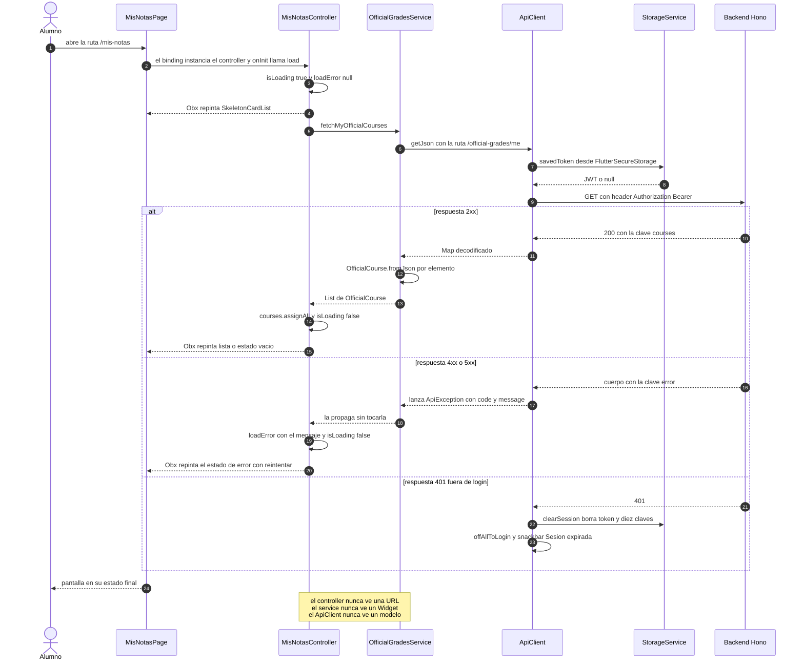

Las tres líneas de la nota final son la regla que ordena toda la capa. Un controller que escribe una
ruta HTTP, o un servicio que muestra un `Get.snackbar`, es una violación de capa, y las que quedan
—los 13 endpoints sin service— están listadas arriba con nombre y archivo.

---

## 🧠 La lógica de dominio

`lib/domain/` existe para una sola cosa: **poder equivocarse barato**. Son 636 líneas en 4
archivos con **cero imports de Flutter y cero imports de GetX** — la restricción está escrita
en el propio código (`lib/domain/malla/malla_entities.dart:3`, `lib/domain/silabo/silabo_link.dart:2`).
Eso permite probar el desbloqueo de un curso o el parseo de un enlace de Drive con un
`test()` de Dart puro, sin `pumpWidget`, sin `Get.testMode`, sin mocks de `BuildContext`.

Aquí vive lo que de verdad hay que acertar: si la malla dice «Disponible» cuando el alumno
no cumple el prerrequisito, la app miente sobre su plan de estudios.

```text
lib/domain/                        636 L · 4 archivos · CERO Flutter, CERO GetX
├── malla/
│   ├── malla_entities.dart        187 L  # CourseNode, CourseProgress, enums CourseStatus y CourseCategory
│   └── malla_logic.dart           350 L  # MallaGraph + 17 funciones puras de nivel superior
├── notas/
│   └── notas_calculo.dart          17 L  # calcularPromedioPonderado y sumaDePesos — TODO el dominio de notas
└── silabo/
    └── silabo_link.dart            82 L  # SilaboLink.tryParse — ¿es un enlace de Drive con FILE_ID usable?
```

La capa de servicios no calcula: [`lib/services/malla_service.dart`](lib/services/malla_service.dart)
declara en su cabecera que «aquí solo se delega». Los colores de curso viven aparte, en
[`lib/configs/course_colors.dart`](lib/configs/course_colors.dart), porque necesitan `Color`
de Flutter.

---

### La malla — [`lib/domain/malla/malla_logic.dart`](lib/domain/malla/malla_logic.dart)

350 líneas, `MallaGraph` más **17 funciones de nivel superior**, todas puras. `MallaGraph`
(`malla_logic.dart:15-28`) es una vista inmutable del catálogo con `courses` y un `byId`
precalculado; **si `/curriculum/me` devolviera dos cursos con el mismo `id`, gana el último**
(`:25-26`) y no hay log ni validación que lo avise.

#### Los cuatro estados

`enum CourseStatus { locked, unlocked, current, approved }` (`malla_entities.dart:12`).
Dos son **derivados** — se recalculan enteros en cada pasada — y dos son **persistentes**:
`isPersistentStatus` (`malla_logic.dart:306-308`) devuelve `true` solo para `approved` y `current`.

| Estado | Etiqueta | Fondo | Borde | Ícono lista | Qué significa exactamente |
|:---|:---|:---|:---|:---|:---|
| `approved` | `Aprobado` | `#10B981` | `#059669` | `check_circle` | Curso aprobado. Cuenta para créditos, para `isLevelComplete` y para satisfacer prerrequisitos ajenos |
| `current` | `Cursando` | `#F59E0B` | `#D97706` | `radio_button_checked` | Está en `currentCourses`. **Máxima precedencia**: gana incluso sobre `approved` y sobre prerrequisitos incumplidos |
| `unlocked` | `Disponible` | `#0EA5E9` | `#0284C7` | `lock_open` | Cumple el marcador de ciclo **y** todos los prerrequisitos concretos, pero ni lo lleva ni lo aprobó |
| `locked` | `Bloqueado` | `#94A3B8` | `#64748B` | `lock_outline` | Falta un prerrequisito, o no completó los obligatorios del ciclo exigido, o **un prerrequisito no existe en el catálogo**. Contenido a opacidad 0.65 |

Colores en [`lib/models/malla_models.dart`](lib/models/malla_models.dart)`:16-43` — la única
parte del dominio de malla que necesita Flutter. Etiquetas en `malla_entities.dart:14-27`.

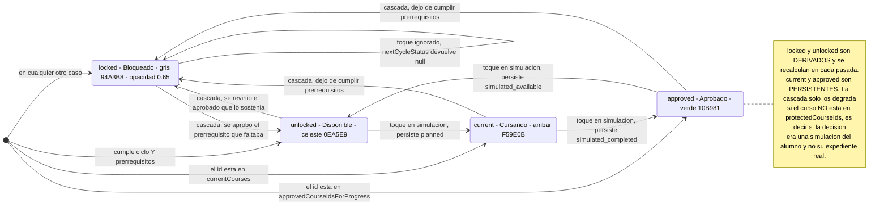

#### Desbloqueo — la conjunción de dos condiciones independientes

`isCourseUnlocked` (`malla_logic.dart:75-82`) es un `&&` entre dos comprobaciones que no se
parecen en nada:

**1 · Requisito de ciclo.** `satisfiesCycleRequirement` (`:48-56`) mira
`course.requiredCompletedLevel`; ese getter (`malla_entities.dart:94-98`) devuelve `5` si la
lista de prerrequisitos contiene el marcador `_V_CICLO_`, `6` si contiene `_VI_CICLO_`, y
`null` si no hay marcador. Con `null` devuelve `true` sin más. Si hay marcador, delega en
`hasCompletedMandatoryCycles` (`:36-44`): **todos** los cursos no electivos con
`level <= throughLevel` deben estar aprobados.

> **1 · Los electivos nunca cuentan para cerrar un ciclo.** `hasCompletedMandatoryCycles`
> filtra `!isElective` siempre (`malla_logic.dart:34-35`), aunque el electivo pertenezca
> visualmente a un nivel anterior y aunque ya esté aprobado. Un ciclo se cierra con sus
> obligatorios, punto. Sobre una lista vacía `.every` devuelve `true`, así que un nivel sin
> obligatorios se da por cumplido.

**2 · Prerrequisitos concretos.** `satisfiesCoursePrerequisites` (`:62-71`) exige que cada
prerrequisito **exista en `graph.byId`** y esté aprobado. `coursePrerequisites`
(`malla_entities.dart:89-90`) ya filtró los marcadores `_*_CICLO_`.

> **2 · Un prerrequisito que no existe en el catálogo NUNCA se considera satisfecho.**
> Está escrito así en `malla_logic.dart:60-61` y verificado en
> `test/HU19_jeff/malla_logic_test.dart:76`: el curso queda **bloqueado para siempre**, no
> hay forma de aprobarlo desde la app. Es deliberado — fallar cerrado es preferible a
> desbloquear un curso por un dato sucio. Corolario probado en `:86`: un curso que se exige
> a sí mismo también queda bloqueado.

`deriveAvailability` (`:86-94`) reduce lo anterior a `unlocked` o `locked`.

#### Progreso REAL — de dónde salen los aprobados

`computeStatuses` (`:148-170`) aplica una precedencia **estricta**, documentada en `:145-147`:

```text
cursando (current)   >   aprobado (approved)   >   derivado (unlocked | locked)
```

Un curso que aparece en `currentCourses` se marca `current` **aunque no cumpla
prerrequisitos** (test `malla_logic_test.dart:117`). Si el alumno lo está llevando, la app no
discute con la matrícula.

El conjunto de aprobados lo produce `approvedCourseIdsForProgress` (`:114-127`), que es la
**unión de tres fuentes** que conviven en `CourseProgress` (`malla_entities.dart:125-187`):

| Fuente | Tipo | Qué aporta | Trampa |
|:---|:---|:---|:---|
| `approvedLevels` | `Set<int>` | Los cursos **obligatorios** de cada nivel listado | Es un **piso, no un techo**; filtra `e > 0` (`:174`). Un electivo nunca se aprueba por pertenecer a un ciclo (test `:132`) |
| `approvedCourseIds` | `Set<String>` | La fuente honesta, curso por curso | Puede contener cursos de **niveles superiores** al del alumno: el plan pide requisitos por curso, no por ciclo (`:108-110`) |
| `approvedElectives` | `Set<String>` | Alias **LEGADO** del mismo contenido | Se suma igual, para no depender de la versión del backend (`:112-113`) |

`currentCourseIdsForProgress` (`:131-141`) acepta tres claves en orden: `courseId` → `idCurso`
→ `id`, porque el payload de `currentCourses` cambió de forma y el histórico sigue vivo. El
`fromJson` incluso convierte un `String` antiguo en `{'idSeccion': e, 'idCurso': 'desconocido'}`
(`malla_entities.dart:162-169`).

#### Simulación — dos algoritmos de recálculo, divergentes a propósito

La app tiene dos vistas de malla y **cada una recalcula distinto**. No es un descuido; está
declarado como decisión de compatibilidad en `malla_logic.dart:214-216`.

| | `recomputeDerivedAvailability` (`:190-211`) | `recomputeDerivedAvailabilityCascade` (`:233-276`) |
|:---|:---|:---|
| Vista que la usa | Mapa clásico `/malla-clasica` | Lista HU19 (tab 0 del alumno) |
| Pasadas | **Una sola**, intencionadamente (`:187-189`) | Itera **hasta punto fijo**, `maxPasses = visible.length + 2` (`:241`) |
| Qué conserva | `fixedStatusCourseIds`, `approved` y `current` (`:201-203`) | `protectedCourseIds` es intocable; una decisión simulada se conserva solo si `isCourseUnlocked(…, approved.difference({c.id}))` (`:255-260`) |
| Efecto dominó | **No hay**: aprobar A desbloquea sus dependientes directos, pero C, que depende de B, sigue `locked` hasta que B se apruebe | **Sí**: revertir A re-bloquea B, C, … en pasadas sucesivas |
| Escritura | Ninguna, solo lectura (`malla_controller.dart:6-11`) | `PUT`/`DELETE /curriculum/me/simulation` + `StorageService` |

El `difference({c.id})` de la cascada es la línea fina: **un curso no se sostiene a sí mismo**.
Y la convergencia está argumentada en `:228-232` — los estados derivados nunca producen
`approved`, así que el set de aprobados solo puede **reducirse** entre pasadas; el punto fijo
existe incluso con prerrequisitos circulares. Lo cubre
`test/HU19_jeff/malla_logic_test.dart:406`.

El ciclo de estados al tocar una card es `nextCycleStatus` (`:292-303`):
`unlocked → current → approved → unlocked`, y **`locked → null`**: no cicla, el toque se ignora
y el botón del detalle rotula `No disponible`. Tres toques desde `unlocked` regresan a
`unlocked` (test `:465`).

La traducción a lo que se persiste la hace `simulationStatusFor(next, realStatus)` (`:328-344`):

| `next` | Se persiste | Condición |
|:---|:---|:---|
| cualquiera | `null` ⇒ **DELETE** de la entrada | si `realStatus == next`: la simulación volvió a coincidir con la realidad |
| `current` | `'planned'` | — |
| `approved` | `'simulated_completed'` | — |
| `unlocked` | `'simulated_available'` | **solo si** el estado real era `current` o `approved` — el alumno está *revirtiendo* algo real |
| `locked` | `null` | siempre |

`statusFromSimulation` (`:312-323`) hace el camino inverso y **descarta en silencio** cualquier
string que no reconozca.

#### Progreso real frente a simulación visual, y niveles cumplidos

`displayedStatuses` conmuta entre `simStatuses` y `realStatuses` según `simulationMode`
(`malla_list_controller.dart:228-229`); `isSimulatedChange(id)` (`:236-237`) pinta el chip
`SIMULADO` cuando el estado mostrado difiere del real. `_protectedRealIds` (`:398-401`) son los
ids cuyo estado **real** es persistente, y es exactamente lo que se pasa como
`protectedCourseIds` a la cascada: **la simulación puede degradar simulaciones, nunca el
expediente**.

Al entrar en simulación (`enterSimulation`, `:403-435`) el baseline es `realStatuses`, encima
se aplica la simulación persistida en backend si existe, si no la guardada localmente en
`StorageService`, y al final se corre una cascada completa. Al guardar (`saveSimulation`,
`:483-574`) sale un `PUT` por curso cuyo `simulationStatusFor` no sea `null` y difiera de lo ya
persistido, y un `DELETE` por cada curso que volvió a coincidir con la realidad; el baseline
local solo registra los requests **con éxito** y ante cualquier fallo la app **permanece en modo
simulación** para reintentar.

Los niveles cumplidos se calculan sobre `displayedStatuses`, así que en modo simulación
reflejan la simulación:

- `isLevelComplete(level)` (`malla_list_controller.dart:308-311`): grupo no vacío **y**
  `approvedIn(group) == group.length`.
- `isElectivesComplete` (`:313-316`): lo mismo para la piscina de electivos.
- `hasCompletedMandatoryCycles(throughLevel, statuses)` delega en
  `MallaService.hasCompletedMandatoryCyclesFromStatuses` → `approvedCourseIdsFromStatuses` +
  la función pura del dominio (`malla_service.dart:167-175`).
- **Ciclo «actual» del alumno** (`currentStudentLevel`, `:207-224`): el **menor nivel con
  obligatorios no aprobados**; si no quedan obligatorios pendientes, el menor nivel con
  cualquier curso pendiente; si no queda nada → `null`.

> ⚠️ **Las dos vistas miden el progreso con unidades distintas.** El mapa clásico calcula
> `approvedRatio = approvedCount / totalVisible`, es decir **por cursos**
> (`malla_controller.dart:319-320`); la vista lista HU19 lo calcula **por créditos**,
> `approvedCredits / totalCredits` (`malla_list_controller.dart:350-361`). El mismo alumno
> puede ver dos porcentajes diferentes en dos pantallas. No existe documento que declare cuál
> es el contrato correcto.

---

### Las notas — [`lib/domain/notas/notas_calculo.dart`](lib/domain/notas/notas_calculo.dart)

**17 líneas. Dos funciones. Eso es todo el dominio de notas.**

```dart
double calcularPromedioPonderado(List notas) {              // :1-10
  if (notas.isEmpty) return 0.0;
  double suma = 0;
  for (final n in notas) {
    final valor = double.tryParse(n['valor']?.toString() ?? '') ?? 0.0;
    final peso  = double.tryParse(n['peso']?.toString()  ?? '') ?? 0.0;
    suma += valor * (peso / 100.0);
  }
  return suma;
}
```

| Regla | Comportamiento exacto | Evidencia |
|:---|:---|:---|
| Contrato de entrada | `List` **sin tipar** de mapas con las claves literales `'valor'` y `'peso'` | `notas_calculo.dart:1,5,6` |
| Lista vacía | `0.0` | `:2`; `test/HU06_sam/notas_calculo_test.dart:7` |
| Fórmula | `Σ (valor_i × peso_i / 100)` — ponderación sobre base 100, la del sílabo | `:7` |
| Pesos que no suman 100 | **NO se normaliza.** Un 14 con 50 % de peso da `7.0`, no `14.0` | test `:25-29` |
| Valores en texto | `'13'` y `'40'` se parsean → `5.2` | `:5-6`; test `:31-35` |
| `null` o basura (`'abc'`) | cuentan como **0.0**; no lanzan y no se omiten | `:5-6`; test `:37-42` |
| Redondeo | **NINGUNO.** Devuelve el `double` crudo | no hay `round()`, `floor()`, `ceil()` ni `toStringAsFixed` en todo `lib/domain/` |
| `sumaDePesos` | `fold` sobre `'peso'` con el mismo parseo defensivo | `:12-17` |

> **3 · El «promedio» de un curso a medio ciclo es un avance parcial, no una proyección.**
> Como los pesos no se normalizan, mientras falten evaluaciones el número es bajo por
> construcción. Por eso la card muestra siempre `"Suma de pesos: X% / 100%"` al lado
> (`lib/components/calculadora/curso_card.dart:137`): sin ese denominador el 7.0 del ejemplo
> se leería como una desaprobación.

**Qué pasa con una evaluación sin nota.** No se omite: entra como cero **con su peso completo**.
El puente al dominio es `OfficialAssessment.toCalcEntry()`
([`lib/models/official_grades_models.dart`](lib/models/official_grades_models.dart)`:131`),
que devuelve `{'valor': value ?? 0, 'peso': weight}`; y en la vista del docente
`teacher_grade_section_controller.dart:91-99` arma `{'valor': scoreFor(...) ?? 0, 'peso': a.weight}`.
El contrapeso honesto es `OfficialCourse.gradedWeight` (`official_grades_models.dart:158-159`),
que suma **solo los pesos ya calificados** y permite decir sobre cuánto se está promediando.

**El redondeo es exclusivamente de presentación**, y no es uniforme:

| Dónde | Formato | Ruta:línea |
|:---|:---|:---|
| Promedio del curso | `toStringAsFixed(2)` | `lib/components/calculadora/curso_card.dart:88`, `lib/pages/mis_notas/mis_notas_page.dart:219` |
| Nota individual y peso (calculadora) | `toStringAsFixed(1)` | `lib/components/calculadora/nota_tile.dart:54`, `lib/components/calculadora/add_score.dart:246,293` |
| Peso en Mis Notas | `toStringAsFixed(0)` | `lib/pages/mis_notas/mis_notas_page.dart:176` |
| Aviso de desaprobación | `promedio < 11.0` pinta el aviso en la card | `lib/components/calculadora/curso_card.dart:95` |

No hay redondeo «a la peruana» (0.5 hacia arriba) ni truncado a nota entera en ninguna parte
del frontend.

> ⚠️ **No existe el cálculo de «nota que falta para aprobar».** Se buscó explícitamente con
> `grep -rni "necesari|faltante|para aprobar|minimo|mínima|needed" lib/`: las únicas
> coincidencias son `zoomMinimo` del visor de sílabos y helpers de foco de la malla. Si ese
> requisito existe, está en el backend o simplemente no está implementado. El README no lo va
> a prometer.

> ⚠️ **La calculadora del alumno NO usa este dominio.**
> `CalculadoraController._calcularPromedio`
> ([`lib/pages/calculadora/calculadora_controller.dart`](lib/pages/calculadora/calculadora_controller.dart)`:168-199`)
> hace `POST /grades/me/calculate` y lee `promedio` y `sumaPesos` del servidor; ante cualquier
> error deja ambos en `0.0`, **indistinguible de «aún no hay notas»**. La misma fórmula está
> duplicada en cliente y servidor y nada verifica que coincidan. Los únicos consumidores del
> dominio puro son `mis_notas_controller.dart:41-43` y `teacher_grade_section_controller.dart:91-99`,
> ambos de solo lectura sobre notas oficiales.

---

### El sílabo — [`lib/domain/silabo/silabo_link.dart`](lib/domain/silabo/silabo_link.dart)

> **4 · No existe ninguna rama «Domino» en este repositorio.** `grep -rni "domino|\.nsf"`
> sobre `lib/`, `test/`, `docs/` y `specs/` no devuelve **ni una** coincidencia. La decisión
> binaria real que toma `SilaboLink.tryParse` es **«¿es un enlace de Google Drive con un
> FILE_ID reconocible?»** → sí (visor in-app) / no (mensaje de error y fallback externo con la
> URL cruda). El frontend no distingue el origen institucional del enlace; lo único que sabe
> es si el host está en su lista blanca.

`tryParse(String? url)` (`:37-71`) ejecuta ocho pasos en orden:

1. `url == null` → `null` (`:38`).
2. `trim()`; si queda vacío → `null` (`:39-40`).
3. `Uri.tryParse` falla → `null` (`:42-43`).
4. Esquema distinto de `https` o `http` → `null` (`:44`).
5. Host (en minúsculas) fuera de la **lista blanca de tres** — `drive.google.com`,
   `drive.usercontent.google.com`, `docs.google.com` — → `null` (`:47-52`).
6. **Variante de ruta**: busca el segmento literal `d` en `pathSegments` y toma el siguiente
   (`:55-62`). Cubre `/file/d/<ID>/view` y `/document/d/<ID>/…`.
7. **Variante de query**: el parámetro `id` (`:65-68`). Cubre `/open?id=<ID>` y
   `/uc?export=download&id=<ID>`.
8. Si nada casa → `null` (`:70`).

`_esFileIdValido` (`:75-78`) exige longitud **≥ 10** y el regex `^[A-Za-z0-9_-]+$`. El umbral de
10 es lo que descarta segmentos accidentales como `view` o `edit` (`:73-74`).

Del `fileId` salen tres URLs: `originalUrl` (la cruda de la BD, `:20-21`), `downloadUrl` =
`https://drive.google.com/uc?export=download&id=$fileId` (`:24-25`, la que usa el visor) y
`externalViewUrl` = `https://drive.google.com/file/d/$fileId/view` (`:28`, el botón *Abrir en Drive*).

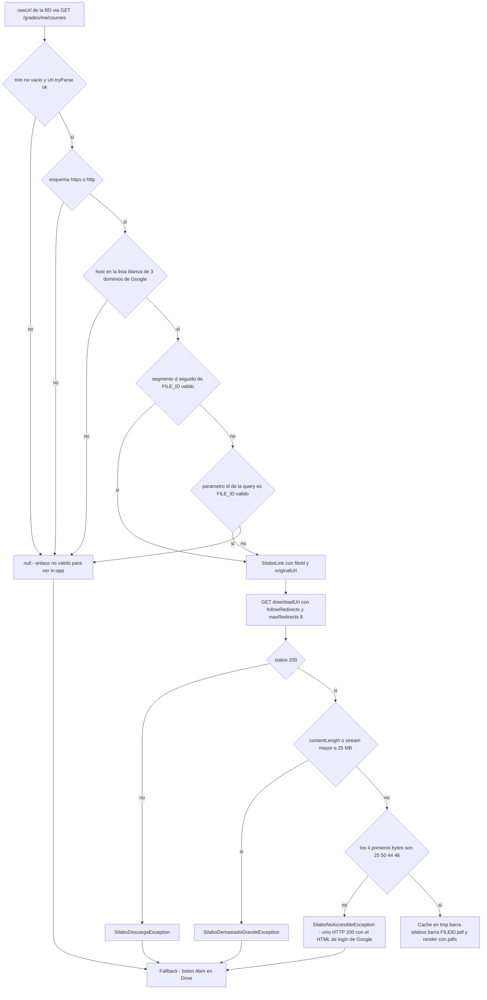

La frontera está en [`lib/services/silabo_service.dart`](lib/services/silabo_service.dart) y
[`lib/pages/silabo/silabo_viewer_controller.dart`](lib/pages/silabo/silabo_viewer_controller.dart):

| Condición | Resultado |
|:---|:---|
| `tryParse(rawUrl) == null` | Error inmediato: *«El enlace del sílabo no es válido para verlo dentro de la app.»*; *Abrir en Drive* cae a `rawUrl` (`silabo_viewer_controller.dart:108-114, 336-339`) |
| HTTP ≠ 200 | `SilaboDescargaException('No se pudo descargar el sílabo (HTTP N).')` (`silabo_service.dart:115-119`) |
| `contentLength > 25 MB` o el stream lo supera | `SilaboDemasiadoGrandeException` — `maxPdfBytes = 25 * 1024 * 1024` (`silabo_service.dart:61, 121-131`) |
| 200 **sin firma `%PDF`** (`0x25 0x50 0x44 0x46`) | `SilaboNoAccesibleException` → la UI degrada a *Abrir en Drive* (`silabo_service.dart:63-72, 135-139`) |
| `ClientException` / `SocketException` | `SilaboDescargaException` con mensaje de red (`silabo_service.dart:143-148`) |
| Todo OK | bytes cacheados en `<tmp>/silabos/<fileId>.pdf` y renderizados con `pdfx` |

> **5 · La validación que importa es la FIRMA del contenido, no el status code.** Los permisos
> de Drive de los sílabos reales son **mixtos**: algunos archivos devuelven el binario y otros
> devuelven **HTTP 200 con el HTML de la pantalla de login de Google**. Comprobar `status == 200`
> haría que el visor intentara renderizar una página web como PDF. Por eso
> `SilaboService.esFirmaPdf` (`silabo_service.dart:66-72`) compara los cuatro primeros bytes
> contra `%PDF` antes de tocar `pdfx`, y una caché que ya no empiece por `%PDF` se descarta y se
> vuelve a descargar (`:86-93`). El botón *Reintentar* fuerza `forzarDescarga = true` e ignora la
> caché.

Complemento útil y también puro: `SilaboService.nombreArchivoPresentable` (`:159-177`) sanea el
título para compartirlo — sustituye `[\/:*?"<>|]` y los caracteres de control por espacio,
colapsa espacios, **recorta a 80 runes** (no code units, para no partir un surrogate pair de
emoji), limpia puntos y espacios extremos y, si queda vacío, devuelve `'Silabo'`.

---

### Los colores de curso — [`lib/configs/course_colors.dart`](lib/configs/course_colors.dart)

`kCoursePalette` (`:14-27`) tiene **12 colores en orden fijo**. Eran 8 y se ampliaron porque el
techo realista de un ciclo son **9 cursos (27 créditos)**: con 8 slots, dos cursos del mismo
alumno compartían color **por obligación matemática** (`:5-9`). Los slots 0-7 conservan su orden
original para que nada ya pintado cambie de color; 8-11 son los añadidos.

| Slot | Hex | Nombre | | Slot | Hex | Nombre |
|---:|:---|:---|:---|---:|:---|:---|
| 0 | `#2F80ED` | azul | | 6 | `#00B8A9` | teal |
| 1 | `#27AE60` | verde | | 7 | `#F2C94C` | amarillo |
| 2 | `#EB5757` | rojo | | 8 | `#00A2C7` | cian *(añadido)* |
| 3 | `#9B51E0` | morado | | 9 | `#7CB518` | lima *(añadido)* |
| 4 | `#EC4899` | rosa | | 10 | `#8B6D5C` | marrón *(añadido)* |
| 5 | `#F2994A` | naranja | | 11 | `#5B5BD6` | índigo *(añadido)* |

**Por qué el reparto se hace en el cliente.** El backend guarda el color en `schedule_session`,
una fila que **comparten todos los alumnos de la sección**; allí es imposible saber qué otros
cursos lleva cada alumno. Caso real citado en el propio código (`:50-54`): en el ciclo **2026-2,
Seguridad de Sistemas y Paradigmas de Programación traen los dos el mismo índigo**. En el
horario semanal eso significa dos bloques idénticos en la misma rejilla.

`asignarColoresSinRepetir(clavesOrdenadas, hexPreferido)` (`:66-115`) resuelve en dos pasadas:

1. **Pasada 1** (`:81-90`) — si el curso trae un hex que cae **exactamente** en un slot de la
   paleta (`slotDe`, `:73-78`, comparando `toARGB32()`) y ese slot está libre, se lo queda. Se
   respeta el color del backend a propósito: *«así el curso se ve igual para todos y se puede
   hablar del curso azul»* (`:56-58`). Lo demás va a `pendientes`.
2. **Pasada 2** (`:95-112`) — cada pendiente arranca en `desde = slotDe(su hex) ?? 0` y **avanza
   circularmente** `(desde + k) % 12` hasta el primer hueco, para que el resultado no dependa
   del orden de llegada más de lo necesario (`:92-94`).

> ⚠️ **Con más de 12 cursos los colores SÍ se repiten.** La rama de desbordamiento (`:105-107`)
> hace `elegido = asignado.length % 12` y **no marca el slot como tomado**, «sin dejar a nadie
> gris». Está documentado como aceptable con un techo de 9 cursos, pero es un límite duro que
> el tipo no defiende: `test/HU31_jeff/course_colors_test.dart:85-90` solo comprueba que nadie
> se quede sin color, no la unicidad.

> ⚠️ **`slotDe` exige coincidencia exacta.** Si el backend cambia un solo dígito de un hex, el
> curso deja de reconocerse y se trata como «sin preferencia» (`desde = 0`). La paleta debe
> coincidir con `COURSE_COLOR_PALETTE` de `portal-sync.repository.ts` en el backend
> (`course_colors.dart:11-13`) y **ningún test ni contrato verifica ese acoplamiento**.

**Estabilidad.** `clavesOrdenadas` debe llegar en orden estable o «el horario parecería
parpadear» entre recargas (`:60-62`). El único llamador,
`HorarioController.colorPorCurso` ([`lib/pages/horario/horario_controller.dart`](lib/pages/horario/horario_controller.dart)`:375-403`),
ordena con `claves.sort()`, excluye las filas de asesoría y toma el hex del **primer horario**
de la sección (`schedule_session.color_hex`), no el color de la sección — que suele venir en un
naranja por defecto.

Aparte queda `courseAccentColor(int seed)` (`:32-33`), un `kCoursePalette[seed.abs() % 12]` que
usan las vistas del **docente**, donde el backend no envía color por curso y el `sectionId` hace
de semilla. Y `parseHexColor` (`:37-46`) acepta `#RRGGBB`, `RRGGBB` y `AARRGGBB`, y devuelve
`null` ante cualquier otra cosa «para que quien llame decida».

---

### Los 21 modelos

21 archivos en `lib/models/`, 40 clases contando las entidades de malla que
`malla_models.dart` reexporta desde `lib/domain/`. La convención transversal es **coerción
defensiva**: casi todos los `fromJson` usan `json['x']?.toString() ?? ''`,
`(json['x'] as num?)?.toInt() ?? 0` o `double.tryParse(...)`, con la justificación escrita en
`portal_sync_models.dart:3-5` — *«el backend devuelve enteros, pero un cambio de serialización
que los mande como texto no debe romper la pantalla»*.

| Modelo | Archivo | Campos principales | De qué endpoint se hidrata |
|:---|:---|:---|:---|
| `AdvisingSession`, `TeacherSectionOption`, `Attendee` | [`lib/models/advising_models.dart`](lib/models/advising_models.dart) | `kind` (`recurring`\|`extra`), `dia`, `fecha?`, `inicio`, `fin`, `modality`, `aula`, `zoom`, `cupo?`, `asistentes`, `rol`; `label`; `fullName` | `GET/POST /advising/me/sessions`, `GET /advising/me/sections`, `GET /advising/me/sessions/{id}/attendees` |
| `AlertModel` | [`lib/models/alert_model.dart`](lib/models/alert_model.dart) | `id`, `type` (`academic_risk`\|`high_load`), `title`, `message`, `isRead` mutable, `createdAt`, `courseName?` | `GET /alerts/me` · marcado con `PUT /alerts/me/{id}/read` |
| `Anuncio` | [`lib/models/anuncio_model.dart`](lib/models/anuncio_model.dart) | `id`, `idSeccion`, `titulo`, `mensaje`, `fecha`, `autorCode`, `autor: UserModel` inyectado; `copyWith` | `GET /course-detail/sections/{id}/announcements` · CRUD en `/section-management/…/announcements` |
| `Asesoria` | [`lib/models/asesoria_model.dart`](lib/models/asesoria_model.dart) | `docente: Docente`, `dia`, `inicio`, `fin`, `aula`, `zoom`, `kind`, `fecha?`, `dictanteRol`, `asistentes`, `myRsvp`; `esExtra` | `GET /advising/section/{idSeccion}` · RSVP con `POST`/`DELETE /advising/{id}/rsvp` |
| `AtRiskStudent` | [`lib/models/at_risk_student_model.dart`](lib/models/at_risk_student_model.dart) | `code`, `absentHours`, `totalHours`, `absencePercentage?` **nullable a propósito**, `status`, `missingFaltas?`; `statusLabel` | `GET /attendance-risk/sections/{id}/attendance-risk` |
| `ChatbotSession`, `ChatbotMessage` | [`lib/models/chatbot_models.dart`](lib/models/chatbot_models.dart) | `title` (def. `'Nueva conversacion'`), `createdAt`, `updatedAt`; `role` (def. `'user'`), `content`, `isUser` | `POST/GET /chatbot/sessions`, `GET /chatbot/sessions/{id}` |
| `ContactoCurso`, `RepresentantePendiente` | [`lib/models/contacto_model.dart`](lib/models/contacto_model.dart) | `user: UserModel`, `roleInSection`, `networking?`; `position` (`delegate`\|`subdelegate`), `contactable` (siempre `false`), `rolEnEspanol` | `GET /course-detail/sections/{id}/contacts` → `alumnos[]` y `representantesPendientes[]` |
| `CursoDelegado` | [`lib/models/curso_delegado_model.dart`](lib/models/curso_delegado_model.dart) | `idCurso`, `nombreCurso`, `idSeccion`, `codigoSeccion` (def. `"Sección {id}"`), `rol`, `alumnosMatriculados`; acepta alias es/en en 5 claves | `GET /section-management/representatives`, con desenvoltura tolerante a 5 formas |
| `Curso` | [`lib/models/curso_model.dart`](lib/models/curso_model.dart) | `id`, `nombre`, `ciclo`, `notas`, `seccion` | **De ninguno — código muerto.** No tiene `fromJson`, nunca se instancia |
| `Docente` | [`lib/models/docente_model.dart`](lib/models/docente_model.dart) | `code` (def. `'Sin código'`), `firstName` (def. `'No'`), `lastName` (def. `'Asignado'`), `networking?`; `fullName` | Anidado como `docente`/`jefePractica` en contactos y asesorías · `GET /course-detail/teachers` |
| `Enrollment` | [`lib/models/enrollment_model.dart`](lib/models/enrollment_model.dart) | `id`, `studentCode`, `idCurso`, `idSeccion` | `GET /course-detail/enrollments` — **modelo huérfano**, ninguna pantalla lo usa |
| `EstadisticasSeccion` | [`lib/models/estadisticas_seccion_model.dart`](lib/models/estadisticas_seccion_model.dart) | `promedioGeneral`, `porcentajeAprobados`, `rango0_10`, `rango11_13`, `rango14_16`, `rango17_20`; `isEmpty`, `maxRango` | `GET /section-management/sections/{id}/statistics` (payload en `data` o en la raíz) |
| `EvaluationComponent`, `CourseSyllabus` | [`lib/models/evaluation_model.dart`](lib/models/evaluation_model.dart) | `nombre`, `sigla`, `peso`, `tipo`; `cursoId`, `cursoNombre`, `silaboUrl?`, `evaluaciones[]`, `pesoTotal` | `GET /grades/me/courses?code=` → `syllabi[]` |
| `CourseNode`, `CourseProgress`, `CourseStatus`, `CourseCategory` | [`lib/models/malla_models.dart`](lib/models/malla_models.dart) *(reexporta `lib/domain/malla/malla_entities.dart`)* | `credits` (def. 3), `level` (def. 1), `prerequisites[]`, `category` (def. FACULTY), `row`, `specialties[]`, `externalFaculty?`; `approvedLevels`, `approvedCourseIds`, `approvedElectives`, `currentCourses` | `GET /curriculum/me` → `courses[]`; el progreso viaja anidado en `user.courseProgress` de `/auth/login`, `/auth/me` y `/auth/google` |
| `ChatMessage` | [`lib/models/message.dart`](lib/models/message.dart) | `senderRole`, `senderRoleLabel`, `isModerator`, `weight`, `body`, `messageType`, `deleted`, `deletedBy`, `deletedByRole`; `isNetworkingCard` | **Firebase RTDB** `sections/{sectionId}/messages` vía `fromMap`; el token sale de `POST /chat/token` |
| `SocialLinkDto`, `NetworkingCardDto`, `PublicNetworkingCardDto`, `NetworkingOwnerDto` | [`lib/models/networking_model.dart`](lib/models/networking_model.dart) | `platform`, `url`, `label?`; `optIn`, `links` (**máximo 1**); `owner`, `card`; `userId`, `fullName`, `roleLabel` | `GET/PUT /networking/me` · `GET /networking/users/{userId}` |
| `GradingSection`, `GradingStudent`, `GradingAssessment`, `SectionGrid`, `OfficialAssessment`, `OfficialCourse` | [`lib/models/official_grades_models.dart`](lib/models/official_grades_models.dart) | `enrollmentId`, `assessmentId`, `weight`, `weekNumber`, `scores` indexado por `"enrollmentId:assessmentId"`; `value?`, `toCalcEntry()`, `gradedWeight` | `GET /official-grades/me` (alumno) · `GET`/`PUT /official-grades/teacher/sections/{id}/scores` y `GET /official-grades/teacher/sections` (docente) |
| `PortalSyncPeriod`, `PortalSyncStatus`, `PortalSyncWarning`, `PortalSyncSummary`, `PortalSyncResult` | [`lib/models/portal_sync_models.dart`](lib/models/portal_sync_models.dart) | `activePeriod?`, `enrollmentsInActivePeriod`, `needsImport`; `code`, `block`, `message`; 8 contadores de `summary`; `token?` **JWT re-firmado** si cambió el cargo | `GET /portal-sync/status` (timeout 15 s) · `POST /portal-sync/import` (timeout 90 s) |
| `Seccion` | [`lib/models/seccion_model.dart`](lib/models/seccion_model.dart) | `idSeccion`, `codigoSeccion`, `docenteCode`, `promedioSeccion`, `curso` (def. `'Sin curso'`), `asistido`, `inasistencia`, `total`, `asistenciaDisponible`; `porcentajeAsistencia` (`null` si `total <= 0`) | `GET /course-detail/sections` y `/sections/{id}` |
| `SectionRepresentative` | [`lib/models/section_representative_model.dart`](lib/models/section_representative_model.dart) | `id`, `enrollmentId`, `role` | `GET /section-management/representatives` — **modelo huérfano** |
| `UserModel` | [`lib/models/user_model.dart`](lib/models/user_model.dart) | `code`, `firstName`, `lastName`, `_fullName`, `email`, `role` (def. `'estudiante'`), `teacherLabel?`, `careerId?`, `especialidadPrincipal?`, `especialidadesInteres[]`, `currentCycle` (def. `'2026-1'`), `setupComplete`, `courseProgress?`; `fullName`, `roleLabel`, `isDelegate`, `isTeacher` | `POST /auth/login`, `GET /auth/me`, `POST /auth/google` → `user`; también anidado como `autor` en anuncios y `user` en contactos |

Cuatro detalles que valen la línea de código que ocupan:

> **6 · `UserModel.fullName` prefiere el nombre del backend antes que recomponerlo.**
> (`user_model.dart:48-60`) El `splitName` del servidor toma el último token como apellido, así
> que de `"QUISPE ROJAS MARIA FERNANDA"` saca `firstName="QUISPE ROJAS MARIA"` y
> `lastName="FERNANDA"`. Con dos apellidos y dos nombres el reparto siempre sale mal, y el nombre
> completo tal cual llegó es el único dato fiable.

> **7 · `Seccion.porcentajeAsistencia` devuelve `null`, no cero.** (`seccion_model.dart:30-40`)
> El bug real: `0/0 = NaN`, y `clampDouble` de Flutter resuelve `NaN` al **máximo**, así que el
> `CircularProgressIndicator` se pintaba lleno y verde afirmando **100 % de asistencia** cuando
> no había ni un solo dato. Misma familia: `AtRiskStudent.absencePercentage` es nullable a
> propósito.

> **8 · `PortalSyncStatus.desconocido` trae `needsImport: false`.** (`portal_sync_models.dart:54-63`)
> Si el status falla, el banner de carga de ciclo **no** se muestra. El razonamiento está
> escrito ahí: *«proponerle cargar sus datos a un alumno que ya los tiene es peor que no
> proponérselo a uno que los necesita»*.

> **9 · `networking_model.dart` es el único modelo que valida y lanza.** Cuatro `FormatException`
> por campos obligatorios y un `StateError` si un carnet trae más de un enlace
> (`networking_model.dart:50-52`). Todos los demás modelos degradan a valores por defecto; este
> prefiere romper porque un carnet mal formado es contenido que se comparte con terceros dentro
> del chat.

---

## 🎨 Interfaz y diseño

### La identidad visual

| Constante | Valor | Dónde |
|:---|:---|:---|
| `MaterialTheme.primaryColor` — naranja ULima | `#FF6600` | `themes.dart:10` |
| `MaterialTheme.primaryDark` | `#D45500` | `themes.dart:12` |
| `MaterialTheme.blackColor` | `#1A1A1A` | `themes.dart:14` |
| `MaterialTheme.greyColor` | `rgb(32, 32, 32)` | `themes.dart:16` |
| `MaterialTheme.whiteColor` | `#FFFFFF` | `themes.dart:18` |
| Ícono de app y splash nativo | `#E77330` | `pubspec.yaml:79, 82` |

> ⚠️ **El naranja de marca no es uno solo.** El tema usa `#FF6600` y el ícono/splash nativo usa
> `#E77330`, tomado del arte del ícono. Son dos naranjas distintos y ninguna spec declara cuál
> es el canónico. Está anotado aquí a propósito para que quien unifique sepa que hay dos sitios
> que tocar.

### Cómo `themes.dart` resuelve el modo claro y el oscuro

310 líneas, y la decisión estructural es que **no hay dos paletas sueltas**: hay una clase que
resuelve **cada color en función del `Brightness`**.

```dart
final materialTheme = MaterialTheme(Theme.of(context).textTheme);
return GetMaterialApp(
  theme:      materialTheme.light(),   // themes.dart:207 → theme(lightScheme())
  darkTheme:  materialTheme.dark(),    // themes.dart:260 → theme(darkScheme())
  themeMode:  ThemeMode.system,        // lo decide el sistema operativo, no la app
  ...
);
```
(`lib/main.dart:93-104`)

La clase tiene tres piezas:

1. **Dos `ColorScheme` completos y escritos a mano** — `lightScheme()` (`themes.dart:159`) y
   `darkScheme()` (`themes.dart:212`). **No** salen de `ColorScheme.fromSeed`: cada rol está
   fijado. `primary` es `#FF6600` **en ambos modos**; lo que cambia es el entorno —
   `surface` pasa de `rgb(254,253,252)` a `rgb(30,30,36)`, `secondary` de `#D45500` a `#FF8C42`,
   `outline` de `#DADADA` a `#444444`.
2. **Un único constructor de `ThemeData`** — `theme(ColorScheme)` (`themes.dart:264-309`) se
   aplica a los dos esquemas: `useMaterial3: true`, `scaffoldBackgroundColor` y `canvasColor` =
   `colorScheme.surface`, `AppBarTheme` con fondo `primary` y `elevation: 0`, botones elevados
   con padding vertical 16 y radio 14, cards con `elevation: 2` y radio 18. **Una sola
   definición para los dos modos**: cambiar el radio de una card lo cambia en claro y en oscuro.
3. **31 helpers semánticos `static Color x(Brightness b)`** — el mecanismo que evita duplicar
   pantallas. En vez de `isDark ? A : B` esparcido por los widgets, el widget pide
   `MaterialTheme.cardBg(brightness)` y el par vive en un solo sitio:

| Helper | Claro | Oscuro | Línea |
|:---|:---|:---|:---|
| `headerColor` | `#FF6600` | `rgb(30,30,36)` | `:21-26` |
| `pageBg` | `#F8FAFC` | `#16161C` | `:55-56` |
| `cardBg` / `sheetBg` | `#FFFFFF` | `#1E1E24` | `:59-60`, `:123-124` |
| `textPrimary` | `#0F172A` | `#EDEDF3` | `:63-64` |
| `textSecondary` | `#334155` | `#A0A0B0` | `:67-68` |
| `textMuted` | `#64748B` | `#787890` | `:71-72` |
| `borderColor` | `#E5E5E5` | `#2E2E38` | `:79-80` |
| `progressBg` | `#E2E8F0` | `#2A2A36` | `:91-92` |
| `dividerMalla` | `#CBD5E1` | `#3A3A48` | `:143-144` |
| `bloqueCurso` | `#FF7A1A` | `#FF6600` | `:28-33` |
| `especialidadPrincipal` / `interés` | `#FFF1EA` / `#F0F7FF` | `#3A2A22` / `#1A2A3A` | `:99-104` |

**Tipografía: no hay familia propia.** La sección `fonts:` de `pubspec.yaml` está íntegramente
comentada (`pubspec.yaml:114-132`) y `uses-material-design: true`. El `TextTheme` se hereda del
contexto y lo único que el tema aplica es color (`themes.dart:304-307`). Tamaños y pesos se
escriben inline en cada widget.

> ⚠️ **Un color se escapó del sistema.** `lib/components/footer/app_footer.dart:29` fija
> `backgroundColor: const Color(0xFF1E1E24)` sin consultar el `Brightness`, así que la barra
> inferior queda oscura **también en modo claro**, a diferencia del resto de la app. Es la única
> inconsistencia de tema verificada.

### Los componentes reutilizables — 18 archivos, 21 widgets

| Componente | Archivo | Dónde se usa |
|:---|:---|:---|
| `ChatbotBubble` | [`lib/components/chatbot_bubble.dart`](lib/components/chatbot_bubble.dart) | `pages/home/home_page.dart` — burbuja flotante de Ulises, arrastrable con snap al borde, respeta *reduce motion* |
| `ErrorRetry` | [`lib/components/error_retry.dart`](lib/components/error_retry.dart) | **7 pantallas**: alertas, calculadora, anuncios de delegado, los 3 tabs de detalle de curso y alumnos en riesgo |
| `googleSignInButton()` | [`lib/components/google_sign_in_button.dart`](lib/components/google_sign_in_button.dart) | `pages/login/login_page.dart` — fachada con import condicional |
| *stub* de Google Sign-In | [`lib/components/google_sign_in_button_stub.dart`](lib/components/google_sign_in_button_stub.dart) | Rama por defecto (móvil): devuelve `SizedBox.shrink()` |
| *web* de Google Sign-In | [`lib/components/google_sign_in_button_web.dart`](lib/components/google_sign_in_button_web.dart) | Rama `dart.library.html`: botón oficial GIS con una `GlobalKey` fija para evitar el warning de `initialize()` llamado dos veces |
| `SkeletonPulse` | [`lib/components/skeleton.dart`](lib/components/skeleton.dart) | Base de todos los esqueletos y uso suelto en `pages/silabo/silabo_viewer_page.dart` |
| `SkeletonBox` | [`lib/components/skeleton.dart`](lib/components/skeleton.dart) | Dentro de `SkeletonCard` y suelto en varias páginas |
| `SkeletonCard` | [`lib/components/skeleton.dart`](lib/components/skeleton.dart) | Vía `SkeletonCardList`; `showAvatar` configurable |
| `SkeletonCardList` | [`lib/components/skeleton.dart`](lib/components/skeleton.dart) | **14 pantallas** — el componente más reutilizado de la app |
| `AddNotaWithSyllabusModal` | [`lib/components/calculadora/add_score.dart`](lib/components/calculadora/add_score.dart) | `pages/calculadora/calculadora_page.dart` — nota validada en el rango 0..20 |
| `CursoCard` | [`lib/components/calculadora/curso_card.dart`](lib/components/calculadora/curso_card.dart) | `pages/calculadora/calculadora_page.dart` — promedio, suma de pesos y aviso bajo 11.0 |
| `NotaTile` | [`lib/components/calculadora/nota_tile.dart`](lib/components/calculadora/nota_tile.dart) | **Solo** dentro de `CursoCard`; ninguna página lo importa |
| `CardAnuncio` | [`lib/components/descripcion_cursos/anuncio_card.dart`](lib/components/descripcion_cursos/anuncio_card.dart) | `anuncios_tab.dart` y `delegado_anuncios_page.dart`; el slot `action` es lo que la reutiliza en ambas |
| `CardAsesoria` | [`lib/components/descripcion_cursos/asesoria_card.dart`](lib/components/descripcion_cursos/asesoria_card.dart) | `asesoria_tab.dart`; si `onToggleRsvp` es `null` no se pinta el botón de RSVP |
| `ContactoCard` | [`lib/components/descripcion_cursos/contacto_card.dart`](lib/components/descripcion_cursos/contacto_card.dart) | `contactos_tab.dart`; `enUlimaPlus` distingue al delegado que aún no tiene cuenta |
| `EmptyTabState` | [`lib/components/descripcion_cursos/empty_tab_state.dart`](lib/components/descripcion_cursos/empty_tab_state.dart) | `anuncios_tab.dart`, `asesoria_tab.dart` |
| `AppFooter` + `AppFooterItem` | [`lib/components/footer/app_footer.dart`](lib/components/footer/app_footer.dart) | `pages/home/home_page.dart`, configurado desde `home_shell_config.dart`: 5 tabs de alumno y 5 de docente |
| `AppHeader` | [`lib/components/header/app_header.dart`](lib/components/header/app_header.dart) | `pages/home/home_page.dart`. Oculta campana y toggle de horario al docente porque *«el docente recibe 403 en `/alerts/me`»*; inyecta `AppHeaderLinkLauncher` para poder verificar la URI en widget tests |
| `NetworkingCardPreview` | [`lib/components/networking/networking_card_preview.dart`](lib/components/networking/networking_card_preview.dart) | `networking_page.dart`, `chat_page.dart`, `contactos_tab.dart` |
| `networkingPlatformLabel()` / `networkingPlatformIcon()` | [`lib/components/networking/networking_platform_presentation.dart`](lib/components/networking/networking_platform_presentation.dart) | Funciones puras de presentación; `linkedin`, `instagram`, `github`, `x`, `website`, `other` → etiqueta e ícono |
| `NetworkingProfileEntryCard` | [`lib/components/networking/networking_profile_entry_card.dart`](lib/components/networking/networking_profile_entry_card.dart) | `pages/perfil/perfil.dart`, envuelto en `Semantics(button: true)` |

| `AvatarUsuario` | [`lib/components/avatar/avatar_usuario.dart`](lib/components/avatar/avatar_usuario.dart) | `contacto_card.dart:53` (y por tanto los tres contactos de `contactos_tab.dart`) y dentro de `AvatarPerfil` (`:178`). Solo pinta: nunca sube ni borra |
| `AvatarPerfil` | [`lib/components/avatar/avatar_perfil.dart`](lib/components/avatar/avatar_perfil.dart) | **Solo** `pages/perfil/perfil.dart:160`, el único punto de la app donde se cambia la foto |
| `AvatarEditBadge` | [`lib/components/avatar/avatar_perfil.dart`](lib/components/avatar/avatar_perfil.dart) | **Solo** dentro de `AvatarPerfil` (`:196`); ninguna página lo importa, y es deliberado |

### Las fotos de perfil: pintar y cambiar son dos widgets distintos

El avatar está partido en dos a propósito. [`AvatarUsuario`](lib/components/avatar/avatar_usuario.dart)
**pinta**; [`AvatarPerfil`](lib/components/avatar/avatar_perfil.dart) pinta **y deja cambiar**. La
separación no es estética: `AvatarPerfil` arrastra `image_picker`, `AvatarService` y un `setState`
de "ocupado", y ninguna de las pantallas que solo muestran una cara necesita nada de eso.

`AvatarUsuario` recibe las **iniciales ya calculadas** (`avatar_usuario.dart:26`) en vez de derivarlas
él. Cada pantalla las arma a su manera —el perfil desde el nombre completo, la tarjeta de contacto
desde las partes que manda el backend— y unificar el cálculo aquí cambiaría lo que hoy ve quien no
tiene foto. El widget solo agrega la imagen encima. Tres detalles que valen su línea:

- **`avatarUrl` llega ya transformada desde el backend y nunca se construye en el cliente**
  (`:28-29`). Viaja dentro de `/auth/me` (`user_model.dart:148`) y de cada contacto
  (`contacto_model.dart:12`).
- **Vacío y espacios cuentan como "sin foto"**: `_tieneFoto` hace `trim()` antes de decidir (`:40`).
- **`loadingBuilder` y `errorBuilder` devuelven el mismo respaldo de iniciales** (`:78-80`). Mientras
  carga no hay hueco y el avatar no cambia de tamaño, así que la lista no salta; y una red
  intermitente no deja la lista de contactos llena de cuadros rotos.

El `borderRadius` es opcional y `null` significa círculo (`:70`): el perfil pasa
`BorderRadius.circular(14)` (`perfil.dart:163`) y la tarjeta de contacto no pasa nada. El widget
respeta la forma de cada pantalla en vez de imponer la suya.

`AvatarEditBadge` es la insignia de cámara pegada abajo a la derecha. Existe por un motivo
documentado en el propio código: sin ella el cuadro de iniciales del perfil se ve **idéntico** al de
las pantallas donde la foto no se puede cambiar, y la función queda escondida —el 2026-09-07, con la
app ya instalada en el teléfono, el propio usuario no encontró dónde cambiarse la foto. El
`Semantics(button: true, label: 'Cambiar foto de perfil')` (`:169-172`) ya existía, pero eso lo
anuncia a los lectores de pantalla, no a la vista. Su diámetro es proporcional pero acotado,
`(avatarSize * 0.36).clamp(14.0, 28.0)` (`:32`): por debajo de 14 px el icono no se distingue y por
encima de 28 la insignia se come el cuadro de 48 del perfil. Lleva borde de 1.5 px del color de
`surface` (`:45`) para despegarse aunque la foto de debajo sea del mismo tono. Y **no** se pone en
`AvatarUsuario`: prometería en `contacto_card.dart` algo que esa pantalla no puede cumplir.

#### La subida son tres pasos, y la imagen no pasa por el backend

[`AvatarService`](lib/services/avatar_service.dart) manda la foto **directo a Cloudinary**. El
backend solo firma y registra:

| # | Dónde | Qué pasa |
|---:|:---|:---|
| 1 · Firma | `avatar_service.dart:27` | `POST /avatar/signature` con cuerpo vacío → `cloudName`, `apiKey`, `timestamp`, `signature`, `publicId` |
| 2 · Subida | `:29-46` | `MultipartRequest` a `https://api.cloudinary.com/v1_1/<cloudName>/image/upload`, con timeout propio de **60 s** (`:22`, `:45`) |
| 3 · Confirmación | `:62` | `POST /avatar` con la `version` que devolvió Cloudinary |

**Por qué no pasa por el backend.** Vercel corta los cuerpos de petición en **4.5 MB**
(`avatar_service.dart:8-10`) y una foto de cámara los pasa. Un `POST /avatar` con la imagen adentro
sería un 413 antes de llegar a la función. Así que el byte de la imagen nunca toca el servidor
propio: solo lo tocan la firma —seis campos de texto— y el registro de la versión.

**Por qué el orden importa.** La base de datos es la fuente de verdad: si se confirmara antes de que
Cloudinary responda, la app mostraría una foto que no existe (`:12-13`). Por eso el paso 3 va
después del 2, y por eso, si Cloudinary responde 2xx pero sin `version`, el servicio aborta con
`AvatarFailure` **antes** de confirmar (`:55-59`).

**Por qué `overwrite` e `invalidate` van a mano.** Se mandan como campos del multipart con el literal
`'true'` (`:39-40`) porque el backend los metió dentro del *string to sign*. Mandarlos distintos, o
no mandarlos, hace que Cloudinary rechace la petición por firma inválida aunque todo lo demás esté
bien.

La imagen se reduce **antes** de subir: `_ladoMaximo = 512` y `_calidad = 85`
(`avatar_perfil.dart:95-96`), aplicados en el propio `pickImage` (`:99-104`). El avatar se pinta a
48 px en el perfil (`perfil.dart:162`) y a 50 en la tarjeta de contacto (`contacto_card.dart:55`);
mandar los 4000 px de la cámara gastaría datos móviles del alumno sin que se note en pantalla.
Cerrado el ciclo, `_conAviso` llama `AuthService.to.refreshCurrentUser()` (`:123`): el `avatarUrl`
viaja en `/auth/me`, y refrescar es lo que hace que la foto nueva aparezca sin reiniciar la app.
Los errores se muestran en un `SnackBar` y no tumban la pantalla (`:116-133`).

> **"No se pudo subir la foto" no era un diagnóstico.** El 2026-09-07 ese texto era compatible con
> una credencial mal puesta, una firma inválida, una cuenta de Cloudinary equivocada y una caída de
> red, y hubo que leer los logs de Vercel solo para descartar el backend. Cloudinary **sí** manda el
> motivo, en `{"error":{"message":"..."}}`, y la app lo tiraba. `mensajeDeFalloDeCloudinary`
> (`avatar_service.dart:84-99`) es una función pura —expuesta justamente para poder probarla— que
> arma `No se pudo subir la foto: <motivo> (error <código>)`, y cae al genérico con el código cuando
> el cuerpo no es JSON: un 502 del CDN de Cloudinary llega como HTML. Publicar ese motivo no filtra
> nada: el *string to sign* que cita el error lleva `public_id` y `timestamp`, nunca el `api_secret`,
> que no sale del backend. Siete casos lo fijan en
> [`test/HU32_jeff/avatar_error_cloudinary_test.dart`](test/HU32_jeff/avatar_error_cloudinary_test.dart).

El borrado tiene dos puertas: `quitar()` → `DELETE /avatar` (`:66`) y `quitarDe(userId)` →
`DELETE /avatar/:userId` (`:70`). La segunda existe para moderación y **el frontend no replica la
regla de permiso**: quién puede borrarle la foto a quién —delegados, subdelegados, docentes y jefes
de práctica de una sección compartida— lo decide el backend. La app se limita a llamar y a mostrar
lo que conteste.

### La asistencia honesta: el anillo mide el ciclo, el porcentaje mide lo dictado

[`Seccion`](lib/models/seccion_model.dart) tiene dos campos que existen solo para no mentir, ambos
llegados con RS-BE-10 y RS-BE-16:

- **`asistenciaDisponible`** (`:15`) es una bandera **positiva** a propósito. Todo el `fromJson` está
  lleno de `?? 0`, que vuelven invisible cualquier `null` del backend, así que la ausencia de dato
  tiene que ser explícita o se disfraza de cero. Con un backend viejo que todavía no la emita se cae
  a la **misma** regla que usa el servidor, `total > 0`, nunca a `true` (`:78-79`).
- **`horasTranscurridas`** (`:19`) son las horas ya **dictadas** —asistidas más faltas—, no las del
  ciclo entero. Si el backend no la manda, se reconstruye como `asistido + inasistencia` (`:81-83`).

Encima de eso hay tres derivados, y que tengan **denominadores distintos no es un descuido**:

| Getter | Fórmula | Para qué |
|:---|:---|:---|
| `fraccionAsistida` (`:50`) | `asistido / total`, `0.0` si `total == 0` | el arco verde del anillo |
| `fraccionFaltas` (`:53`) | `inasistencia / total`, `0.0` si `total == 0` | el arco rojo del anillo |
| `porcentajeAsistencia` (`:59-62`) | `asistido / horasTranscurridas`, **`null`** si no se dictó ninguna | el número que se le diría al alumno |

**El anillo se mide sobre el total del ciclo** porque lo que todavía no se dictó tiene que quedar
**sin pintar**. `_AnilloAsistencia` (`descrip_cursos.dart:521-563`) es un `CustomPainter` que dibuja
primero la pista completa en un color neutro (`:546`), después el verde desde las 12 en punto
(`_arriba = -math.pi / 2`, `:535`) y el rojo a continuación (`:552-555`), con grosor 16 (`:534`).
Nace vacío y se llena como las manecillas de un reloj. Reemplaza a un `CircularProgressIndicator`
con `backgroundColor: Colors.red`, que pintaba de rojo **todo** lo no asistido: en la semana 2
mostraba el 87.5 % del anillo en rojo, o sea afirmaba que el alumno había faltado a clases que nunca
ocurrieron. Pintarlo de verde habría dicho lo contrario y también falso: que ya terminó el curso.

**El porcentaje se mide sobre lo dictado** por la razón inversa. Con 8 horas asistidas de 64
programadas en la semana 2, dividir por `total` da 12.5 % y el alumno lee "asististe al 12.5 %": la
misma deshonestidad que arregló RS-BE-10, invertida. Para que el anillo lleno no se lea como "ya
terminaste", el bloque escribe debajo del total la línea `"<horasTranscurridas> dictadas hasta hoy"`
(`descrip_cursos.dart:195-201`).

**El estado sin datos corta arriba de todo.** `_asistencia` empieza con
`if (!seccion.asistenciaDisponible) return _asistenciaSinDatos(...)` (`:109-111`) y esa es la única
condición. Un ciclo recién empezado —64 horas programadas, 0 dictadas— **sí es un dato**: el anillo
se muestra vacío, que es exactamente lo que pasó. Antes se exigía además un porcentaje no nulo y ese
caso caía por error en "sin datos". `_asistenciaSinDatos` (`:252-300`) usa `Icons.help_outline` y
`onSurfaceVariant`: es deliberadamente **neutro y no verde**, porque el verde es el color de "todo
bien" en esta app y "no sabemos" no es "todo bien". Tampoco muestra los tres ceros, que se leían como
asistencia perfecta. Y cierra ofreciendo la acción que resuelve el vacío: un `TextButton.icon`
"Actualizar desde miUlima" a `/portal-sync` (`:288-294`).

Los 21 casos de [`test/HU_asistencia/`](test/HU_asistencia) fijan las dos mitades: que el anillo deje
sin pintar el 87.5 % restante en la semana 2, que las dos fracciones cierren en 1.0 a fin de ciclo,
que `porcentajeAsistencia` sea `null` sin horas dictadas y que la degradación con un backend viejo
no invente disponibilidad.

> **`porcentajeAsistencia` hoy no tiene ni un consumidor en `lib/`.**
> `git grep porcentajeAsistencia main -- lib` devuelve una sola línea: su propia definición en
> `seccion_model.dart:59`. La pantalla pinta las dos fracciones del anillo y los conteos de horas, y
> nunca llama al getter. Está bien que exista —es la fórmula honesta que acordó RS-BE-16 y la que
> habría que usar el día que se muestre un número— pero mientras nadie lo invoque, la regla la
> sostiene un test, no la interfaz.

### Qué dice un bloque del horario debajo del nombre

`HorarioPage.blockMetaLines` (`horario.dart:50-58`) es estática y pura, expuesta para poder probarla
igual que `blockGeometry`. Su cuerpo entero son dos líneas:

```dart
if (!compact) return <String>[aula];
return height >= compactMetaMinHeight ? <String>[seccionLabel] : const <String>[];
```

Lo que decide es la **vista**, no el tamaño del bloque. La rejilla de **día a día** muestra el
**salón** y nada más: el alumno está matriculado en una sola sección y la tiene en el detalle del
curso, mientras que el salón cambia de semana a semana y es el dato que va a buscar dentro del
bloque. Antes se pintaba además `"Sección: XXX"`, que le ocupaba una línea para decirle algo que ya
sabía. Nótese que la altura **no entra** en esa rama: un curso de una hora mide menos que cualquier
umbral y aun así tiene que decir dónde se dicta.

La **semanal horizontal** no cambió: ahí cada día es una columna angosta —el bloque se pinta con
`left: 2, right: 2` (`:721-722`)— donde el salón no entra, así que sigue mostrando la sección y solo
si el bloque llega a `compactMetaMinHeight = 34.0` (`:36`). Por debajo devuelve la lista vacía, y el
bloque queda con el nombre solo en lugar de un texto recortado a la mitad.

La etiqueta la arma el llamador (`:476-482`): una asesoría lleva su `codigoSeccion` tal cual —o el
literal `'Asesoría'`— y un curso lleva `"Sección: <código>"`. Si el backend no manda salón, `aulaStr`
vale `'Sin salón'` (`:284`) y eso es lo que se pinta: el marcador, no la sección de repuesto. Ocho
casos cubren las dos vistas en
[`test/HU31_jeff/horario_bloque_contenido_test.dart`](test/HU31_jeff/horario_bloque_contenido_test.dart).

> **`compact` no es exactamente "la vista", y ahí queda una grieta.** `_landscapeWeekGrid` pasa
> `compact: true` fijo (`:723`), pero `_portraitGrid` pasa `compact: dynamicHourHeight < 35`
> (`:578`). Con 16 filas de 7 a 22 h y `_dynamicHourHeight` clampeando el alto por hora en
> `[22, 85]` (`:203-213`), un teléfono que le deje a la rejilla menos de ~572 px cae en la rama
> compacta: la vista de día pierde el salón y muestra la sección, justo lo contrario de lo que se
> quiso. `blockMetaLines` es pura y hace lo correcto con lo que recibe; el defecto está en el
> llamador, que usa un flag de tipografía como si fuera un flag de vista, y ninguna prueba lo cubre.

### Los cuatro estados obligatorios de pantalla

`AGENTS.md:49` los exige: **loading, error, vacío y éxito, explícitos**. Cada uno tiene su
componente y su regla:

| Estado | Componente | Regla |
|:---|:---|:---|
| **Cargando** | `SkeletonCardList` / `SkeletonPulse` / `SkeletonBox` | Esqueleto, **no** `CircularProgressIndicator` central. Un solo `AnimationController` por subtree (`skeleton.dart:13-14`), pulso de 850 ms y opacidad 0.45 → 1.0 (`:28, 31-34`) |
| **Error** | `ErrorRetry` | Título por defecto `'No se pudo cargar'`, ícono `wifi_off_rounded`, callback `onRetry` obligatorio. El flag `compact` alinea arriba dentro de una pestaña o centra a pantalla completa (`:29-31`) |
| **Vacío** | `EmptyTabState` y vacíos propios de cada página | Ícono + título + mensaje, con el mismo lenguaje visual que `ErrorRetry` (`error_retry.dart:11-12`) |
| **Éxito** | Ninguno propio | Es la rama por defecto una vez que la respuesta llegó con filas. Se documenta porque `AGENTS.md:49` la exige explícita: es la única forma de que «cargó y vino vacío» no se confunda con «cargó bien» |

> **1 · «Falló la carga» y «no hay datos» nunca se pintan igual.** Es la regla de UI más
> repetida del repo. `ErrorRetry` con `onRetry` cuando la petición falló; estado vacío cuando la
> respuesta llegó y venía sin filas. Aplicado en calculadora
> (`calculadora_page.dart:71-76`), alertas (`alertas_page.dart:153-157`), los tres tabs de curso
> (`anuncios_tab.dart:25`, `asesoria_tab.dart:27`, `contactos_tab.dart:31`), alumnos en riesgo
> (`at_risk_students_page.dart:196-203`), estadísticas de delegado
> (`delegado_anuncios_controller.dart:61-67`); la malla usa su propio `_ErrorState`
> (`malla_list_page.dart:53-58`). El caso que
> lo originó está anotado en el propio código: un `"No se encontraron alumnos"` mostrado cuando
> el endpoint había fallado es un **falso negativo** que el docente se cree.

### Los mockups como contrato de diseño

`docs/images/UI/` contiene **17 PNG**. No son documentación decorativa: son el contrato.

- `AGENTS.md:47` — *«Respeta mockups en `docs/images/UI` salvo cambio aprobado.»*
- `KNOWLEDGE.md:112` — *«No cambiar mockups/flujo visual sin spec.»*
- `AGENTS.md:50` — *«No agregues texto explicativo dentro de la app que no exista en spec/mockup.»*
- `feature-index.md:32` — *«Review UI behavior against the feature spec and mockups.»*

El mapeo completo mockup → pantalla, con las imágenes, está en
[Pantallas y navegación](#-pantallas-y-navegación); aquí interesa su estatus normativo, no su
inventario.

Solo **dos specs** referencian mockups en sus `targets`: `alerts` (`BuzonAlertas.png`) y
`section-management` (los tres del delegado). Las otras trece features se implementaron sin atar
la spec a una imagen, así que en la práctica el contrato visual lo sostiene la revisión humana, no
la herramienta.

### Ícono y splash

Ambos parten de **la misma imagen** — `assets/images/UL_fondo_naranja_grande.png` — para que el
splash «herede» el logo del ícono sin costuras, y del mismo color `#E77330`:

```yaml
flutter_launcher_icons:              # pubspec.yaml:67-73
  android: true
  ios: true
  remove_alpha_ios: true             # iOS no admite transparencia; se aplanaría sobre blanco
  image_path: "assets/images/UL_fondo_naranja_grande.png"
  min_sdk_android: 21

flutter_native_splash:               # pubspec.yaml:78-83
  color: "#E77330"
  image: assets/images/UL_fondo_naranja_grande.png
  android_12:                        # Android 12 cambió el contrato del splash: bloque propio
    color: "#E77330"
    image: assets/images/UL_fondo_naranja_grande.png
```

Regeneración tras tocar la imagen o el color:

```bash
dart run flutter_launcher_icons        # regenera los mipmaps de Android y el AppIcon de iOS
dart run flutter_native_splash:create  # comando anotado en pubspec.yaml:77
```

Ambos son artefactos **generados**: editar a mano `android/app/src/main/res/mipmap-*` o
`ios/Runner/Assets.xcassets` se pierde en la siguiente regeneración.

### Accesibilidad y adaptación

**Rotación.** La app arranca **bloqueada en vertical** —
`SystemChrome.setPreferredOrientations([DeviceOrientation.portraitUp])` en `lib/main.dart:50-52`
— y el landscape se concede **por pantalla**, solo a las dos que muestran una rejilla ancha:

| Pantalla | Orientaciones | Por qué |
|:---|:---|:---|
| Tab **Horario** (`home_page.dart:24-31, 51-55`) | `portraitUp`, `landscapeLeft`, `landscapeRight` | Rejilla de 7 → 22 h con 85 px por hora (`horario.dart:20-22`): en vertical los bloques de un día completo no caben legibles |
| **Malla clásica** `/malla-clasica` (`malla_page.dart:32-38`) | idénticas (`_mallaMapOrientations`) | Lienzo 2D con conectores de prerrequisito y zoom `[0.5, 1.6]`: es un mapa, y un mapa se lee ancho |

Las dos constantes, `_scheduleOrientations` y `_mallaMapOrientations`, son literalmente la misma
lista. La disciplina está en el retorno: **toda navegación que sale de esas pantallas fuerza
vertical y la restaura al volver** — el toggle del header (`app_header.dart:123-133`), la vista
lista del horario (`horario_list_view.dart:126-138`), la ida y vuelta a `DescripCursosPage`
(`horario.dart:404-408, 1193-1206`) y el `dispose()` de la malla clásica. Sin eso, una pantalla
de detalle heredaría el landscape y quedaría desmaquetada.

Cuando el horario entra en landscape, header y footer se ocultan para devolver alto útil
(`home_page.dart:107, 128-134`).

**Daltonismo.** En la malla, **color, ícono y texto van siempre juntos**; el comentario que lo
exige está en `lib/pages/malla/malla_list_page.dart:1157`. El `_StatusBadge` combina fondo
`status.color` al 14 % de alfa, ícono y texto en `status.borderColor` (`:1162-1177`), y la card
añade una franja vertical de 5 px con el color de estado (`:1033`). Los conectores de
prerrequisito usan además grosor distinto según el estado: **verde `#10B981` a 2.4 px** si el
prerrequisito está aprobado, **gris `#CBD5E1` a 2.0 px** si no (`prerequisite_painter.dart:25-31`).
Los electivos no se distinguen por color sino por **borde punteado** y chip `ELECT.`
(`course_card.dart:56-58, 186-193`).

**Semantics.** Marcado explícito en cuatro puntos verificados:
`networking_profile_entry_card.dart:14` (`Semantics(button: true, label: 'Configurar carnet de
networking')`), `asesoria_card.dart:273`, `app_header.dart:73` y `malla_list_page.dart:366`. Es
poco; el resto de la app se apoya en los `Semantics` implícitos de los widgets Material.

**Pantallas estrechas.** Solo hay dos adaptaciones documentadas en el código, y ninguna es un
sistema de breakpoints:

- **Chatbot, umbral de 600 px** (`chatbot_page.dart:31-38`): por encima, dos paneles — lista de
  sesiones y conversación; por debajo, navegación apilada, y el botón atrás **primero cierra la
  conversación** y solo después sale de la pantalla.
- **Login, `maxWidth: 340`** (`login_page.dart:59`): la tarjeta no se estira en tablet ni en web.

No existe una capa responsive general: el resto de pantallas confía en `ListView` + `Expanded` y
en el scroll global `ClampingScrollPhysics` que `AppScrollBehavior` impone a toda la app
(`lib/main.dart:220-226`), que elimina el rebote de iOS por decisión explícita.

---

## 📋 Requerimientos

Esta sección mira la app desde afuera: qué tiene que hacer la aplicación Flutter, en qué
pantalla se ve y qué service la alimenta. Las reglas de negocio duras (umbrales, permisos,
transacciones) viven en el backend y están documentadas en
[`ULima_Backend_IS2`](https://github.com/jeffangeloss/ULima_Backend_IS2); aquí solo aparecen
cuando la app tiene que reaccionar a ellas.

> **1 · De dónde salen los IDs.** Las 15 specs de `specs/features/` citan requisitos con IDs
> `R4`…`R26`, `RS-FE-1`…`RS-FE-6`, `R1`…`R7` (espacio de nombres propio de *advising-student*) y
> reglas `BR-AUTH-F-01`…`BR-SHELL-F-01`. **El catálogo maestro que define `R1`–`R26` y `RNF6`/`RNF7`
> no existe en este repositorio**: [`docs/specs/feature-index.md`](docs/specs/feature-index.md) los
> referencia, pero ningún archivo los enuncia. Por eso la tabla de abajo usa una numeración propia
> con prefijo **`RF-APP-##`**, y cita entre paréntesis el ID real de la spec cuando lo hay.
> **`RF-APP-##` es un prefijo de este README, no del proyecto**; los `R##`, `RS-FE-#` y
> `BR-*-F-##` son literales del repo.

> **2 · Colisiones conocidas.** `R13` aparece en `academic-profile.spec.md:21` y en
> `curriculum.spec.md:18` con redacciones distintas; `R18` en `course-detail.spec.md:17` y
> `section-management.spec.md:20`; `R22` y `R23` en `alerts` y en `schedule`. `advising-student`
> numera `R1`–`R7` sobre el mismo espacio que el catálogo global. Las colisiones siguen abiertas:
> este README las registra, no las resuelve.

---

### Requerimientos funcionales

| ID | Requerimiento | Pantalla | Service | Estado |
|:---|:---|:---|:---|:---|
| `RF-APP-01` | Iniciar sesión con código y contraseña; el formulario valida no-vacío y **no llama a la API** si falta un campo (`BR-AUTH-F-01`) | [`lib/pages/login/login_page.dart`](lib/pages/login/login_page.dart) | `AuthService` → `POST /auth/login` | Implementado |
| `RF-APP-02` | Traducir todo error de login a `Código o contraseña incorrectos.` sin distinguir usuario inexistente de contraseña mala (`BR-AUTH-F-01`) | `login_page.dart` | `AuthService.loginErrorMessage` | Implementado |
| `RF-APP-03` | Persistir el JWT en el dispositivo bajo la clave `session_token` y **no** persistir el código junto a él (`BR-AUTH-F-02`) | — | `StorageService` (`flutter_secure_storage`) | Implementado |
| `RF-APP-04` | Restaurar la sesión al arrancar contra `GET /auth/me` y rutear por rol y `setupComplete` (`BR-AUTH-F-03`) | [`lib/main.dart`](lib/main.dart) | `AuthService.tryRestoreSession`, `postLoginRoute` | Implementado |
| `RF-APP-05` | Cerrar sesión: `POST /auth/logout` best-effort que no bloquea, limpieza de storage y salida a `/login` sin re-autenticación automática (`BR-AUTH-F-04`) | [`lib/pages/perfil/perfil.dart`](lib/pages/perfil/perfil.dart) | `AuthService.logout`, `session_navigation.dart` | Implementado |
| `RF-APP-06` | Mapear el rol del backend a español: `student→estudiante`, `delegate→delegado`, `subdelegate→subdelegado` (`BR-AUTH-F-05`) | shell completo | `UserModel` | **No implementado**: `UserModel.fromJson` guarda el `role` crudo del backend (`user_model.dart:146`) y no existe ningún `_roleToSpanish` en `lib/`; por eso `isDelegate` (`:93-97`) tiene que aceptar las dos ortografías. Lo único traducido es la etiqueta de presentación `roleLabel` (`:62-91`), que sí cubre `teacher` → `Profesor` y `jp` → `Jefe de Práctica` |
| `RF-APP-07` | Enviar `Authorization: Bearer` en toda petición salvo `POST /auth/login`, y ante un `401` limpiar sesión y forzar `/login` (`BR-AUTH-F-07`) | transversal | `ApiClient` | Implementado |
| `RF-APP-08` | Mostrar spinner y deshabilitar el botón `Entrar` mientras el login está en vuelo (`BR-AUTH-F-08`) | `login_page.dart` | `LoginController.submitting` | Implementado |
| `RF-APP-09` | Iniciar sesión con Google en web y Android restringido a `@aloe.ulima.edu.pe` (alumno) y `@ulima.edu.pe` (docente), sin autoaprovisionamiento (`BR-AUTH-F-10`) | `login_page.dart`, `google_sign_in_button_web.dart` | `AuthService.loginWithGoogle` → `POST /auth/google` | Implementado |
| `RF-APP-10` | Restablecer contraseña con OTP de 6 dígitos y contraseña nueva de ≥ 8 caracteres | [`lib/pages/password_reset/reset_password_page.dart`](lib/pages/password_reset/reset_password_page.dart) | `PasswordResetService` | Implementado **sin spec** |
| `RF-APP-11` | Seleccionar una especialidad principal y varias de interés; la misma no puede ser ambas (**R12**) | [`lib/pages/perfil/perfil.dart`](lib/pages/perfil/perfil.dart), [`lib/pages/setup_carrera/setup_carrera_page.dart`](lib/pages/setup_carrera/setup_carrera_page.dart) | `AuthService.completeSetup` → `PUT /academic-profile/me/specialties` | Implementado |
| `RF-APP-12` | Reflejar en la malla los electivos de las especialidades elegidas (**R13**) | [`lib/pages/malla/malla_list_page.dart`](lib/pages/malla/malla_list_page.dart) | `MallaService` | Implementado |
| `RF-APP-13` | Mostrar el wizard de carrera/especialidad **una sola vez**, tras el primer login, cuando `setupComplete == false` | `setup_carrera_page.dart` | `AuthService`, `StorageService` | Implementado |
| `RF-APP-14` | Ver la malla agrupada por ciclo, con el estado visible en cada tarjeta (**R4**, **R11**) | `malla_list_page.dart` | `MallaService` → `GET /curriculum/me` | Implementado |
| `RF-APP-15` | Cambiar el estado visual de un curso y que la grilla se actualice en cascada (**R5**) | `malla_list_page.dart` | `ApiClient` → `PUT`/`DELETE /curriculum/me/simulation` | Implementado |
| `RF-APP-16` | Distinguir cursos elegibles de bloqueados según prerrequisitos y marcador de ciclo (**R10**) | `malla_list_page.dart` | [`lib/domain/malla/malla_logic.dart`](lib/domain/malla/malla_logic.dart) | Implementado |
| `RF-APP-17` | Pintar como completados los cursos del progreso real: unión de `approvedLevels` (piso) y `approvedCourseIds` | `malla_list_page.dart` | `AuthService.currentUser.courseProgress` | Implementado |
| `RF-APP-18` | Vista mapa clásica en `/malla-clasica`: lienzo con zoom/pan, título propio `Vista mapa (clásica)`, **solo lectura**, y rotación permitida | [`lib/pages/malla/malla_page.dart`](lib/pages/malla/malla_page.dart) | `MallaService`, `StorageService` | Implementado |
| `RF-APP-19` | Registrar notas personales por evaluación con validación de rango 0 a 20 (**R6**) | [`lib/pages/calculadora/calculadora_page.dart`](lib/pages/calculadora/calculadora_page.dart) | `POST /grades/me/notes` | Implementado |
| `RF-APP-20` | Tomar los pesos de evaluación del sílabo, nunca del usuario (**R8**) | `calculadora_page.dart` | `EvaluationSyllabusService` → `GET /grades/me/courses` | Implementado |
| `RF-APP-21` | Delegar el promedio ponderado al backend: **el frontend no calcula promedios ni almacena notas localmente** (**R9**) | `calculadora_page.dart` | `POST /grades/me/calculate` | Implementado |
| `RF-APP-22` | Excluir del desplegable las evaluaciones ya registradas (**R8**) | `AddNotaWithSyllabusModal` | `CalculadoraController.getAvailableEvaluations` | Implementado |
| `RF-APP-23` | Consultar las notas **oficiales** en solo lectura, separadas de la calculadora personal | [`lib/pages/mis_notas/mis_notas_page.dart`](lib/pages/mis_notas/mis_notas_page.dart) | `OfficialGradesService` → `GET /official-grades/me` | Implementado **sin spec** |
| `RF-APP-24` | Ver clases y evaluaciones del ciclo en la misma grilla horaria (**R19**) | [`lib/pages/horario/horario.dart`](lib/pages/horario/horario.dart) | `GET /schedule/me/sessions`, `/assessments` | Implementado |
| `RF-APP-25` | Mostrar el aula **de esa sesión concreta**, porque una sección puede cambiar de aula según el día (**R24**) | `horario.dart` | `GET /schedule/me/sessions` | Implementado |
| `RF-APP-26` | Aceptar el color del curso como nombre legado o como hex `#RRGGBB`/`#AARRGGBB` del backend (**R25**) | `horario.dart` | [`lib/configs/course_colors.dart`](lib/configs/course_colors.dart) | Implementado |
| `RF-APP-27` | Dibujar la línea de hora actual solo si el día seleccionado es hoy en Lima (UTC−5) y la hora cae entre 7:00 y 22:00 (**R26**) | `horario.dart` | `HorarioController` | Implementado |
| `RF-APP-28` | Avisar de semana de alta carga cuando la semana activa tiene 3 o más evaluaciones (**R22**, **R23**) | `horario.dart` | `GET /schedule/me/load` | Implementado |
| `RF-APP-29` | Rotar a horizontal **solo** en `HorarioPage`, con calendario semanal lunes–sábado y sin header ni footer globales | `horario.dart` | — | Implementado |
| `RF-APP-30` | Ver los anuncios del delegado de la sección, lo más nuevo primero (**R18**) | [`lib/pages/descripcion_cursos/anuncios_tab.dart`](lib/pages/descripcion_cursos/anuncios_tab.dart) | `AnuncioService` | Implementado |
| `RF-APP-31` | Ver las asesorías del curso con docente, modalidad, ubicación y hora (**R20**) | [`lib/pages/descripcion_cursos/asesoria_tab.dart`](lib/pages/descripcion_cursos/asesoria_tab.dart) | `AsesoriaService` → `GET /advising/section/:id` | Implementado |
| `RF-APP-32` | Ver los contactos de la sección, incluidos delegados que miUlima publica pero que aún no tienen cuenta (`contactable: false`) | [`lib/pages/descripcion_cursos/contactos_tab.dart`](lib/pages/descripcion_cursos/contactos_tab.dart) | `ContactoService` | Implementado |
| `RF-APP-33` | Mostrar el porcentaje de asistencia solo si el backend lo midió; con `asistenciaDisponible == false` la UI dice **sin datos**, nunca un porcentaje | [`lib/pages/descripcion_cursos/descrip_cursos.dart`](lib/pages/descripcion_cursos/descrip_cursos.dart) | `SeccionService` | Implementado |
| `RF-APP-34` | Botón `Asistiré` / `Asistiré · Cancelar` con contador `N asistirán` en cada asesoría (**R1**, **R2**, **R3** de *advising-student*) | [`lib/components/descripcion_cursos/asesoria_card.dart`](lib/components/descripcion_cursos/asesoria_card.dart) | `AsesoriaService` → `POST`/`DELETE /advising/:id/rsvp` | Implementado |
| `RF-APP-35` | Actualizar el contador de forma optimista y revertir con snackbar si la petición falla (**R4**) | `asesoria_tab.dart` | `DescripCursosController.toggleRsvp` | Implementado |
| `RF-APP-36` | Ignorar el tap si ya hay una petición en curso para esa asesoría (**R6**, guarda `rsvpEnCurso`) | `asesoria_card.dart` | `DescripCursosController` | Implementado |
| `RF-APP-37` | Ordenar la pestaña con las asesorías **extra primero** y las recurrentes después (**R7**) | `asesoria_tab.dart` | `AsesoriaService` | Implementado |
| `RF-APP-38` | Buzón de alertas con tarjetas que distinguen riesgo académico, alta carga, recordatorios, promedio y sistema (**R15**, **R16**) | [`lib/pages/alertas/alertas_page.dart`](lib/pages/alertas/alertas_page.dart) | `AlertService` → `GET /alerts/me` | Implementado |
| `RF-APP-39` | Preservar el estado de leído cuando la API lo respalda | `alertas_page.dart` | `PUT /alerts/me/:id/read` | Implementado |
| `RF-APP-40` | Publicar, editar y eliminar anuncios como delegado o subdelegado (**R17**) | [`lib/pages/delegado/delegado_anuncios/create_announcement_page.dart`](lib/pages/delegado/delegado_anuncios/create_announcement_page.dart) | `DelegateAnnouncementService` | Implementado |
| `RF-APP-41` | Mostrar el promedio del salón, el porcentaje de aprobados y el histograma **sin exponer ninguna nota individual** (**R14**, **R21**) | [`lib/pages/delegado/delegado_anuncios/delegado_anuncios_page.dart`](lib/pages/delegado/delegado_anuncios/delegado_anuncios_page.dart) | `SectionStatisticsService` | Implementado |
| `RF-APP-42` | Ocultar la pestaña Delegado y sus acciones a los alumnos regulares | [`lib/pages/home/home_shell_config.dart`](lib/pages/home/home_shell_config.dart) | `UserModel.isDelegate` | Implementado |
| `RF-APP-43` | Shell docente con pestañas propias; **Calificar** aparece solo si `canGrade`, es decir si el docente es titular de alguna sección | `home_shell_config.dart` | `AuthService.canGrade` ← `GET /official-grades/teacher/sections` | Implementado |
| `RF-APP-44` | Crear asesorías extra validando sección, fecha, rango horario, ubicación según modalidad y cupo | [`lib/pages/teacher/create_advising_page.dart`](lib/pages/teacher/create_advising_page.dart) | `AdvisingService` → `POST /advising/me/sessions` | Implementado **sin spec de frontend** |
| `RF-APP-45` | Cargar notas oficiales por alumno y evaluación en una grilla, solo el profesor titular | [`lib/pages/teacher/teacher_grade_section_page.dart`](lib/pages/teacher/teacher_grade_section_page.dart) | `OfficialGradesService` | Implementado **sin spec** |
| `RF-APP-46` | Listar alumnos impedidos y en riesgo por inasistencia, con filtro por estado (`todos` / `impedido` / `en_riesgo` / `normal`) y búsqueda por **código o apellido**, sin distinguir mayúsculas | [`lib/pages/teacher/at_risk_students_page.dart`](lib/pages/teacher/at_risk_students_page.dart) | `AttendanceRiskService` | Implementado **sin spec** |
| `RF-APP-46b` | Ordenar la lista por % de ausencia descendente, ascendente o por apellido, dejando **siempre al final** a los alumnos sin dato de asistencia medido | [`lib/pages/teacher/at_risk_students_controller.dart`](lib/pages/teacher/at_risk_students_controller.dart)`:6,133-153` | — | Implementado **sin spec** |
| `RF-APP-47` | Exportar la lista de impedidos a CSV y compartirla desde el dispositivo | `at_risk_students_page.dart` | `AttendanceRiskService.exportCsv` | Implementado **sin spec**; defecto conocido: no entrecomilla, una coma en el apellido desplaza columnas |
| `RF-APP-48` | Chat en vivo por sección sobre Firebase RTDB, con el token emitido por el backend | [`lib/pages/chat/chat_page.dart`](lib/pages/chat/chat_page.dart) | `ChatRepository` → `POST /chat/token` | Implementado **sin spec de frontend** |
| `RF-APP-49` | Mostrar la lápida `eliminado por <profesor>` en vez de borrar la burbuja del mensaje | `chat_page.dart` | `ChatRepository` | Implementado |
| `RF-APP-50` | Preguntar en lenguaje natural por notas, horario, exámenes, malla, anuncios, compañeros, alertas y el chat de la sección (**HU-CHATBOT-01**) | [`lib/pages/chatbot/chatbot_page.dart`](lib/pages/chatbot/chatbot_page.dart) | `ChatbotService` → `POST /chatbot/sessions/:id/ask` | Implementado; el índice de features aún dice "pendiente" |
| `RF-APP-51` | Crear varias sesiones de conversación, cambiar entre ellas y eliminarlas (**HU-CHATBOT-02**) | `chatbot_page.dart` | `ChatbotService` | Implementado |
| `RF-APP-52` | Acceso al chatbot desde el shell del alumno, nunca desde login, setup ni pantallas de docente | [`lib/pages/home/home_page.dart`](lib/pages/home/home_page.dart) | — | Implementado como **burbuja arrastrable**, no como el `ChatbotFab` que la spec declara |
| `RF-APP-53` | Carnet de networking con opt-in y **como máximo un enlace**, reemplazable o removible (`BR-NET-F-02`) | [`lib/pages/networking/networking_page.dart`](lib/pages/networking/networking_page.dart) | `NetworkingService` → `GET`/`PUT /networking/me` | Escenario 1 implementado |
| `RF-APP-54` | Antes de abrir un enlace **ya persistido**, comprobar que sea URI absoluta HTTP(S); un borrador sin guardar nunca se lanza (`BR-NET-F-03`) | `networking_page.dart` | `networking_link_launcher.dart` | Implementado |
| `RF-APP-55` | Detectar que el alumno necesita importar el ciclo y proponérselo al entrar, con banner `Cargar ahora` / `Después` (**RS-FE-1**, `BR-SYNC-F-01`) | `home_page.dart` | `PortalSyncService.status` | Implementado |
| `RF-APP-56` | No cambiar el login de ULima++: el login de miUlima ocurre solo dentro del flujo de importación (**RS-FE-2**) | — | — | Implementado |
| `RF-APP-57` | Enviar contraseña y código del authenticator **solo al backend de ULima++**, sin guardarlos y descartándolos apenas se usan (**RS-FE-3**) | [`lib/pages/portal_sync/portal_sync_page.dart`](lib/pages/portal_sync/portal_sync_page.dart) | `PortalSyncService.import` | Implementado |
| `RF-APP-58` | Repetir la importación desde Perfil con el mismo flujo, incluido el consentimiento (**RS-FE-4**) | `perfil.dart` | `PortalSyncService` | Implementado |
| `RF-APP-59` | Un fallo del portal **nunca** cierra la sesión de ULima++ (**RS-FE-5**, `BR-SYNC-F-05`) | `portal_sync_page.dart` | `PortalSyncService`, `ApiClient` | Implementado; por eso el backend devuelve `409` y no `401` |
| `RF-APP-60` | Pedir consentimiento informado antes de abrir el portal, enumerando los diez datos que se importan (**RS-FE-6**, `BR-SYNC-F-02`) | `portal_sync_page.dart` | — | Implementado |
| `RF-APP-61` | Refrescar en orden tras importar: `GET /auth/me` → cachés de cursos y sílabos → controllers registrados (`BR-SYNC-F-06`) | shell | `AuthService.refreshCurrentUser` | Implementado |
| `RF-APP-62` | Visor de sílabo PDF dentro de la app, con zoom 1x–5x y opción de compartir | [`lib/pages/silabo/silabo_viewer_page.dart`](lib/pages/silabo/silabo_viewer_page.dart) | `SilaboService` (descarga directa de Drive) | Implementado **sin spec** |
| `RF-APP-63` | Mantener el shell en vertical para todos los roles, con `Horario` y `/malla-clasica` como únicas excepciones (`BR-SHELL-F-00`) | `home_page.dart` | — | Implementado |
| `RF-APP-64` | El texto `ULIMA++` del encabezado abre una URL externa fija con `url_launcher` y expone semántica de botón (`BR-SHELL-F-01`) | [`lib/components/header/app_header.dart`](lib/components/header/app_header.dart) | `url_launcher` | Implementado |
| `RF-APP-65` | Resolver el backend desde `API_BASE_URL` inyectado con `--dart-define`; un release sin esa variable debe fallar temprano, no caer a `localhost` | — | `ApiClient` | Implementado: con `kReleaseMode` y la variable vacía, `baseUrl` lanza `StateError` (`api_client.dart:40-44`); los fallbacks `http://10.0.2.2:3000` y `http://localhost:3000` (`:45-49`) solo son alcanzables en debug y profile |
| `RF-APP-66` | Firmar el APK de release con el keystore de `android/key.properties`, no versionado (`BR-RELEASE-01`, `BR-RELEASE-03`) | — | — | Documentado; con fallback a firma de debug si el archivo no existe (`BR-RELEASE-02`) |

---

### Requerimientos no funcionales

| ID | Categoría | Requerimiento verificable | Dónde vive | Estado |
|:---|:---|:---|:---|:---|
| `RNF-APP-01` | Rendimiento percibido | La importación del portal tarda **30 a 50 s** medidos (40,7 s la primera y 47,7 s la segunda el 2026-09-02); la pantalla de carga tiene que decirlo, no fingir instantaneidad | `portal-sync.spec.md` `BR-SYNC-F-03` | Implementado |
| `RNF-APP-02` | Rendimiento percibido | `PortalSyncService` impone timeouts propios: **90 s** para `import` y **15 s** para `status` | `portal_sync_service.dart:28-29` | Implementado |
| `RNF-APP-03` | Rendimiento percibido | El chat corta la conexión a Firebase a los **8 s** y muestra "chat no disponible" | `chat_page.dart:48` | Implementado |
| `RNF-APP-04` | Rendimiento percibido | **`ApiClient` no tiene timeout**: `_send` llama a `request.send()` sin `.timeout()`. Toda llamada que no sea de portal-sync o chat puede colgarse indefinidamente | `api_client.dart:95` | **Deuda abierta** |
| `RNF-APP-05` | Estados de carga | Norma raíz: *"Usa estados explícitos de loading, error, vacío y éxito"* | `AGENTS.md:49` | **6 de 15 specs** enumeran los cuatro estados; 9 no lo hacen |
| `RNF-APP-06` | Estados de carga | Networking distingue `saving` de `loading`: durante el guardado el botón queda bloqueado con indicador, y al terminar la vista se hidrata con la respuesta del backend | `networking.spec.md:95-102` | Implementado |
| `RNF-APP-07` | Estados de carga | Los fallos conservan el borrador del formulario y muestran el mensaje de `ApiException`; el chatbot además **no pierde el mensaje del usuario** cuando la respuesta falla | `networking.spec.md:102`, `chatbot.spec.md:63` | Implementado |
| `RNF-APP-08` | Estados de carga | Skeletons en lugar de spinners pelados en perfil, asesorías y chatbot; `SkeletonPulse` para la lista de sesiones | `academic-profile.spec.md:49`, `advising-student.spec.md:34`, `chatbot.spec.md:59` | Implementado |
| `RNF-APP-09` | Offline | **No hay modo offline y es deliberado.** `assets/data/` no existe, está prohibido reintroducir mocks JSON y *"si faltan datos en PostgreSQL, reportar el faltante; no volver a JSON"* | `AGENTS.md:11,43`, `workflow.md:25-27` | Decisión firme |
| `RNF-APP-10` | Offline | `shared_preferences` **no** sustituye la persistencia académica del backend: solo sesión, token y preferencias | `AGENTS.md:41`, `KNOWLEDGE.md:111` | Cumplido con una excepción viva: `NotasService` cachea notas por alumno bajo `notas_estudiante_<id>` |
| `RNF-APP-11` | Offline | Caché local admitida y acotada: estados de malla, setups por código y PDFs de sílabo en `getTemporaryDirectory()` con tope de **25 MB** y validación de firma `%PDF` | `storage_service.dart`, `silabo_service.dart:61-63` | Implementado |
| `RNF-APP-12` | Seguridad del token | El JWT vive en `flutter_secure_storage` bajo `session_token`; el código del alumno va aparte en `shared_preferences` | `storage_service.dart:17-18` | Implementado |
| `RNF-APP-13` | Seguridad del token | Cualquier `401` fuera de `/auth/login` se interpreta como sesión caída: `clearSession()` y salida forzada a `/login` por `offAllToLogin()` | `api_client.dart:98-113`, `session_navigation.dart:32-39` | Implementado |
| `RNF-APP-14` | Seguridad del token | `clearSession()` **no** borra `user_setups_v1` ni `user_statuses_v1`: esas cachés por código sobreviven al logout en el dispositivo | `storage_service.dart:206-218` | Comportamiento consciente, documentado aquí |
| `RNF-APP-15` | Seguridad de credenciales | La contraseña de miUlima vive **solo** en el `TextEditingController`: no entra en un `Rx`, ni en `shared_preferences`, ni en `flutter_secure_storage`, ni en `debugPrint`; se limpia al usarse y otra vez en `onClose()` | `portal-sync.spec.md:56-64` | Implementado; **sin test que lo verifique** |
| `RNF-APP-16` | Seguridad | Anti-enumeración: login y reset devuelven el mismo mensaje exista o no la cuenta | `auth_service.dart:19-34` | Implementado |
| `RNF-APP-17` | Seguridad | `android:usesCleartextTraffic="true"` sin `network_security_config` permite HTTP sin TLS también en release | `android/app/src/main/AndroidManifest.xml:7` | **Riesgo abierto**, heredado de los fallbacks de desarrollo |
| `RNF-APP-18` | Accesibilidad | El control `ULIMA++` del encabezado expone semántica de botón para tecnologías de asistencia (`find.bySemanticsLabel('Abrir promoción de Don Belisario')`) | `app_header_test.dart` | Verificado por test |
| `RNF-APP-19` | Accesibilidad | El campo de OTP usa seis casillas con teclado numérico, `digitsOnly` y `autofillHints: oneTimeCode`, reutilizado por password reset y portal-sync | `password_reset_ui.dart` | Implementado |
| `RNF-APP-20` | Accesibilidad | Tema claro y oscuro completos: dos `ColorScheme` escritos a mano y ~30 helpers semánticos por `Brightness`, no `ColorScheme.fromSeed` | [`lib/configs/themes.dart`](lib/configs/themes.dart) | Implementado |
| `RNF-APP-21` | Accesibilidad | **No hay auditoría de contraste, ni pruebas con lector de pantalla, ni tamaños de fuente escalables verificados.** El `TextTheme` sale del contexto y los tamaños se aplican inline en cada widget | — | **Hueco reconocido** |
| `RNF-APP-22` | Compatibilidad | Android es la única plataforma de producción: es la que compila el CI y la que se publica en GitHub Releases | `.github/workflows/build-apk.yml` | Producción |
| `RNF-APP-23` | Compatibilidad | iOS compila (piso 15.0, Podfile presente) pero **no tiene CI ni comando documentado**; Web compila pero **no tiene hosting configurado** | `ios/Podfile`, `firebase.json` | Compilable, sin distribución |
| `RNF-APP-24` | Compatibilidad | Los tres escritorios tienen scaffold pero **la app crashea al arrancar**: `firebase_options.dart` lanza `UnsupportedError` para macOS, Windows y Linux | `lib/firebase_options.dart:27-41` | **No funcional** |
| `RNF-APP-25` | Compatibilidad | Orientación vertical forzada en todo el shell autenticado; excepciones: la pestaña `Horario` y la ruta `/malla-clasica` | `app-shell.spec.md:21-34` | Implementado |
| `RNF-APP-26` | Entorno de build | Flutter **3.44.2** en CI; revisión del canal `stable` fijada en `.metadata` | `build-apk.yml:61` | Fijado |
| `RNF-APP-27` | Tamaño del APK | **No consta.** Ningún archivo del repositorio publica el peso del artefacto: el workflow lo compila, lo renombra a `ULimaPlus.apk` y lo sube al release `latest` sin registrar tamaño | `build-apk.yml:179-207` | Sin dato |

---

### Matriz de trazabilidad

Las 15 features del frontend son exactamente las 15 carpetas de `specs/features/`. La columna
**Estado** contrasta lo que declara [`docs/specs/feature-index.md`](docs/specs/feature-index.md)
con lo que hay en el árbol.

| Feature | Spec | Historias | Pantallas | Services | Pruebas | Estado |
|:---|:---|:---|:---|:---|:---|:---|
| **Auth** | [`specs/features/auth/auth.spec.md`](specs/features/auth/auth.spec.md) · 246 líneas · 10 reglas `BR-AUTH-F-*` | US01, US02, US03 (Google), HU01, HU02, HU16, HU18, HU20 | `login`, `password_reset`, `perfil` | `AuthService`, `PasswordResetService`, `StorageService`, `ApiClient` | `HU01_jeff` (16), `HU02_jeff` (5), `HU20_jeff` (17) | Implementado, incluye SSO docente |
| **Academic Profile** | [`.../academic-profile.spec.md`](specs/features/academic-profile/academic-profile.spec.md) · 150 líneas | US05, HU05, HU15 | `setup_carrera`, `perfil` | `AuthService` (catálogos + `completeSetup`) | **ninguna** | Spec existente; sin suite propia |
| **Curriculum** | [`.../curriculum.spec.md`](specs/features/curriculum/curriculum.spec.md) · 43 líneas | US03, US04, HU03, HU04, HU19 | `malla_list_page`, `malla_page` | `MallaService`, `ApiClient` (simulación) | `HU19_jeff` (55, la carpeta más grande) | Implementado |
| **Grades** | [`.../grades.spec.md`](specs/features/grades/grades.spec.md) · 40 líneas | US06, US07, HU06, HU07 | `calculadora`, `mis_notas` | `CoursesService`, `EvaluationSyllabusService`, `ApiClient` | `HU06_sam` (13), `HU07_sam` (6) | Implementado; los dos `[@test]` de la spec apuntan a `HU0*_aurelio`, carpetas que ya no existen |
| **Schedule** | [`.../schedule.spec.md`](specs/features/schedule/schedule.spec.md) · 49 líneas · 13 reglas de UI | US09, HU09, HU24 | `horario` | `ApiClient` directo (sin service propio) | `HU31_jeff/horario_geometria_test.dart` (9) | Implementado |
| **Course Detail** | [`.../course-detail.spec.md`](specs/features/course-detail/course-detail.spec.md) · 37 líneas | US13, US14, US17, HU12, HU14 | `descripcion_cursos` + 3 pestañas | `SeccionService`, `AnuncioService`, `ContactoService`, `DocenteService` | `HU31_jeff/delegados_pendientes_test.dart` (11) | Implementado |
| **Advising Student** | [`.../advising-student.spec.md`](specs/features/advising-student/advising-student.spec.md) · 79 líneas · R1–R7 | HU13, HU17 | `asesoria_tab`, `asesoria_card` | `AsesoriaService` | `HU17_ronald` (10) | Implementado |
| **Alerts** | [`.../alerts.spec.md`](specs/features/alerts/alerts.spec.md) · 32 líneas | US15, HU08 | `alertas_page`, badge del header | `AlertService` | **ninguna** | Spec existente; sin suite propia |
| **Section Management** | [`.../section-management.spec.md`](specs/features/section-management/section-management.spec.md) · 38 líneas | US16, US17, US18, HU10, HU11 | `delegado_cursos`, `delegado_anuncios`, `create_announcement` | `DelegateService`, `DelegateAnnouncementService`, `SectionStatisticsService` | `HU10_mel` (12) | Implementado; la spec aún marca tres endpoints como NO IMPLEMENTADO |
| **Networking** | [`.../networking.spec.md`](specs/features/networking/networking.spec.md) · 131 líneas · `BR-NET-F-01..03` | HU25-E1 (histórico HU27) | `networking_page`, preview en contactos y chat | `NetworkingService` | `HU25_mel` (33, 8 archivos) | Escenario 1 implementado; el alcance real ya superó lo declarado |
| **Chatbot** | [`.../chatbot.spec.md`](specs/features/chatbot/chatbot.spec.md) · 168 líneas · 10 criterios | HU-CHATBOT-01/02, HU28 | `chatbot_page`, burbuja del Home | `ChatbotService`, `NotasService` | **ninguna** | Índice dice "pendiente de implementar"; el código ya existe. `lib/components/chatbot_fab.dart`, declarado como target, **no existe** |
| **Portal Sync** | [`.../portal-sync.spec.md`](specs/features/portal-sync/portal-sync.spec.md) · 158 líneas · `BR-SYNC-F-01..07` | HU-SYNC-01/02, HU31 | `portal_sync_page`, banner del Home, opción en Perfil | `PortalSyncService` | `HU31_jeff/portal_sync_test.dart` (13) | Implementado el 2026-09-02; el índice y el contrato dicen lo contrario |
| **App Shell** | [`.../app-shell.spec.md`](specs/features/app-shell/app-shell.spec.md) · 52 líneas · `BR-SHELL-F-00/01` | Infra | `home_page`, `app_header`, `app_footer` | — | `components/header/app_header_test.dart` (1) | Activo; uno de los dos `[@test]` que resuelven |
| **Platform Runtime** | [`.../platform-runtime.spec.md`](specs/features/platform-runtime/platform-runtime.spec.md) · 35 líneas | Infra | ninguna: *"no hay cambios visuales ni de navegación"* | `ApiClient` | `services/api_client_test.dart` (1) | Activo; el otro `[@test]` que resuelve |
| **Release Build** | [`.../release-build.spec.md`](specs/features/release-build/release-build.spec.md) · 60 líneas · `BR-RELEASE-01..03` | Infra | ninguna | — | **manual**: la única spec con bloque `Acceptance Criteria` explícito | Documentado |

**Features implementadas sin spec de frontend.** Seis piezas grandes de la app viven fuera del
proceso Spec Driven Development. Están en el README porque existen, no porque estén bendecidas.

| Feature | Historia | Pantallas | Services | Pruebas | Por qué no hay spec |
|:---|:---|:---|:---|:---|:---|
| Teacher / Advising | HU18 | `lib/pages/teacher/**` | `AdvisingService` | `HU18_jeff` (28) | `feature-index.md:17` la declara "Implementado sin spec" |
| Password Reset | HU20 | `lib/pages/password_reset/**` | `PasswordResetService` | `HU20_jeff` (17) | `feature-index.md:18` |
| Sílabo Viewer | HU21 | `lib/pages/silabo/**` | `SilaboService` | `HU21_jeff` (43) | `feature-index.md:19` |
| Chat de sección | HU23 | `lib/pages/chat/chat_page.dart` | `ChatRepository` | `HU23_jeff` (20) | La spec `chat.spec.md` existe solo en el backend |
| Official Grades | HU29 | `teacher_grade_section_page`, `mis_notas` | `OfficialGradesService` | ninguna en el frontend | Spec solo en el backend; no figura en ningún `feature-index` |
| Attendance Risk | HU22, HU26, HU30, asistencia | `at_risk_students_page`, `descrip_cursos` | `AttendanceRiskService` | `HU22_sam` (10), `HU26_sam` (7), `HU_asistencia` (16) | **No existe spec en ninguno de los dos repositorios.** Toda la especificación vive en el código y en las cabeceras de los tests |

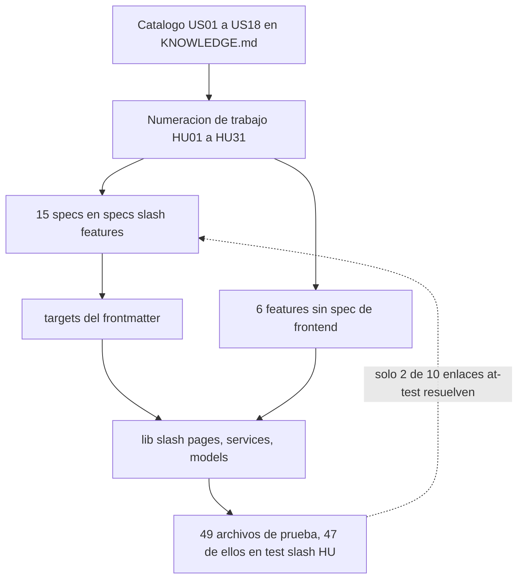

---

## 👤 Historias de usuario y criterios de aceptación

### Actores

El backend solo conoce cuatro roles técnicos. Todo lo demás son etiquetas que la app deriva.

| Actor | Rol técnico | Qué ve en la app | Cómo obtiene el rol |
|:---|:---|:---|:---|
| **Visitante** | ninguno | `/login`, `/forgot-password`, `/reset-password`. Nada más | Es el estado por defecto: sin JWT válido, `main.dart` arranca en `/login` |
| **Alumno** | `student` | 4 pestañas: Malla · Notas · Horario · Perfil. Banner de carga de ciclo, campana de alertas, burbuja de chatbot | Tiene al menos una `enrollment` con `status = 'active'`; el login lo verifica |
| **Delegado** | `delegate` | Lo del alumno más una 5.ª pestaña **Delegado**: sus secciones, estadísticas del salón y gestión de anuncios | El backend lo deriva de `section_representative`; el portal lo trae en la nómina de la sección. `UserModel.isDelegate` lo activa en el shell |
| **Subdelegado** | `subdelegate` | Idéntico al delegado: `isDelegate` cubre ambos | Igual que el delegado, con `position = 'subdelegate'` |
| **Profesor titular** | `teacher` | 5 pestañas: Secciones · **Calificar** · Horario · Asesorías · Perfil. Sin campana, sin chatbot, sin banner de portal | `app_user` vinculado a `teacher.user_id` y presente como `section.teacher_id`. La pestaña Calificar depende de `AuthService.canGrade` |
| **Jefe de práctica** | `teacher` | 4 pestañas: Secciones · Horario · Asesorías · Perfil. **Sin Calificar**, porque `GET /official-grades/teacher/sections` solo devuelve secciones de titular | Mismo rol técnico que el profesor; se distingue por aparecer como `section.jp_id`. No existe enum de tipo docente en la persona |

> **3 · El carnet de networking aplana los roles a propósito.** La vista previa muestra
> `Alumno`, `Docente` o `Jefe de Práctica`, y **delegado y subdelegado se presentan como
> `Alumno`** (`networking.spec.md:79-81`). Un carnet de contacto no es el lugar para publicar
> quién manda en la sección.

---

### Tabla maestra del backlog

Dos numeraciones conviven y **no son el mismo eje**: `US01`–`US18` es el backlog original del
curso (14 historias reales: no existen US08, US10, US11 ni US12) y `HU01`–`HU31` es la numeración
de trabajo del equipo, materializada como carpetas `test/HU##_<autor>/`. Contraejemplo verificado:
`US15` son las alertas, pero `HU15` es el perfil del alumno; las alertas son `HU08`.

La columna **Pruebas** cuenta casos declarados en el frontend (`test(` + `testWidgets(`).
`—` significa que la historia no tiene contraparte de prueba en esta app.

| HU | Título | Actor | Pantalla | Autor | Pruebas | Estado |
|:---|:---|:---|:---|:---|---:|:---|
| **HU01** | Iniciar sesión con código y contraseña | Alumno / Docente | `lib/pages/login` | jeff | 16 | Implementado |
| **HU02** | Cerrar sesión e invalidar el JWT | Alumno / Docente | `lib/pages/perfil`, `session_navigation.dart` | jeff | 5 | Implementado |
| HU03 | Visualizar la malla curricular interactiva | Alumno | `lib/pages/malla` | julio (backend) | — | Implementado; la cobertura de frontend está en HU19 |
| HU04 | Simular el estado visual de un curso | Alumno | `lib/pages/malla` | julio (backend) | — | Implementado; ídem HU19 |
| HU05 | Seleccionar especialidad principal y de interés | Alumno | `setup_carrera`, `perfil` | mel (backend) | — | Implementado; **sin prueba de frontend** |
| **HU06** | Registrar notas personales por evaluación | Alumno | `lib/pages/calculadora` | sam | 13 | Implementado |
| **HU07** | Visualizar el promedio ponderado del curso | Alumno | `lib/pages/calculadora` | sam | 6 | Implementado |
| HU08 | Alertas de riesgo académico y alta carga (US15) | Alumno | `lib/pages/alertas`, `home` | julio (backend) | — | Implementado; **sin prueba de frontend** |
| HU09 | Horario semanal y evaluaciones del ciclo | Alumno | `lib/pages/horario` | nehemias (backend) | — | Implementado; solo hay prueba de geometría en HU31 |
| **HU10** | Registrar, editar y eliminar anuncios como delegado | Delegado / Subdelegado | `lib/pages/delegado/delegado_anuncios` | mel | 12 | Implementado |
| HU11 | Estadísticas agregadas del salón (US18) | Delegado / Subdelegado | `lib/pages/delegado/delegado_cursos` | ronald (backend) | — | Implementado; **sin prueba de frontend** |
| HU12 | Ver los anuncios de la sección (US17) | Alumno | `descripcion_cursos` · tab Anuncios | — | — | Implementado; **inferida**, sin carpeta de prueba en ningún repo |
| HU13 | Ver las asesorías del curso (US13) | Alumno | `descripcion_cursos` · tab Asesorías | ronald (backend) | — | Implementado; el RSVP se prueba en HU17 |
| HU14 | Ver los contactos de la sección | Alumno | `descripcion_cursos` · tab Contactos | mel (backend) | — | Implementado; los delegados pendientes se prueban en HU31 |
| HU15 | Ver el perfil académico propio | Alumno | `lib/pages/perfil` | — | — | Implementado; **inferida** de comentarios en `perfil.dart:25,62,198` |
| HU16 | Iniciar sesión con Google SSO institucional | Alumno / Docente | `lib/pages/login` | jeff (backend) | — | Implementado; **sin prueba de frontend** |
| **HU17** | Confirmar y cancelar asistencia a una asesoría | Alumno | `asesoria_card.dart`, `asesoria_tab.dart` | ronald | 10 | Implementado |
| **HU18** | Rol docente: login y asesorías extra | Profesor / JP | `lib/pages/teacher/**` | jeff | 28 | Implementado **sin spec de frontend** |
| **HU19** | Malla móvil: filtros, progreso real y simulación | Alumno | `malla_list_page.dart`, `lib/domain/malla/**` | jeff | 46 | Implementado |
| **HU20** | Restablecer la contraseña con OTP | Alumno / Docente | `lib/pages/password_reset/**` | jeff | 17 | Implementado **sin spec** |
| **HU21** | Visor de sílabos PDF con zoom y compartir | Alumno | `lib/pages/silabo/**` | jeff | 43 | Implementado **sin spec** |
| **HU22** | Lista de alumnos impedidos por inasistencia | Docente | `at_risk_students_page.dart` | sam | 10 | Implementado **sin spec** |
| **HU23** | Chat en vivo por sección | Alumno / Docente | `lib/pages/chat/chat_page.dart` | jeff | 20 | Implementado; reglas RTDB pendientes de validar con Emulator |
| HU24 | Horario interactivo del docente | Docente | `teacher_home_page.dart`, `horario` | nehemias (backend) | — | Implementado; **sin prueba de frontend** |
| **HU25** | Carnet de networking opt-in | Alumno / Docente | `lib/pages/networking/**` | mel | 33 | Escenario 1 implementado |
| **HU26** | Exportar a CSV la lista de impedidos | Docente | `at_risk_students_page.dart` | sam | 7 | Implementado **sin spec**; sin endpoint, el CSV se arma en el cliente |
| HU27 | *(histórico)* Carnet de networking | — | — | — | — | **Renumerada a HU25**; el nombre sobrevive solo en issues viejos |
| HU28 | Chatbot académico "ULimaBot" | Alumno | `lib/pages/chatbot/**` | ronald (backend) | — | Implementado; **sin prueba de frontend** y con el índice desactualizado |
| HU29 | Calificación oficial por evaluación | Profesor titular | `teacher_grade_section_page.dart`, `mis_notas` | jeff (backend) | — | Implementado; **sin prueba de frontend** |
| HU30 | Notificar a los alumnos en riesgo por inasistencia | Docente | `at_risk_students_page.dart` | sam (backend) | — | Implementado; **sin prueba de frontend** |
| **HU31** | Cargar el ciclo desde el portal miUlima | Alumno | `lib/pages/portal_sync/**` | jeff | 52 | Implementado; verificación E2E manual pendiente |
| **HU_asistencia** | Asistencia real por sección y estado `sin_datos` | Alumno / Docente | `descrip_cursos.dart`, `at_risk_students_*` | jeff | 21 | Implementado. `sin_datos` existe en el backend desde RS-BE-15 |
| **HU32** | Foto de perfil sobre Cloudinary: subida, borrado y moderación | Alumno / Docente | `lib/components/avatar/**`, `avatar_service.dart` | jeff | 17 | Implementado y verificado en dispositivo el 2026-09-07 |

Once historias del backlog —HU03, HU04, HU05, HU08, HU09, HU11, HU16, HU24, HU28, HU29 y HU30—
**no tienen carpeta de prueba en esta app**: su cobertura vive entera en el backend. Dos más
(HU12, HU15) no tienen carpeta en ningún repositorio y su numeración es una inferencia
reconstruida a partir de comentarios del código.

---

### Fichas detalladas

Los criterios de aceptación de abajo salen de reglas escritas en las specs o en el código. Ninguno
está inventado; cada ficha cita su origen en la fila **Reglas**.

#### HU01 · Iniciar sesión con código y contraseña

**Como** alumno o docente de la Universidad de Lima, **quiero** entrar a ULima++ con mi código
institucional y mi contraseña, **para** ver mi información académica sin pasar por el portal web.

| | |
|:---|:---|
| **Pantalla** | [`lib/pages/login/login_page.dart`](lib/pages/login/login_page.dart) |
| **Services** | `AuthService.login` → `POST /auth/login`; `StorageService.saveToken`; `postLoginRoute` |
| **Reglas** | `BR-AUTH-F-01` (flujo y mensajes), `BR-AUTH-F-02` (clave `session_token`), `BR-AUTH-F-08` (estado de carga) |
| **Pruebas** | `test/HU01_jeff/login_error_mapping_test.dart`, `login_navigation_paths_test.dart`, `login_relogin_regression_test.dart` |

**Criterios de aceptación**

```gherkin
Escenario: Campos vacíos no llegan a la red
  Dado que dejo el código o la contraseña en blanco
  Cuando pulso "Entrar"
  Entonces la app muestra "Ingresa tu código y contraseña."
  Y no se envía ninguna petición al backend

Escenario: Login correcto de un alumno con setup terminado
  Dado que envío credenciales válidas
  Cuando el backend responde 200 con token y user
  Entonces el JWT se guarda en el almacenamiento seguro bajo la clave session_token
  Y el código del alumno NO se guarda junto al token
  Y la app navega a /home con offAllNamed

Escenario: Login correcto de un alumno sin especialidad configurada
  Dado que el user devuelto trae setupComplete en false
  Cuando termina el login
  Entonces la app navega a /setup-carrera y no a /home

Escenario: El docente entra directo aunque no tenga setup
  Dado que el user devuelto tiene isTeacher verdadero
  Cuando termina el login
  Entonces postLoginRoute devuelve /home sin mirar setupComplete

Escenario: Credenciales incorrectas no revelan si la cuenta existe
  Dado que el backend responde 401 USER_NOT_FOUND o 401 INVALID_PASSWORD
  Cuando la app traduce el error
  Entonces muestra exactamente "Código o contraseña incorrectos." en ambos casos

Escenario: Alumno sin matrícula activa
  Dado que el backend responde 403 NOT_ENROLLED
  Cuando la app traduce el error
  Entonces muestra "No tienes una matrícula activa."

Escenario: El botón se bloquea mientras la petición está en vuelo
  Dado que pulsé "Entrar" con datos completos
  Cuando la petición sigue en curso
  Entonces el botón muestra un indicador circular y está deshabilitado
```

---

#### HU02 · Cerrar sesión

**Como** usuario autenticado, **quiero** cerrar sesión y que la app olvide mi token,
**para** que nadie que tome mi teléfono siga dentro de mi cuenta.

| | |
|:---|:---|
| **Pantalla** | [`lib/pages/perfil/perfil.dart`](lib/pages/perfil/perfil.dart) |
| **Services** | `AuthService.logout` → `POST /auth/logout`; `StorageService.clearSession`; [`lib/services/session_navigation.dart`](lib/services/session_navigation.dart) |
| **Reglas** | `BR-AUTH-F-04` (logout best-effort, cierre definitivo), `BR-AUTH-F-07` (interceptor 401) |
| **Pruebas** | `test/HU02_jeff/session_navigation_guard_test.dart`, `user_cache_reset_test.dart` |

**Criterios de aceptación**

```gherkin
Escenario: El logout no depende de que el backend responda
  Dado que pulso "Cerrar sesión"
  Cuando POST /auth/logout falla o tarda
  Entonces la app igual limpia el token y los datos de StorageService
  Y navega a /login
  Porque el aviso al backend es best-effort y no bloquea la salida

Escenario: No hay re-autenticación automática
  Dado que cerré sesión
  Cuando vuelvo a abrir la app
  Entonces arranca en /login y no intenta restaurar la sesión anterior

Escenario: Toda salida de sesión pasa por un solo punto
  Dado cualquier camino que termina la sesión: botón de Perfil, interceptor 401 o reset de contraseña exitoso
  Cuando se navega al login
  Entonces se usa offAllToLogin, que no hace nada si ya estamos en /login o /LoginPage
  Y por eso no se apilan dos rutas de login ni aparece el "tipeo fantasma"

Escenario: Ningún archivo de lib navega al login por su cuenta
  Dado el árbol completo de lib
  Cuando se busca la expresión offAllNamed hacia /login
  Entonces solo aparece dentro de session_navigation.dart

Escenario: Las cachés por usuario se invalidan
  Dado que cierro sesión y entro con otra cuenta
  Cuando la app pide cursos, sílabos o simulación
  Entonces vuelve a consultarlos al backend en vez de servir la caché del usuario anterior
```

---

#### HU06 · Registrar notas personales por evaluación

**Como** alumno, **quiero** anotar mis propias notas por evaluación de cada curso,
**para** proyectar cómo voy sin esperar a que el profesor publique las oficiales.

| | |
|:---|:---|
| **Pantalla** | [`lib/pages/calculadora/calculadora_page.dart`](lib/pages/calculadora/calculadora_page.dart) + `AddNotaWithSyllabusModal` |
| **Services** | `CoursesService`, `EvaluationSyllabusService` → `GET /grades/me/courses`; `ApiClient` → `GET`/`POST /grades/me/notes`, `DELETE /grades/me/notes/:sectionId/:assessmentId` |
| **Reglas** | **R6** (rango 0 a 20), **R8** (pesos desde el sílabo); *"El frontend no realiza cálculos de promedio ni almacena notas localmente"* (`grades.spec.md` §UI Behavior) |
| **Pruebas** | `test/HU06_sam/calculadora_evaluaciones_unitaria_test.dart`, `notas_calculo_test.dart` |

**Criterios de aceptación**

```gherkin
Escenario: La nota debe estar en el rango del sistema peruano
  Dado que abro el modal de registrar nota
  Cuando escribo 25 y confirmo
  Entonces la app muestra "La nota debe estar entre 0 y 20"
  Y no se envía nada al backend

Escenario: La nota debe ser un número
  Dado que escribo "abc" en el campo de nota
  Cuando confirmo
  Entonces la app muestra "Ingresa un número válido"

Escenario: El campo no puede quedar vacío
  Dado que confirmo sin escribir nada
  Entonces la app muestra "La nota es requerida"

Escenario: Una evaluación ya registrada no se vuelve a ofrecer
  Dado que ya registré la evaluación PA de un curso
  Cuando vuelvo a abrir el modal de ese curso
  Entonces PA no aparece en el desplegable de evaluaciones disponibles

Escenario: Los pesos los manda el sílabo, no el alumno
  Dado un curso con sílabo cargado
  Cuando abro el modal
  Entonces cada evaluación ya trae su peso y el alumno no puede editarlo

Escenario: Curso sin sílabo
  Dado un curso donde hasSyllabusData es falso
  Cuando abro la tarjeta
  Entonces la app no ofrece evaluaciones y no revienta

Escenario: Eliminar la última nota deja la tarjeta vacía
  Dado un curso con una sola nota registrada
  Cuando la elimino
  Entonces la tarjeta vuelve a mostrar "No hay notas registradas" y el contador en 0
```

---

#### HU07 · Visualizar el promedio ponderado del curso

**Como** alumno, **quiero** ver el promedio ponderado del curso y cuánto peso llevo evaluado,
**para** saber en qué situación estoy antes del cierre del ciclo.

| | |
|:---|:---|
| **Pantalla** | `calculadora_page.dart` → `CursoCard` |
| **Services** | `ApiClient` → `POST /grades/me/calculate` |
| **Reglas** | **R9** (el promedio se actualiza tras cada cambio y **lo calcula el backend**); `lib/domain/notas/notas_calculo.dart` replica la fórmula solo para la vista |
| **Pruebas** | `test/HU07_sam/calculadora_flujo_cajanegra_test.dart`, `evaluation_component_cajanegra_test.dart` |

**Criterios de aceptación**

```gherkin
Escenario: El promedio se pide al backend
  Dado que registro o elimino una nota
  Cuando la tarjeta recalcula el promedio
  Entonces la app llama a POST /grades/me/calculate
  Y no guarda el resultado como fuente de verdad en el dispositivo

Escenario: Fórmula del promedio ponderado
  Dado un curso con las notas 12 al 30 por ciento, 16 al 50 por ciento y 8 al 20 por ciento
  Cuando se calcula el promedio
  Entonces el resultado es 13.2

Escenario: Sin notas el promedio es cero
  Dado un curso sin ninguna nota registrada
  Cuando se calcula el promedio
  Entonces el resultado es 0.0 y la tarjeta no muestra un valor inventado

Escenario: La barra de avance muestra el peso ya evaluado
  Dado que registré una única nota de peso 30
  Cuando miro la tarjeta del curso
  Entonces muestra "Suma de pesos: 30.0%" sobre 100 por ciento

Escenario: Un peso que llega como texto se normaliza
  Dado que el backend manda el peso como cadena decimal
  Cuando EvaluationComponent parsea el JSON
  Entonces el peso queda como double y el cálculo no se rompe

Escenario: Un peso no numérico no envenena el promedio
  Dado un componente cuyo peso no es un número
  Cuando se parsea
  Entonces el peso cae al valor seguro 0 en vez de lanzar
```

---

#### HU19 · Malla curricular con progreso real y simulación

**Como** alumno, **quiero** ver qué aprobé, qué tengo desbloqueado y poder simular
"¿y si apruebo esto?", **para** planificar mi matrícula sin tocar mis datos reales.

| | |
|:---|:---|
| **Pantalla** | [`lib/pages/malla/malla_list_page.dart`](lib/pages/malla/malla_list_page.dart) y [`lib/pages/malla/malla_page.dart`](lib/pages/malla/malla_page.dart) para `/malla-clasica` |
| **Services** | `MallaService` → `GET /curriculum/me`; `ApiClient` → `PUT`/`DELETE /curriculum/me/simulation`; lógica pura en [`lib/domain/malla/malla_logic.dart`](lib/domain/malla/malla_logic.dart) |
| **Reglas** | **R4**, **R5**, **R10**, **R11**, **R13**; *"La simulación de malla es visual y no debe confundirse con progreso real"* (`AGENTS.md:61`); `courseProgress` es la unión de `approvedLevels` y `approvedCourseIds`, donde `approvedLevels` **es piso y nunca techo** |
| **Pruebas** | `test/HU19_jeff/malla_logic_test.dart` (31 casos), `malla_desbloqueo_cajablanca_test.dart`, `course_node_fromjson_cajanegra_test.dart`, `malla_list_page_test.dart`, `course_detail_sheet_test.dart` |

**Criterios de aceptación**

```gherkin
Escenario: La grilla agrupa por ciclo y expone el estado de cada curso
  Dado que abro la pestaña Malla
  Cuando termina GET /curriculum/me
  Entonces los cursos aparecen agrupados por ciclo
  Y cada tarjeta muestra su estado actual

Escenario: Un curso se desbloquea solo con todos sus prerrequisitos
  Dado un curso con marcador de ciclo y prerrequisitos concretos
  Cuando isCourseUnlocked evalúa el conjunto de aprobados
  Entonces exige TODOS los obligatorios hasta ese ciclo
  Y además todos los prerrequisitos concretos

Escenario: Un prerrequisito que no existe en la malla bloquea para siempre
  Dado un curso cuyo prerrequisito no está en el grafo
  Cuando se evalúa satisfiesCoursePrerequisites
  Entonces devuelve falso y el curso queda bloqueado

Escenario: Los electivos no cuentan para el marcador de ciclo
  Dado un electivo aprobado de un nivel anterior
  Cuando se evalúa si el ciclo obligatorio está completo
  Entonces ese electivo se excluye del cálculo

Escenario: El progreso real pinta los completados
  Dado que el backend envía approvedLevels y approvedCourseIds
  Cuando la app calcula los cursos aprobados
  Entonces usa la UNIÓN de ambos campos
  Y un curso aprobado del propio ciclo del alumno también se pinta como completado

Escenario: Simular no toca los datos reales
  Dado que cambio el estado visual de un curso
  Cuando se guarda con PUT /curriculum/me/simulation
  Entonces no se modifica la matrícula, ni las notas, ni el progreso académico

Escenario: Revertir una simulación devuelve el estado derivado
  Dado un curso con simulación registrada
  Cuando la elimino con DELETE /curriculum/me/simulation
  Entonces el curso vuelve al estado que le corresponde por progreso real

Escenario: La vista mapa clásica es de solo lectura
  Dado que abro /malla-clasica
  Cuando se despliega el detalle de un curso con readOnly en verdadero
  Entonces el botón de cambiar estado no aparece, aunque se le pase el callback

Escenario: Rotación exclusiva de la vista clásica
  Dado que estoy en /malla-clasica
  Cuando giro el dispositivo
  Entonces la pantalla rota, conserva su título propio "Vista mapa (clásica)"
  Y oculta el resumen de progreso para maximizar el lienzo
```

---

#### HU10 · Anuncios de sección como delegado

**Como** delegado o subdelegado, **quiero** publicar, editar y eliminar anuncios de mi sección,
**para** comunicar avisos académicos dentro de la app.

| | |
|:---|:---|
| **Pantalla** | [`lib/pages/delegado/delegado_anuncios/delegado_anuncios_page.dart`](lib/pages/delegado/delegado_anuncios/delegado_anuncios_page.dart) y [`create_announcement_page.dart`](lib/pages/delegado/delegado_anuncios/create_announcement_page.dart) |
| **Services** | `DelegateAnnouncementService` → `GET`/`POST /section-management/sections/:id/announcements`, `PUT`/`DELETE /section-management/announcements/:id`; `SectionStatisticsService` |
| **Reglas** | **R17** (el delegado registra anuncios), **R18** (el alumno los ve), **R14** y **R21** (agregados sin notas individuales); *"Delegate-only actions are hidden from regular students"* |
| **Pruebas** | `test/HU10_mel/anuncios_cajablanca_test.dart`, `anuncios_cajanegra_test.dart`, `anuncios_unit_test.dart` |

**Criterios de aceptación**

```gherkin
Escenario: El formulario nunca envía el id de representante
  Dado que publico un anuncio desde la app
  Cuando se arma el body
  Entonces solo viajan el título y el mensaje
  Porque el backend deriva el representante desde el JWT y la sección

Escenario: Título vacío
  Dado que dejo el título en blanco
  Cuando pulso guardar
  Entonces la app muestra el error de campo obligatorio
  Y no llama al servicio

Escenario: Mensaje vacío
  Dado que dejo el mensaje en blanco
  Cuando pulso guardar
  Entonces ocurre lo mismo que con el título

Escenario: El formulario recorta espacios
  Dado un título y un mensaje rodeados de espacios
  Cuando se envían
  Entonces llegan recortados a la sección elegida

Escenario: Modo edición
  Dado que abro un anuncio existente
  Cuando guardo los cambios
  Entonces la app llama a update con el id del anuncio, no a create

Escenario: Un borrado que falla no altera la lista
  Dado que elimino un anuncio y el backend devuelve falso
  Cuando termina la operación
  Entonces la lista visible conserva el anuncio

Escenario: Las estadísticas son solo agregados
  Dado que abro la sección de estadísticas del salón
  Entonces veo promedio general, porcentaje de aprobados y el histograma por rangos
  Y no aparece ninguna nota atribuible a un compañero

Escenario: El alumno regular no ve nada de esto
  Dado que mi usuario no es delegado ni subdelegado
  Cuando se arma el shell
  Entonces la pestaña Delegado no existe en el footer
```

---

#### HU17 · Confirmar y cancelar asistencia a una asesoría

**Como** alumno, **quiero** confirmar si asistiré a una asesoría y poder retirar esa confirmación,
**para** que el docente sepa con cuántos alumnos contará.

| | |
|:---|:---|
| **Pantalla** | [`lib/pages/descripcion_cursos/asesoria_tab.dart`](lib/pages/descripcion_cursos/asesoria_tab.dart) con [`lib/components/descripcion_cursos/asesoria_card.dart`](lib/components/descripcion_cursos/asesoria_card.dart), pestaña 1 de `DescripCursosPage` |
| **Services** | `AsesoriaService` → `GET /advising/section/:sectionId`, `POST`/`DELETE /advising/:sessionId/rsvp` |
| **Reglas** | **R1**–**R7** de `advising-student.spec.md`: contador `N asistirán`, optimismo con reversión, idempotencia por `rsvpEnCurso`, 409 para asesorías pasadas, extras antes que recurrentes |
| **Pruebas** | `test/HU17_ronald/asesoria_rsvp_test.dart` |

**Criterios de aceptación**

```gherkin
Escenario: Confirmar asistencia se ve al instante
  Dado que la asesoría muestra "Asistiré" y el contador en N
  Cuando pulso el botón
  Entonces el contador sube a N más 1 antes de que responda el backend
  Y el botón pasa a estado confirmado con check

Escenario: El conteo autoritativo es el del backend
  Dado que la petición de RSVP respondió
  Cuando llega el conteo real
  Entonces la app reconcilia el valor optimista con el del backend

Escenario: Un fallo revierte el optimismo
  Dado que la petición de RSVP falla
  Cuando la app procesa el error
  Entonces el contador y el botón vuelven al estado anterior
  Y aparece el snackbar "No pudimos confirmar tu asistencia. Inténtalo de nuevo."

Escenario: Cancelar no baja de cero
  Dado un contador en 0 por desincronización
  Cuando cancelo mi asistencia
  Entonces el contador queda en 0 y nunca en negativo

Escenario: Doble tap ignorado
  Dado que ya hay una petición en curso para esa asesoría
  Cuando vuelvo a pulsar el botón
  Entonces el tap se ignora por la guarda rsvpEnCurso

Escenario: Asesoría ya pasada
  Dado que por desfase llega al listado una asesoría que ya ocurrió
  Cuando intento confirmar
  Entonces el backend responde 409 y el snackbar lo informa

Escenario: Orden de la pestaña
  Dado un curso con asesorías extra y recurrentes
  Cuando se renderiza la pestaña
  Entonces las extra aparecen primero y las recurrentes después

Escenario: Estados de la pestaña
  Dado que entro a la pestaña Asesorías
  Entonces veo tarjetas skeleton mientras carga
  Y un estado vacío si el curso no tiene asesorías
  Y la lista de tarjetas cuando hay datos
```

---

#### HU18 · Rol docente: profesor y jefe de práctica

**Como** docente de una sección, **quiero** entrar a la app y publicar asesorías extra,
**para** reforzar temas antes de las evaluaciones y saber cuántos alumnos asistirán.

| | |
|:---|:---|
| **Pantalla** | [`lib/pages/teacher/teacher_home_page.dart`](lib/pages/teacher/teacher_home_page.dart), [`create_advising_page.dart`](lib/pages/teacher/create_advising_page.dart), [`attendees_page.dart`](lib/pages/teacher/attendees_page.dart), [`teacher_sections_page.dart`](lib/pages/teacher/teacher_sections_page.dart) |
| **Services** | `AdvisingService` → `GET /advising/me/sections`, `GET`/`POST`/`DELETE /advising/me/sessions`, `GET /advising/me/sessions/:id/attendees`; `AuthService.canGrade` ← `GET /official-grades/teacher/sections` |
| **Reglas** | El shell docente se arma en [`lib/pages/home/home_shell_config.dart`](lib/pages/home/home_shell_config.dart); `canGrade` es `_profesorSectionIds.isNotEmpty`, poblado solo con secciones de titular. Validaciones del formulario en `lib/pages/teacher/advising_validators.dart` |
| **Pruebas** | `test/HU18_jeff/advising_validators_test.dart` (28 casos, 6 grupos) |

**Criterios de aceptación**

```gherkin
Escenario: El docente entra sin exigir matrícula
  Dado un usuario vinculado a un registro de docente
  Cuando inicia sesión
  Entonces recibe un JWT con rol teacher y sin studentId
  Y la app lo lleva a /home sin pasar por /setup-carrera

Escenario: El jefe de práctica no ve Calificar
  Dado un docente que solo figura como jefe de práctica de sus secciones
  Cuando se consulta el catálogo de secciones calificables y vuelve vacío
  Entonces canGrade es falso y la pestaña Calificar no se monta
  Y el índice de la pestaña Horario se recalcula en tiempo de ejecución

Escenario: Un fallo del catálogo no rompe el login docente
  Dado que la consulta de secciones calificables falla
  Cuando termina el arranque de sesión
  Entonces el conjunto queda vacío, canGrade es falso y la sesión sigue viva

Escenario: El docente no ve funciones de alumno
  Dado que estoy autenticado como docente
  Cuando se arma el encabezado
  Entonces no aparecen la campana de alertas ni el toggle de horario
  Y no se muestra el banner de carga de miUlima ni la burbuja del chatbot

Escenario: Validación del formulario de asesoría extra
  Dado el formulario de nueva asesoría
  Cuando dejo la sección sin elegir
  Entonces el error de sección se muestra antes que cualquier otro
  Y el orden de precedencia es sección, fecha, rango horario, ubicación y cupo

Escenario: Rango horario inválido
  Dado un rango donde el inicio no es menor que el fin, o donde la hora no existe
  Cuando valido el formulario
  Entonces el rango se rechaza

Escenario: Ubicación obligatoria según modalidad
  Dado modalidad presencial sin aula
  Entonces el formulario se rechaza
  Y lo mismo con modalidad virtual sin enlace
  Y la modalidad híbrida exige al menos uno de los dos

Escenario: Cupo opcional pero válido
  Dado un cupo vacío
  Entonces se acepta
  Y un cupo de 0, negativo o no numérico se rechaza

Escenario: Fecha en el pasado
  Dado que elijo una fecha anterior a hoy
  Entonces el formulario la rechaza antes de llamar al backend
```

---

#### HU20 · Restablecer la contraseña con OTP

**Como** usuario que olvidó su contraseña, **quiero** recibir un código de un solo uso en mi correo
institucional y poner una contraseña nueva, **para** recuperar el acceso sin pedirle nada a nadie.

| | |
|:---|:---|
| **Pantalla** | [`lib/pages/password_reset/forgot_password_page.dart`](lib/pages/password_reset/forgot_password_page.dart) y [`reset_password_page.dart`](lib/pages/password_reset/reset_password_page.dart) |
| **Services** | `PasswordResetService` → `POST /auth/password-reset/request`, `/confirm`, `/request-me` |
| **Reglas** | Constantes verificadas: `passwordResetCodeLength = 6`, `passwordResetMinPasswordLength = 8`, `resendCooldownSeconds = 60`. El éxito cierra la sesión y sale por `offAllToLogin()`. **Feature sin spec**: `feature-index.md:18` la declara "Implementado sin spec" |
| **Pruebas** | `test/HU20_jeff/password_reset_validators_test.dart` (17 casos, 4 grupos) |

**Criterios de aceptación**

```gherkin
Escenario: El código debe tener exactamente seis dígitos
  Dado que escribo un código de cinco o de siete dígitos
  Cuando valido el formulario
  Entonces se rechaza

Escenario: Se toleran espacios alrededor del código
  Dado un código de seis dígitos con espacios delante y detrás
  Cuando valido el formulario
  Entonces se acepta

Escenario: Código vacío
  Dado que no escribo nada en el campo del código
  Entonces la app muestra "Ingresa el código de verificación."

Escenario: Código no numérico
  Dado un código con letras
  Cuando valido
  Entonces se rechaza

Escenario: Longitud mínima de la contraseña nueva
  Dado que escribo una contraseña de exactamente ocho caracteres
  Entonces se acepta
  Y con siete o menos se rechaza

Escenario: Confirmación de contraseña
  Dado que la confirmación no coincide con la contraseña
  Entonces el formulario se rechaza

Escenario: Precedencia de errores
  Dado un formulario con el código y la contraseña mal a la vez
  Cuando valido
  Entonces se reporta primero el error del código, luego el de la contraseña y al final el de la confirmación

Escenario: Código inválido o expirado
  Dado que el backend responde 400 INVALID_RESET_CODE
  Cuando la app procesa el error
  Entonces muestra el mensaje del backend y devuelve al sub-paso del código

Escenario: Reenvío con enfriamiento
  Dado que acabo de pedir un código
  Cuando intento reenviarlo
  Entonces el botón queda bloqueado durante 60 segundos

Escenario: Cambiar la contraseña cierra la sesión
  Dado que el cambio se confirmó
  Cuando termina el flujo
  Entonces la app sale a /login por offAllToLogin, sin apilar rutas
```

---

#### HU21 · Visor de sílabo en PDF

**Como** alumno, **quiero** abrir el sílabo del curso dentro de la app, con zoom y opción de
compartirlo, **para** consultarlo sin salir a Drive ni pelearme con el navegador.

| | |
|:---|:---|
| **Pantalla** | [`lib/pages/silabo/silabo_viewer_page.dart`](lib/pages/silabo/silabo_viewer_page.dart), ruta `/silabo` con argumentos `{url, titulo}` |
| **Services** | `SilaboService` — descarga HTTP directa a Google Drive normalizada a `uc?export=download&id=<FILE_ID>`; `EvaluationSyllabusService` provee el `silaboUrl` |
| **Reglas** | Zoom acotado a **1x–5x**; tope de descarga **25 MB**; validación de firma `%PDF` = `[0x25,0x50,0x44,0x46]`; caché por `fileId` en `getTemporaryDirectory()`; nombre presentable recortado a 80 caracteres. **Feature sin spec** (`feature-index.md:19`) |
| **Pruebas** | `test/HU21_jeff/silabo_link_test.dart`, `silabo_service_test.dart` (17 casos), `silabo_viewer_page_test.dart`, `silabo_viewer_zoom_test.dart` |

**Criterios de aceptación**

```gherkin
Escenario: Se aceptan las tres formas de enlace de Drive
  Dado un enlace de tipo file barra d, o con open interrogación id, o con uc export download
  Cuando SilaboLink lo parsea
  Entonces extrae el mismo identificador de archivo
  Y construye la URL de descarga normalizada

Escenario: Enlace que no es de Drive
  Dado un enlace vacío, de otro dominio o sin identificador
  Cuando se abre el visor
  Entonces la app muestra "El enlace del sílabo no es válido para verlo dentro de la app."

Escenario: Drive devuelve la página de login en vez del PDF
  Dado que el archivo no es público y Drive responde 200 con HTML
  Cuando el service inspecciona el cuerpo
  Entonces detecta que no empieza con la firma PDF
  Y lanza el error de sílabo no accesible, ofreciendo "Abrir en Drive" como salida

Escenario: PDF demasiado grande
  Dado un cuerpo mayor a 25 MB
  Cuando termina la descarga
  Entonces se rechaza en vez de intentar renderizarlo

Escenario: Caché corrupta
  Dado un archivo cacheado que no empieza con la firma PDF
  Cuando se intenta reutilizar
  Entonces se descarta y se vuelve a descargar

Escenario: Reintentar ignora la caché
  Dado que la primera descarga falló
  Cuando pulso "Reintentar"
  Entonces el service fuerza la descarga en vez de servir lo cacheado

Escenario: Límites del zoom
  Dado el visor abierto
  Cuando hago zoom repetido
  Entonces la escala nunca baja de 1x ni supera 5x
  Y el punto del documento bajo el dedo no se desplaza

Escenario: Compartir usa un nombre legible
  Dado que comparto el sílabo
  Entonces el archivo sale con el nombre del curso, no con el identificador de Drive
  Y el botón de compartir está deshabilitado mientras carga y oculto si hubo error
```

---

#### HU22 · Lista de alumnos impedidos por inasistencia

**Como** docente de una sección, **quiero** ver quién está impedido o en riesgo por faltas,
**para** avisarle antes de que sea irreversible.

| | |
|:---|:---|
| **Pantalla** | [`lib/pages/teacher/at_risk_students_page.dart`](lib/pages/teacher/at_risk_students_page.dart) · controller [`at_risk_students_controller.dart`](lib/pages/teacher/at_risk_students_controller.dart) |
| **Services** | `AttendanceRiskService` → `GET /attendance-risk/sections/:id/attendance-risk`, `.../summary`, `POST .../notify` ([`attendance_risk_service.dart`](lib/services/attendance_risk_service.dart)`:13-39`) |
| **Modelo** | `AtRiskStudent` — `isImpedido`, `isEnRiesgo`, `isNormal`, `isSinDatos`, `statusLabel` ([`at_risk_student_model.dart`](lib/models/at_risk_student_model.dart)`:28-44`) |
| **Reglas** | **Sin spec de frontend.** El umbral lo calcula el backend —35 % si `cycle >= 6`, 25 % en otro caso (`attendance-risk.service.ts:164`)— y la app solo presenta el `status` recibido. Notificar es exclusivo del **Profesor titular**: `isProfesor` oculta el botón al JP (`at_risk_students_page.dart:13-15,77`) |
| **Estados** | Excepción documentada a la norma de esqueletos: esta pantalla usa `CircularProgressIndicator` centrado (`at_risk_students_page.dart:191`), no `SkeletonCardList`. Error y vacío sí están separados (`:197-212`) |
| **Pruebas** | [`test/HU22_sam/at_risk_student_model_unitaria_test.dart`](test/HU22_sam) 6 casos y [`test/HU22_sam/impedidos_page_cajanegra_test.dart`](test/HU22_sam) 4 casos — **10** |

**Criterios de aceptación**

```gherkin
Escenario: Listado con los cuatro estados
  Dado que el backend devuelve alumnos con status impedido, en_riesgo, normal y sin_datos
  Cuando abro la pantalla de alumnos en riesgo
  Entonces cada alumno se pinta con su statusLabel y su color
  Y quien viene con sin_datos nunca muestra un porcentaje inventado

Escenario: Filtro por estado
  Dado el listado completo cargado
  Cuando selecciono el filtro Impedido
  Entonces solo quedan los alumnos con isImpedido en true

Escenario: Búsqueda por código o apellido
  Dado el listado completo cargado
  Cuando escribo un texto en el buscador
  Entonces se conservan los alumnos cuyo code o cuyo lastName lo contienen, sin distinguir mayúsculas

Escenario: El orden deja al final a los que no tienen dato
  Dado que ordeno por porcentaje de ausencia
  Entonces los alumnos sin porcentaje medido quedan siempre al final de la lista

Escenario: Un fallo de red no se confunde con una sección vacía
  Dado que la consulta de alumnos en riesgo falla
  Cuando la lista está vacía
  Entonces se muestra ErrorRetry con No se pudo cargar la lista de alumnos y botón de reintento
  Y NO se muestra No se encontraron alumnos

Escenario: El jefe de práctica no puede notificar
  Dado que entro con isProfesor en false
  Entonces el botón Notificar alumnos en riesgo no se dibuja
  Y el botón Exportar CSV sí, porque exportar no es una acción sobre el alumno

Escenario: Notificar sin nadie a quien notificar
  Dado que impedidoCount más enRiesgoCount es 0
  Cuando pulso Notificar alumnos en riesgo
  Entonces sale el aviso No hay alumnos impedidos o en riesgo para notificar
  Y no se llama al endpoint de notificación
```

---

#### HU23 · Chat en vivo por sección

**Como** integrante de una sección, **quiero** un chat grupal con mis compañeros, el profesor y el
jefe de práctica, **para** coordinar dentro de la app sin depender de WhatsApp.

| | |
|:---|:---|
| **Pantalla** | [`lib/pages/chat/chat_page.dart`](lib/pages/chat/chat_page.dart), abierta desde "Mis chats" del alumno o desde Secciones del docente |
| **Services** | `ChatRepository` → `POST /chat/token`, stream de Firebase RTDB con `limitToLast(80)`, `DELETE /chat/sections/:sectionId/messages/:messageId`; `NetworkingService` para el carnet compartido |
| **Reglas** | El backend es el único que escribe la membresía; las reglas de `database.rules.json` hacen el hilo **append-only** y validan campo a campo contra el nodo de membresía. Pesos de rol: profesor 100, JP 90, delegado 70, subdelegado 60, alumno 10. **Feature sin spec de frontend** |
| **Pruebas** | `test/HU23_jeff/chat_message_test.dart` (11 casos), `chat_page_test.dart` (9 casos) |

**Criterios de aceptación**

```gherkin
Escenario: Conectar al chat
  Dado que abro el chat de una sección donde participo
  Cuando la app pide el token al backend y se autentica en Firebase
  Entonces muestra un indicador mientras conecta y luego los mensajes

Escenario: El chat no está disponible
  Dado que la conexión falla o supera los 8 segundos
  Cuando termina el intento
  Entonces la app muestra el estado de chat no disponible en vez de una pantalla en blanco

Escenario: No se envían mensajes vacíos
  Dado que el campo de texto está vacío
  Cuando pulso enviar
  Entonces no se envía nada

Escenario: Enviar limpia el campo
  Dado que escribo y envío un mensaje
  Entonces el campo queda vacío y el mensaje aparece en el hilo

Escenario: Un rol desconocido no se convierte en moderador
  Dado un mensaje cuyo rol no está en el catálogo
  Cuando se parsea
  Entonces cae a alumno, con peso 10 y sin moderación

Escenario: La bandera explícita de moderador manda
  Dado un mensaje con rol de alumno pero con la marca de moderador en verdadero
  Cuando se parsea
  Entonces se respeta la marca

Escenario: Compatibilidad con el esquema viejo
  Dado un mensaje guardado con los campos antiguos de texto y marca de tiempo
  Cuando se parsea
  Entonces se lee igual que uno del esquema nuevo

Escenario: Borrado suave con lápida
  Dado un mensaje que el profesor titular eliminó
  Cuando se renderiza el hilo
  Entonces la burbuja muestra la lápida con quién lo eliminó
  Y el cuerpo original queda oculto

Escenario: Compartir el carnet exige tenerlo visible
  Dado que mi carnet de networking está oculto
  Cuando intento enviarlo al chat
  Entonces la app pide activar la opción de mostrar el carnet antes de enviarlo
```

---

#### HU25 · Carnet de networking opt-in

**Como** alumno o docente, **quiero** activar un carnet opcional con una red social,
**para** compartir un medio de contacto dentro de la app sin publicar mis datos por defecto.

| | |
|:---|:---|
| **Pantalla** | [`lib/pages/networking/networking_page.dart`](lib/pages/networking/networking_page.dart), ruta `/networking` desde la tarjeta "Carnet de networking" del Perfil |
| **Services** | `NetworkingService` → `GET /networking/me`, `PUT /networking/me`; `networking_link_launcher.dart` |
| **Reglas** | `BR-NET-F-01` el backend es autoritativo, `BR-NET-F-02` máximo un enlace, `BR-NET-F-03` apertura defensiva. Plataformas: `linkedin`, `instagram`, `github`, `x`, `website`, `other`. La vista previa rotula `Alumno`, `Docente` o `Jefe de Práctica`; delegado y subdelegado se presentan como `Alumno` |
| **Pruebas** | `test/HU25_mel/` — 8 archivos, 33 casos: `networking_cajablanca_test.dart`, `networking_cajanegra_test.dart`, `networking_controller_test.dart`, `networking_service_test.dart`, `networking_model_test.dart`, `networking_unit_test.dart`, `networking_validators_test.dart`, `networking_card_preview_test.dart` |

**Criterios de aceptación**

```gherkin
Escenario: El cliente no decide permisos
  Dado cualquier borrador del carnet
  Cuando pulso "Guardar cambios"
  Entonces la app envía todo a PUT /networking/me
  Y presenta la respuesta del backend sin bloquear la escritura por su cuenta

Escenario: Máximo una red
  Dado que ya tengo un enlace guardado
  Cuando guardo otro
  Entonces el anterior se reemplaza
  Y una respuesta con más de un enlace se rechaza al parsearla

Escenario: Ocultar el carnet no borra el enlace
  Dado que apago el interruptor de visibilidad
  Cuando guardo
  Entonces el enlace sigue en el formulario y se reenvía al backend
  Porque ocultar y borrar son acciones distintas

Escenario: Quitar la red conserva la visibilidad
  Dado que pulso quitar la red
  Cuando guardo
  Entonces se envía la lista de enlaces vacía y el interruptor no cambia

Escenario: Solo se abre lo que el backend confirmó
  Dado un borrador de enlace todavía sin guardar
  Cuando pulso "Abrir enlace"
  Entonces no se lanza nada, porque solo se abre una URL hidratada por el backend

Escenario: Apertura defensiva
  Dado un enlace persistido
  Cuando la app va a abrirlo
  Entonces comprueba que sea una URI absoluta http o https
  Y lo abre fuera de la aplicación

Escenario: Validación del campo de enlace
  Dado un campo vacío
  Entonces la app muestra "Ingresa el enlace de tu red."
  Y ante un enlace relativo, texto suelto o un esquema que no sea http o https
  Muestra "Ingresa un enlace completo que empiece con http:// o https://."

Escenario: Guardar no se habilita sin cambios
  Dado que abro el carnet y no toco nada
  Entonces el botón de guardar permanece inactivo

Escenario: Estado de guardado
  Dado que pulso guardar
  Cuando la petición está en curso
  Entonces el botón queda bloqueado con indicador
  Y al terminar la vista se hidrata con la respuesta del backend

Escenario: Un fallo conserva el borrador
  Dado que el guardado falla
  Entonces se muestra el mensaje de la excepción del backend
  Y lo que escribí no se pierde
```

---

#### HU31 · Cargar el ciclo desde el portal miUlima

**Como** alumno, **quiero** importar desde miUlima mis cursos, secciones, horario, matrícula y
avance oficial al empezar el ciclo, **para** no digitarlos y poder repetir la carga sin perder mis
notas personales ni mi simulación de malla.

| | |
|:---|:---|
| **Pantalla** | [`lib/pages/portal_sync/portal_sync_page.dart`](lib/pages/portal_sync/portal_sync_page.dart), ruta `/portal-sync` con `PortalSyncBinding`; banner en [`lib/pages/home/home_page.dart`](lib/pages/home/home_page.dart) y opción "Actualizar desde miUlima" en el Perfil |
| **Services** | `PortalSyncService` → `GET /portal-sync/status` (timeout 15 s), `POST /portal-sync/import` (timeout 90 s); `AuthService.refreshCurrentUser` y las cachés de `CoursesService` y `EvaluationSyllabusService` tras importar |
| **Reglas** | `RS-FE-1`…`RS-FE-6` y `BR-SYNC-F-01`…`BR-SYNC-F-07`. Una sola pantalla con tres `PortalSyncStep` (formulario, cargando, resumen), **no tres rutas**. La contraseña vive solo en el `TextEditingController`. El código del authenticator acepta 6 a 8 dígitos. **Riesgo aceptado y escrito en la spec**: la contraseña pasa por la app y por el backend |
| **Pruebas** | `test/HU31_jeff/portal_sync_test.dart` (13 casos), más `delegados_pendientes_test.dart`, `course_colors_test.dart` y `horario_geometria_test.dart` en la misma carpeta |

**Criterios de aceptación**

```gherkin
Escenario: La app propone importar cuando hace falta
  Dado que entro a /home como alumno
  Cuando GET /portal-sync/status devuelve que necesito importar
  Entonces aparece el banner con las acciones "Cargar ahora" y "Después"

Escenario: El texto del banner tolera que no haya período activo
  Dado que el período activo llega nulo
  Entonces el banner dice "Carga tus datos del ciclo desde miUlima" sin el código

Escenario: Después no es para siempre
  Dado que pulso "Después"
  Entonces el banner se oculta solo hasta el próximo arranque
  Porque la decisión se guarda en memoria y no en preferencias

Escenario: Un fallo del estado no bloquea el Home
  Dado que GET /portal-sync/status falla
  Cuando se arma la pantalla
  Entonces el banner simplemente no se muestra y el Home funciona igual

Escenario: El docente nunca ve nada de esto
  Dado que estoy autenticado como docente
  Entonces ni el banner ni la opción del Perfil existen

Escenario: Consentimiento antes de pedir credenciales
  Dado que pulso "Cargar ahora"
  Entonces la app enumera qué se importará y con qué finalidad
  Y sin aceptación explícita no avanza

Escenario: La app no pide el usuario del portal
  Dado el formulario de credenciales
  Entonces solo pide contraseña y código del authenticator
  Porque el backend obtiene el código del alumno desde el JWT

Escenario: La contraseña no se guarda en ningún lado
  Dado que envío el formulario
  Entonces la contraseña se limpia apenas se usa, con éxito o con fallo
  Y se vuelve a limpiar al cerrar el controller

Escenario: La pantalla de carga dice cuánto tarda
  Dado que la importación está en curso
  Entonces la app anuncia que la operación toma entre 30 y 50 segundos

Escenario: Cada error del portal tiene su propio mensaje
  Dado que el backend responde 409 PORTAL_SESSION_INVALID
  Entonces la app dice que la sesión de miUlima expiró
  Y ante 403 PORTAL_IDENTITY_MISMATCH dice que esa cuenta no corresponde al usuario, sin ofrecer reintento
  Y ante 422 PORTAL_IDENTITY_UNVERIFIABLE dice que no se pudo confirmar la identidad
  Y ante 502 o 504 dice que miUlima no responde

Escenario: Un fallo del portal no cierra mi sesión de ULima++
  Dado que la sesión del portal es inválida
  Cuando el backend responde 409 en vez de 401
  Entonces el interceptor del ApiClient no se dispara
  Y sigo autenticado en la app

Escenario: La app se refresca en orden después de importar
  Dado que la importación terminó bien
  Entonces se recarga el usuario con GET /auth/me
  Luego se invalidan las cachés de cursos y sílabos
  Y por último se recargan los controllers que estén registrados

Escenario: Repetir la carga desde el Perfil
  Dado que ya importé este ciclo
  Cuando entro a "Actualizar desde miUlima"
  Entonces paso por el mismo consentimiento y veo el período activo
  Y no se muestra una fecha de última carga, porque el backend no la persiste
```

---

> **4 · Qué no está cubierto por estos criterios.** Solo la spec de `release-build` tiene un bloque
> titulado `Acceptance Criteria`; doce usan `## Verification`, `chatbot.spec.md:157` lo escribe
> `## Verificacion` y `auth.spec.md` no tiene ninguno de los dos —cierra en `## Test Links` (`:244`)—,
> y en cuatro casos —curriculum,
> course-detail, alerts y section-management— esa sección es un único bullet del tipo
> *"Add linked tests for…"*, es decir una tarea pendiente y no un criterio verificable. De los
> 10 enlaces `[@test]` que declaran las specs, **solo 2 resuelven a archivos que existen**
> (`platform-runtime` y `app-shell`); los otros 8 apuntan a `test/HU06_aurelio/`,
> `test/HU07_aurelio/` y a rutas raíz `test/networking_*.dart` que quedaron obsoletas cuando las
> carpetas se uniformaron a `HU##_<autor>`.

---

## 🧪 Pruebas y calidad

**49 archivos de prueba, 6 567 líneas, 358 casos declarados** — 299 `test(` y 59 `testWidgets(`.
Todo corre en la VM de Dart con `flutter test`: no hay emulador, no hay dispositivo, no hay
red. Los widget tests renderizan el árbol real en el binding de prueba de Flutter; los tests
de servicio usan `MockClient` de `package:http/testing` y dobles escritos a mano.

| Métrica | Valor |
|:---|---:|
| Archivos `*_test.dart` | 46 |
| Líneas de prueba | 6 567 |
| Casos totales | 336 |
| `test(` | 287 |
| `testWidgets(` | 49 |
| Archivos con al menos un widget test | 14 |
| Carpetas bajo `test/` | 18 |
| Pruebas de integración, goldens, cobertura medida | 0 |

La proporción es **6 567 líneas de prueba contra 30 217 de `lib/`**: aproximadamente una línea
de prueba por cada 4,7 de producción. No es cobertura medida —nadie corre `--coverage` en este
repo— pero sí es la superficie real.

---

### La convención: `test/HU<nn>_<autor>/`

Cada archivo de prueba vive en una carpeta que lo ata **a una historia de usuario y a una
persona**. El patrón es:

```
test/HU<nn>_<autor>/<sujeto>_[<tipo>_]test.dart
     │     │         │         │
     │     │         │         └── sufijo tipológico opcional: cajanegra, cajablanca, unitaria
     │     │         └──────────── unidad bajo prueba: login_error_mapping, export_csv, malla_desbloqueo
     │     └────────────────────── alias del dueño de la historia: jeff, sam, mel, ronald
     └──────────────────────────── número de historia: HU01 … HU31
```

El motivo es de trazabilidad de curso: al abrir `test/` se ve de un vistazo quién respondía por
qué historia y si esa historia tiene pruebas. El precio es que la carpeta **no** clasifica por
capa de arquitectura, así que un mismo sujeto (`AtRiskStudent`) aparece en dos carpetas distintas.

Dos aclaraciones honestas sobre la convención:

> **1 · El sufijo `_<autor>` marca al dueño de la historia, no a quien commiteó.** En
> `git log`, `test/HU17_ronald/` fue commiteado por jeff. La carpeta dice de quién es la
> historia; el historial dice de quién es el código.

> **2 · Dos carpetas rompen el patrón a propósito.** `test/components/header/` y
> `test/services/` agrupan por capa de `lib/`, no por historia, porque prueban infraestructura
> transversal (el `AppHeader` y el `ApiClient`) que no pertenece a ninguna HU. Son, además, las
> dos únicas enlazadas correctamente desde una spec con `[@test]`.

#### Qué significa cada sufijo en un proyecto Flutter

| Sufijo | Tipo | Qué es exactamente aquí | Archivos |
|:---|:---|:---|---:|
| `_cajanegra_test.dart` | **Caja negra** | Casos derivados del contrato o del requisito, nunca del código. Nomenclatura `CV1/CV2` para clases válidas, `CNV1/CNV2` para inválidas, o `CN1..CNn`. El header del archivo lleva la tabla de particiones de equivalencia y valores límite, y justifica la rúbrica de «más de cuatro campos de entrada». | 7 |
| `_cajablanca_test.dart` | **Caja blanca** | Un caso por camino independiente del grafo de decisión, nombrados `C1..Cn`. El header enumera los puntos de decisión `P1..Pn` y declara V(G) cuando aplica — `malla_desbloqueo_cajablanca_test.dart` declara V(G) ≈ 6 y escribe 7 casos. | 3 |
| `_unitaria_test.dart` · `_unit_test.dart` | **Unitaria explícita** | Un método o un modelo puro, sin red, sin GetX, sin árbol de widgets. El `group(...)` empieza literalmente con `UNITARIA · `. Conviven las dos ortografías: `unitaria` en HU06/HU22, `unit` en HU10/HU25. | 4 |
| *(sin sufijo tipológico)* | **Mixto** | El resto. El tipo se infiere del sujeto (`_validators_`, `_model_`, `_service_`, `_controller_`, `_page_`, `_guard_`, `_regression_`) y de si usa `test()` o `testWidgets()`. | 32 |

Y transversal a todos los anteriores, la distinción que de verdad importa en Flutter:

- **Unit test** (`test(...)`) — corre en la VM de Dart sin binding de Flutter. Aquí cubre lógica
  de dominio pura, `fromJson` de modelos, validadores de formulario y servicios con dobles.
  287 casos en 32 archivos.
- **Widget test** (`testWidgets(...)` + `WidgetTester`) — monta un árbol real con
  `tester.pumpWidget`, bombea frames y consulta por texto o por semántica. No abre ventana ni
  toca canales nativos: los que necesitan plataforma (`pdfx`, `path_provider`, `share_plus`,
  FlutterFire) van con doble. Cuando hay GetX se activa `Get.testMode = true` en `setUp` y
  `Get.reset()` en `tearDown`. 49 casos en 14 archivos.
- **Guarda estática** — un caso raro y útil:
  [`test/HU02_jeff/session_navigation_guard_test.dart`](test/HU02_jeff/session_navigation_guard_test.dart)
  no prueba comportamiento, recorre `Directory('lib').listSync(recursive: true)` y **falla si
  algún `.dart` distinto de `session_navigation.dart` contiene la regex
  `offAll(Named)?\(\s*['"]/login['"]`**. Es una regla de arquitectura convertida en test.

No hay pruebas de integración (`integration_test/` no existe), no hay golden tests y no hay
mocks generados: **no están `mockito`, `mocktail` ni `build_runner` en `pubspec.yaml`**. Todos
los dobles son fakes escritos a mano con `extends` o `implements`, más `MockClient`,
`PathProviderPlatform` y `SharePlatform`.

---

### La matriz completa

| Carpeta | Historia | Autor | Archivos | Casos | Tipos | Qué cubre |
|:---|:---|:---|---:|---:|:---|:---|
| [`test/HU01_jeff/`](test/HU01_jeff) | HU01 / US01 — Iniciar sesión | jeff | 3 | 16 | Unitaria + Widget | Mapeo de código de error del backend a mensaje de usuario (`USER_NOT_FOUND` e `INVALID_PASSWORD` devuelven **el mismo** texto genérico, para no revelar si la cuenta existe); 10 caminos de navegación a `/login` contra el bug de «tipeo fantasma»; regresión de doble navegación tras logout |
| [`test/HU02_jeff/`](test/HU02_jeff) | HU02 / US02 — Cerrar sesión | jeff | 2 | 5 | Guarda estática + Unitaria | Que ningún archivo de `lib/` navegue a `/login` fuera de `session_navigation.dart`; invalidación de cachés de cursos, sílabos y simulación en `logout()` y al cambiar de cuenta |
| [`test/HU06_sam/`](test/HU06_sam) | HU06 / US06 — Registrar notas personales | sam | 2 | 13 | Unitaria | `CalculadoraController` no vuelve a ofrecer una evaluación ya registrada; `calcularPromedioPonderado` y `sumaDePesos` de [`lib/domain/notas/notas_calculo.dart`](lib/domain/notas/notas_calculo.dart) |
| [`test/HU07_sam/`](test/HU07_sam) | HU07 / US07 — Promedio por curso | sam | 2 | 6 | Caja negra (una de widget) | Flujo completo de la calculadora solo por entradas y salidas visibles: nota vacía, `abc`, `25` fuera de rango, `15` válida → promedio `4.50` y «Suma de pesos: 30.0%», eliminar; `EvaluationComponent.fromJson/toMap` con 5 campos |
| [`test/HU10_mel/`](test/HU10_mel) | HU10 — Gestión de anuncios (delegado) | mel | 3 | 12 | Caja blanca + Caja negra + Unitaria | Caminos C1–C4 de `DelegadoAnunciosController` (fetch OK y error, delete true y false); `CreateAnnouncementController.submit()` con título o mensaje vacío y modo crear/editar; `Anuncio.fromJson`, `copyWith`, `CursoDelegado.rolTexto` |
| [`test/HU17_ronald/`](test/HU17_ronald) | HU17 — RSVP de asesorías (alumno) | ronald | 1 | 10 | Unitaria + Widget | `Asesoria.fromJson` con `myRsvp` ausente ⇒ `false`; `toggleRsvp` optimista que reconcilia con el conteo del backend, no baja de 0, ignora taps con request en curso y hace rollback ante error; botón RSVP de `CardAsesoria` en sus tres estados |
| [`test/HU18_jeff/`](test/HU18_jeff) | HU18 — Asesorías extra (docente) | jeff | 1 | 28 | Caja negra por campo + Unitaria | Los validadores de [`lib/pages/teacher/advising_validators.dart`](lib/pages/teacher/advising_validators.dart): sección, fecha pasada/hoy/futura, rango horario (`25:00` inválido, inicio ≥ fin), ubicación según modalidad presencial/virtual/híbrida, cupo, y la precedencia de errores del formulario |
| [`test/HU19_jeff/`](test/HU19_jeff) | HU19 / US03-US04 — Malla curricular | jeff | 6 | 55 | Unitaria + Caja blanca + Caja negra + Widget | La carpeta más grande. Lógica de dominio pura de la malla: prerrequisitos simples y «N de M», marcadores `_V_CICLO_`, `computeStatuses`, cascadas de simulación con convergencia ante prerrequisitos circulares, `nextCycleStatus`; 7 caminos de `isCourseUnlocked`; `CourseNode.fromJson` con 10 campos; repintado on-demand de cards; `readOnly` del bottom sheet |
| [`test/HU20_jeff/`](test/HU20_jeff) | HU20 — Restablecer contraseña | jeff | 1 | 17 | Unitaria | `validateResetCode` (6 dígitos, tolera espacios, rechaza <6, >6 y no numéricos), `validateNewPassword` (mínimo 8), `validatePasswordConfirmation` y la precedencia código → contraseña → confirmación |
| [`test/HU21_jeff/`](test/HU21_jeff) | HU21 — Visor de sílabo | jeff | 4 | 43 | Unitaria + Widget + Servicio | Parsing de las tres formas de enlace de Drive y sus inválidos; `SilaboService` con `MockClient` (firma `%PDF`, HTML de login → no accesible, 404, error de red, cuerpo > 25 MB, caché corrupta, nombre presentable recortado a 80 caracteres); estados de la ruta `/silabo`; `calcularMatrizZoom` con límites 1x–5x |
| [`test/HU22_sam/`](test/HU22_sam) | HU22 — Lista de alumnos impedidos | sam | 2 | 10 | Unitaria + Caja negra de widget | `AtRiskStudent.fromJson` y `statusLabel` por partición (`impedido`, `en_riesgo` con y sin faltas, `normal`, desconocido); CN1–CN4 de la página: listado de 3 alumnos, filtro «Impedidos», búsqueda con y sin resultados |
| [`test/HU23_jeff/`](test/HU23_jeff) | HU23 — Chat de sección | jeff | 2 | 20 | Unitaria + Widget | `ChatMessage.fromMap` con el esquema nuevo y el legado `text`/`timestamp`, carnet de networking, flag `moderator` explícito por encima del rol, rol desconocido → peso 10, orden cronológico, borrado suave; `ChatPage` con repo falso: spinner, error de conexión, sesión vacía, envío, no envía vacíos, lápida del mensaje borrado |
| [`test/HU25_mel/`](test/HU25_mel) | HU25 — Carnet de networking | mel | 8 | 33 | Caja blanca + Caja negra + Unitaria + Widget + Servicio | La carpeta con más archivos. Caminos C1–C5 de `NetworkingController`; `NetworkingCardDto` con 5 campos y el **límite duro de una sola red**; contrato exacto `GET /networking/me` y `PUT /networking/me`; `validateNetworkingUrl` (http/https sí, relativo y `ftp://` no); preview sin errores de flex; roles de carnet que no exponen roles académicos |
| [`test/HU26_sam/`](test/HU26_sam) | HU26 — Exportar impedidos a CSV | sam | 1 | 7 | Caja negra | `AttendanceRiskService.exportCsv()` con el CSV generado de verdad y solo la plataforma doblada: nombre `Ausencias_<Curso>_S<sección>.csv`, encabezado exacto de 8 columnas, `ciclo` null → columna vacía y nunca el literal `null`, porcentaje siempre a un decimal, saneo del nombre del curso |
| [`test/HU31_jeff/`](test/HU31_jeff) | HU31 — sin historia documentada: horario, colores, contactos, portal-sync | jeff | 4 | 43 | Unitaria + Widget | Geometría de bloques del horario (`hourHeight = 85`, `vertLineOffset = 9`, sin solapamiento, bloque degenerado que no se vuelve negativo); paleta de al menos 9 colores sin repetidos y desempate de `asignarColoresSinRepetir`; delegados que miUlima publica pero aún no usan la app, con la regresión de producción del 2026-09-04; validadores, `import` y `status` de `PortalSyncService` |
| [`test/HU_asistencia/`](test/HU_asistencia) | Asistencia — RS-BE-10 y RS-BE-16, sin numeración HU | **sin determinar** | 2 | 16 | Unitaria | `AtRiskStudent` con `status: "sin_datos"` y `absencePercentage: null` que antes llegaba como `normal` al 0 % y se pintaba de verde; `Seccion.porcentajeAsistencia` sin NaN y calculado sobre las horas **transcurridas**, no sobre el ciclo entero |
| [`test/components/header/`](test/components/header) | Feature `app-shell` | jeff | 1 | 1 | Widget | `AppHeader` con `linkLauncher` inyectado: pulsar «ULIMA++» invoca el launcher exactamente una vez con la URI esperada y expone el semantics label correspondiente |
| [`test/services/`](test/services) | Feature `platform-runtime` | jeff | 1 | 1 | Unitaria | `ApiClient` normaliza `API_BASE_URL` quitando el slash final. 12 líneas, un caso, y es el guardián de la única variable de configuración de la app |
| **TOTAL** | | | **49** | **358** | | **6 567 líneas** |

> **3 · `test/HU_asistencia/` no está versionada.** `git status` la reporta como `?? test/HU_asistencia/`.
> Sus 2 archivos y 16 casos existen en el árbol de trabajo pero no en el historial: no tienen
> autoría en `git log` y se pierden si alguien limpia el workspace. Cubren dos bugs reales de
> producción, así que conviene commitearlos antes que cualquier otra cosa.

---

### Conteo por tipo

| Clasificación | Archivos | Casos | Detalle |
|:---|---:|---:|:---|
| Caja negra (sufijo explícito) | 7 | 29 | HU07 ×2, HU10, HU19, HU22, HU25, HU26 |
| Caja blanca (sufijo explícito) | 3 | 16 | HU10, HU19, HU25 |
| Unitaria (sufijo explícito) | 4 | 19 | HU06, HU10, HU22, HU25 |
| Sin sufijo tipológico | 32 | 272 | dominio, validadores, servicios con dobles, widgets, guardas |
| *Transversal* — con `testWidgets` | 14 | 49 | widget tests |
| *Transversal* — solo `test()` | 32 | 287 | unitarias, dominio y servicio |
| **TOTAL** | **46** | **336** | |

Las dos últimas filas cruzan a las cuatro primeras: un archivo `_cajanegra_test.dart` puede estar
lleno de `testWidgets` (`impedidos_page_cajanegra_test.dart`) o no tener ninguno
(`export_csv_cajanegra_test.dart`). El sufijo declara **cómo se derivaron los casos**; el uso de
`testWidgets` declara **qué se monta para ejecutarlos**.

---

### Qué se prueba de verdad

Cuatro bloques concentran casi todo:

**1. Lógica de dominio pura.** Es lo mejor cubierto porque es lo único que no necesita dobles.
[`lib/domain/malla/malla_logic.dart`](lib/domain/malla/malla_logic.dart) tiene 31 casos solo en
[`malla_logic_test.dart`](test/HU19_jeff/malla_logic_test.dart) (527 líneas), escritos
explícitamente «bug-for-bug» contra el comportamiento actual.
[`lib/domain/notas/notas_calculo.dart`](lib/domain/notas/notas_calculo.dart) verifica constantes:
`[{12,30},{16,50},{8,20}]` → `13.2` con `closeTo(..., 1e-9)`.
[`lib/domain/silabo/silabo_link.dart`](lib/domain/silabo/silabo_link.dart) normaliza las tres
formas de URL de Drive a `uc?export=download&id=<FILE_ID>`.
[`lib/configs/course_colors.dart`](lib/configs/course_colors.dart) garantiza que con 9 cursos por
ciclo —el techo real— nadie se quede sin color y nadie repita.

**2. Modelos y su `fromJson`.** Todos los modelos probados se atacan por partición de
equivalencia sobre el payload del backend, con especial atención a **campos ausentes, nulos y de
tipo equivocado**: `CourseNode.fromJson` con 10 campos (`credits` ausente → `3`, pero el límite
`0` → `0`, no al default), `EvaluationComponent` con peso decimal como texto, `AtRiskStudent` con
`num` que llega como int o como double, `ChatMessage` con el esquema legado `text`/`timestamp`,
`Asesoria` con `myRsvp` ausente en respuestas de backend viejo.

**3. Validadores.** Son funciones puras y por eso están entre lo más denso: 28 casos para los 7
validadores de asesorías, 17 para los de restablecimiento de contraseña, 4 para el de URL de
networking. Se prueba tanto el veredicto como **la precedencia**: qué error gana cuando fallan
dos campos a la vez.

**4. Controllers y pantallas clave.** Los controllers se prueban con fakes que sustituyen el
servicio (`_FakeAsesoriaService`, `_FakeGateway`, `_FakeAnnouncementService`), y en HU06/HU07 el
controller se construye **sin `Get.put()`** para que GetX no dispare `onInit()` y arrastre una
carga remota. Los widget tests cubren login, malla, calculadora, impedidos, chat, visor de sílabo
y carnet.

Cinco de estos tests existen porque un bug llegó a producción y alguien lo fijó:

> **4 · El «tipeo fantasma» del login.** Con `Get.lazyPut`, navegar a `/login` con
> `offAllNamed('/login')` cuando ya había otra ruta `/login` enterrada en el stack hacía que GetX
> destruyera el `LoginController` visible. En release el `TextEditingController` disposed deja de
> notificar y el campo repinta tarde; en debug revienta con «A TextEditingController was used
> after being disposed». Los 10 casos de
> [`login_navigation_paths_test.dart`](test/HU01_jeff/login_navigation_paths_test.dart) recorren
> los seis caminos que llevan a `/login` y el fix es que todos pasen por `offAllToLogin()`.

> **5 · La app afirmaba 100 % de asistencia cuando no había datos.** La dona de
> `descrip_cursos.dart` calculaba `asistido/total` sin guarda; con `total = 0` sale `NaN`, y
> `clampDouble` de Flutter devuelve el **máximo** ante NaN (`if (x.isNaN) return max;` en
> `sky_engine/lib/ui/math.dart`). `Seccion.porcentajeAsistencia` ahora devuelve `null` sin horas,
> y [`seccion_asistencia_test.dart`](test/HU_asistencia/seccion_asistencia_test.dart) lo fija.

> **6 · El sílabo que responde 200 con la página de login de Google.** Drive con permisos mixtos
> devuelve HTTP 200 y un HTML de login en lugar del PDF.
> [`silabo_service_test.dart`](test/HU21_jeff/silabo_service_test.dart) exige que
> `SilaboService` valide la firma `%PDF` y lance `SilaboNoAccesibleException`, y que una caché sin
> esa firma se descarte y se vuelva a descargar.

> **7 · El bloque del horario 13 px corto.** El cálculo bajaba el bloque 10 px y le restaba 14 de
> alto. `horario_geometria_test.dart` incluye un caso llamado explícitamente «el error viejo
> habría dejado el bloque 13 px corto», que falla si alguien revierte el fix del 2026-09-06.

> **8 · Un defecto documentado, no arreglado.** El caso CN7 de
> [`export_csv_cajanegra_test.dart`](test/HU26_sam/export_csv_cajanegra_test.dart) prueba que un
> apellido con coma **desplaza las columnas** del CSV, porque la generación no entrecomilla los
> campos: la fila sale con 9 valores en vez de 8. El test no exige el arreglo, fija el
> comportamiento actual. Es deuda declarada, no un descuido.

#### Qué NO está cubierto

Sin adornos:

- **Cero pruebas de integración.** No existe `integration_test/`. Ningún flujo se ejecuta de punta
  a punta contra el backend real, ni siquiera contra uno de mentira levantado en local.
- **Cero golden tests.** No hay ninguna verificación de que la UI se vea como debe; solo de que
  los textos y semantics correctos estén presentes en el árbol.
- **Cero cobertura medida.** Nadie corre `flutter test --coverage`, no hay `lcov`, no hay umbral,
  no hay badge. `.gitignore` ignora `/coverage/`, lo que sugiere que alguien la generó una vez y
  nunca se institucionalizó. **El porcentaje real de cobertura de los 151 archivos de `lib/` es
  desconocido.**
- **Features enteras sin ningún test**, cruzando `docs/specs/feature-index.md` con el árbol
  `test/`: Academic Profile (US05, `lib/pages/setup_carrera`), Alerts (US15), las estadísticas de
  Section Management (US18, más allá del fake que usa HU10) y el Chatbot
  (`lib/pages/chatbot/**`, marcado como diseñado y pendiente).
- **8 de 10 enlaces `[@test]` de las specs están rotos.** `grades.spec.md:38,40` apuntan a
  `test/HU07_aurelio/` y `test/HU06_aurelio/`, carpetas que no existen (las reales son `_sam`);
  `networking.spec.md:51,62,82,87,102,120` apuntan a rutas en la raíz de `test/` cuando los
  archivos viven en `test/HU25_mel/`. Y `portal-sync.spec.md:147` dice «agregar `[@test]` cuando
  existan los archivos» mientras `test/HU31_jeff/portal_sync_test.dart` ya tiene 13 casos.
- **Códigos de alumno con pinta de reales en los títulos de dos casos** de
  `malla_progreso_real_test.dart`, que **no existe en `main`**: vive en las ramas de malla sin
  fusionar (`fix/malla-completados`). Conviene saberlo antes de mergearlas, porque el repo es
  público. La práctica correcta ya existe en el árbol
  —`test/HU_asistencia/at_risk_student_sin_datos_test.dart` usa un código con el comentario
  `// sintetico: el repo es publico`— y falta homogeneizarla.
- **Nada de esto corre en CI.** Ver más abajo.

---

### Análisis estático

[`analysis_options.yaml`](analysis_options.yaml) tiene 39 líneas y toma **tres decisiones**, una
de ellas por omisión.

**Decisión 1 — heredar el set de Flutter completo y no tocarlo.** La línea 10 es
`include: package:flutter_lints/flutter.yaml`, resuelto a `flutter_lints 6.0.0`, que a su vez
incluye `package:lints/recommended.yaml`, que incluye `package:lints/core.yaml` (`lints 6.1.0`).
Son tres capas heredadas:

| Capa | Fuente | Reglas | Qué aporta |
|:---|:---|---:|:---|
| Core | `package:lints/core.yaml` (6.1.0) | 41 | Errores casi seguros: `empty_catches`, `hash_and_equals`, `unrelated_type_equality_checks`, `collection_methods_unrelated_type`, `valid_regexps`, `await_only_futures`, `void_checks` |
| Recommended | `package:lints/recommended.yaml` (6.1.0) | 68 | Estilo idiomático de Dart: `prefer_final_fields`, `prefer_contains`, `unnecessary_const`, `use_super_parameters`, `library_private_types_in_public_api` |
| Flutter | `package:flutter_lints/flutter.yaml` (6.0.0) | 11 | Específicas del framework: `avoid_print`, `use_build_context_synchronously`, `use_key_in_widget_constructors`, `sized_box_for_whitespace`, `sort_child_properties_last`, `no_logic_in_create_state` |

**Decisión 2 — analizar solo Dart de la app.** El bloque `analyzer.exclude` (líneas 12-21) saca
`build/**`, `.dart_tool/**` y las seis carpetas de plataforma (`android`, `ios`, `web`, `windows`,
`macos`, `linux`). En la práctica **`flutter analyze` solo mira `lib/` y `test/`**, que es
exactamente el código que el equipo escribe.

**Decisión 3, la que se toma por omisión — `linter.rules` está vacía.** La sección existe
(líneas 33-36) pero sus dos únicas entradas son los comentarios de plantilla que genera
`flutter create`. **El proyecto no activa ni desactiva ninguna regla adicional**: 0 añadidas, 0
suprimidas, sin `analyzer.errors:` (ningún override de severidad) y sin bloque `language:`
(sin `strict-casts`, `strict-raw-types` ni `strict-inference`).

Eso tiene una ventaja y un costo. La ventaja: nadie discute el lint, el set es el upstream y se
actualiza solo al subir `flutter_lints`. El costo: quedan fuera reglas que este código agradecería
—`prefer_const_constructors` (una app GetX repinta mucho), `require_trailing_commas`,
`unawaited_futures` (hay `Future` sueltos en handlers), `avoid_dynamic_calls`
(los `fromJson` viven de `Map<String, dynamic>`) y `prefer_single_quotes`, que explicaría por qué
conviven las dos comillas en el árbol.

**Solo hay 2 supresiones en las 36 673 líneas de `lib/` + `test/`**, y las dos están justificadas:

| Archivo | Supresión | Motivo |
|:---|:---|:---|
| [`lib/firebase_options.dart:2`](lib/firebase_options.dart) | `// ignore_for_file: type=lint` | Archivo generado por `flutterfire configure`; se regenera, no se edita |
| [`test/HU07_sam/calculadora_flujo_cajanegra_test.dart:36`](test/HU07_sam/calculadora_flujo_cajanegra_test.dart) | `// ignore: must_call_super` | El doble sobreescribe `onInit()` a propósito para que GetX no dispare la carga remota |

`flutter analyze` es **puerta obligatoria** del flujo de trabajo: lo exigen `README.md`,
`AGENTS.md` y `docs/specs/workflow.md` como paso previo a cualquier PR, y
`specs/features/platform-runtime/platform-runtime.spec.md` lo repite. Obligatoria, sí, pero
**verificada a mano**: nada la hace cumplir automáticamente.

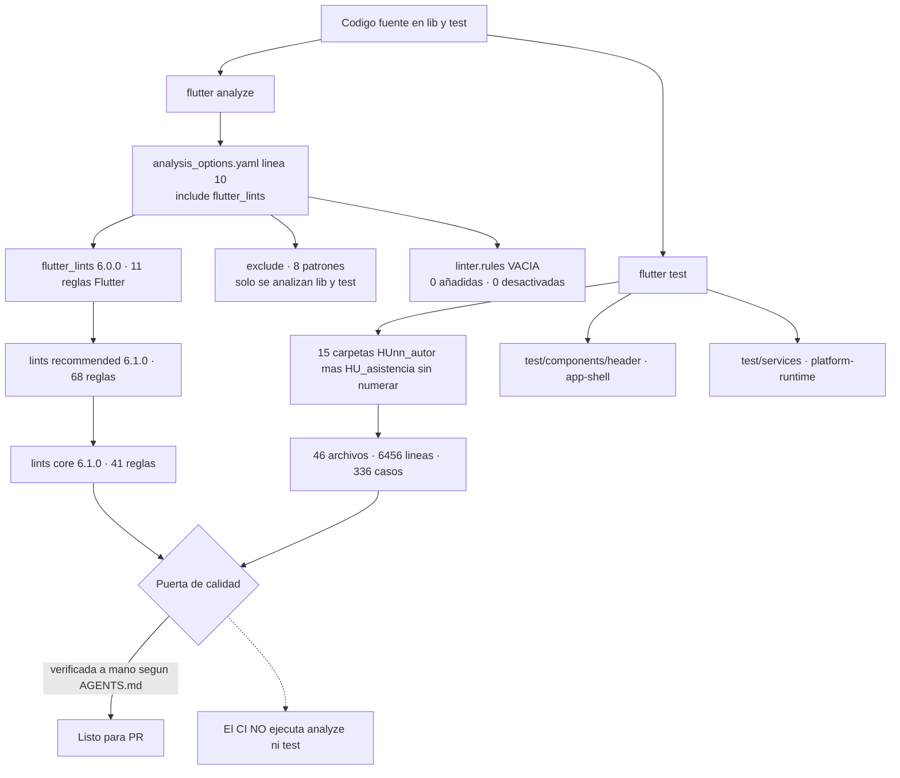

---

### CI — un solo workflow, y no prueba nada

`.github/` contiene **un único archivo**: [`.github/workflows/build-apk.yml`](.github/workflows/build-apk.yml),
207 líneas, llamado «Build and Release APK». No hay workflow de análisis, ni de tests, ni de web,
ni de iOS.

- **Se dispara** con `push` a la rama `main` y con `workflow_dispatch` manual. **No corre en Pull
  Requests**, así que ninguna PR se valida automáticamente.
- **Concurrencia**: grupo `build-apk-${{ github.ref }}` con `cancel-in-progress: true` — varios
  pushes seguidos a `main` cancelan el build anterior.
- **Permisos**: `contents: write`, lo mínimo para crear el GitHub Release.
- **Runner**: `ubuntu-latest`, job `build-android`.

| # | Paso | Líneas | Qué hace | Falla si |
|---:|:---|:---|:---|:---|
| 1 | Descargar código | 22-23 | `actions/checkout@v4` | — |
| 2 | Validar secretos de firma | 25-49 | Comprueba los 4 GitHub Secrets de firma antes de gastar 10 minutos de build | falta alguno |
| 3 | Configurar Java | 51-56 | `actions/setup-java@v4`, `temurin`, Java 17, `cache: gradle` | — |
| 4 | Instalar Flutter | 58-63 | `subosito/flutter-action@v2`, **Flutter 3.44.2**, canal `stable`, `cache: true` | — |
| 5 | Cache pub | 65-70 | `actions/cache@v4` sobre `~/.pub-cache`, clave por hash de `pubspec.lock` | — |
| 6 | Instalar dependencias | 72-73 | `flutter pub get` | — |
| 7 | Configurar firma de release | 75-96 | Decodifica el keystore base64 a `android/app/upload-keystore.jks`, escribe `android/key.properties` y valida el alias con `keytool -list` | keystore, alias o contraseña inválidos |
| 8 | Cache Android native | 98-103 | Cachea el `cmake` del SDK, clave `android-cmake-<os>-3.22.1` | — |
| 9 | **Compilar APK** | 105-106 | `flutter build apk --release --dart-define=API_BASE_URL=https://u-lima-backend-is-2-jeffangeloss-projects.vercel.app` — **no** el `-one` que documentan el README y `.vscode/launch.json`; ver [Deuda técnica](#-deuda-técnica-y-límites-conocidos) | error de compilación |
| 10 | **Verificar firma y autorización de Firebase Auth** | 108-177 | El paso interesante, detallado abajo | ver abajo |
| 11 | Preparar APKs | 179-187 | `release/ULimaPlus.apk` (estable, el que enlaza la landing) y `release/ULimaPlus-build-<run_number>.apk` (historial) | — |
| 12 | Crear o actualizar Release | 189-207 | `softprops/action-gh-release@v2`, tag fijo `latest`, nombre «ULima++ Latest», cuerpo con número de build y commit, `make_latest: true` | — |

El paso 10 es lo que distingue a este workflow de un `flutter build apk` con adornos. En vez de
confiar en que la firma y la configuración de Firebase estén bien, **las verifica contra Google en
vivo**:

1. Localiza el `build-tools` más alto del SDK y toma `apksigner` y `aapt2`.
2. `apksigner verify` sobre `app-release.apk`.
3. Extrae el SHA-1 del certificado (`apksigner verify --print-certs-pem` → `openssl x509 -fingerprint -sha1`).
4. `aapt2 dump packagename` para el package name.
5. Compara la API key Android de `android/app/google-services.json` con la de
   `lib/firebase_options.dart`. Si difieren, falla pidiendo `flutterfire configure` — porque una
   app firmada con una key desincronizada compila bien y luego no deja loguear a nadie.
6. Hace un `POST` real a `identitytoolkit.googleapis.com/v1/accounts:signInWithCustomToken` con
   las cabeceras `X-Android-Package` y `X-Android-Cert`, y un token deliberadamente basura. **El
   éxito esperado es un HTTP 400 con `INVALID_CUSTOM_TOKEN`**: significa que Google aceptó el par
   package + SHA-1 y solo rechazó el token. Si responde `API_KEY_ANDROID_APP_BLOCKED`, el build
   falla indicando que hay que registrar esa combinación en las restricciones de la API key.

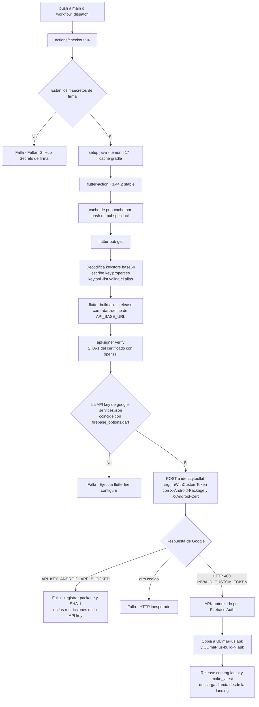

**Lo que el CI no hace**, dicho sin rodeos:

- **No ejecuta `flutter analyze`.**
- **No ejecuta `flutter test`.** Los 336 casos nunca corren automáticamente: son una red de
  seguridad que solo atrapa lo que alguien decida atrapar antes de commitear.
- No corre en Pull Requests, solo en `push` a `main` y en disparo manual.
- No compila iOS ni Web, no despliega Firebase Hosting (no está configurado) ni publica las reglas
  de Realtime Database.

> ⚠️ La consecuencia práctica: un commit que rompa 300 tests se compila, se firma, se publica como
> «ULima++ Latest» y llega al APK que la gente descarga. Añadir dos pasos —`flutter analyze` y
> `flutter test`— antes del paso 9, y un disparador `pull_request`, es la mejora de calidad más
> barata que le queda a este repo.

---

### Comandos de verificación

```bash
# Dependencias. Obligatorio tras cualquier cambio en pubspec.yaml.
flutter pub get

# Puerta 1 · análisis estático. Solo mira lib/ y test/ (el resto está excluido).
# Debe salir "No issues found!" antes de abrir una PR.
flutter analyze

# Puerta 2 · la suite completa: 46 archivos, 336 casos.
flutter test

# Una carpeta concreta — así se corre la batería de una sola historia.
flutter test test/HU19_jeff/          # malla curricular · 6 archivos · 55 casos
flutter test test/HU25_mel/           # carnet de networking · 8 archivos · 33 casos
flutter test test/services/           # ApiClient · 1 archivo · 1 caso

# Un archivo suelto, o un caso por nombre.
flutter test test/HU21_jeff/silabo_service_test.dart
flutter test --plain-name "UNITARIA"  # filtra por el texto del group/test

# Cobertura: no está institucionalizada, no hay umbral y el CI no la mide,
# pero el comando funciona y deja el reporte en coverage/lcov.info (git-ignorado).
flutter test --coverage
```

Y el build que consume esa configuración, para contexto (detalle completo en
[Compilación y distribución](#-compilación-y-distribución)):

```bash
flutter build apk --dart-define=API_BASE_URL=https://u-lima-backend-is-2-one.vercel.app
```

`API_BASE_URL` no es opcional en release: sin ella, `ApiClient` lanza un `StateError` en el
arranque en vez de apuntar silenciosamente a `localhost`. Esa decisión también tiene su test —el
único de `test/services/`.

---

## 📦 Compilación y distribución

Solo hay **un** artefacto que se publica de verdad: el APK de Android, compilado y
firmado por GitHub Actions y colgado en el Release de tag fijo `latest`. iOS y web
compilan pero nadie los distribuye. Los tres escritorios ni siquiera arrancan.

### Requisitos previos

| Herramienta | Versión | Dónde está fijada |
|:---|:---|:---|
| **Flutter** | `3.44.2`, canal `stable` | [`.github/workflows/build-apk.yml`](.github/workflows/build-apk.yml)`:61` |
| Revisión del motor | `db50e20168db8fee486b9abf32fc912de3bc5b6a` | [`.metadata`](.metadata)`:7` |
| **SDK de Dart** | `^3.11.4` | [`pubspec.yaml`](pubspec.yaml)`:22` |
| JDK (solo Android) | Temurin **17** | `build-apk.yml:51-56`; `JavaVersion.VERSION_17` en [`android/app/build.gradle.kts`](android/app/build.gradle.kts)`:30-33` |
| Gradle wrapper | `gradle-8.14-all.zip` | [`android/gradle/wrapper/gradle-wrapper.properties`](android/gradle/wrapper/gradle-wrapper.properties) |
| Android Gradle Plugin | `8.11.1` | [`android/settings.gradle.kts`](android/settings.gradle.kts)`:22` |
| Kotlin Android | `2.2.20` | `android/settings.gradle.kts:26` |
| `google-services` | `4.3.15` | `android/settings.gradle.kts:24` |
| CocoaPods (solo iOS) | piso `platform :ios, '15.0'` | [`ios/Podfile`](ios/Podfile)`:2` |

El paquete Dart se llama `ulima_plus` y la versión es `1.0.0+1`
([`pubspec.yaml`](pubspec.yaml)`:1,19`). Nunca se ha subido: `publish_to: 'none'`.

El build de Android pide memoria de verdad —
`org.gradle.jvmargs=-Xmx8G -XX:MaxMetaspaceSize=4G` en
[`android/gradle.properties`](android/gradle.properties)`:1` — con `caching` y
`parallel` activados (`:4-5`). El directorio de salida está redirigido a `<repo>/build`
([`android/build.gradle.kts`](android/build.gradle.kts)`:8-17`).

---

### Android

El comando de release contra el backend vivo:

```bash
flutter build apk --release \
  --dart-define=API_BASE_URL=https://u-lima-backend-is-2-one.vercel.app
```

El artefacto sale en `build/app/outputs/flutter-apk/app-release.apk`.

> **1 · Sin `API_BASE_URL` el release muere en la primera petición, a propósito.**
> `ApiClient.baseUrl` es un **getter**, no un campo: se recalcula en cada llamada
> ([`lib/services/api_client.dart`](lib/services/api_client.dart)`:35-50`). Si el
> `String.fromEnvironment('API_BASE_URL')` viene vacío **y** `kReleaseMode` es
> verdadero, lanza
> `StateError('API_BASE_URL debe definirse en builds release con --dart-define.')`
> (`api_client.dart:40-44`). La alternativa sería peor: los fallbacks de desarrollo
> son `http://10.0.2.2:3000` y `http://localhost:3000`, que dentro de un APK
> instalado en un teléfono real apuntan **al propio teléfono**. Sin la excepción, la
> app fallaría con «no se pudo conectar» en cada pantalla y nadie sabría por qué.
> La regla está escrita en
> [`specs/features/platform-runtime/platform-runtime.spec.md`](specs/features/platform-runtime/platform-runtime.spec.md)`:15,21`.

> ⚠️ **Divergencia real de URL entre la documentación y el CI.**
> [`README.md`](README.md)`:113,119`, [`.vscode/launch.json`](.vscode/launch.json)`:10,29`
> y la spec de `platform-runtime` usan `https://u-lima-backend-is-2-one.vercel.app`
> —el despliegue verificado vivo—, pero el APK que el CI publica en GitHub Releases
> se compila contra `https://u-lima-backend-is-2-jeffangeloss-projects.vercel.app`
> ([`.github/workflows/build-apk.yml`](.github/workflows/build-apk.yml)`:106`). No está
> verificado que ambos hosts apunten al mismo despliegue. El dominio
> `-tau.vercel.app` que aparece en documentación antigua está **muerto**.

#### Firma: dos keystores con propósitos opuestos

| Keystore | ¿Versionado? | Para qué |
|:---|:---|:---|
| `android/app/debug.keystore` | **Sí, a propósito** | Que todo el equipo firme `flutter run` con el mismo SHA-1 |
| `<lo que diga key.properties>` | **No, jamás** | Release firmado de verdad |

**El keystore de debug se versiona a propósito.** [`.gitignore`](.gitignore)`:47-53`
ignora `/android/key.properties`, `**/*.jks` y `**/*.keystore`, y acto seguido añade
la excepción explícita `!/android/app/debug.keystore`. El motivo está escrito en
[`android/app/build.gradle.kts`](android/app/build.gradle.kts)`:51-54`: si cada
desarrollador usara el `~/.android/debug.keystore` que Android genera por máquina,
cada laptop produciría un SHA-1 distinto, y Firebase Auth solo autoriza las huellas
registradas en la consola. Con el keystore compartido hay **un solo SHA-1** que se
registró una vez, y el chat de la sección conecta en cualquier laptop del equipo.
Las credenciales embebidas en el Gradle (`:55-60`) son los valores estándar de
Android; un keystore de debug no es un secreto. El riesgo es cero mientras nunca se
use para firmar un release — y por eso existe la sección siguiente.

**El keystore de release es condicional.** `build.gradle.kts` lee
`android/key.properties` (no versionado) y solo crea el `signingConfig` de release
si el archivo existe (`hasReleaseKeystore`, `:61-68`). Si no existe:

```kotlin
signingConfig = if (hasReleaseKeystore) {
    signingConfigs.getByName("release")
} else {
    // Sin keystore de release configurado: se usa debug para no romper el
    // desarrollo. NO apto para producción ni para subir a Play Store.
    signingConfigs.getByName("debug")
}
```
(`android/app/build.gradle.kts:71-81`)

> **2 · Un `flutter build apk --release` sin `key.properties` produce un APK
> firmado con debug.** Compila, instala y funciona, pero Google Play lo rechaza y
> cualquiera puede reemplazarlo por otro APK firmado con la misma llave pública. La
> plantilla versionada es [`android/key.properties.example`](android/key.properties.example),
> que incluye el comando de generación
> (`keytool -genkey -v -keystore ulimaplus-release.jks -keyalg RSA -keysize 2048 -validity 10000 -alias ulimaplus`)
> y documenta que `storeFile` es relativo a `android/app`. Esta es la deuda **C8**
> del informe de junio: sigue en estado **PARCIAL**, porque el mecanismo existe pero
> el fallback silencioso a debug también.

En el CI el problema no se da: el paso «Validar secretos de firma»
(`build-apk.yml:25-49`) aborta con `::error::` si falta alguno de los cuatro
GitHub Secrets, y el paso `:75-96` decodifica el keystore desde base64, escribe
`android/key.properties` y valida el alias con `keytool -list` antes de compilar.

#### Identidad de la app y tráfico en claro

| Parámetro | Valor | Ruta |
|:---|:---|:---|
| `namespace` | `com.example.ulima_plus` | `android/app/build.gradle.kts:26` |
| `applicationId` | `com.example.ulima_plus` — **placeholder con `// TODO`** | `android/app/build.gradle.kts:40-41` |
| `android:label` | `ULima++` | [`android/app/src/main/AndroidManifest.xml`](android/app/src/main/AndroidManifest.xml)`:5` |
| `usesCleartextTraffic` | `true`, sin `network_security_config` | `AndroidManifest.xml:7` |
| Permisos | solo `INTERNET` | `AndroidManifest.xml:2` |

> ⚠️ El `applicationId` sigue siendo el de ejemplo de Flutter, así que el APK
> actual **no puede subirse a Play Store** aunque estuviera bien firmado.
> `usesCleartextTraffic="true"` permite HTTP sin TLS también en release;
> presumiblemente está para los fallbacks `10.0.2.2:3000` / `localhost:3000` de
> desarrollo, pero no está acotado por `network_security_config`.

#### Distribución

El workflow copia el mismo APK dos veces (`:179-187`): `release/ULimaPlus.apk`
—nombre estable, el que enlaza la landing— y `release/ULimaPlus-build-<N>.apk`
para historial. `softprops/action-gh-release@v2` lo publica con tag fijo `latest`,
nombre «ULima++ Latest» y un cuerpo que incluye el número de build y el SHA del
commit (`:189-207`). No hay Play Store, ni TestFlight, ni Firebase App Distribution.

---

### iOS

> **3 · Swift Package Manager está desactivado a propósito, y no es un descuido.**
> Flutter 3.44 genera el paquete SPM raíz con un piso de **iOS 13.0 hardcodeado**,
> mientras que Firebase (`firebase_auth`, `firebase_core`, `firebase_database`)
> exige **iOS 15.0**. Con SPM activo el build de iOS rompe. Apagándolo, los plugins
> vuelven a resolverse por CocoaPods, que sí respeta el `platform :ios, '15.0'` del
> Podfile. La clave efectiva vive en [`pubspec.yaml`](pubspec.yaml)`:92-97`:
>
> ```yaml
> flutter:
>   config:
>     enable-swift-package-manager: false
> ```
>
> Si alguien «limpia» esas dos líneas porque parecen configuración muerta, iOS deja
> de compilar. El piso 15.0 está replicado en las tres configuraciones de
> [`ios/Runner.xcodeproj/project.pbxproj`](ios/Runner.xcodeproj/project.pbxproj)
> (`IPHONEOS_DEPLOYMENT_TARGET = 15.0` en las líneas 493, 623 y 674).

El [`ios/Podfile`](ios/Podfile) tiene 43 líneas: piso 15.0 (`:2`),
`COCOAPODS_DISABLE_STATS` (`:5`), mapeo `Debug => :debug`, `Profile => :release`,
`Release => :release` (`:7-11`), `use_frameworks!` (`:31`),
`flutter_install_all_ios_pods` (`:33`), el target anidado `RunnerTests` con
`inherit! :search_paths` (`:34-36`) y un `post_install` que aplica
`flutter_additional_ios_build_settings` a todos los targets (`:39-43`).

Versiones resueltas en [`ios/Podfile.lock`](ios/Podfile.lock): `Firebase/Auth`,
`Firebase/CoreOnly` y `Firebase/Database` **12.15.0**; `firebase_auth 6.5.4`,
`firebase_core 4.11.0`, `firebase_database 12.4.4`; `GoogleUtilities ~> 8.1`.

[`ios/Runner/Info.plist`](ios/Runner/Info.plist) declara `CFBundleDisplayName` y
`CFBundleName` = `ULima++`, orientaciones portrait + landscape en iPhone (más
`PortraitUpsideDown` en iPad), `UIApplicationSceneManifest` con `SceneDelegate`, y
el `GIDClientID` con su `CFBundleURLTypes` invertido para Google Sign-In (`:72-84`).

**No existe ningún comando de build de iOS documentado en el repositorio**, ni
workflow de CI que lo compile. El flujo implícito es
`flutter pub get` → `pod install` dentro de `ios/` →
`flutter build ipa --dart-define=API_BASE_URL=...`, pero eso es inferencia, no está
verificado aquí.

---

### Web

```bash
flutter build web --release \
  --dart-define=API_BASE_URL=https://u-lima-backend-is-2-one.vercel.app
```

> ⚠️ **Firebase Hosting no está configurado.** [`firebase.json`](firebase.json)
> declara exactamente dos cosas: `database.rules` → `database.rules.json` (`:2-4`)
> y `flutter.platforms` con `android`, `ios` y `dart` (`:5-31`). **No hay clave
> `hosting`, ni `public`, ni `rewrites`**, y [`.firebaserc`](.firebaserc) solo fija
> el proyecto por defecto `ulima-plus-chat`. Hoy `firebase deploy --only hosting`
> falla; lo único desplegable es `firebase deploy --only database` (las reglas).
> Para habilitarlo hay que añadir a `firebase.json` una sección `hosting` con
> `"public": "build/web"` y el rewrite SPA a `/index.html`. Ninguna búsqueda en los
> `.md`, `.yml` y `.json` del repo encontró mención a `flutter build web` ni a
> `firebase deploy`: los comandos de arriba son los canónicos de Flutter, no algo
> verificado en este repositorio.

[`web/index.html`](web/index.html) tiene tres particularidades que sobreviven a
cualquier rebuild:

- `<base href="$FLUTTER_BASE_HREF">` (`:15`), sustituido por `--base-href` si el
  despliegue no cuelga de la raíz del dominio.
- `window._flutter = { config: { renderer: "html" } }` (`:116-122`). El renderizador
  `html` fue retirado de Flutter en versiones recientes —los valores vigentes son
  `canvaskit` y `skwasm`— y el CI usa 3.44.2. No pude verificar si esa línea sigue
  siendo válida o se ignora en silencio; requiere una compilación web real.
- PDF.js cargado desde CDN para `pdfx`: `pdfjs-dist@4.6.82` desde
  `cdn.jsdelivr.net` (`:123-129`), con `workerSrc`, `cMapUrl = /cmaps/` y
  `cMapPacked`. El visor de sílabos en web depende de ese CDN; no hay copia local
  ni SRI.

`web/manifest.json` sigue con `background_color` y `theme_color` en el azul por
defecto de Flutter `#0175C2` (`:6-7`), inconsistente con el naranja de marca
`#E77330` que sí aplica el splash inyectado (`web/index.html:43`).

#### Inicio de sesión con Google en web: es otro flujo, no el mismo

En `google_sign_in` 6.x, `GoogleSignIn.signIn()` **no funciona en web**. Google
Identity Services obliga a renderizar su propio botón. El repo lo resuelve con un
import condicional:

```dart
import 'google_sign_in_button_stub.dart'
    if (dart.library.html) 'google_sign_in_button_web.dart' as platform;
```
([`lib/components/google_sign_in_button.dart`](lib/components/google_sign_in_button.dart)`:5-6`)

Cuatro diferencias concretas respecto a móvil:

1. **Client ID cruzado.** `AuthService` construye
   `GoogleSignIn(clientId: kIsWeb ? googleWebClientId : null, serverClientId: kIsWeb ? null : googleWebClientId)`
   ([`lib/services/auth_service.dart`](lib/services/auth_service.dart)`:49-51`). El
   mismo client web va en `clientId` en web y en `serverClientId` en Android/iOS;
   sin `serverClientId`, Android devuelve `idToken == null` y el login falla con
   «No se obtuvo información de Google.».
2. **La cuenta llega por stream, no por `Future`.** En web
   `LoginController.onInit` se suscribe a `googleSignIn.onCurrentUserChanged`
   ([`lib/pages/login/login_controller.dart`](lib/pages/login/login_controller.dart)`:29-32`)
   y de ahí llama a `finishGoogleLogin`. `loginWithGoogle()` solo se usa en móvil.
3. **El botón se construye una sola vez.** `renderButton()` se guarda en un campo
   `late final` dentro de `initState`
   ([`lib/components/google_sign_in_button_web.dart`](lib/components/google_sign_in_button_web.dart)`:24-30`)
   para que Flutter no destruya y recree el `HtmlElementView`; si se recreara, GIS
   avisaría con «google.accounts.id.initialize() is called multiple times».
4. **La UI difiere.** En web se pinta el botón oficial de Google; en móvil, un
   `OutlinedButton` propio con `assets/images/google_logo.svg`
   ([`lib/pages/login/login_page.dart`](lib/pages/login/login_page.dart)`:359-368`).

---

### Ícono y splash

Ambos salen de **una sola imagen**, `assets/images/UL_fondo_naranja_grande.png`, y
de **un solo color de marca**, `#E77330` (el naranja tomado del propio ícono; el
primario del tema es `#FF6600` y su variante oscura `#D45500`, en
[`lib/configs/themes.dart`](lib/configs/themes.dart)).

```yaml
flutter_launcher_icons:          # pubspec.yaml:67-73
  android: true
  ios: true
  remove_alpha_ios: true         # iOS no admite transparencia: se aplana sobre blanco
  image_path: "assets/images/UL_fondo_naranja_grande.png"
  min_sdk_android: 21

flutter_native_splash:           # pubspec.yaml:78-83
  color: "#E77330"
  image: assets/images/UL_fondo_naranja_grande.png
  android_12:
    color: "#E77330"
    image: assets/images/UL_fondo_naranja_grande.png
```

```bash
dart run flutter_native_splash:create   # documentado en pubspec.yaml:77
dart run flutter_launcher_icons         # comando estándar del paquete
```

> **4 · El comando del ícono no está documentado en el repo.**
> [`pubspec.yaml`](pubspec.yaml)`:77` sí documenta el del splash en un comentario.
> El de `flutter_launcher_icons` es el estándar del paquete `^0.14.4`, pero no hay
> ninguna línea en este repositorio que lo declare: queda anotado como inferencia.

Artefactos generados y verificados en el árbol:

```text
android/app/src/main/res/
├── mipmap-{mdpi,hdpi,xhdpi,xxhdpi,xxxhdpi}/   # ícono, 5 densidades
├── drawable*/launch_background.xml            # splash Android < 12 (layer-list)
└── values-v31/styles.xml                      # splash Android 12+ · #E77330
ios/Runner/Assets.xcassets/
├── AppIcon.appiconset/                        # ícono iOS
├── LaunchImage.imageset/                      # 1x, 2x, 3x
└── LaunchBackground.imageset/
web/splash/img/                                # light|dark en 1x–4x (8 PNG)
```

[`lib/main.dart`](lib/main.dart)`:49-53` **no** usa
`FlutterNativeSplash.preserve/remove`: el splash nativo se retira solo, cuando el
motor pinta el primer frame.

---

### El pipeline, y qué parte de él es automática

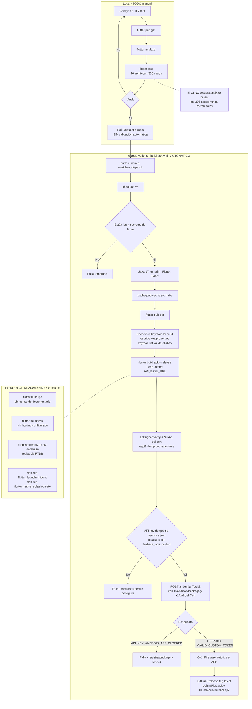

> **5 · El CI compila, verifica firma y publica, pero no valida el código.**
> `.github/workflows/build-apk.yml` es el **único** workflow del repositorio, tiene
> 207 líneas y en ningún paso invoca `flutter analyze` ni `flutter test`. Además
> solo se dispara con `push` a `main` y `workflow_dispatch`: **ninguna Pull Request
> se valida automáticamente**. La compensación es la verificación post-build
> (`:108-177`), que sí es seria: extrae el SHA-1 del certificado del APK, compara la
> API key de `google-services.json` con la de `lib/firebase_options.dart`, y hace un
> `POST` real a `identitytoolkit.googleapis.com/v1/accounts:signInWithCustomToken`
> con las cabeceras `X-Android-Package` y `X-Android-Cert`. El criterio de éxito es
> contraintuitivo: espera **HTTP 400 con `INVALID_CUSTOM_TOKEN`**. Eso prueba que
> Google aceptó la combinación paquete + huella y solo rechazó el token falso; si
> respondiera `API_KEY_ANDROID_APP_BLOCKED`, el APK no podría autenticar a nadie.

### Plataformas

| Plataforma | Estado | Notas |
|:---|:---|:---|
| **Android** | **Producción** | Único canal real. CI compila, verifica firma contra Firebase y publica en GitHub Releases (tag `latest`). Firma de release condicional a `key.properties`; `applicationId` aún es `com.example.ulima_plus`. |
| **iOS** | Compilable, sin CI ni distribución | Podfile con piso 15.0, SPM desactivado a propósito, Firebase 12.15.0 resuelto en `Podfile.lock`. Ningún comando de build documentado en el repo. |
| **Web** | Compilable, sin hosting | `FirebaseOptions.web` existe y el login con Google usa `renderButton`. `firebase.json` **no tiene** sección `hosting`. Renderizador `html` posiblemente obsoleto; PDF.js depende de un CDN. |
| **Linux** | **No funcional** | Scaffold real en `linux/`, pero [`lib/firebase_options.dart`](lib/firebase_options.dart)`:37-41` lanza `UnsupportedError` y `main.dart:53` llama a `Firebase.initializeApp` sin condición: **crashea al arrancar**. |
| **macOS** | **No funcional** | Igual: `UnsupportedError` en `firebase_options.dart:27-31`. Hay `macos/Podfile` con `platform :osx, '10.15'`, pero la app no llega a pintar. |
| **Windows** | **No funcional** | Igual: `UnsupportedError` en `firebase_options.dart:32-36`. |

Refuerzan el diagnóstico [`firebase.json`](firebase.json)`:5-31` (solo declara
`android`, `ios` y `dart`), [`.metadata`](.metadata)`:14-20` (solo registra migración
para `root` y `android`) y
[`analysis_options.yaml`](analysis_options.yaml)`:16-21`, que excluye del análisis
las seis carpetas de plataforma.

---

## ⚙ Configuración y entorno

### Variables de compilación

**Hay exactamente una.** Un `grep` de `String.fromEnvironment` en `lib/` y `test/`
devuelve una sola coincidencia:
[`lib/services/api_client.dart`](lib/services/api_client.dart)`:31`. No existen
`bool.fromEnvironment` ni `int.fromEnvironment`, ni archivos `.env` en el runtime.

| Variable | Obligatoria | Valor por defecto | Efecto |
|:---|:---|:---|:---|
| `API_BASE_URL` | **Sí en release** | ninguno | Base de todas las llamadas HTTP al backend |

La resolución, en orden estricto de evaluación (`api_client.dart:35-50`):

| # | Condición | Resultado | Línea |
|---:|:---|:---|:---|
| 1 | `configuredBaseUrl` pasado al constructor no vacío | ese valor saneado | `:28-29, 37-39` |
| 2 | `--dart-define=API_BASE_URL=...` no vacío | ese valor saneado | `:31-33` |
| 3 | Vacío **y** `kReleaseMode` | **`StateError`** | `:40-44` |
| 4 | Vacío, debug/profile, `kIsWeb` | `http://localhost:3000` | `:45` |
| 5 | Vacío, debug/profile, Android | `http://10.0.2.2:3000` | `:46-48` |
| 6 | Vacío, debug/profile, resto (iOS, escritorio) | `http://localhost:3000` | `:49` |

«Saneado» significa `trim()` más `replaceFirst(RegExp(r'/$'), '')`: se recorta la
barra final para que `.../api` y `.../api/` produzcan la misma URI
(`api_client.dart:144-146`, cubierto por
[`test/services/api_client_test.dart`](test/services/api_client_test.dart)).

La inyección en la práctica ocurre en cuatro sitios:
[`README.md`](README.md)`:113,119`, las tres configuraciones de
[`.vscode/launch.json`](.vscode/launch.json) (Vercel, local `10.0.2.2:3000` y
perfil), la spec `platform-runtime` `:33-34`, y
[`.github/workflows/build-apk.yml`](.github/workflows/build-apk.yml)`:106`.

### Puesta en marcha local

```bash
# 0. Dependencias. Repetir siempre que cambie pubspec.yaml.
flutter pub get

# 1. Comprobaciones antes de abrir PR (el CI NO las corre por ti).
flutter analyze
flutter test

# 2. Contra el backend desplegado: lo normal para trabajar en la UI.
flutter run --dart-define=API_BASE_URL=https://u-lima-backend-is-2-one.vercel.app

# 3. Contra un backend local en :3000, desde el EMULADOR de Android.
#    10.0.2.2 es el alias que el emulador da a la máquina anfitriona;
#    "localhost" desde dentro del emulador apunta al emulador mismo,
#    donde no hay ningún servidor escuchando.
flutter run --dart-define=API_BASE_URL=http://10.0.2.2:3000

# 4. Contra un backend local desde web, simulador de iOS o escritorio:
#    ahí localhost SÍ es la máquina anfitriona.
flutter run -d chrome --dart-define=API_BASE_URL=http://localhost:3000

# 5. Sin --dart-define en debug: los fallbacks de api_client.dart hacen
#    exactamente lo mismo que 3 y 4 según la plataforma. En release, esto
#    lanza StateError en la primera petición.
flutter run

# 6. APK de release contra el backend vivo.
flutter build apk --release \
  --dart-define=API_BASE_URL=https://u-lima-backend-is-2-one.vercel.app
```

El backend que consume esta app vive en `../ULima_Backend_IS2`
([repo público](https://github.com/jeffangeloss/ULima_Backend_IS2)); para el paso 3
hay que tenerlo levantado en el puerto 3000.

### Configuración de Firebase

El proyecto es `ulima-plus-chat` ([`.firebaserc`](.firebaserc)). Se usa **solo** para
el chat por sección: `firebase_core 4.11.0`, `firebase_auth 6.5.4` y
`firebase_database 12.4.4`. No hay Firestore, ni Storage, ni Analytics.

| Archivo | ¿Versionado? | Qué lleva |
|:---|:---|:---|
| [`firebase.json`](firebase.json) | Sí | Ruta de las reglas de RTDB y el mapa `flutter.platforms` (android, ios, dart) que usa `flutterfire configure` |
| [`.firebaserc`](.firebaserc) | Sí | Proyecto por defecto |
| [`database.rules.json`](database.rules.json) | Sí | Reglas de seguridad de Realtime Database, 57 líneas |
| `android/app/google-services.json` | Sí | Config de cliente Android, con API key **pública de cliente** |
| `ios/Runner/GoogleService-Info.plist` | Sí | Config de cliente iOS |
| [`lib/firebase_options.dart`](lib/firebase_options.dart) | Sí | `FirebaseOptions` para android, ios y web; `UnsupportedError` para los tres escritorios |
| [`lib/configs/google_auth_config.dart`](lib/configs/google_auth_config.dart) | Sí | Client ID web de OAuth, público por diseño (va embebido en la página) |
| `android/key.properties` | **No** — [`.gitignore`](.gitignore)`:48` | Credenciales del keystore de release |
| `**/*.jks`, `**/*.keystore` | **No** — `.gitignore:49-50` | Keystores, salvo la excepción `debug.keystore` |
| `service-account*.json`, `*-firebase-adminsdk-*.json` | **No** — `.gitignore:59-60` | Credenciales de servidor. El SDK Admin vive en el backend, no aquí |

> ⚠️ Las API keys de cliente de Firebase están versionadas en un repositorio
> **público**, y eso es correcto por diseño: son identificadores, no secretos. Pero
> su seguridad depende por completo de dos capas que sí hay que mantener: **(a)** las
> restricciones Android por *package name* + SHA-1 en Google Cloud —lo que el CI
> comprueba en vivo en `build-apk.yml:150-177`— y **(b)** las reglas de
> `database.rules.json`. Si se relaja cualquiera de las dos, la clave deja de estar
> protegida. Los secretos de verdad viven en GitHub Secrets:
> `ANDROID_KEYSTORE_BASE64`, `ANDROID_KEYSTORE_PASSWORD`, `ANDROID_KEY_ALIAS`,
> `ANDROID_KEY_PASSWORD` y `GITHUB_TOKEN` — solo los nombres, nunca los valores.

#### Qué dicen las reglas de `database.rules.json`, en prosa

La raíz está **cerrada**: `".read": false` y `".write": false` (`:3-4`). Todo lo que
no se declare explícitamente queda denegado.

Un usuario autenticado puede leer **su propio** nodo de membresía en
`/members/<sección>/<uid>`, y solo mientras `expiresAt` sea posterior a `now`
(`:5-12`). Escribirlo no puede: `".write": false`. Las membresías las crea el
backend con el SDK Admin, así que nadie se auto-inscribe en una sección ni se
prorroga la vigencia.

Un usuario lee los mensajes de `/sections/<sección>/messages` únicamente si tiene
membresía **vigente** en esa sección (`:16`). Hay `.indexOn: ["createdAt"]` (`:17`)
para que el servidor ordene y pagine por fecha sin degradarse.

Escribir un mensaje es **append-only**: la regla exige `!data.exists()` y
`newData.exists()` (`:19`), es decir, solo se permite **crear**. No se puede editar
ni borrar — y el `null` de un borrado queda prohibido por la segunda condición.
Consecuencia práctica: el borrado suave del chat (`deleted` / `deletedBy`) **no lo
puede hacer el cliente**; requiere el backend.

Cada mensaje debe traer **exactamente ocho campos** (`:20`), y cada uno se valida
contra el nodo de membresía que escribió el backend, lo que hace la suplantación
imposible desde el cliente:

| Campo | Regla | Qué impide |
|:---|:---|:---|
| `senderId` | debe ser igual a `auth.uid` | Firmar como otro |
| `senderName` | igual a `members/<sec>/<uid>/displayName` | Cambiarse el nombre visible |
| `senderRole` | igual a `.../role` | Fingir otro rol |
| `senderRoleLabel` | igual a `.../roleLabel` | Fingir otra etiqueta |
| `moderator` | booleano igual a `.../moderator` | Auto-declararse moderador |
| `weight` | número igual a `.../weight` | Alterar el peso de orden |
| `body` | string de 1 a **4000** caracteres | Mensajes vacíos o gigantes |
| `createdAt` | número igual a `now` | Antedatar o posdatar un mensaje |

Cualquier campo adicional se rechaza (`"$other": {".validate": false}`, `:45-47`), y
cualquier subárbol de la sección distinto de `messages` está cerrado (`:50-53`).

Las reglas se publican con `firebase deploy --only database`. **No está
automatizado**: ningún workflow las despliega.

### Qué guarda la app en el dispositivo

Dos backends simultáneos, gestionados por
[`lib/services/storage_service.dart`](lib/services/storage_service.dart): el JWT va a
`flutter_secure_storage` (Keychain en iOS, EncryptedSharedPreferences en Android) y
todo lo demás a `shared_preferences`.

El inventario completo de claves —12 en `shared_preferences` y 1 en el almacén seguro,
declaradas como constantes privadas en `storage_service.dart:17-29`— está en
[Almacenamiento local](#almacenamiento-local).

Fuera de `StorageService` hay tres almacenamientos más:

- [`lib/services/notas_service.dart`](lib/services/notas_service.dart) llama a
  `SharedPreferences.getInstance()` **directamente**, con las claves
  `notas_estudiante_<idEstudiante>` y `currentStudentId` (`:7,33,43,61,71,81`).
- [`lib/services/silabo_service.dart`](lib/services/silabo_service.dart) cachea los
  PDF de sílabo en `getTemporaryDirectory()` como `<fileId>.pdf` (`:52,206-209`),
  con tope de **25 MB** (`maxPdfBytes`, `:61`) y validación de la firma `%PDF`
  (`:63`) antes de escribir.
- La contraseña de miUlima **nunca se persiste**. El comentario de
  [`lib/services/portal_sync_service.dart`](lib/services/portal_sync_service.dart)`:16-18`
  es explícito: no entra en un `Rx`, no va a `shared_preferences`, no se imprime.

> **6 · `clearSession()` no borra todo.** El método
> (`storage_service.dart:206-218`) limpia el token y las diez claves `session_*`,
> pero **no** `user_setups_v1` ni `user_statuses_v1` (comparar `:206-218` con
> `:28-29`). Tampoco toca las claves de `notas_service.dart`. Es intencional para
> que el mismo alumno no repita el setup al volver a entrar, pero significa que en
> un dispositivo compartido las cachés por código de alumno **sobreviven al
> logout**. Están indexadas por código, así que otro usuario no las ve en pantalla,
> pero siguen en el disco.

---

## 🧭 Cómo se trabaja aquí

Este repositorio no se toca sin spec. La primera línea de [`AGENTS.md`](AGENTS.md) lo dice sin
matices: **«Este repositorio usa Tessl con Spec Driven Development. No implementes cambios
funcionales sin spec aprobada.»** El resto de esta sección es el procedimiento que se deriva de
esa frase, con las puertas que realmente bloquean y los puntos donde el proceso es frágil.

### El flujo obligatorio, paso a paso

Los diez pasos están transcritos de [`AGENTS.md`](AGENTS.md)`:13-24`. No son una recomendación:
la regla `spec-before-code` del tile vendorizado en [`.tessl/RULES.md`](.tessl/RULES.md) tiene
`alwaysApply: true`.

| # | Paso | Fuente | Qué se produce |
|---:|:---|:---|:---|
| 1 | Leer [`.tessl/RULES.md`](.tessl/RULES.md) | `AGENTS.md:15` | Las 3 reglas del tile `tessl-labs/spec-driven-development@2.0.1` |
| 2 | Leer [`KNOWLEDGE.md`](KNOWLEDGE.md) | `AGENTS.md:16` | Reglas de dominio, roles, umbrales |
| 3 | Leer [`docs/specs/workflow.md`](docs/specs/workflow.md) y [`docs/specs/feature-index.md`](docs/specs/feature-index.md) | `AGENTS.md:17` | Prioridad de la feature y su estado declarado |
| 4 | Ubicar la spec en `specs/features/<feature>/<feature>.spec.md` | `AGENTS.md:18` | La spec vigente, si existe |
| 5 | Si no existe o no cubre el cambio, **actualizar la spec primero** | `AGENTS.md:19` | Frontmatter `name` + `description` + `targets` |
| 6 | Si la feature consume **API nueva o modificada**: coordinar con backend y actualizar [`docs/specs/api-contracts.md`](docs/specs/api-contracts.md) | `AGENTS.md:20` | Contrato REST espejado en los dos repos |
| 7 | **Esperar aprobación explícita de la spec** | `AGENTS.md:21` | Un «looks good», «yes» o «approved» del stakeholder |
| 8 | Implementar **solo** archivos incluidos en `targets` | `AGENTS.md:22` | Código dentro de la estructura actual de `lib/` |
| 9 | Ejecutar `flutter analyze` | `AGENTS.md:23`, `:65` | **Puerta 1** |
| 10 | Si agregas tests: ejecutar `flutter test` y enlazarlos en la spec con `[@test]` | `AGENTS.md:24`, `:66` | **Puerta 2** + trazabilidad requisito ↔ prueba |

[`docs/specs/workflow.md`](docs/specs/workflow.md)`:9-20` es la variante operativa del mismo
flujo y añade dos matices propios del frontend: el paso 3 es **confirmar el contrato esperado en
`docs/specs/api-contracts.md` antes de abrir la spec**, y el paso 5 obliga a definir «pantallas,
estados UI, validaciones, loading, errores, navegacion y consumo de API» — no solo el happy path.

> **1 · Qué cuenta como aprobación y qué no.** La regla `spec-before-code` lo enumera: aprueban
> «looks good», «yes», «approved» o correcciones seguidas de confirmación. **No** aprueban el
> silencio, un «just do it» sin revisar la spec, ni el propio juicio del implementador. Solo hay
> dos excepciones: cambios triviales que no alteran comportamiento y hotfixes de emergencia — y
> estos últimos exigen spec retroactiva.

> **2 · `flutter analyze` y `flutter test` son puertas locales, no de CI.** El único workflow del
> repo, [`.github/workflows/build-apk.yml`](.github/workflows/build-apk.yml), **no ejecuta ninguno
> de los dos**: compila y firma el APK, nada más. Los 46 archivos de prueba y sus 336 casos nunca
> corren automáticamente, y el workflow solo se dispara con `push` a `main` o a mano, así que
> ninguna Pull Request se valida sola. Si no corres las puertas antes de commitear, nadie las corre.

> **3 · Los `targets` son un contrato de alcance.** El frontmatter de cada spec lista los archivos
> que esa feature puede tocar ([`specs/README.md`](specs/README.md)`:13-20`). Implementar fuera de
> `targets` es salirse de la spec aprobada, aunque el cambio funcione. La regla
> `spec-format-compliance` exige además al menos un `target` por spec y que los enlaces `[@test]`
> vayan **junto al requisito que verifican**, no en una sección aparte al final.

> **4 · No añadas `[@test]` a un archivo que no existe.**
> [`docs/specs/spec-template.md`](docs/specs/spec-template.md)`:61` es literal:
> «Do not add `[@test]` links that point to files that do not exist». Hoy la regla está incumplida:
> **8 de los 10 enlaces `[@test]` de las specs apuntan a rutas inexistentes** (ver
> [Deuda técnica](#-deuda-técnica-y-límites-conocidos)).

### La coordinación con el backend

El backend proveedor es [`../ULima_Backend_IS2`](https://github.com/jeffangeloss/ULima_Backend_IS2)
([`AGENTS.md`](AGENTS.md)`:8`, ruta relativa: los dos repos se asumen hermanos en el mismo
directorio padre). La regla de precedencia está escrita en los dos `workflow.md`:

- **El backend define primero.** «El backend debe definir primero su contrato local en
  `docs/specs/api-contracts.md` cuando la feature requiere API, permisos, reglas de negocio o base
  de datos. Luego el frontend debe reflejar el mismo contrato en su propio repo»
  (`ULima_Backend_IS2/docs/specs/workflow.md:50-54`).
- **Cuándo puede arrancar el frontend solo.** «Se puede empezar por frontend solo cuando el cambio
  sea visual, local o de navegacion sin contrato nuevo. Si aparece una dependencia backend, **se
  pausa la implementacion** y se actualiza la spec backend primero»
  ([`docs/specs/workflow.md`](docs/specs/workflow.md)`:45`).
- **El frontend no copia la arquitectura del backend.** El backend usa
  `routes → controller → service → repository`; aquí se mantienen páginas, controllers GetX,
  services y models ([`docs/specs/workflow.md`](docs/specs/workflow.md)`:47`).

> ⚠️ **Este es el punto frágil conocido del proceso.** No hay generación de código, ni OpenAPI, ni
> validación automática: **hay dos archivos `docs/specs/api-contracts.md`, uno en cada repositorio,
> que se mantienen alineados a mano.** La línea 3 del archivo del frontend lo admite: «Mantener
> alineado manualmente con `ULima_Backend_IS2/docs/specs/api-contracts.md`». Hoy no lo están: el del
> frontend tiene **503 líneas y 17 secciones `##`**, el del backend **600 líneas y 19**, y hay
> al menos cuatro módulos consumidos en producción — Official Grades, Chat, Attendance Risk y
> Schedule docente — que **no tienen sección propia en el contrato del frontend**. El inventario
> completo de divergencias está en [La capa de servicios](#-la-capa-de-servicios).

### Convención de commits

Prefijo `tipo:` o `tipo(scope):`, asunto corto en minúscula que describe el **efecto observable**,
no el archivo tocado. Sobre los 281 commits alcanzables desde todas las refs (274 en el HEAD
actual), **130 llevan prefijo — el 46,3 %**; 95 con scope explícito y 34 sin él. El resto se
reparte entre 89 merges y la etapa temprana de mayo de 2026, cuando los mensajes eran libres
(`Calculadora implementada`, `login funcional`, `act. header`).

| Tipo | Commits | Ejemplo real del log de este repo |
|:---|---:|:---|
| `feat` | 60 | `feat(contactos): mostrar al delegado aunque todavía no use ULima++` |
| `fix` | 39 | `fix(malla): sumar el progreso real por curso al piso de niveles cumplidos` |
| `chore` | 9 | `chore(ios,seguridad): desactivar SPM (Firebase exige iOS 15) y reforzar .gitignore` |
| `test` | 6 | `test(HU26): ampliar la caja negra de exportCsv a 7 casos de partición` |
| `docs` | 5 | `docs(frontend): sincronizar documentación con estado real del código (R1-R24)` |
| `ci` | 4 | `ci(apk): cachear Flutter/pub/Gradle + CMake y cancelar builds superados` |
| `style` | 2 | `style(ux): skeleton de página completa en detalle de curso y horario` |
| `seguridad` | 1 | `seguridad(android): firmar release con keystore propio y fallback a debug` |
| `refactor` | 1 | `refactor(malla): extraer lógica de dominio a módulo Dart puro (TT03)` |
| `dev` | 1 | `dev(android): debug keystore compartida + launch config a Vercel (#138)` |
| `tests` | 1 | `tests: networking y anuncios` — plural, **desviación**; el tipo canónico es `test` |

`seguridad`, `limpieza` y `dev` son tipos propios del equipo, en español, fuera del catálogo
Conventional Commits. Coexisten con los estándar y no se han normalizado.

Rasgos verificados de la convención:

- **Scopes más usados**: `malla` (8), `auth` (8), `ux` (5), `horario` (5), `chatbot` (5), `chat` (5),
  `teacher` (4), `asesorias` (4), `android` (4). Se admiten scopes compuestos:
  `ios,seguridad`, `schedule,course-detail`, `chat+cursos`.
- **Referencia a la historia en el scope** cuando el commit cierra una HU:
  `test(HU26): …`, `feat(chat): borrado suave de mensajes solo por el profesor titular (HU23)`.
- **Trazabilidad de hallazgos entre paréntesis**: los mensajes citan el identificador de auditoría
  o de requisito que cierran — `(TT03)`, `(R1-R24)`, `(RS-BE-16)`, `(M-11)`, `(#138)`.
- **Sufijo `(#NN)`** = número de PR de GitHub cuando el commit llegó por squash-merge: 14 casos.
- **Idioma**: español desde julio de 2026; los commits de mayo y junio están en inglés. Conviven.

### Convención de ramas

Hay dos épocas y la frontera es nítida.

**Época 1 — mayo a julio de 2026: una rama de larga vida por persona.** Sobreviven en
`remotes/upstream/*`: `jeff`, `mel`, `sam`, `nehemias`, `Ronald`, `Julito`, `aUreLi0` y su
duplicado casi homónimo `aUreLio`, más las ramas de tema `build-apk`, `orientation` y
`chore/tt12-auditoria-dependencias-flutter`. Cada integrante sincronizaba `main` hacia su rama con
merges (`Merge remote-tracking branch 'origin/main' into mel`) y abría PR de vuelta. La
capitalización nunca se unificó.

**Época 2 — agosto a septiembre de 2026: `tipo/slug-descriptivo`.**

| Prefijo | Semántica | Ejemplos reales de este repo |
|:---|:---|:---|
| `feat/` | funcionalidad nueva | `feat/asistencia-honesta-fe`, `feat/avatar-fe`, `feat/delegados-portal`, `feat/portal-sync-frontend` |
| `fix/` | corrección de comportamiento | `fix/malla-completados`, `fix/horario-geometria` |
| `investigate/` | spike o reproducción de un bug, sin entregable | `investigate/otp-backspace-hu20` — el slug referencia la HU |
| `chore/` | mantenimiento y dependencias | `chore/tt12-auditoria-dependencias-flutter` |

Cuando una feature cruza los dos repositorios, el tronco del nombre se repite y se distingue por
sufijo — `feat/portal-sync-backend` ↔ `feat/portal-sync-frontend`, `feat/asistencia-honesta` ↔
`feat/asistencia-honesta-fe`. **Cuando el nombre es idéntico en ambos repos significa cambio
coordinado simultáneo**: `feat/delegados-portal` y `fix/malla-completados` existen con el mismo
nombre en backend y frontend.

#### `origin` frente a `upstream`

Este repo tiene **dos remotes**, y confundirlos es la forma más fácil de perder trabajo.

| Remote | URL | Rol |
|:---|:---|:---|
| `origin` | `https://github.com/jeffangeloss/ULima_Frontend_IS2` | Fork de despliegue. Es el repo público al que apunta este README y desde el que se publica el APK. |
| `upstream` | `https://github.com/meltiruiz/ULima_Frontend_IS2` | **Repo canónico del equipo.** Aquí viven las 13 refs históricas, incluidas las 8 ramas personales de la época 1 —7 personas: `aUreLi0` y `aUreLio` son la misma. |

`git rev-list --left-right --count origin/main...upstream/main` devuelve **`0 0`**: las dos ramas
principales están exactamente al día, sin divergencia. El fork es un espejo fiel, no una
bifurcación — y hay que mantenerlo así. Las Pull Requests van a `upstream`.

El backend, en cambio, **solo tiene `origin`**. Su historia demuestra que hubo un espejo automático
con `meltiruiz/main` (`6c5a8e9 ci: espejo del fork de despliegue…`), retirado después con
`e399d76 ci: retirar el espejo automático con meltiruiz/main`. Antes de `meltiruiz` el repo
canónico fue `linartic` (mayo–junio de 2026); la migración se lee en los propios mensajes de merge.

### El ciclo completo, de la spec al APK

```mermaid
flowchart TD
    A["Tarea nueva - HU, bug o cambio de UI"] --> B["Leer .tessl/RULES.md y KNOWLEDGE.md"]
    B --> C["Leer docs/specs/workflow.md y docs/specs/feature-index.md"]
    C --> D["Ubicar specs/features/FEATURE/FEATURE.spec.md"]
    D --> E{"La spec existe y cubre el cambio"}
    E -->|No| F["Escribir o actualizar la spec con frontmatter name, description y targets"]
    E -->|Si| G{"Consume API nueva o modificada"}
    F --> G
    G -->|Si| H["Acordar el contrato con el equipo de backend"]
    H --> I["Actualizar api-contracts.md primero en BACKEND y espejarlo A MANO en FRONTEND"]
    I --> J["Esperar aprobacion explicita de la spec"]
    G -->|No| J
    J --> K{"Aprobada por el stakeholder"}
    K -->|Silencio o un just do it| J
    K -->|Si| L["Implementar SOLO los archivos listados en targets"]
    L --> M["Puerta 1 - flutter analyze"]
    M -->|Falla| L
    M -->|Cero errores| N["Puerta 2 - flutter test"]
    N -->|Falla| L
    N -->|Verde| O["Enlazar cada prueba con @test junto al requisito que verifica"]
    O --> P["Revision con las skills work-review y spec-verification"]
    P --> Q{"Spec, contrato y codigo coinciden"}
    Q -->|No| D
    Q -->|Si| R["Commit tipo scope en rama feat o fix"]
    R --> S["Pull Request al repo canonico upstream"]
    S --> T["Merge a main"]
    T --> U["build-apk.yml compila, firma y publica ULimaPlus.apk"]
```

---

## 🧯 Deuda técnica y límites conocidos

### La auditoría de junio de 2026

El 15 de junio de 2026 se corrió una auditoría multi-agente sobre 10 dimensiones, con verificación
adversarial de cada hallazgo crítico y alto contra el código real. El informe vive en el repo del
backend (`DEUDA_TECNICA.md`, 175 líneas) y cubre los dos repositorios. Confirmó **128 ítems**, de
los cuales **67 son del frontend** — más que los 61 del backend.

| Severidad | Total del informe | Del frontend |
|:---|---:|---:|
| 🔴 Crítica | 11 | 3 |
| 🟠 Alta | 20 | 11 |
| 🟡 Media | 75 | ≈ 38 |
| ⚪ Baja | 22 | ≈ 8 |
| **Total** | **128** | **67** |

Las críticas y las altas están atribuidas con exactitud a cada repo; las medias y bajas solo se
reparten de forma aproximada en el informe, por eso las dos últimas filas llevan `≈` y la columna
no cuadra exactamente con 67. No inflamos el número: 67 es la cifra que el informe atribuye al
frontend.

### Estado verificado hoy de los críticos del frontend

Los tres hallazgos críticos que tocaban a este repositorio, contrastados contra el código el
**2026-09-07**:

| ID | Hallazgo de junio | Estado hoy | Evidencia |
|:---|:---|:---|:---|
| **C6** | Cero pruebas en el frontend: no existía la carpeta `test/` | ✅ **CERRADO** | **46 archivos de prueba, 6 456 líneas, 336 casos** repartidos en 15 carpetas `HU##_<autor>` más `test/HU_asistencia/`, `test/components/` y `test/services/`. El backend cerró su gemelo C5 con 74 suites. |
| **C8** | El APK de release se firmaba con la llave de **debug** | 🟠 **PARCIAL** | [`android/app/build.gradle.kts`](android/app/build.gradle.kts)`:72-80` usa el keystore de release **si existe `android/key.properties`** y **cae a la firma de debug si no existe**. El CI sí firma bien: [`.github/workflows/build-apk.yml`](.github/workflows/build-apk.yml)`:25-49` aborta con `::error::Faltan GitHub Secrets de firma` si falta cualquiera de las cuatro variables, y `:108-177` verifica la firma con `apksigner` y el SHA-1 del certificado. El riesgo residual es un `flutter build apk --release` local sin `key.properties`: produce un APK firmado con debug y sin ningún aviso, y el propio Gradle lo rotula «NO apto para producción ni para subir a Play Store». |
| **C9** | Campos `late` que pueden crashear en tiempo de ejecución | ❌ **Pendiente** | El informe lo dejó abierto y no consta cierre posterior. |

C7 (doble lockfile) y las críticas de autenticación C1–C4 eran del backend; tres de ellas están
cerradas y C4 sigue parcial, con 8 llamadas `db.execute` en `course-detail.routes.ts` (líneas 63,
82, 119, 134, 178, 193, 207 y 264).

### Límites conocidos vigentes

Esto es lo que hoy no funciona, o funciona con una condición. Está aquí para que nadie lo
redescubra a mano.

> **1 · El visor de sílabo no abre lo que el portal protege por sesión.** El visor
> ([`lib/pages/silabo/`](lib/pages/silabo/), [`lib/services/silabo_service.dart`](lib/services/silabo_service.dart))
> solo acepta enlaces de Google Drive: `SilaboLink.tryParse`
> ([`lib/domain/silabo/silabo_link.dart`](lib/domain/silabo/silabo_link.dart)`:47-52`) admite
> exactamente tres hosts — `drive.google.com`, `drive.usercontent.google.com`, `docs.google.com` —
> y tres formas de URL. Pero desde que Portal Sync importa sílabos, la URL que puede quedar
> guardada apunta a la **base Domino de `cactus.ulima.edu.pe`**, que exige la sesión SSO del portal.
> El backend registra el límite como decisión abierta #10 de su `portal-sync.spec.md:334`: ese
> documento está protegido por sesión y la app **no puede abrirlo como abre los de Drive**. En la
> práctica el enlace cae por la rama de error del controller —
> `El enlace del sílabo no es válido para verlo dentro de la app.`
> ([`lib/pages/silabo/silabo_viewer_controller.dart`](lib/pages/silabo/silabo_viewer_controller.dart)`:111-113`)
> — con el fallback **Abrir en Drive**, que tampoco resuelve un documento de Domino. No hay rama
> Domino en todo `lib/`.

> **2 · El contrato de API se mantiene alineado a mano entre dos repositorios.** Ya descrito en
> [Cómo se trabaja aquí](#-cómo-se-trabaja-aquí). Las consecuencias medidas hoy: cuatro módulos sin
> sección en el contrato local (Official Grades, Chat, Attendance Risk, Schedule docente); el
> contrato del frontend documenta `POST /portal-sync/import` como «PROPUESTO, pendiente de
> implementar» con un body de `cookies` cuando el código manda `credentials`
> ([`lib/services/portal_sync_service.dart`](lib/services/portal_sync_service.dart)`:59-62`); dos
> definiciones incompatibles del objeto `User`; y un desalineamiento con impacto funcional real —
> el contrato dice `429 TOO_MANY_REQUESTS` y el código hace `case 'RATE_LIMITED'`
> (`portal_sync_service.dart:97`). Además `GET /section-management/sections/:id/statistics` está
> implementado y consumido **sin figurar en ningún contrato**, razón por la cual
> `EstadisticasSeccion.fromJson` acepta dos vocabularios distintos, español e inglés.

> **3 · Los estados de carga y error dependen de cada pantalla.** La norma existe y es explícita —
> [`AGENTS.md`](AGENTS.md)`:49`: «Usa estados explícitos de loading, error, vacío y éxito» — pero
> **solo 6 de las 15 specs enumeran esos estados**; las otras 9 no los declaran. No hay un widget
> ni un mixin común que los imponga: cada pantalla resuelve su propio esqueleto, su propio mensaje
> de error y su propio estado vacío. Networking es la única feature que además distingue un estado
> `saving` de `loading`.

> **4 · `ApiClient` no impone timeout.** `ApiClient._send`
> ([`lib/services/api_client.dart`](lib/services/api_client.dart)) llama a `request.send()` sin
> `.timeout()`. Solo dos lugares lo imponen por su cuenta: `PortalSyncService` (90 s y 15 s) y
> `ChatPage._initializeChat` (8 s). Cualquier otra pantalla puede quedarse colgada
> indefinidamente si el backend no responde.

Y los límites estructurales, en tabla:

| Límite | Detalle verificado | Dónde |
|:---|:---|:---|
| El CI no valida nada más que la compilación | No corre `flutter analyze` ni `flutter test`; no hay workflow de Pull Request; solo `push` a `main` y disparo manual | [`.github/workflows/build-apk.yml`](.github/workflows/build-apk.yml) |
| Sin cobertura medida ni pruebas de integración | No existe `integration_test/`, ni goldens, ni ningún paso `--coverage`/`lcov`. `.gitignore:34` ignora `/coverage/`, señal de que se generó local alguna vez | — |
| Features sin ninguna prueba | Academic Profile (US05), Alerts (US15), estadísticas de Section Management (US18) y Chatbot | [`test/`](test/) |
| 8 de 10 enlaces `[@test]` rotos | `grades.spec.md:38,40` apuntan a `test/HU06_aurelio/` y `HU07_aurelio/`, renombradas a `_sam` el 14-jul-2026; `networking.spec.md` apunta a `test/networking_*.dart` en la raíz, hoy bajo `test/HU25_mel/` | [`specs/features/`](specs/features/) |
| El índice de features miente en dos filas | [`docs/specs/feature-index.md`](docs/specs/feature-index.md) marca **Chatbot** como «Diseñada — pendiente de implementar» y **Portal Sync** como «Diseñada — pendiente de aprobación e implementación»; ambas tienen página, controller, service y modelos en `lib/` | `feature-index.md:21,23` |
| Tres features implementadas sin spec | Teacher/Advising (HU18), Password Reset (HU20) y Sílabo Viewer (HU21) figuran como «Implementado sin spec» — contradice `AGENTS.md:3` | `feature-index.md:17-19` |
| Cuatro módulos se consumen sin capa de servicio | Todo `schedule`, `grades/me/notes`, `grades/me/calculate` y `curriculum/me/simulation` van directo con `ApiClient` desde controllers o widgets — **13 de los 66 endpoints**; [`lib/pages/horario/horario.dart`](lib/pages/horario/horario.dart)`:976` llega a instanciar `ApiClient()` dentro de un `State` | `lib/pages/**` |
| Código muerto en `lib/services/` | `DocenteService` y `SectionRepresentativeService` no tienen llamadores; `EnrollmentService` solo lo usa el segundo, así que tampoco se ejecuta; `SeccionService.fetchSecciones()` está sin llamadores | [`lib/services/`](lib/services/) |
| Dos mocks residuales, hoy inalcanzables | `DelegateService._mockDelegateSections` y los estáticos de `DelegateAnnouncementService` solo se activan con `404` + `code == 'HTTP_ERROR'`; los endpoints reales ya existen | `lib/services/delegate_service.dart:48-92` |
| `API_BASE_URL` diverge entre documentación y CI | `README.md`, `.vscode/launch.json` y `platform-runtime.spec.md` usan `https://u-lima-backend-is-2-one.vercel.app`; el APK publicado se compila contra `https://u-lima-backend-is-2-jeffangeloss-projects.vercel.app` | `build-apk.yml:106` |
| `applicationId` sigue siendo un placeholder | `com.example.ulima_plus`, con un `// TODO` explícito. Un identificador `com.example.*` **no se puede subir a Play Store** | [`android/app/build.gradle.kts`](android/app/build.gradle.kts)`:40-41` |
| Tráfico en claro habilitado en toda la app | `android:usesCleartextTraffic="true"` sin `network_security_config`, también en release. Está para los fallbacks de desarrollo `http://10.0.2.2:3000` / `http://localhost:3000` | `android/app/src/main/AndroidManifest.xml:7` |
| Escritorio no arranca | Existen scaffolds `linux/`, `macos/` y `windows/`, pero `lib/main.dart:53` llama incondicionalmente a `Firebase.initializeApp` y `lib/firebase_options.dart:27-41` lanza `UnsupportedError` en esas tres plataformas | `lib/firebase_options.dart` |
| Web depende de un CDN sin fijar | `web/index.html:123-129` carga PDF.js (`pdfjs-dist@4.6.82`) desde `cdn.jsdelivr.net` en tiempo de ejecución, sin copia local ni SRI; sin él, el visor de sílabo web no funciona. Además `web/index.html:116-122` fija `renderer: "html"`, un renderizador retirado de Flutter | `web/index.html` |
| Metadatos por defecto sin personalizar | `pubspec.yaml:2` sigue con `description: "A new Flutter project."` y `web/manifest.json:6-7` mantiene el azul `#0175C2` de Flutter en vez del naranja de marca `#FF6600` | `pubspec.yaml`, `web/manifest.json` |
| Un mockup sin pantalla | `docs/images/UI/SubirSilabo.png` describe un modal de **subida** de sílabo dentro de la calculadora. No existe ese flujo ni endpoint de upload: hoy solo hay visor | `docs/images/UI/` |

### Qué no debe entrar nunca al repositorio

> ⚠️ **Este repositorio es público.** El `.gitignore` ya protege lo importante, pero un
> `git add -f` o un empaquetado manual lo saltan. Nunca se versiona:
>
> - **El keystore de release** — `**/*.jks`, `**/*.keystore` (`.gitignore:47-53`). Se entrega al CI
>   como el secreto `ANDROID_KEYSTORE_BASE64` y se materializa en `android/app/upload-keystore.jks`
>   solo durante el build.
> - **`android/key.properties`** — contiene `storePassword`, `keyPassword`, `keyAlias` y la ruta del
>   keystore. Lo único versionado es la plantilla
>   [`android/key.properties.example`](android/key.properties.example), que solo trae el comando
>   `keytool` y los nombres de campo.
> - **Los cuatro secretos de firma del CI** — `ANDROID_KEYSTORE_BASE64`,
>   `ANDROID_KEYSTORE_PASSWORD`, `ANDROID_KEY_ALIAS`, `ANDROID_KEY_PASSWORD`. Viven en GitHub
>   Secrets; el paso «Validar secretos de firma» falla si falta alguno.
> - **Credenciales de Firebase de producción** — cualquier cuenta de servicio, clave privada o
>   token de administrador. Nada de eso pertenece a una app cliente: la escritura contra Realtime
>   Database se autoriza con custom tokens emitidos por el backend y con `database.rules.json`.
> - **Archivos `.env` y `.env.*`**, dumps de base de datos y cualquier `backup_*.sql`.
>
> Lo que **sí** está versionado a propósito, y por qué: `android/app/debug.keystore` (no es secreto,
> usa las credenciales estándar de Android y permite que todo el equipo firme con el mismo SHA-1
> registrado una sola vez en Firebase), y `android/app/google-services.json` +
> `lib/firebase_options.dart` + `ios/Runner/GoogleService-Info.plist`, que contienen claves de
> cliente que Firebase considera públicas por diseño. Su seguridad **descansa por completo** en dos
> cosas: la restricción de la API key por package name + huella SHA-1 en Google Cloud — que el
> propio CI comprueba en `build-apk.yml:150-177`, buscando `API_KEY_ANDROID_APP_BLOCKED` — y las
> reglas de `database.rules.json`. Si se relaja cualquiera de las dos, la clave queda expuesta.
>
> **Pendiente de limpiar:** cuatro archivos versionados usan códigos de alumno que aparentan ser
> reales, y no solo en pruebas: `test/HU01_jeff/login_relogin_regression_test.dart:81,83`,
> `test/HU31_jeff/portal_sync_test.dart:69,81` y `docs/specs/api-contracts.md:491` repiten el mismo
> código, que el seed del backend asocia a un nombre completo; los tres `test/HU10_mel/anuncios_*.dart`
> fijan otro código de 8 dígitos junto a su correo institucional derivado. Además
> `docs/CAMBIO_GOOGLE_SIGNIN_ANDROID.md` referencia correos institucionales y la huella SHA-1 de una
> máquina concreta. El patrón correcto ya existe en el repo:
> `test/HU_asistencia/at_risk_student_sin_datos_test.dart:16` usa un código con el comentario
> `// sintetico: el repo es publico`. Homogeneizar hacia datos sintéticos.

---

## 👥 Equipo

Proyecto del curso de **Ingeniería de Software 2** de la Universidad de Lima, desarrollado entre el
**12 de mayo y el 6 de septiembre de 2026** — 118 días, 274 commits en este repositorio.

### Contribuyentes

Conteo por `git shortlog -sn --all` sobre los dos repositorios, consolidando las identidades que
comparten correo. Sin correos, por decisión: el repo es público.

| Persona | Commits backend | Commits frontend |
|:---|---:|---:|
| Jefferson Sanchez Palacios · `jeffangeloss` · `Jeff` | 211 | 167 |
| `citrix` | 11 | 33 |
| Melissa Ruíz | 4 | 17 |
| Ronald Alfredo Hurtado Lago | 20 | 11 |
| `aUreLi0_triste` | 5 | 13 |
| Nehemias | 6 | 12 |
| `rex` | 5 | 9 |
| Julio Gabriel Salazar Torres | 3 | 6 |
| Bots — Antigravity Bot, `github-actions` | 8 | 12 |

Varias personas firmaron con más de un nombre de git a lo largo del proyecto; la consolidación se
hizo comparando el hash del correo de autor y cruzando con ramas y carpetas de prueba. El commit
inicial de este repositorio (`059e594 Initial commit`, 2026-05-12) es de Melissa Ruíz.

### Los seis autores con carpetas de prueba propias

El equipo se repartió las historias por autor y lo dejó grabado en el árbol: cada carpeta de prueba
se llama `test/HU<NN>_<autor>`. Los seis alias canónicos —**jeff, sam, mel, julio, nehemias,
ronald**— son los mismos que nombran las seis configuraciones de Stryker del backend
(`stryker.<autor>.conf.json`) y sus scripts `mut:<autor>`.

| Autor | Carpetas en `test/` de este repo | Suites | Historias que llevó aquí |
|:---|:---|---:|:---|
| **jeff** | `HU01_jeff`, `HU02_jeff`, `HU18_jeff`, `HU19_jeff`, `HU20_jeff`, `HU21_jeff`, `HU23_jeff`, `HU31_jeff` | 23 | Login (US01) y logout (US02), validadores de asesoría docente (HU18), malla curricular y detalle de curso (US03/US04), recuperación de contraseña (HU20), visor de sílabo (HU21), chat de sección (HU23), portal sync y geometría del horario (HU31) |
| **sam** | `HU06_sam`, `HU07_sam`, `HU22_sam`, `HU26_sam` | 7 | Registro de notas personales (US06), promedio por curso y flujo de la calculadora (US07), lista de impedidos y riesgo por inasistencias (HU22), exportación a CSV (HU26) |
| **mel** | `HU10_mel`, `HU25_mel` | 11 | Anuncios de delegado y subdelegado (US16/US17), carnet de networking (HU25 — modelo, controller, validadores, servicio y vista previa) |
| **ronald** | `HU17_ronald` | 1 | Confirmación de asistencia a asesorías, el RSVP del alumno (HU17) |
| **julio** | — | 0 | Sus carpetas viven en el backend: `HU03_julio` y `HU04_julio` (malla y simulación), `HU08_julio` (alertas) |
| **nehemias** | — | 0 | Sus carpetas viven en el backend: `HU09_nehemias` (horario del alumno) y `HU24_nehemias` (horario docente) |

A esas 42 suites por autor se suman `test/components/header/` (1) y `test/services/api_client_test.dart`
(1), transversales, y `test/HU_asistencia/` (2), que a la fecha de este documento **todavía no
estaba commiteada**. Total: **46 archivos de prueba**.

La nomenclatura de los archivos codifica la técnica: `*_cajablanca_test.dart` para cobertura de
caminos, `*_cajanegra_test.dart` para partición de equivalencia, `*_unit_test.dart` /
`*_unitaria_test.dart` para unitarias. Ese vocabulario es del curso, y se respeta en los dos
repositorios.

---

## 📚 Enlaces

| Dónde | Qué encontrarás |
|:---|:---|
| [`jeffangeloss/ULima_Backend_IS2`](https://github.com/jeffangeloss/ULima_Backend_IS2) | El backend que sirve esta app: Bun + Hono + Drizzle sobre PostgreSQL. 16 795 líneas de TypeScript, 15 módulos, 34 tablas. Es el repo hermano al que apunta `../ULima_Backend_IS2` en [`AGENTS.md`](AGENTS.md)`:8`. |
| [`https://u-lima-backend-is-2-one.vercel.app`](https://u-lima-backend-is-2-one.vercel.app) | La API en producción, en Vercel, región `iad1`. Es el valor de `--dart-define=API_BASE_URL` que documentan el README y `.vscode/launch.json`. **El dominio `-tau.vercel.app` de documentación antigua está muerto.** |
| [`/health`](https://u-lima-backend-is-2-one.vercel.app/health) | Sonda de vida. Verificada el 2026-09-07: responde `{"status":"ok","timestamp":"…"}`. Es lo primero que hay que mirar cuando la app devuelve errores de red. |
| [`docs/specs/api-contracts.md`](docs/specs/api-contracts.md) | El contrato REST local del frontend: 503 líneas, 17 secciones, forma de error uniforme y catálogo de códigos. Se mantiene **a mano** en espejo con el del backend. Léelo junto a su gemelo, no en su lugar. |
| [`specs/features/`](specs/features/) | Las 15 specs vigentes, una carpeta por feature, cada una con frontmatter `name` / `description` / `targets`. Es la fuente de verdad del comportamiento: si el código y la spec discrepan, uno de los dos está mal y hay que decidir cuál. |
| [`KNOWLEDGE.md`](KNOWLEDGE.md) | Las reglas de dominio en una página: roles válidos, umbrales de riesgo académico y alta carga, qué es nota personal y qué es nota oficial, qué puede y qué no puede guardar `shared_preferences`. Lectura obligatoria del paso 2. |
| [`AGENTS.md`](AGENTS.md) | El contrato de trabajo: contexto obligatorio, el flujo de 10 pasos, la estructura normativa de `lib/`, las prohibiciones de integración y de UI, y las puertas de verificación. Si solo vas a leer un archivo antes de tocar código, lee este. |
| [`docs/images/UI/`](docs/images/UI/) | Los 17 mockups de pantalla que la UI debe respetar salvo spec aprobada (`AGENTS.md:47`): inicio de sesión, malla, calculadora, notas por curso, contactos, asesorías, buzón de alertas, gestión de delegado, perfil. |
| [`docs/images/arquitectura/`](docs/images/arquitectura/) | Diagramas de clases, entidad-relación, base de datos y despliegue — este último también en fuente `.puml`, editable. |
| [`docs/images/casos_uso/`](docs/images/casos_uso/) | Los 8 diagramas de casos de uso del curso: Autenticación y Seguridad, Perfil Académico, Malla Curricular, Estructura de Sección, Gestión de Sección, Seguimiento Académico, Riesgo Académico y Administrador. |

<div align="center">

**Universidad de Lima** · Facultad de Ingeniería y Arquitectura

*Ingeniería de Software 2 · 2026*

</div>
